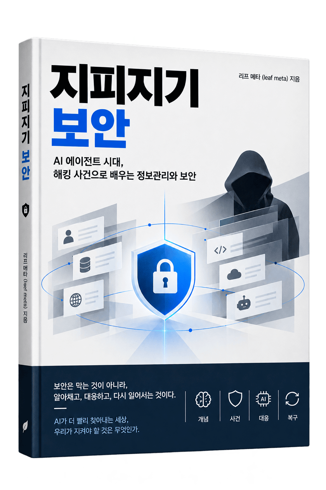

<p align="center">
  
</p>

# 지피지기 보안

**AI 에이전트 시대, 해킹 사건으로 배우는 정보관리와 보안**

리프 메타 (leaf meta) 지음. 무료로 배포한다. MIT 라이선스다. 복사, 재배포, 인쇄, 수업 자료로 쓸 수 있다.

> **기준일 2026-10-05.** 이 책의 모든 날짜와 시행 여부는 이 날짜 기준이다.
> 보안에서 날짜 없는 사실은 사실이 아니다. 낡은 것은 부록 E 의 변경 이력으로 갱신한다.

## 읽는 곳

**<https://leaf-kit.github.io/book-breach-lessons/>**

브라우저에서 바로 읽는다. 설치도 내려받기도 필요 없다. **PDF 는 만들지 않는다.**

내려받아 읽으려면 저장소를 통째로 받아서 열면 된다.

```bash
python3 -m http.server 8000
```

## 이 책

2026년 9월 28일부터 10월 3일까지 엿새 동안 국내 은행 여섯 곳에서 같은 수법의 공격이 확인됐습니다.
공격이 들어온 곳은 계정계가 아니라 그 주변 시스템들이었습니다.
직원용 업무지원시스템, 영업지원시스템, 모바일 홈페이지. 제각각인데 공통점이 있습니다.
**돈이 오가는 핵심 거래 시스템이 아니었습니다.** 그래서 점검 대상에서도 빠져 있었습니다.

이 책은 그 지점에서 시작합니다. 핵심을 지키느라 주변부를 놓치는 구조, 그리고 그 구조를
AI 가 어떻게 더 빨리 찾아내는지를 다룹니다.

목표는 뚫리지 않는 시스템이 아닙니다. **뚫려도 얻을 것이 없고, 빨리 알아채고, 빠르게 복구되는
시스템**입니다. 해커의 경제성을 무너뜨리는 쪽이 훨씬 현실적입니다.

| | |
|---|---|
| 본문 | 42편 |
| 분량 | 마크다운 원문 252,488자 |
| 1부 개념 | 40개. 한 쪽에 하나씩. 여기에 요즘 수법 10가지를 더했다 |
| 4부 사건 | 10편. 2011년부터 2026년까지 |
| 등록된 사실 | 61건 (✅ 31, ⚠️ 30). 전부 출처와 확인 날짜가 있다 |
| 라이선스 | MIT |

## 어떻게 구성했나

**뒤로 갈수록 풀어 씁니다.**

1부는 개념 하나에 한 쪽입니다. 정의와 왜 중요한지와 무엇을 할지까지 650자 안에 끝냅니다.
개념을 길게 설명해서 좋을 것이 없습니다. 길게 풀 것은 4부에서 사건과 함께 풉니다.

2부와 3부는 자기 조직과 자기 코드에 대보는 자리입니다.

4부가 이 책의 무게 중심입니다. 사건 하나를 경과부터 실패 지점, 무엇이 있었으면 막혔는지까지
끝까지 따라갑니다. 열 건 중 여섯 건이 2023년 이후이고, 세 건은 AI 와 직접 관련이 있습니다.

## 읽는 길

| 당신이 | 이렇게 읽으세요 |
|---|---|
| 보안을 겸임으로 맡았다 | 처음부터 끝까지 |
| 경영진이거나 관리자다 | 여는 글 → 1부 → 2.3 → 4부 → 5.2 |
| 개발자다 | 1부 → 3부 → 4.5, 4.6, 4.9, 4.10 |
| 개발자가 아니다 | 여는 글 → 1.1, 1.2 → 4부 → 5.3 |
| 급하다 | 4부만. 사건 열 편이 이 책의 요약입니다 |

## 이 책이 하지 않는 것

- **공격 방법을 가르치지 않습니다.** 익스플로잇, 침투 절차, 페이로드, 도구 사용법은 싣지 않습니다
- **공격 주체를 단정하지 않습니다.** 도구의 국적은 공격자의 국적이 아닙니다
- **특정 제품을 추천하지 않습니다.** 6개월이면 낡습니다
- **법률 판단을 대신하지 않습니다.** 어디를 봐야 하는지까지만 안내합니다

사실마다 ✅ ⚠️ 🔍 로 확인 수준을 표시했습니다. ⚠️ 가 붙은 문장은 단일 출처이거나
출처가 갈리는 것이고, 본문에서도 단서를 달았습니다.

**확인하지 못한 것은 적지 않았습니다.** 빈칸으로 두고 "직접 확인하십시오"라고 쓴
자리가 여럿 있습니다. 떠넘기는 것이 아니라, 책이 가질 수 없는 정보이기 때문입니다.

세 가지가 그렇습니다.

- **조문 해석과 해당 여부** — 과징금 요건, ISMS-P 대상 범위, EU 규제 적용 대상.
  어디를 봐야 하는지까지만 적고 멈췄습니다
- **자주 바뀌는 날짜와 버전** — 표준 판 번호, 규제 시행일, 인증서 유효기간 일정.
  적는 순간 낡아서, 대신 **왜 그것을 고르는가**를 적었습니다
- **갈리는 숫자** — 고시 시행일이 자료마다 2026-10-30 과 10-31 로 다릅니다.
  어느 쪽인지 찍지 않고 부칙을 보라고 적었습니다

남은 유지보수 목록은 [`research/verify-todo.md`](research/verify-todo.md) 에 있습니다.
**책의 내용을 바꾸는 항목은 없습니다.** 출처를 더 좋은 것으로 올리는 작업입니다.

## 이 책이 정하는 한계

보안 책은 두 가지 방식으로 독자를 해칩니다. 틀린 것을 적어서 해치고,
**더 봐야 할 자리를 안 알려 줘서** 해칩니다. 두 번째가 더 흔합니다.

그래서 이 책은 한계를 선언합니다.

> **추가 검토가 필요한 자리는 추가 검토가 필요합니다.
> 이 책은 거기까지 데려다줄 뿐, 대신 판단하지 않습니다.**

구체적으로 이렇습니다.

| 어떤 일 | 이 책이 하는 것 | 독자가 해야 하는 것 |
|---|---|---|
| 법령 적용 여부 | 어느 법의 어느 자리를 볼지 알려 줍니다 | 조문 원문 확인과 법률 자문 |
| 암호 알고리즘 선택 | 고르는 기준을 줍니다 | 암호 전문가 검토 |
| 침해 사고 대응 | 절차의 뼈대와 시간표를 줍니다 | 대응 전문가와 포렌식 |
| 우리 조직의 위험 | 자가진단 문항을 줍니다 | 자기 환경에서 직접 측정 |
| 제품과 도구 선택 | 판단 기준을 줍니다 | 자기 환경에서 검증 |

**이 선은 이 책의 약점이 아니라 설계입니다.**

조문을 옮겨 적으면 독자가 그것을 근거로 판단합니다. 그 판단이 틀렸을 때
책임은 독자에게 갑니다. 알고리즘을 특정하면 6개월 뒤에 낡은 권고가 됩니다.
**데려다주는 것까지가 책이 안전하게 할 수 있는 일입니다.**

그리고 이 책 자체도 검토가 더 필요합니다. 숨기지 않고 적습니다.

- **독립 검토를 아직 거치지 않았습니다.** 지은이가 세 번 훑어 33건을 고쳤습니다.
  다만 제3자의 눈은 한 번도 닿지 않았습니다
- **법률, 암호, 침해 대응 전문가의 감수를 받지 않았습니다**
- **등록된 사실 61건 중 30건이 ⚠️** 입니다. 단일 출처이거나 출처가 갈립니다

**읽다가 "이건 더 봐야겠는데" 싶은 자리가 나오면, 그 감각이 맞습니다.**
그 자리를 이슈로 알려 주시면 다음 판이 나아집니다.

## 차례

### 여는 글

- [2026년 가을, 은행 여섯 곳](part0/01-prologue.md)

### 1부 — 한 쪽에 하나씩

- [1.1 공격을 보는 눈 열 가지](part1/01-attack.md)
- [1.2 방어를 세우는 눈 열 가지](part1/02-defense.md)
- [1.3 신원과 데이터 열 가지](part1/03-identity-data.md)
- [1.4 AI 시대에 새로 생긴 열 가지](part1/04-ai-era.md)
- [1.5 요즘 들어오는 수법 열 가지](part1/05-recent-attacks.md)
- [1.6 공격자는 누구이고 무엇을 노리는가](part1/06-attacker.md)

### 2부 — 나를 안다

- [2.1 자산과 데이터](part2/01-assets.md)
- [2.2 신원과 접근 통제](part2/02-identity.md)
- [2.3 탐지와 대응](part2/03-detect.md)
- [2.4 국내 지침 지도](part2/04-rules-korea.md)
- [2.5 해외 프레임워크](part2/05-rules-global.md)
- [2.6 암호와 양자내성암호](part2/06-crypto.md)

### 3부 — 만드는 사람의 보안

- [3.1 개발자가 놓치기 쉬운 자리](part3/01-coding.md)
- [3.2 코딩 에이전트를 쓰면 놓치는 것](part3/02-agents.md)
- [3.3 서버 구성](part3/03-server.md)
- [3.4 HTTPS 가 해결하지 못하는 것](part3/04-https.md)
- [3.5 로그 설계](part3/05-logging.md)
- [3.6 뚫려도 괜찮은 시스템](part3/06-resilient.md)
- [3.7 에이전트 공격은 어떻게 도는가](part3/07-agent-attacks.md)
- [3.8 코드를 쓸 때 보안을 같이 쓰는 법](part3/08-secure-coding.md)

### 4부 — 사건으로 배운다

- [4.1 엿새 동안 은행 여섯 곳 (2026)](part4/01-finance-2026.md)
- [4.2 3년 8개월 (통신사, 2025)](part4/02-telecom-2025.md)
- [4.3 35일 (카드사, 2025)](part4/03-card-2025.md)
- [4.4 노트북 한 대와 USB 하나 (2011, 2014)](part4/04-outsourcing.md)
- [4.5 78일 (Equifax, 2017)](part4/05-patch-equifax.md)
- [4.6 하나를 뚫어 천 곳 (MOVEit, 2023)](part4/06-moveit.md)
- [4.7 전화 한 통 (MGM 과 Caesars, 2023)](part4/07-helpdesk.md)
- [4.8 새로운 기법은 없었다 (Salt Typhoon, 2024)](part4/08-salt-typhoon.md)
- [4.9 처음 보고된 AI 주도 캠페인 (2025)](part4/09-ai-campaign.md)
- [4.10 설치 한 줄 (npm, 2025)](part4/10-supply-npm.md)

### 5부 — 미지와 실천

- [5.1 책에 없는 공격에 대비하기](part5/01-unknown.md)
- [5.2 조직의 90일](part5/02-90days.md)
- [5.3 개인의 30일](part5/03-personal.md)

### 닫는 글

- [학습 속도가 곧 방어력](part6/01-epilogue.md)

### 부록

- [A. 용어집](appendix/a-glossary.md)
- [B. 체크리스트 모음](appendix/b-checklists.md)
- [C. 스터디 운영과 모의훈련](appendix/c-study-guide.md)
- [D. 출처 목록](appendix/d-sources.md)
- [E. 변경 이력과 갱신 방법](appendix/e-changelog.md)
- [F. 우리 서버 안전 점검 100점](appendix/f-server-audit.md)
- [G. 꼭 아는 보안 용어](appendix/g-terms.md)

## 저장소 구조

```
index.html          뷰어
viewer/             뷰어 스타일과 동작
LICENSE             MIT
images/
  logo.png          표지
  people/           인물 사진. 사진마다 라이선스가 다르다
  CREDITS.md        사진 출처와 라이선스
README.md           표지와 차례. 뷰어가 이 파일의 「차례」를 읽는다
tools/
  check.py          차례 대조, 분량, 표기, 사실 ID 점검
  linkcheck.py      출처 링크가 살아 있는지 점검
research/
  facts.yaml        사실 레지스트리. 본문의 모든 숫자는 여기 ID 를 가진다
  sources.md        출처 목록
  verify-todo.md    출처 유지보수 목록
part0 ~ part6/      본문
appendix/           부록
```

## 고치고 싶다면

사실 오류를 발견하면 이슈로 알려 주세요. `research/facts.yaml` 의 ID 를 함께 적어 주면 빠릅니다.
출처가 더 좋은 것으로 바뀌는 제안이 가장 반갑습니다.

## 라이선스

[MIT](LICENSE). 복사, 수정, 재배포, 인쇄, 수업 자료로 자유롭게 쓸 수 있습니다.
상업적 이용도 막지 않습니다. 저작권 표시만 함께 남겨 주십시오.

**출처를 적어 주시면 감사합니다.** 의무는 아닙니다.
다만 어디서 왔는지가 남아 있어야 틀린 것을 발견한 분이 고칠 자리를 찾습니다.
보안 글에서는 그게 생각보다 중요합니다.

### 사진은 MIT 가 아닙니다

`images/people/` 의 인물 사진은 위키미디어 커먼즈에서 받은 것이고
**각각 원저작자가 정한 CC 라이선스를 따릅니다.**
저작자와 라이선스는 [`images/CREDITS.md`](images/CREDITS.md) 에 한 장씩 적어 두었습니다.
사진을 가져다 쓰실 때는 그 표를 함께 보십시오.

표지 `images/logo.png` 는 이 책을 위해 만든 것이고 본문과 같은 MIT 입니다.
