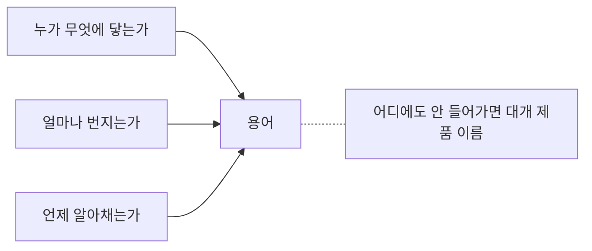

# A. 용어집

본문에서 처음 나올 때 한 줄로 풀었던 말들을 모았습니다.
가나다순입니다. 괄호 안은 처음 나오는 자리입니다.

**먼저 알아야 하는 순서로 보고 싶다면 [부록 G](g-terms.md) 로 가십시오.**
제로 트러스트처럼 한 줄로는 부족한 말들을 거기서 길게 풀었습니다.
에이전트 시대의 용어도 그쪽에 모아 두었습니다.

## ㄱ

**가정 침해** (assume breach) — 이미 뚫렸다고 가정하고 설계하는 방식.
경계 방어만으로 끝내지 않습니다. (1.2)

**간접 프롬프트 인젝션** (indirect prompt injection) — 사용자가 아니라
에이전트가 읽는 데이터에 명령을 숨기는 공격. 사용자가 누를 버튼이 없습니다. (1.4)

**검토 피로** — 생성되는 양이 사람의 검토 능력을 넘어서는 상태. (1.4)

**공격면** (attack surface) — 공격자가 건드릴 수 있는 모든 지점의 합. (1.1)

**공격 생애주기** — 표적 선정, 침투, 확산, 잠복, 유출의 다섯 단계. (1.1)

**기계 신원** (machine identity) — 사람이 아닌 것들의 계정.
서비스 계정, API 키, 컨테이너, 에이전트. (1.3)

**기본값 차단** (deny by default) — 허용 목록에 없으면 막는 방식. (1.2)

<figure class="shot">
  
  <figcaption>도서관의 카드 목록함. 찾아보는 용도이지 외우는 용도가 아닙니다. 사진 TBurmeister (WMF), <a href="https://creativecommons.org/licenses/by-sa/4.0">CC BY-SA 4.0</a></figcaption>
</figure>

## ㄴ

**내부 이동** (lateral movement) — 한 지점에서 다른 지점으로 옮겨 다니는 단계. (1.1)

**새 용어를 만나면 축 셋 중 어디인지만 정합니다**

## ㄷ

**단명 자격증명** (short-lived credential) — 몇 분에서 몇 시간 안에 만료되는 열쇠. (1.3)

**다중 인증** (MFA) — 비밀번호 말고 하나를 더 확인하는 방식. (1.3)

**도구 권한** (agency) — 에이전트에게 쥐여 준 행동 능력의 범위. (1.4)

## ㅁ

**멀티 에이전트 분업** — 역할이 다른 에이전트 여럿이 나눠서 일하는 구조. (1.4)

**메모리 오염** — 에이전트가 기억하는 내용을 오염시켜 오래 영향을 남기는 공격. (1.4)

**멱등 키** (idempotency key) — 같은 요청이 두 번 와도 한 번만 처리되게 하는 식별자. (3.1)

**무결성** — 데이터가 바뀌지 않았음을 보장하는 성질. (2.6)

## ㅂ

**봉투 암호화** (envelope encryption) — 데이터는 데이터 열쇠로,
데이터 열쇠는 상위 열쇠로 암호화하는 방식. (2.6)

**불변 백업** (immutable backup) — 정해진 기간 동안 지우거나 고칠 수 없는 백업. (1.2)

**불변 인프라** (immutable infrastructure) — 서버를 손으로 고치지 않고
새로 만들어 교체하는 방식. (3.6)

## ㅅ

**수집 후 해독** (harvest now, decrypt later) — 지금 암호문을 모아 두었다가
나중에 푸는 공격. (1.4)

**슬롭스쿼팅** (slopsquatting) — 모델이 자주 환각하는 패키지 이름을
공격자가 선점해 악성 코드를 올리는 공격. (1.4)

**심층 방어** (defense in depth) — 막는 장치를 여러 겹으로 두는 방식. (1.2)

## ㅇ

**아웃바운드 통제** (egress control) — 서버가 밖으로 나가는 통신을 제한하는 것. (1.2)

**암호 민첩성** (crypto agility) — 쓰는 암호를 빠르게 바꿀 수 있는 상태. (2.6)

**양자내성암호** (PQC) — 양자 컴퓨터로도 풀기 어렵게 설계한 암호. (2.6)

**에이전트** — 목표를 받아서 스스로 계획하고 도구를 써서 실행하는 프로그램. (1.4)

**인가** (authorization) — 무엇을 해도 되는지 정하는 일. (1.3)

**인증** (authentication) — 누구인지 확인하는 일. (1.3)

## ㅈ

**자율 침투 루프** — 탐색, 시도, 결과 판단, 다음 선택을 사람 없이 도는 것. (1.4)

**장기 잠복** (dwell time) — 침입한 뒤 발견될 때까지 머무는 기간. (1.1)

**접속기록** — 누가 언제 무엇에 접근했는지 남긴 기록. 법령 용어입니다. (1.3)

**주변부** — 핵심이 아니라는 이유로 점검 대상에서 빠진 시스템. (1.1)

## ㅊ

**최소 권한** (least privilege) — 일에 필요한 만큼만 권한을 주는 원칙. (1.2)

**최소 보유** — 필요한 기간만 데이터를 갖고 있다가 지우는 것. (1.3)

## ㅋ

**카나리** (canary) — 건드리면 알림이 울리도록 심어 둔 가짜 자산. (1.2)

## ㅍ

**패스키** (passkey) — 기기에 저장된 열쇠로 로그인하는 방식.
가짜 사이트에 입력될 값이 없습니다. (1.3)

**패치 수명** — 패치가 나온 날부터 적용한 날까지의 기간. (1.2)

**패키지 환각** — 모델이 존재하지 않는 패키지를 있는 것처럼 말하는 현상. (1.4)

**폭발 반경** (blast radius) — 한 지점이 뚫렸을 때 공격자가 닿을 수 있는 범위. (1.2)

**프롬프트 인젝션** — 지시문에 다른 지시를 끼워 넣어 모델의 목표를 바꾸는 공격. (1.4)

## ㅎ

**행동 기반 탐지** — 알려진 악성 지문이 아니라 정상과 다른 행동을 찾는 방식. (5.1)

## 영문 약어

| 약어 | 원어 | 뜻 |
|---|---|---|
| ASI | Agentic Security Initiative | OWASP 의 에이전트 보안 위험 분류 (2.5) |
| CBOM | Cryptography Bill of Materials | 암호 자산 목록 (2.6) |
| CPO | Chief Privacy Officer | 개인정보 보호책임자 (2.4) |
| CVE | Common Vulnerabilities and Exposures | 공개 취약점 식별 번호 (4.5) |
| CVSS | Common Vulnerability Scoring System | 취약점 심각도 점수 (4.5) |
| IMEI | International Mobile Equipment Identity | 단말기 고유식별번호 (4.2) |
| IMSI | International Mobile Subscriber Identity | 가입자식별키 (4.2) |
| ISMS-P | — | 정보보호 및 개인정보보호 관리체계 인증 (2.4) |
| MFA | Multi-Factor Authentication | 다중 인증 (1.3) |
| PQC | Post-Quantum Cryptography | 양자내성암호 (2.6) |
| SSRF | Server-Side Request Forgery | 서버가 사용자가 준 주소로 요청하게 만드는 공격 (3.1) |

## 표기 통일

이 책이 고른 표기입니다. 법령 인용문 안에서는 원문 표기를 그대로 둡니다.

| 쓴다 | 안 쓴다 |
|---|---|
| 개인정보 보호법 (법률) | 개인정보보호법 |
| 개인정보보호위원회 (기관) | 개인정보 보호위원회 |
| 양자내성암호(PQC) | 포스트양자암호, 양자저항암호 |
| 다중 인증(MFA) | 2차 인증, 이중 인증 |
| 에이전트 | 자율 에이전트 |
| 접속기록 | 접근 로그, 액세스 로그 |

---

## 개념 확인

**Q.** 가정 침해(assume breach)의 뜻은 무엇입니까.

1. 침해에 대비해 보험에 든다
2. 이미 뚫렸다고 가정하고 설계한다
3. 침해를 당국에 신고한다
4. 침해를 모의로 재연한다

답 보기

**2번.** 경계 방어만으로 끝내지 않겠다는 선언입니다.
질문이 "막았나"에서 "**뚫렸으면 무엇이 보이나**"로 바뀝니다.
제로 트러스트와 짝으로 자주 나옵니다.

