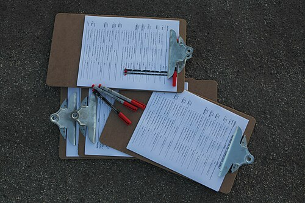
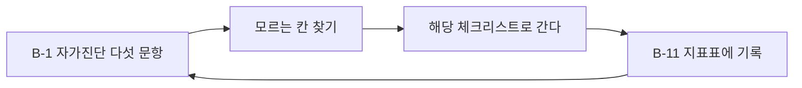

# B. 체크리스트 모음

본문에 흩어진 체크리스트를 한곳에 모았습니다. 떼어서 쓰셔도 됩니다.

---

## B-1. 자가진단 다섯 문항 (2.1)

분기마다 다시 묻습니다. 답이 "모른다"인 항목이 위험 순서입니다.

1. **자산 가시성** — 외부에서 접근 가능한 우리 주소를 전부 댈 수 있습니까.
2. **점검 사각지대** — 어떤 점검에도 들어가지 않는 시스템이 몇 개입니까.
3. **데이터 위치** — 고객 개인정보가 몇 개의 시스템에 있습니까. 핵심 시스템 밖에 얼마나 있습니까.
4. **신원 체계** — 사람, 외주, 서비스 계정, API 키, 에이전트를 한 화면에서 볼 수 있습니까.
5. **탐지와 대응 속도** — 지난 사고에서 침입부터 인지까지 몇 시간이었습니까. 인지부터 차단까지는 몇 분이었습니까.

숫자가 좋아지는 것보다 **"모른다"가 줄어드는 것**이 먼저입니다.

---

<figure class="shot">
  
  <figcaption>점검표. 서명이 있다고 점검이 된 것은 아닙니다. 그 차이를 4.4 에서 법원이 지적했습니다. 사진 출처 불명, 퍼블릭 도메인</figcaption>
</figure>

## B-2. PR 리뷰 질문 20개 (3.1)

해당하는 것만 묻습니다.

**인가**
1. 이 엔드포인트는 누가 호출할 수 있습니까
2. 소유자 검증이 조회 조건에 들어가 있습니까
3. 관리자 기능이 서버에서 다시 확인됩니까

**입출력**
4. 사용자 입력이 SQL 에 문자열로 붙지 않습니까
5. 화면에 출력할 때 이스케이프됩니까
6. 파일 경로에 사용자 입력이 들어갑니까
7. 받은 객체를 통째로 모델에 넣지 않습니까

**외부 연동**
8. 서버가 사용자가 준 주소로 요청합니까
9. 리다이렉트를 따라갑니까
10. 타임아웃이 설정되어 있습니까

**상태와 실패**
11. 확인에 실패하면 막히는 쪽으로 떨어집니까
12. 동시에 두 번 오면 두 번 처리됩니까
13. 멱등 키가 있습니까
14. 예외 메시지에 내부 정보가 노출됩니까

**비밀과 로그**
15. 새 비밀 문자열이 들어오지 않았습니까
16. 로그에 요청 전체를 찍지 않습니까
17. 에러 추적 도구로 개인정보가 나가지 않습니까

**의존성과 업무**
18. 새 의존성이 추가됐습니까. 왜 필요합니까
19. 금액이나 수량에 음수나 큰 수가 들어오면 어떻게 됩니까
20. 단계를 건너뛰고 호출할 수 있습니까

---

**어느 체크리스트부터 펴는가**

## B-3. 서버 점검 20줄 (3.3)

새 서버를 띄울 때, 그리고 분기마다. **사내 도구에도 똑같이 적용합니다.**

**네트워크**
1. 공인 IP 에 열린 포트가 목록과 같다
2. 관리 포트가 외부에 열려 있지 않다
3. 아웃바운드가 허용 목록으로 제한된다
4. 서버 간 통신이 기본 거부다

**계정**
5. 기본 계정과 기본 비밀번호가 없다
6. 서비스가 루트로 돌지 않는다
7. 공용 관리 계정이 없다
8. 퇴사자와 종료된 외주 계정이 없다

**접근**
9. 관리 접근이 점프 호스트나 VPN 을 거친다
10. 관리 접근에 다중 인증이 걸려 있다
11. 관리 세션이 기록된다

**데이터**
12. DB 계정 권한이 필요한 것만이다
13. DB 접속 출발지가 제한된다
14. 저장소 버킷이 공개가 아니다
15. 디스크와 DB 암호화가 켜져 있고 열쇠가 분리되어 있다

**운영**
16. 패치 목표 기간이 지켜지고 있다
17. 에러 페이지에 버전과 스택이 노출되지 않는다
18. 로그가 서버 밖으로 전송된다
19. 불변 백업이 있고 최근 복원을 해 봤다
20. 이 서버의 담당자가 자산 목록에 적혀 있다

---

## B-4. 로그 정책 체크 (3.5)

- [ ] 3개월 전 접근 기록을 검색할 수 있다
- [ ] 로그가 생성 즉시 서버 밖으로 전송된다
- [ ] 로그에 비밀번호, 토큰 전체, 주민등록번호가 없다
- [ ] 출력 단계에 마스킹 필터가 있다
- [ ] 로그가 구조화되어 있고 상관 ID 가 있다
- [ ] 모든 서버의 시각이 동기화되어 있다
- [ ] 로그 저장소가 수정과 삭제를 막는다
- [ ] 로그 조회에 권한이 걸려 있고 조회 이력이 남는다
- [ ] 로그 정책이 문서로 있다
- [ ] 보관 기간이 법정 요건 이상이다

---

## B-5. 사고 대응 시간표 (2.3)

사고 전에 채워 둡니다. 당일에 채우면 늦습니다.

| 시점 | 정해 둘 것 | 담당자 |
|---|---|---|
| 0분 | 누구에게 먼저 연락하는가 | |
| 30분 | 서비스를 내릴 권한이 누구에게 있는가 | |
| 2시간 | 외부 도움(포렌식, 법무)을 부를 기준 | |
| 12시간 | 72시간 통지 대상인지 누가 판단하는가 | |
| 24시간 | 고객과 언론에 누가 무엇을 말하는가 | |
| 72시간 | 통지 발송. 누가 보내고 누가 검토하는가 | |

**절차 맨 앞에 한 줄을 박아 둡니다. "보전 먼저, 복구 나중."**

---

## B-6. 사고 공지문 3단계 (4.3)

미리 써 둡니다. 당일에 쓰면 "없습니다"라고 쓰게 됩니다.

**1단계 (정황 확인 직후)**
> 외부 침입 정황을 확인했습니다. 현재 조사 중이며 고객 정보 영향 여부를
> 확인하고 있습니다. 확인되는 대로 알려 드리겠습니다.

**2단계 (범위 일부 확인)**
> 조사 결과 일부 정보가 유출된 것으로 확인됐습니다. 현재까지 확인된 범위는
> 다음과 같으며, 조사가 진행 중이라 변동될 수 있습니다.

**3단계 (조사 종료)**
> 최종 조사 결과를 알려 드립니다. 유출 범위는 다음과 같습니다.

**1단계에 "유출은 없습니다"를 쓰지 않습니다.**

---

## B-7. 헬프데스크 재설정 절차 (4.7)

- 자격증명 재설정은 **전화로 하지 않는다. 예외 없음**
- 재설정은 등록된 다른 채널로 확인한 뒤에만 한다
- 고위험 계정(관리자, 재무, 인사, 경영진)은 상급자 승인을 추가로 받는다
- **절차대로 거절해서 생긴 불편은 담당자 책임이 아니다**

마지막 줄이 없으면 앞의 세 줄은 안 지켜집니다.

---

## B-8. 외주 계약서에 넣을 것 (4.4)

1. 접근 가능한 시스템의 **목록**과 그 외 접근 금지
2. 접속 **기기와 경로** 지정
3. 작업 **기간**과 자동 만료
4. 데이터 **반출 금지**와 예외 승인 절차
5. 보안 **사고 발생 시 통지 의무**와 기한
6. 재위탁 **금지** 또는 사전 승인
7. 계약 종료 시 **데이터 파기** 확인
8. **감사 수용** 의무

---

## B-9. 에이전트를 붙일 때 (1.4, 2.5, 3.2)

- [ ] 이 에이전트가 할 수 있는 일의 목록을 적었다
- [ ] 되돌릴 수 없는 행동에 사람 승인이 걸려 있다
- [ ] 사람 계정이 아닌 자기 신원으로 돈다
- [ ] 외부 콘텐츠를 읽는다면 쓰기 권한이 제한된다
- [ ] 외부 통신이 허용 목록으로 제한된다
- [ ] 읽을 수 없는 경로가 지정되어 있다
- [ ] 메모리에 무엇이 쌓이는지 확인할 수 있다
- [ ] 활동이 로그에 구분되어 남는다
- [ ] 제안한 패키지의 실재를 확인하는 절차가 있다
- [ ] OWASP ASI01~ASI10 을 한 번 훑었다

---

## B-10. 새 기술을 들일 때 다섯 질문 (5.1)

에이전트, 새 SaaS, 새 외주, 새 연동에 똑같이 적용합니다.

1. 이것이 **무엇을 할 수 있습니까.** 할 수 있는 일의 목록이 곧 최악의 피해입니다
2. 이것이 **무엇을 읽습니까.** 읽는 것이 오염되면 어떻게 됩니까
3. 이것이 **누구의 신원으로 돕니까.** 로그에 어떻게 남습니까
4. **되돌릴 수 없는 행동**이 있습니까. 있다면 사람 승인이 걸립니까
5. 이것이 뚫리면 **어디까지 갑니까.** 폭발 반경이 얼마입니까

---

## B-11. 90일 지표표 (5.2)

| 지표 | 0일 | 90일 |
|---|---|---|
| 외부 노출 자산 수 | | |
| 점검 대상이 아닌 시스템 수 | | |
| 상시 관리자 계정 수 | | |
| 영구 토큰 수 | | |
| 잔존 퇴사자 계정 수 | | |
| 자가진단 "모른다" 개수 | | |
| 복원 소요 시간 | 미측정 | |
| 탐지에서 차단까지 시간 | 미측정 | |

---

## B-12. 개인 30일 점검 (5.3)

- [ ] 메일 계정에 패스키가 등록되어 있다
- [ ] 비밀번호를 두 곳 이상에서 똑같이 쓰는 것이 없다
- [ ] 업무 기기 디스크가 암호화되어 있다
- [ ] 중요 파일 백업에서 복원을 해 봤다
- [ ] 메일 링크를 누르지 않고 들어가는 습관이 생겼다
- [ ] 급한 요청에 다른 채널로 되묻는 규칙이 있다

---

## 개념 확인

**Q.** B-1 자가진단에서 점수가 좋아지는 것보다 먼저인 것은 무엇입니까. (주관식)

답 보기

**"모른다"가 줄어드는 것입니다.**
모르는 항목은 좋지도 나쁘지도 않은 것이 아니라
**측정되지 않은 위험**입니다. 숫자는 그다음에 봅니다.

