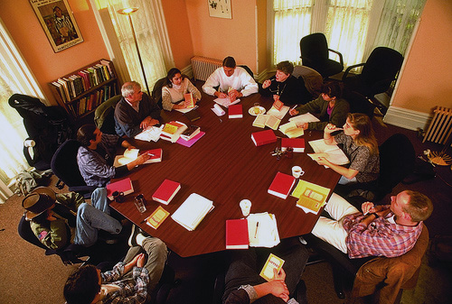
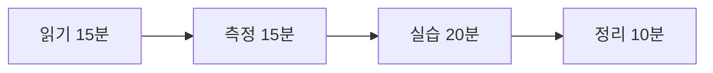

# C. 스터디 운영과 모의훈련

이 책은 혼자 읽는 것보다 팀으로 읽는 것이 낫습니다.
자가진단 문항 대부분이 혼자서는 답이 안 나오기 때문입니다.

---

## 운영 방식

**주 1회, 60분, 10주.** 한 회에 한 장씩 보지 않습니다. 묶어서 봅니다.

| 회차 | 읽을 곳 | 그 주의 실습 |
|---|---|---|
| 1 | 여는 글, 1.1, 1.2 | 외부 노출 자산 목록 뽑기 |
| 2 | 1.3, 1.4 | 에이전트 목록과 권한 적기 |
| 3 | 2.1, 2.2 | 자가진단 다섯 문항 답하기 |
| 4 | 2.3, 2.4 | 72시간 통지 담당자 정하기 |
| 5 | 2.5, 2.6 | 암호 자산 목록 첫 다섯 줄 |
| 6 | 3.1, 3.2 | 최근 PR 세 개를 20개 질문으로 리뷰 |
| 7 | 3.3, 3.4, 3.5 | 서버 한 대에 20줄 점검 |
| 8 | 3.6, 4.1, 4.2 | 폭발 반경 그리기 |
| 9 | 4.3 ~ 4.7 | 헬프데스크 역할극 |
| 10 | 4.8 ~ 4.10, 5부 | 90일 계획 만들기 |

**실습이 없는 회차는 만들지 않습니다.** 읽고 끝나면 아무것도 안 바뀝니다.

---

<figure class="shot">
  
  <figcaption>둘러앉아 읽는 자리. 이 책의 체크리스트는 혼자 채우는 것보다 같이 채울 때 "모른다"가 빨리 줄어듭니다.<br>사진 Shimer College, <a href="https://creativecommons.org/licenses/by/2.0">CC BY 2.0</a></figcaption>
</figure>

## 한 회차 진행 (60분)

| 시간 | 무엇 |
|---|---|
| 0~5분 | 지난주 과제 확인. 못 한 사람은 왜 못 했는지만 한 줄 |
| 5~15분 | 각자 조용히 읽기 (미리 읽어 왔으면 생략) |
| 15~20분 | 「오늘의 질문」에 각자 답 적기. 공유하지 않고 혼자 |
| 20~40분 | 실습 |
| 40~55분 | 결과 공유. 가장 많이 나온 "모른다"를 찾기 |
| 55~60분 | 다음 주까지 할 일 하나 정하기. 담당자 이름까지 |

**15~20분이 중요합니다.** 먼저 혼자 답을 적어야 다른 사람 의견에
끌려가지 않습니다. 그리고 "나만 모르는 줄 알았는데 다 모르더라"가
이 스터디의 가장 큰 효과입니다.

---

**한 회차 60분의 모양**



## 역할

**진행자** — 질문만 합니다. 답하지 않습니다.
가장 잘 아는 사람이 진행자를 맡으면 스터디가 강의가 됩니다.

**기록자** — 나온 "모른다"와 할 일을 적습니다. 매주 돌아가며 맡습니다.

**현업 한 명** — 개발자만 모이면 3.1 의 비즈니스 로직 질문이 안 나옵니다.
업무를 아는 사람이 한 명 있어야 합니다.

---

## 모의훈련 시나리오

실제로 돌려 봅니다. 문서만 읽으면 당일에 못 합니다.
각 시나리오는 45분이면 됩니다.

### 훈련 1 — 72시간 시계

**상황.** 외부 보안업체에서 연락이 왔습니다.
"귀사 고객 데이터로 보이는 것이 판매되고 있습니다."

**진행.** 시계를 72시간으로 놓고 시작합니다. 순서대로 적습니다.

- 지금 누구에게 연락합니까
- 누가 판단합니까
- 진위를 어떻게 확인합니까
- 서비스를 내릴지 누가 정합니까
- 통지 대상인지 누가 판단합니까
- 홈페이지에 뭐라고 올립니까

**찾을 것.** 담당자가 비어 있는 칸. 그게 지금 가장 큰 구멍입니다.

**흔한 결과.** 세 번째 항목에서 멈춥니다.
"진위를 어떻게 확인하지"에 답이 없습니다.

---

### 훈련 2 — 헬프데스크 전화

**상황.** 임원을 사칭한 전화가 옵니다. 4.7 의 사건 그대로입니다.

**진행.** 두 명이 역할극을 합니다.
한 명은 급한 임원, 한 명은 헬프데스크 담당자입니다.
10분 하고 역할을 바꿉니다.

대본은 주지 않습니다. "저 OOO 상무인데 지금 이사회 들어가야 하는데
로그인이 안 됩니다"로 시작하면 충분합니다.

**찾을 것.** 어느 지점에서 담당자가 기울어지는지.
그리고 본인 확인 질문의 답을 공개 정보로 알 수 있는지.

**흔한 결과.** 거절하기가 생각보다 훨씬 어렵습니다.
그래서 "거절의 책임은 조직이 진다"는 문장이 필요합니다.

---

### 훈련 3 — 복원

**상황.** 가장 중요한 데이터베이스가 손상됐습니다.

**진행.** 실제로 복원해 봅니다. 운영이 아니라 별도 환경에.
시작 시각과 완료 시각을 적습니다.

**찾을 것.** 복원 소요 시간. 그리고 막힌 지점.

**흔한 결과.** 백업은 있는데 복원 절차를 아는 사람이 한 명뿐입니다.
그 사람이 휴가 중이면 못 합니다.

---

### 훈련 4 — 폭발 반경

**상황.** 웹 서버 한 대가 뚫렸습니다.

**진행.** 화이트보드에 그 서버를 그리고, 거기서 갈 수 있는 곳을
선으로 잇습니다. 각 선에 "어떻게 가는지"를 적습니다.

**찾을 것.** 가장 굵은 선. 그 선을 끊는 방법.

**흔한 결과.** 그림이 생각보다 훨씬 넓습니다.
그리고 "이 서버에서 저기로 갈 수 있었나"를 아무도 몰랐습니다.

---

### 훈련 5 — 카나리 확인

**상황.** 카나리를 심어 두었습니다. 정말 울립니까.

**진행.** 카나리 계정으로 로그인을 시도하거나 카나리 파일을 엽니다.
알림이 몇 분 만에 누구에게 가는지 봅니다.

**찾을 것.** 알림이 실제로 가는지. 받는 사람이 그게 뭔지 아는지.

**흔한 결과.** 알림은 가는데 받는 사람이 퇴사했습니다.
또는 알림 채널이 아무도 안 보는 곳입니다.

---

## 훈련 후 정리

훈련마다 세 줄만 적습니다.

```
막힌 지점:
그 자리의 담당자:
다음 훈련까지 고칠 것:
```

**훈련의 목적은 잘하는 것이 아니라 못하는 자리를 찾는 것입니다.**
훈련에서 아무 문제가 없었다면 시나리오가 너무 쉬웠던 것입니다.

---

## 혼자 읽을 때

팀이 없으면 이렇게 합니다.

**4부부터 읽습니다.** 사건 열 편이 이 책의 요약입니다.
각 장 끝의 「우리 조직 체크 3문항」만 답해도 30문항입니다.

**답할 수 없는 문항을 셉니다.** 그 수가 출발점입니다.

**5.2 의 0~30일 목록 중 세 개를 고릅니다.** 전부 하려 하지 않습니다.

**90일 뒤에 B-11 의 지표표를 채웁니다.**

---

## 개념 확인

**Q.** 모의훈련을 하는 목적은 무엇입니까.

1. 구성원을 평가한다
2. 적어 둔 절차가 실제로 작동하는지 확인한다
3. 교육 이수 실적을 만든다
4. 감사 자료를 남긴다

<details>
<summary>답 보기</summary>

**2번.** 문서에 있는 절차와 작동하는 절차는 다릅니다.
비밀 교체도, 복원도, 헬프데스크 되전화도
**사고 때 처음 해 보면 늦습니다.**

</details>

