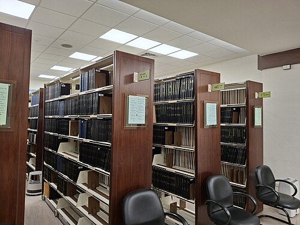
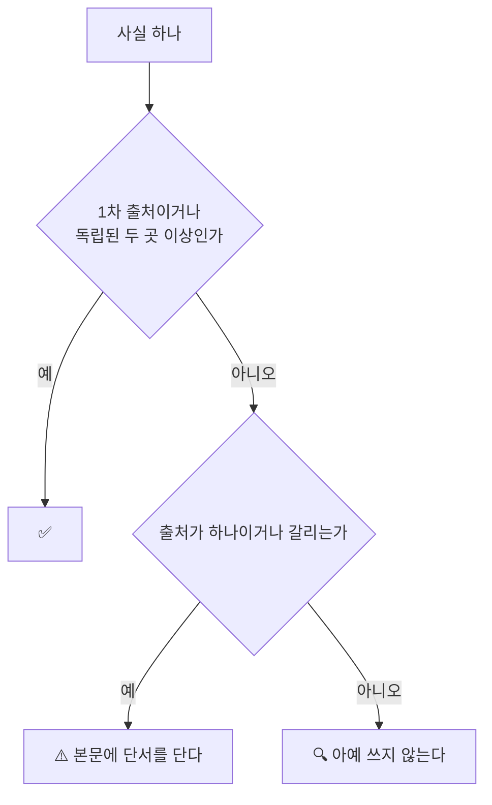

# D. 출처 목록

기준일 **2026-10-05**. 모든 링크는 그날 확인했습니다.

기계가 읽는 원본은 `research/facts.yaml` 입니다. 이 부록은 사람이 읽고 **눌러 보는** 목록입니다.

## 검증 라벨

| 라벨 | 뜻 | 본문 처리 |
|---|---|---|
| ✅ | 1차 출처 또는 독립적인 2개 이상 출처 | 단정해서 씁니다 |
| ⚠️ | 단일 출처이거나 출처 간 불일치 | "보도에 따르면" 같은 단서를 붙였습니다 |
| 🔍 | 확인하지 못함 | **본문에 쓰지 않았습니다** |

---

# 국내 사건

<figure class="shot">
  
  <figcaption>출처는 책의 뼈대입니다. 어디서 왔는지 적혀 있지 않으면 고칠 수도 없습니다. 사진 Szeronine, <a href="https://creativecommons.org/licenses/by/4.0">CC BY 4.0</a></figcaption>
</figure>

## 2026 금융권 연쇄 해킹 (F-001 ~ F-008)

| ID | 출처 |
|---|---|
| F-001, F-005, F-007 ✅⚠️ | 서울신문, [동일 해커, 중국 AI로 최소 6개 은행 공격](https://www.seoul.co.kr/news/economy/2026/10/04/20261004500025) (2026-10-04) |
| F-002 ⚠️ | 서울신문, [중국 AI 손에 쥔 해커](https://www.seoul.co.kr/news/economy/2026/10/05/20261005001002) (2026-10-05) |
| F-003, F-004 ⚠️✅ | 뉴스핌, [은행권 전방위 해킹 종합](https://www.newspim.com/news/view/20261002001278) (2026-10-02) |
| F-006 ⚠️ | 부산일보, [해커들 표적된 금융권](https://www.busan.com/view/busan/view.php?code=2026100418075759253) (2026-10-04) |
| F-008 ✅ | 보안뉴스, [금융보안원 2026년 조직 개편](https://m.boannews.com/html/detail.html?idx=141206) |

**전부 2차 자료입니다.** [금융위원회](https://www.fsc.go.kr/),
[금융감독원](https://www.fss.or.kr/), [금융보안원](https://www.fsec.or.kr/)
공식 발표로 교체해야 합니다. 조사가 진행 중이라 수치가 바뀔 수 있습니다.

**라벨을 어떻게 매겼나**

## 2025 통신사 유심 정보 유출 (F-020 ~ F-025)

| ID | 출처 |
|---|---|
| F-021, F-024 ✅ | **1차** — 대한민국 정책브리핑, [SKT 침해사고 민관합동조사단 조사 결과](https://www.korea.kr/briefing/policyBriefingView.do?newsId=156689741) |
| F-020, F-022, F-023, F-025 ✅⚠️ | 네이트뉴스, [4년 전 침투해 유출까지](https://news.nate.com/view/20250704n26170?mid=n0100) (2025-07-04, 과기정통부 발표 인용) |

## 2025 카드사 해킹 (F-030 ~ F-033)

| ID | 출처 |
|---|---|
| F-030, F-032 ⚠️✅ | 경향신문, [28만명 카드 비밀번호 CVC 유출](https://www.khan.co.kr/article/202509181346001) (2025-09-18) |
| F-031 ✅ | 데일리시큐, [금융당국 296만명 개인정보 유출 사태](https://www.dailysecu.com/news/articleView.html?idxno=200655) |
| F-033 ⚠️ | 강원일보, [안일한 대처로 사태 키운](https://www.kwnews.co.kr/article/202509220020890) (2025-09-22) |

**유출 규모가 매체마다 296만과 297만으로 갈립니다.** 본문은 "약 297만"으로 적었습니다.
금융당국 공식 발표 원문으로 확정해야 합니다.

## 2014 카드 3사, 2011 농협 (F-040 ~ F-044)

| ID | 출처 |
|---|---|
| F-040 ✅ | 전자신문, [2014년 10대 뉴스 — 카드3사 대규모 개인정보유출](https://www.etnews.com/20141226000110) |
| F-041 ✅ | 더스쿠프, [카드3사 고객정보 유출사건 3년의 기록](https://www.thescoop.co.kr/news/articleView.html?idxno=25228) |
| F-042 ✅ | 보안뉴스, [카드 3사 1심 판결로 본 시사점](https://m.boannews.com/html/detail.html?idx=51708) |
| F-044 ⚠️ | 보안뉴스, [농협 사이버테러 사건 그 이후](https://m.boannews.com/html/detail.html?idx=29192) |
| F-043 ⚠️ | 위키백과, [농협 전산망 마비 사태](https://ko.wikipedia.org/wiki/%EB%86%8D%ED%98%91_%EC%A0%84%EC%82%B0%EB%A7%9D_%EB%A7%88%EB%B9%84_%EC%82%AC%ED%83%9C) (3차 자료) |

**농협 사건의 공격 주체에 대한 당시 발표에는 여러 의문이 제기됐습니다.**
이 책은 주체를 단정하지 않고 구조만 봅니다.

---

# 해외 사건

## Equifax 2017 (F-050, F-051)

| ID | 출처 |
|---|---|
| F-050, F-051 ✅ | **1차** — 미국 하원 감독위원회, [Equifax Report](https://oversight.house.gov/wp-content/uploads/2018/12/Equifax-Report.pdf) (2018-12, PDF) |

이 책에서 1차 자료로 확인한 몇 안 되는 사건입니다.
타임라인과 감사 지적 사항이 보고서 원문에 있습니다.

## MOVEit 2023 (F-052, F-053)

| ID | 출처 |
|---|---|
| F-052 ✅ | BankInfoSecurity, [MOVEit 피해 집계 455곳](https://www.bankinfosecurity.com/latest-moveit-data-breach-victim-tally-455-organizations-a-22650) |
| F-053 ⚠️ | Flashpoint, [Clop 랜섬웨어와 MOVEit 취약점](https://flashpoint.io/blog/clop-ransomware-moveit-vulnerability/) |

집계기관마다 수치가 다릅니다. 본문에 집계 시점을 병기했습니다.
취약점 원문은 [CVE-2023-34362](https://nvd.nist.gov/vuln/detail/CVE-2023-34362) 입니다.

## MGM 과 Caesars 2023 (F-054 ~ F-056)

| ID | 출처 |
|---|---|
| F-054, F-055 ⚠️ | Adaptive Security, [MGM Ransomware Attack Timeline](https://www.adaptivesecurity.com/blog/mgm-ransomware-attack) |
| F-056 ⚠️ | The Hacker News, [Scattered Spider 헬프데스크 사기](https://thehackernews.com/2025/06/scattered-spider-understanding-help-desk-scams.html) (2025-06) |

**초기 침투 경로는 회사 공시가 아니라 공격자 측 주장과 언론 보도에 근거합니다.**
본문 전체에 "보도에 따르면"을 붙였습니다.
공시로 확인하려면 [SEC EDGAR](https://www.sec.gov/edgar/search/) 에서 두 회사의 2023년 8-K 를 봅니다.

## Salt Typhoon 2024 (F-057 ~ F-059)

| ID | 출처 |
|---|---|
| F-057, F-058, F-059 ✅⚠️ | Dark Reading, [CISA Issues Guidance to Telecom Sector on Salt Typhoon](https://www.darkreading.com/cyberattacks-data-breaches/cisa-issue-guidance-telecoms-salt-typhoon-threat) |

[CISA](https://www.cisa.gov/) 의 공동 가이드 원문으로 교체하는 것이 좋습니다.

---

# AI 와 공급망

## AI 주도 첩보 캠페인 2025 (F-070 ~ F-073)

| ID | 출처 |
|---|---|
| F-070, F-071, F-072 ✅ | **1차** — Anthropic, [Disrupting the first reported AI-orchestrated cyber espionage campaign](https://assets.anthropic.com/m/ec212e6566a0d47/original/Disrupting-the-first-reported-AI-orchestrated-cyber-espionage-campaign.pdf) (2025-11, PDF) |
| F-073 ⚠️ | Just Security, [The Era of AI-Orchestrated Hacking Has Begun](https://www.justsecurity.org/127053/era-ai-orchestrated-hacking/) |

**보고 주체가 AI 개발사이고 독립적인 제3자 검증이 아닙니다.**
그래서 의문을 제기한 F-073 을 본문에 함께 적었습니다.

## OWASP 에이전트 목록 (F-074, F-075)

| ID | 출처 |
|---|---|
| F-074, F-075 ⚠️ | Cycode, [OWASP Top 10 for Agentic Applications 2026](https://cycode.com/blog/owasp-top-10-agentic-applications/) |

**2차 자료입니다.** [OWASP GenAI Security Project](https://genai.owasp.org/) 의
원문으로 교체해야 합니다.

## npm 공급망 2025 (F-076 ~ F-079)

| ID | 출처 |
|---|---|
| F-076 ✅ | Palo Alto Unit 42, [Shai-Hulud Worm Compromises npm Ecosystem](https://unit42.paloaltonetworks.com/npm-supply-chain-attack/) |
| F-077 ✅ | Zscaler, [Shai-Hulud V2 Analysis](https://www.zscaler.com/blogs/security-research/shai-hulud-v2-poses-risk-npm-supply-chain) |
| F-079 ⚠️ | Socket, [Slopsquatting](https://socket.dev/blog/slopsquatting-how-ai-hallucinations-are-fueling-a-new-class-of-supply-chain-attacks) |
| F-078 ⚠️ | 위키백과, [Slopsquatting](https://en.wikipedia.org/wiki/Slopsquatting) (3차 자료) |

F-079 의 수치(19.7%, 205,000개, 58%, 43%)는 **USENIX Security 2025 논문을
2차 자료가 인용한 것**입니다. [USENIX Security 2025](https://www.usenix.org/conference/usenixsecurity25)
에서 원논문으로 교체해야 합니다.

---

# 법령과 표준

## 개정 개인정보 보호법 (F-090 ~ F-094)

| ID | 출처 |
|---|---|
| F-090, F-091, F-093, F-094 ✅⚠️ | 법률신문, [2026-09-11 개인정보 보호법 개정법 시행](https://www.lawtimes.co.kr/news/articleView.html?idxno=226491) |
| F-092 ✅ | datalaw.kr, [2026-09-11 시행 개정 개인정보 보호법 신구조문 대조표](https://datalaw.kr/posts/pipa-2026-amendment-comparison/) |

**로펌 브리핑과 해설 기반입니다.** 조문 번호를 인용해서 쓰실 때는
[국가법령정보센터](https://www.law.go.kr/) 에서 **법률 제21445호**와
**대통령령 제36671호** 원문과 대조하십시오.

## 암호와 PQC (F-110 ~ F-115)

| ID | 출처 |
|---|---|
| F-114 ⚠️ | **1차** — KISA, [암호 FAQ](https://seed.kisa.or.kr/kisa/bbs/faq.do) |
| F-115 ✅ | **1차** — KISA, [양자내성암호](https://seed.kisa.or.kr/kisa/ngc/pqc.do) |
| F-110 ✅ | QRAMM, [NIST PQC Standards](https://qramm.org/learn/nist-pqc-standards.html) |
| F-111 ⚠️ | Encryption Consulting, [NIST IR 8547 2030/2035 Action Plan](https://www.encryptionconsulting.com/nist-ir-8547-2030-2035-action-plan/) |
| F-112 ⚠️ | Encryption Consulting, [PQC Standardization](https://www.encryptionconsulting.com/education-center/pqcs-standardization/) |
| F-113 ⚠️ | ITECS, [Post-Quantum Cryptography 2026 Migration Guide](https://itecsonline.com/post/post-quantum-cryptography-complete-guide-2026) |

**NIST IR 8547 은 초안입니다.** 2030과 2035를 확정 정책으로 인용하지 마십시오.
현재 상태는 [NIST CSRC](https://csrc.nist.gov/) 에서 직접 확인하십시오.
표준 원문은 [FIPS 203](https://csrc.nist.gov/pubs/fips/203/final),
[FIPS 204](https://csrc.nist.gov/pubs/fips/204/final),
[FIPS 205](https://csrc.nist.gov/pubs/fips/205/final) 입니다.

---

# 1차 출처로 바로 가는 곳

본문에서 "직접 확인하십시오"라고 적은 자리의 목적지입니다.

## 국내

| 무엇 | 어디 |
|---|---|
| 법률, 시행령, 고시 | [국가법령정보센터](https://www.law.go.kr/) |
| 개인정보 | [개인정보보호위원회](https://www.pipc.go.kr/) |
| 암호, ISMS-P, 침해 통계 | [KISA](https://www.kisa.or.kr/), [KISA 암호이용활성화](https://seed.kisa.or.kr/) |
| 금융 규제 | [금융위원회](https://www.fsc.go.kr/), [금융감독원](https://www.fss.or.kr/), [금융보안원](https://www.fsec.or.kr/) |
| 침해사고 신고 | [KISA 보호나라](https://www.boho.or.kr/) |
| 판결문 | [대법원 판결서 인터넷열람](https://www.scourt.go.kr/portal/information/finalruling/peruse/peruse.jsp) |

## 국제 표준

| 무엇 | 어디 |
|---|---|
| NIST CSF, SP 800 시리즈, FIPS, IR | [NIST CSRC](https://csrc.nist.gov/) |
| ISO/IEC 27001, 42001 | [ISO](https://www.iso.org/) |
| PCI DSS | [PCI Security Standards Council](https://www.pcisecuritystandards.org/) |
| CIS Controls | [CIS](https://www.cisecurity.org/controls) |
| 웹 취약점 | [OWASP](https://owasp.org/) |
| LLM 과 에이전트 | [OWASP GenAI Security Project](https://genai.owasp.org/) |
| 공격 기법 분류 | [MITRE ATT&CK](https://attack.mitre.org/) |
| AI 시스템 공격 분류 | [MITRE ATLAS](https://atlas.mitre.org/) |
| 취약점 번호 | [NVD](https://nvd.nist.gov/), [CVE](https://www.cve.org/) |
| TLS 인증서 정책 | [CA/Browser Forum](https://cabforum.org/) |

## EU

| 무엇 | 어디 |
|---|---|
| 규정 원문 | [EUR-Lex](https://eur-lex.europa.eu/) |
| 정책 안내 | [EU 집행위 Digital Strategy](https://digital-strategy.ec.europa.eu/) |
| 사이버보안 기관 | [ENISA](https://www.enisa.europa.eu/) |

## 미국

| 무엇 | 어디 |
|---|---|
| 권고와 경보 | [CISA](https://www.cisa.gov/) |
| 기업 공시 | [SEC EDGAR](https://www.sec.gov/edgar/search/) |

---

# 이 책에 싣지 못한 것

본문에서 확인하지 못한 자리는 **빈칸으로 두고 어디서 찾는지만 적었습니다.**
추측으로 채우지 않았습니다.

**사건** — 2011 네이트와 싸이월드 유출, 2013 3.20 사이버테러,
SolarWinds, Colonial Pipeline, Log4Shell, Uber 2022 MFA 피로 공격,
Arup 딥페이크 화상회의

**법령** — 개인정보의 안전성 확보조치 기준의 최신 개정과 시행일
(자료마다 2026-10-30 과 10-31 로 갈립니다. **고시 부칙 원문으로 확정해야 합니다**),
정보통신망법, 전자금융감독규정, 신용정보법, 정보통신기반보호법, AI 기본법, CSAP

**표준 버전** — NIST CSF, SP 800-53, ISO/IEC 27001 과 42001,
PCI DSS, CIS Controls 의 현재 판. EU NIS2, DORA, CRA, AI Act 의 현재 일정.
TLS 인증서 최대 유효기간 단축 일정

유명한 사건이나 표준이 이 책에 없다면, 몰라서가 아니라 **확인하지 못해서 뺀 것**입니다.

출처를 더 좋은 것으로 올리는 유지보수 목록이 `research/verify-todo.md` 에 있습니다.
**책의 서술을 바꾸는 항목은 없습니다.**

---

# 인용 원칙

- 뉴스, 보고서, 법률 해설을 그대로 옮기지 않았습니다. 자기 말로 다시 썼습니다
- 직접 인용은 한 출처당 1회, 30자 미만으로 제한했습니다
- 타인의 도표와 그림을 복제하지 않았습니다
- 실존 인물 실명을 쓰지 않았습니다
- 공격 주체를 단정하지 않았습니다

**링크가 죽었다면** 기준일(2026-10-05) 이후에 바뀐 것입니다.
`research/facts.yaml` 의 `checked_date` 와 함께 이슈로 알려 주십시오.

---

## 개념 확인

**Q.** 이 책의 ⚠️ 라벨은 무엇을 뜻합니까.

1. 위험한 내용이다
2. 출처가 하나이거나 출처끼리 내용이 다르다
3. 확인하지 못해 본문에 쓰지 않았다
4. 오래되어 낡았다

답 보기

**2번.** ✅ 는 1차 출처이거나 독립된 두 곳 이상에서 확인한 것이고,
🔍 는 확인하지 못해 **아예 쓰지 않은** 것입니다.
⚠️ 가 붙은 문장에는 본문에서도 단서를 달았습니다.

