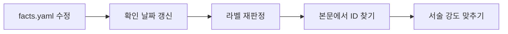

# E. 변경 이력과 갱신 방법

## 왜 이 부록이 있나

보안 책은 낡습니다. 시행일이 바뀌고, 표준이 개정되고,
조사 중이던 사건의 결론이 나옵니다.

낡지 않는 보안 책은 없습니다. **낡은 것을 아는 보안 책**은 만들 수 있습니다.
그러려면 무엇이 언제 기준인지, 무엇이 바뀌었는지가 적혀 있어야 합니다.

이 부록이 그 자리입니다.

---

## 현재 판

| 항목 | 값 |
|---|---|
| 판 | v2026.10.05 |
| 기준일 | 2026-10-05 |
| 본문 | 42편 (여는 글 1, 1부 6, 2부 6, 3부 8, 4부 10, 5부 3, 닫는 글 1, 부록 7) |
| 분량 | 마크다운 원문 252,488자 |
| 등록된 사실 | **61건** |
| 라벨 분포 | ✅ 31, ⚠️ 30, 🔍 0 |

🔍 가 0인 것은 확인하지 못한 항목을 **아예 등록하지 않았기** 때문입니다.
그 목록은 부록 D 의 「이 책에 싣지 못한 것」에 있습니다.

본문의 모든 날짜와 수치와 조문은 기준일 현재입니다.

---

**사실 하나를 고치는 순서**



## 변경 이력

| 판 | 날짜 | 바뀐 것 |
|---|---|---|
| v2026.10.05 | 2026-10-05 | 첫 공개 |
| v2026.10.05 | 2026-10-05 | 자체 점검 반영. F-030(카드사 유출 규모)을 ✅ 에서 ⚠️ 로 내렸다. 매체마다 296만과 297만으로 갈린다 |
| v2026.10.05 | 2026-10-05 | 전편 읽기 점검. 근거 없는 수치와 단정 25건 수정. F-003, F-044 의 claim 을 보강하고 F-025 를 새로 등록했다 |
| v2026.10.05 | 2026-10-05 | **확인하지 못한 자리를 전부 정리.** 조문 해석과 해당 여부, 자주 바뀌는 버전과 일정은 **독자 영역으로 넘기고** 어디서 찾는지만 남겼다. 본문의 `[검증 필요]` 표시 아홉 곳을 전부 없앴다 |
| v2026.10.05 | 2026-10-05 | 여는 글에 「왜 하필 거기였나」를 넣었다. 사건 서술만 있고 그 밑의 원리가 없었다. 최저값, 중요도와 닿는 범위의 어긋남, 공격과 방어의 비대칭 셋을 앞으로 당겼다 |
| v2026.10.05 | 2026-10-05 | **부록 F 추가.** 서버 자가진단 40항목 100점과 등급, 조치 순서. 부록 B 의 「서버 점검 20줄」은 훑는 용도로 그대로 둔다 |
| v2026.10.05 | 2026-10-05 | 분량 표기를 다시 쟀다. 이전 판의 138,404자는 셈법이 남아 있지 않아 재현되지 않았다. 지금은 차례에 오른 파일의 마크다운 원문 길이를 그대로 센다 |
| v2026.10.05 | 2026-10-05 | **1.5 추가.** 지금 실제로 들어오는 수법 열 가지를 어떻게 도는지와 막는 법으로 묶었다. 공격 절차는 싣지 않는다 |
| v2026.10.05 | 2026-10-05 | **3.7 추가.** 에이전트 공격 루프의 다섯 칸과 끊는 자리. F-073 의 단서(출력 오류, 자율성 의문)를 함께 적어 과장을 막았다 |
| v2026.10.05 | 2026-10-05 | **3.8 추가.** 코드를 쓸 때 거는 검사 네 겹, 차단 기준, 에이전트 규칙 파일, 들이는 순서 |
| v2026.10.05 | 2026-10-05 | **라이선스를 CC BY 4.0 에서 MIT 로 바꿨다.** `LICENSE` 를 추가했다. 출처 표기는 의무가 아니라 부탁으로 적는다 |
| v2026.10.05 | 2026-10-05 | 새 장과 부록 F 의 교차 참조를 전부 실제 링크로 걸고, 보안 용어를 괄호 안에 풀어 썼다 |
| v2026.10.05 | 2026-10-05 | **죽은 출처 링크 두 건의 링크란을 비웠다.** F-002 와 F-056 의 원문이 404 다. 없는 링크를 걸어 두는 것보다 비워 두고 사유를 적는 쪽이 낫다. 원래 주소는 `dead_url` 로 옮겼다 |
| v2026.10.05 | 2026-10-05 | `tools/linkcheck.py` 를 추가했다. 등록된 출처 61건의 링크가 살아 있는지 한 번에 본다. 403 은 봇 차단이라 따로 구분한다 |
| v2026.10.05 | 2026-10-05 | **1.6 추가.** 공격자의 유형과 심리, 무엇을 노리는가, 그리고 국적과 귀속. 흔적 기반 추정과 기관의 공개 귀속을 표로 갈라 두었다. F-060(FBI 와 CISA 공동 성명)을 새로 등록했다 |
| v2026.10.05 | 2026-10-05 | **본문 사진을 29장으로 늘렸다.** 42개 절 중 30개에 사진이 붙었다. 전부 커먼즈의 자유 이용 이미지이고 설명문이 본문과 이어진다. 나머지 12개 절은 다이어그램만 있다 |
| v2026.10.05 | 2026-10-05 | **출처 블록을 근거 링크 표로 바꿨다.** 33개 장에서 사실 ID 옆에 라벨과 원문 링크를 직접 단다. 이제 독자가 ID 를 들고 `facts.yaml` 을 뒤지지 않아도 된다 |
| v2026.10.05 | 2026-10-05 | **절마다 시각 자료를 하나 이상 넣었다.** 41개 전부. 다이어그램 39개와 현장 사진 3장이다. 장식용 사진은 넣지 않았고, 이유를 `images/CREDITS.md` 에 적었다 |
| v2026.10.05 | 2026-10-05 | **절마다 「개념 확인」 문제를 하나씩 넣었다.** 41개 전부. 객관식과 주관식을 섞었고 답은 접어 두어 먼저 풀 수 있게 했다. 기존 「이해 점검」 다섯 문항은 토론용이라 그대로 둔다 |
| v2026.10.05 | 2026-10-05 | `tools/check.py` 의 문장 길이 점검이 원시 HTML 줄을 산문으로 세던 것을 고쳤다. `<` 로 시작하는 줄을 건너뛴다 |
| v2026.10.05 | 2026-10-05 | 「깃허브에서 보기」가 절의 blob 주소로 덮어써지던 것을 저장소 루트로 고정했다. 머리말 제목을 공개 주소 링크로 걸었다 |
| v2026.10.05 | 2026-10-05 | **인물 인용 카드 6개와 사진을 넣었다.** Spafford, Schneier, Diffie 와 Hellman, Stoll, Mitnick, Morris. 사진은 전부 커먼즈의 자유 이용 이미지이고 저작자와 라이선스를 `images/CREDITS.md` 에 적었다. Kindervag 는 자유 이용 사진이 없어 글로만 넣었다 |
| v2026.10.05 | 2026-10-05 | 인물과 인용을 위해 사실 묶음 F-130 ~ F-149 를 열고 6건을 등록했다. 원문을 직접 연 둘만 ✅ 다 |
| v2026.10.05 | 2026-10-05 | 형광펜을 넣었다. 파스텔 세 톤으로 핵심 문장, 용어, 경고를 나눈다. 26곳에만 칠했다. 많이 칠하면 안 칠한 것과 같아진다 |
| v2026.10.05 | 2026-10-05 | 다이어그램 7개를 넣었다. 에이전트 공격 루프와 그 루프에 방어를 얹은 그림, 검사 네 겹과 되돌아가는 비용, 주변부에서 핵심으로 가는 경로, 경계 모델과 제로 트러스트 대비, 채점에서 조치까지의 흐름, 중계형 피싱 구조 |
| v2026.10.05 | 2026-10-05 | 따옴표를 감싼 굵게 표기 네 곳이 렌더링되지 않던 것을 고쳤다. 닫는 기호 앞이 구두점이면 마크다운이 강조로 보지 않는다 |
| v2026.10.05 | 2026-10-05 | **부록 G 추가.** 꼭 아는 보안 용어. 제로 트러스트를 비롯한 핵심 열 개는 길게 풀고, 나머지는 공격, 방어, 에이전트, 신원과 데이터, 사고 대응 다섯 묶음의 표로 정리했다. 부록 A 는 가나다순, 부록 G 는 먼저 알아야 하는 순서다 |

---

## 다시 봐야 하는 시점

날짜가 붙은 사실이 많습니다. 최소 아래 시점에 확인합니다.

| 언제 | 무엇을 | 관련 |
|---|---|---|
| 2026-10-30 전후 | 안전성 확보조치 기준 개정 시행 (시행일 확인 필요) | 2.4, 3.5 |
| 2027-07 전후 | ISMS-P 인증 의무화 대상과 시행일 | 2.4, F-094 |
| 2027~2028 | EU CRA 주요 의무, AI Act 고위험 의무 | 2.5 |
| 조사 종결 시 | 2026 금융권 연쇄 해킹 공식 발표 | 4.1, F-001~F-008 |
| IR 8547 확정 시 | PQC 전환 일정이 초안에서 확정으로 | 2.6, F-111 |
| 반기 1회 | NIST, OWASP, ISO, CIS, PCI DSS 버전 | 2.5 |
| 신규 사건 발생 시 | 4부에 추가할지 판단 | 4부 |

---

## 갱신하는 법

### 1. 사실 하나를 고칠 때

**`research/facts.yaml` 을 먼저 고칩니다.** 본문부터 고치지 않습니다.

```yaml
  - id: F-094
    claim: >
      (새 내용)
    source_url: "(새 출처)"
    source_type: 1차(국가법령정보센터)
    checked_date: 2027-01-15      # 반드시 갱신
    label: ✅                      # 라벨도 다시 판정
```

그다음 그 ID 를 본문에서 찾습니다.

```bash
grep -rn "F-094" part*/ appendix/
```

본문의 서술 강도가 새 라벨과 맞는지 확인합니다.
⚠️ 에서 ✅ 로 바뀌었으면 "보도에 따르면"을 떼도 됩니다.
반대면 붙여야 합니다.

### 2. 사실을 추가할 때

ID 는 묶음 번호를 따릅니다.

| 번호대 | 묶음 |
|---|---|
| F-001 ~ F-019 | 2026 금융권 |
| F-020 ~ F-029 | 2025 통신사 |
| F-030 ~ F-039 | 2025 카드사 |
| F-040 ~ F-049 | 국내 과거 사건 |
| F-050 ~ F-069 | 해외 사건 |
| F-070 ~ F-089 | AI 와 공급망 |
| F-090 ~ F-109 | 국내 법령 |
| F-110 ~ F-129 | 암호와 표준 |
| F-130 ~ F-149 | 인물과 인용 |

### 3. 사건을 추가할 때

4부에 장을 추가하면 **`README.md` 의 「차례」에도 올려야 합니다.**
뷰어가 그 절을 읽어 목차를 만듭니다. 올리지 않으면 파일은 있는데
목차에 안 보입니다.

장 형식은 기존 4부 장들을 따릅니다.

```
# 4.N 제목 (연도)
> 오늘의 질문
## 무슨 일이 있었나      ← 타임라인 표
## 어떻게 들어왔나
## 어디서 실패했나        ← 번호 목록
## 무엇이 있었으면 막혔나  ← 앞 장들과 연결
## 우리 조직 체크 3문항
## 한 줄 요약
**출처** — ...
```

### 4. 판 번호를 올릴 때

- `README.md` 의 기준일
- `index.html` 의 `<meta name="description">` 과 푸터
- `research/facts.yaml` 맨 위의 기준일 주석
- 이 부록의 「현재 판」과 「변경 이력」

네 곳을 함께 고칩니다.

---

## 갱신할 때 하지 말 것

**본문만 고치고 `facts.yaml` 을 안 고치는 것.**
레지스트리가 갈라지면 다음 사람이 무엇이 맞는지 모릅니다.

**확인 날짜를 안 바꾸는 것.** 내용을 고쳤으면 확인 날짜도 바뀐 것입니다.

**라벨을 안 다시 보는 것.** 출처가 바뀌면 라벨도 바뀔 수 있습니다.

**기준일을 안 올리는 것.** 기준일이 낡으면 독자가 전체를 의심합니다.

---

## 틀린 것을 발견하면

저장소에 이슈로 알려 주십시오.

가장 도움이 되는 형태입니다.

```
ID: F-0NN
문제: (무엇이 틀렸는지)
근거: (더 나은 출처 링크)
확인일: (언제 확인했는지)
```

ID 를 적어 주시면 본문의 어디를 고쳐야 하는지 바로 찾습니다.

**출처가 더 좋은 것으로 바뀌는 제안이 가장 반갑습니다.**
`research/verify-todo.md` 의 「출처 승급」에 2차를 1차로 바꿔야 하는 목록이 있습니다.
**여덟 건입니다.** 그중 하나라도 올려 주시면 이 책이 단단해집니다.

---

## 이 책이 사라지지 않게

마크다운 파일입니다. 저장소를 받으면 그대로 읽힙니다.
PDF 도 없고 전용 도구도 없습니다.

복사, 재배포, 인쇄, 수업 자료로 쓸 수 있습니다([MIT](../LICENSE)).
저작권 표시만 남겨 주시면 됩니다. **출처까지 적어 주시면 감사합니다.**

고쳐서 쓰셔도 됩니다. 고치실 때 **기준일과 확인 날짜만 같이 바꿔 주십시오.**
그 두 가지가 이 책의 유일한 약속입니다.

---

## 개념 확인

**Q.** 사실 하나가 틀린 것을 발견했습니다. 가장 먼저 고쳐야 하는 파일은 무엇입니까. (주관식)

<details>
<summary>답 보기</summary>

**`research/facts.yaml` 을 먼저 고칩니다.** 본문부터 고치지 않습니다.
레지스트리를 고치고 확인 날짜와 라벨을 다시 매긴 뒤,
그 ID 를 본문에서 찾아 서술 강도를 맞춥니다.
레지스트리와 본문이 갈라지면 다음 사람이 무엇이 맞는지 모릅니다.

</details>
