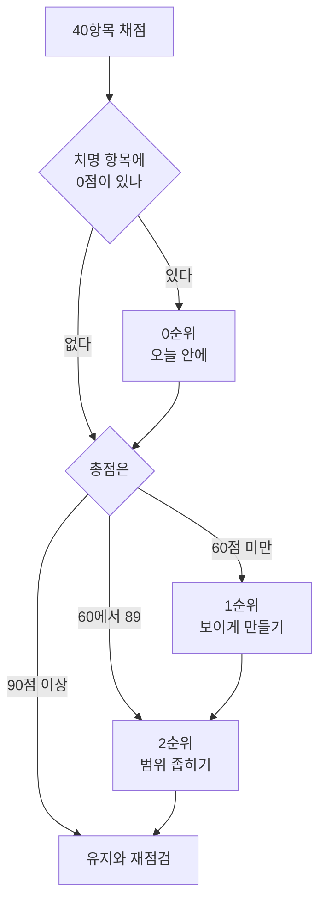

# F. 우리 서버 안전 점검 100점

> **오늘의 질문** — 우리 서버에서 0점짜리 항목은 몇 개입니까.

[부록 B](b-checklists.md) 의 「서버 점검 20줄」은 빠르게 훑는 용도입니다.
이 부록은 한 번 제대로 앉아서 점수를 매기는 자리입니다.
항목 40개, 100점 만점입니다.

---

## 먼저 읽을 것

**배점은 이 책이 정한 것입니다.** 표준도 인증 기준도 아닙니다.
사건에서 반복해서 실패한 자리에 점수를 더 줬습니다.
ISMS-P 나 CIS 점수와 바꿔 쓰면 안 됩니다.
그쪽은 인증과 감사의 기준이고, 이 표는 자기 점검용입니다.

**이 점수는 안전을 재지 않습니다.** 안 보고 있는 자리를 셉니다.
90점이 안전하다는 뜻이 아니라, 모르는 것이 적다는 뜻입니다.

점수를 올리는 것이 목적이 되면 이 표는 망가집니다.
<mark>**"모른다"를 "안다"로 바꾸는 것**</mark>이 목적입니다.

---

## 채점 규칙

| 답 | 점수 |
|---|---|
| 그렇다 | 배점 전부 |
| 일부만 그렇다 | 배점의 절반 (소수점은 버립니다) |
| 아니다 | 0 |
| **모른다** | **0** |

"모른다"를 0으로 두는 이유가 있습니다.
<mark class="w">확인되지 않은 통제는 없는 통제와 같기 때문입니다.</mark>
있는데 못 찾았다면, 못 찾는 것 자체가 사고 때 문제가 됩니다.

**증거 없이 그렇다고 적지 않습니다.** 화면을 띄워서 확인합니다.
"아마 켜져 있을 겁니다"는 모른다입니다.

🔴 표시가 붙은 다섯 항목은 **치명 항목**입니다.
하나라도 0점이면 총점과 관계없이 등급이 D 이하로 내려갑니다.
이유는 「등급」 절에 적었습니다.

---

## A. 자산과 노출 (13점)

목록에 없는 것은 점검도 투자도 가지 않습니다. 여기가 1번인 이유입니다.

| # | 항목 | 배점 | 점수 |
|---|---|---|---|
| 1 | 외부에서 닿는 주소를 전부 적은 목록이 있다 | 3 | |
| 2 | 그 목록을 기억이 아니라 스캔으로 다시 만들어 봤다 | 3 | |
| 3 | 목록의 항목마다 담당자 이름이 적혀 있다 | 2 | |
| 4 | 테스트, 데모, 옛 관리 페이지가 남아 있지 않다 | 3 | |
| 5 | 사내 전용 시스템도 같은 목록에 들어 있다 | 2 | |

2번이 핵심입니다. 적어 둔 목록과 실제로 뜨는 목록은 거의 항상 다릅니다.
차이가 0 이 아니면 그 차이가 지금 가장 위험한 자산입니다.

**더 볼 곳** — [1.1 공격을 보는 눈](../part1/01-attack.md) 의 공격면과 주변부, [2.1 자산과 데이터](../part2/01-assets.md), [1.5 요즘 들어오는 수법](../part1/05-recent-attacks.md) 10번

---

## B. 네트워크 경계 (14점)

| # | 항목 | 배점 | 점수 |
|---|---|---|---|
| 6 | 공인 IP 에 열린 포트가 목록과 일치한다 | 3 | |
| 7 | 🔴 관리 포트가 인터넷에 열려 있지 않다 | 3 | |
| 8 | 아웃바운드가 허용 목록으로 제한된다 | 3 | |
| 9 | 서버 간 통신이 기본 거부다 | 3 | |
| 10 | 관리망과 서비스망이 나뉘어 있다 | 2 | |

8번을 빠뜨리는 곳이 많습니다.
아웃바운드(outbound)는 **우리 서버가 바깥으로 나가는 통신**입니다.
들어오는 것만 막고 나가는 것은 열어 두는 곳이 많습니다.
유출도 내려받기도 전부 나가는 방향입니다.
아웃바운드를 막으면 침입을 못 막아도 유출은 막힐 수 있습니다.

**더 볼 곳** — [1.1 공격을 보는 눈](../part1/01-attack.md) 의 공격의 경제성, [3.3 서버 구성](../part3/03-server.md), [1.5 요즘 들어오는 수법](../part1/05-recent-attacks.md) 4번과 8번

---

## C. 계정과 권한 (16점)

| # | 항목 | 배점 | 점수 |
|---|---|---|---|
| 11 | 🔴 기본 계정과 기본 비밀번호가 하나도 없다 | 3 | |
| 12 | 서비스가 루트나 관리자 권한으로 돌지 않는다 | 3 | |
| 13 | 여럿이 함께 쓰는 공용 계정이 없다 | 3 | |
| 14 | 🔴 퇴사자와 종료된 외주 계정이 남아 있지 않다 | 3 | |
| 15 | 오래 안 쓴 계정을 자동으로 찾아낸다 | 2 | |
| 16 | 사람, 서비스, API 키, 에이전트를 한 화면에서 본다 | 2 | |

13번이 0점이면 그 뒤의 로그는 대부분 쓸모가 없습니다.
누가 했는지 가려낼 수 없기 때문입니다.

16번은 점점 무거워지는 항목입니다.
사람 계정만 세던 때와 달리, 지금은 토큰과 에이전트가 더 많습니다.

**더 볼 곳** — [1.3 신원과 데이터](../part1/03-identity-data.md) 의 인증과 인가, 기계 신원, [2.2 신원과 접근 통제](../part2/02-identity.md)

---

## D. 관리 접근 (11점)

| # | 항목 | 배점 | 점수 |
|---|---|---|---|
| 17 | 관리 접근이 점프 호스트(관리용으로만 쓰는 중간 서버)나 VPN 을 거친다 | 3 | |
| 18 | 🔴 관리 접근에 다중 인증이 걸려 있다 | 3 | |
| 19 | 관리자 로그인에 피싱에 강한 수단을 쓴다 | 2 | |
| 20 | 관리 세션이 기록되고 나중에 볼 수 있다 | 2 | |
| 21 | 긴급용 계정이 봉인돼 있고 꺼낸 기록이 남는다 | 1 | |

19번은 18번과 다릅니다.
문자나 앱 코드를 쓰는 다중 인증은 중계형 피싱에 뚫립니다.
패스키나 하드웨어 키는 그 구조가 통하지 않습니다.

**더 볼 곳** — [1.3 신원과 데이터](../part1/03-identity-data.md) 의 다중 인증과 패스키, [4.7 전화 한 통](../part4/07-helpdesk.md), [1.5 요즘 들어오는 수법](../part1/05-recent-attacks.md) 1번과 2번

---

## E. 데이터 (15점)

| # | 항목 | 배점 | 점수 |
|---|---|---|---|
| 22 | 개인정보가 어느 시스템 몇 곳에 있는지 적혀 있다 | 3 | |
| 23 | DB 계정 권한이 필요한 것만이다 | 2 | |
| 24 | DB 접속 출발지가 제한된다 | 2 | |
| 25 | 🔴 공개로 열린 저장소 버킷이 없다 | 3 | |
| 26 | 저장 암호화가 켜져 있고 열쇠가 데이터와 분리돼 있다 | 3 | |
| 27 | 운영 데이터를 개발이나 테스트로 그대로 복사하지 않는다 | 2 | |

26번에서 반쪽짜리가 흔합니다. 암호화는 켰는데 열쇠가 같은 계정 안에 있습니다.
같이 털리면 암호화는 없던 일이 됩니다.
켜져 있는지가 아니라 **열쇠가 어디 있는지**를 봅니다.

27번은 자주 잊힙니다. 개발 환경은 통제가 느슨한데 데이터는 운영과 같습니다.
공격자 입장에서는 같은 값을 더 싸게 얻는 길입니다.

**더 볼 곳** — [1.3 신원과 데이터](../part1/03-identity-data.md) 의 데이터 분류와 암호화의 세 자리, [2.6 암호와 양자내성암호](../part2/06-crypto.md)

---

## F. 비밀과 공급망 (11점)

| # | 항목 | 배점 | 점수 |
|---|---|---|---|
| 28 | 비밀이 코드와 설정 파일에 들어 있지 않다 | 3 | |
| 29 | 비밀을 바꾸는 절차가 있고 최근에 실제로 돌려 봤다 | 2 | |
| 30 | 빌드에 들어가는 의존성이 고정돼 있다 (잠금 파일 커밋) | 2 | |
| 31 | 패치 목표 기간이 정해져 있고 지켜지고 있다 | 3 | |
| 32 | 알려진 취약점을 우리 자산 목록과 대조하는 사람이 있다 | 1 | |

29번이 중요한 이유가 있습니다.
사고가 났을 때 가장 먼저 해야 하는 일이 비밀 교체입니다.
그때 처음 해 보면 서비스가 멈춥니다.

32번은 도구가 아니라 사람을 묻는 항목입니다.
취약점 공지는 쏟아지는데, 그중 우리 것이 어느 것인지 보는 사람이 없으면
공지는 읽히지 않습니다.

**더 볼 곳** — [1.2 방어를 세우는 눈](../part1/02-defense.md) 의 패치 수명, [3.8 코드를 쓸 때 보안을 같이 쓰는 법](../part3/08-secure-coding.md), [4.5 78일 (Equifax)](../part4/05-patch-equifax.md), [4.10 설치 한 줄 (npm)](../part4/10-supply-npm.md)

---

## G. 로그와 탐지 (12점)

| # | 항목 | 배점 | 점수 |
|---|---|---|---|
| 33 | 로그가 생성 즉시 서버 밖으로 전송된다 | 3 | |
| 34 | 3개월 전 접근 기록을 검색할 수 있다 | 2 | |
| 35 | 로그에 비밀번호, 토큰 전체, 주민등록번호가 없다 | 3 | |
| 36 | 평소와 다른 시간, 장소, 양의 접근에 알림이 온다 | 2 | |
| 37 | 알림 받을 사람이 정해져 있고 밤에도 닿는다 | 2 | |

33번이 0점이면 나머지 넷이 무의미합니다.
서버 안에만 있는 로그는 공격자가 지웁니다.
들어온 다음에 가장 먼저 하는 일입니다.

37번은 기술 항목이 아닙니다. 사건 대부분에서 가장 오래 걸린 일은
탐지가 아니라 **결정권자를 찾는 일**이었습니다.

**더 볼 곳** — [1.2 방어를 세우는 눈](../part1/02-defense.md) 의 탐지와 대응 시간, [2.3 탐지와 대응](../part2/03-detect.md), [3.5 로그 설계](../part3/05-logging.md)

---

## H. 백업과 복구 (8점)

| # | 항목 | 배점 | 점수 |
|---|---|---|---|
| 38 | 백업이 운영 계정 권한으로 지울 수 없는 곳에 있다 (불변 백업) | 3 | |
| 39 | 최근 1년 안에 실제로 복원해 봤다 | 3 | |
| 40 | 복구 목표 시간이 숫자로 정해져 있다 | 2 | |

39번에서 많이 깎입니다. 백업은 도는데 복원은 해 본 적이 없습니다.
돌아가는 백업과 복구되는 백업은 다릅니다.
해 보기 전까지는 모르는 쪽에 가깝습니다.

**더 볼 곳** — [1.2 방어를 세우는 눈](../part1/02-defense.md) 의 불변 백업과 복원력, [3.6 뚫려도 괜찮은 시스템](../part3/06-resilient.md)

---

## 점수 합계

| 영역 | 배점 | 우리 점수 |
|---|---|---|
| A 자산과 노출 | 13 | |
| B 네트워크 경계 | 14 | |
| C 계정과 권한 | 16 | |
| D 관리 접근 | 11 | |
| E 데이터 | 15 | |
| F 비밀과 공급망 | 11 | |
| G 로그와 탐지 | 12 | |
| H 백업과 복구 | 8 | |
| **합계** | **100** | |

🔴 치명 항목 중 0점이 있습니까 — 예 / 아니오

---

## 등급

| 점수 | 등급 | 지금 상태 |
|---|---|---|
| 90 ~ 100 | **A** | 모르는 자리가 거의 없습니다. 점수를 올릴 때가 아니라 유지할 때입니다 |
| 75 ~ 89 | **B** | 구조는 서 있습니다. 빠진 것은 대개 "안 한 것"이 아니라 "확인 안 한 것"입니다 |
| 60 ~ 74 | **C** | 핵심은 지킵니다. 주변부가 비어 있습니다. 2026년 은행들이 여기 있었습니다 |
| 40 ~ 59 | **D** | 들어오면 곧바로 퍼집니다. 경계선 밖에 방어가 거의 없습니다 |
| 0 ~ 39 | **E** | 뚫렸는지 아닌지를 알 방법이 없습니다. 탐지부터 세웁니다 |

**치명 항목 규칙** — 🔴 다섯 중 하나라도 0점이면 총점과 무관하게 **D 이하**로 읽습니다.

규칙이 가혹해 보이지만 이유는 단순합니다.
보안 수준은 평균이 아니라 최저값으로 정해지기 때문입니다.
다섯 항목은 하나만 열려도 나머지 서른아홉을 건너뛰게 해 주는 자리입니다.

<mark>**C 등급이 가장 흔하고 가장 위험합니다.**</mark>
평균 점수가 나쁘지 않아서 괜찮다고 느끼는데,
실제로 뚫리는 곳은 점수를 깎아 먹은 그 몇 칸이기 때문입니다.

---

## 조치사항

점수를 올리는 순서가 있습니다. 위에서부터 합니다.

### 0순위 — 오늘 안에 (치명 항목 0점)

| 항목 | 조치 | 대략 걸리는 시간 |
|---|---|---|
| 7 관리 포트 노출 | 보안 그룹과 방화벽에서 인터넷 노출을 닫고 점프 호스트로 돌립니다 | 반나절 |
| 11 기본 비밀번호 | 기본 계정을 지우거나 끄고, 남길 것은 비밀번호를 바꿉니다 | 반나절 |
| 14 퇴사자와 외주 계정 | 인사 기록과 계정 목록을 대조해 즉시 막습니다 | 하루 |
| 18 관리 접근 다중 인증 | 관리자부터 켭니다. 전사 적용은 그다음입니다 | 하루 |
| 25 공개 버킷 | 전부 비공개로 돌리고, 공개가 필요한 것만 다시 엽니다 | 반나절 |

0순위는 예산도 도구도 필요 없습니다. 설정입니다.
**여기를 넘기지 않고 다음으로 가지 않습니다.**

### 1순위 — 2주 안에 (보이게 만드는 일)

| 항목 | 조치 |
|---|---|
| 1, 2 자산 목록 | 외부 스캔을 한 번 돌리고 적어 둔 목록과 맞춰 봅니다. 차이를 먼저 처리합니다 |
| 4 안 쓰는 것 | 목록에 없던 것부터 끕니다. 지우기 전에 끄고 2주 지켜봅니다 |
| 33 로그 외부 전송 | 전송부터 켭니다. 분석은 쌓인 다음 일입니다 |
| 35 로그 속 비밀 | 출력 단계에 마스킹을 넣습니다. 이미 쌓인 로그는 따로 처리합니다 |
| 37 알림 수신자 | 이름을 적습니다. 역할 이름이 아니라 사람 이름입니다 |

1순위의 목표는 방어가 아니라 **가시성**입니다.
안 보이는 것은 고칠 수도 없습니다.

### 2순위 — 분기 안에 (범위를 좁히는 일)

| 항목 | 조치 |
|---|---|
| 8 아웃바운드 | 허용 목록으로 바꿉니다. 먼저 기록만 켜서 무엇이 나가는지 2주 봅니다 |
| 9 서버 간 통신 | 기본 거부로 바꾸고 필요한 경로만 엽니다. 단계적으로 합니다 |
| 12, 13 권한과 공용 계정 | 서비스 계정을 분리하고 공용 계정을 개인 계정으로 바꿉니다 |
| 22 데이터 위치 | 개인정보가 있는 시스템을 세어 적습니다. 숫자 하나가 목표입니다 |
| 26 암호화 열쇠 | 열쇠를 데이터와 다른 계정이나 서비스로 옮깁니다 |
| 27 운영 데이터 복사 | 개발용 데이터를 가짜 값으로 바꾸거나 가립니다 |
| 31 패치 기간 | 등급별 목표 일수를 정하고 지표로 봅니다 |
| 38, 39 백업 | 지울 수 없는 보관을 만들고 복원을 한 번 해 봅니다 |

### 3순위 — 반기 안에 (구조를 바꾸는 일)

| 항목 | 조치 |
|---|---|
| 10 망 분리 | 관리망을 따로 세웁니다 |
| 16 신원 통합 | 사람, 서비스, 키, 에이전트를 한 곳에서 보게 합니다 |
| 19 피싱 내성 | 관리자부터 패스키나 하드웨어 키로 옮깁니다 |
| 20 세션 기록 | 관리 세션 기록을 켭니다 |
| 29, 30 비밀과 의존성 | 교체 절차를 만들고 한 번 돌려 봅니다. 의존성을 고정합니다 |
| 36 이상 탐지 | 로그가 3개월 쌓인 다음에 시작합니다 |

**3순위를 1순위보다 먼저 하지 않습니다.**
구조를 바꾸는 일은 오래 걸리고, 그동안 0순위는 열려 있습니다.

---

## 다시 점검할 때

| 언제 | 무엇을 |
|---|---|
| 새 서버를 띄울 때 | 40개 전부 |
| 분기마다 | 40개 전부 |
| 외주 계약이 끝날 때 | 14, 16, 28 |
| 사고가 난 뒤 | 33 ~ 37 을 먼저 |
| 새 서비스를 외부에 열 때 | A 와 B 전부 |

점수 추이를 적어 두면 다음 분기에 할 말이 생깁니다.

| 날짜 | 총점 | 등급 | 치명 0점 | 그 분기에 한 일 |
|---|---|---|---|---|
| | | | | |
| | | | | |

---

## 이 표의 한계

**이 표는 감사가 아닙니다.** 자가진단입니다.
40개를 다 채워도 인증 요건을 만족한다는 뜻이 아닙니다.
규제 대상이면 2.4 와 2.5 를 보고 해당 여부는 직접 확인하십시오.

**업종별로 빠진 것이 있습니다.**
산업 제어, 의료 기기, 결제 가맹 환경에는 여기 없는 항목이 더 붙습니다.

**점수가 같아도 위험은 다릅니다.**
같은 70점이라도 개인정보 천만 건을 가진 곳과 내부 도구만 있는 곳은
같은 위험이 아닙니다. 점수는 자기 자신과 비교할 때만 뜻이 있습니다.

---

---

## 개념 확인

**Q.** 채점에서 "모른다"를 0점으로 두는 이유는 무엇입니까.

1. 채점을 단순하게 하려고
2. 확인되지 않은 통제는 없는 통제와 같아서
3. 점수를 일부러 낮추려고
4. 표준이 그렇게 정해서

답 보기

**2번.** 있는데 못 찾았다면, 못 찾는다는 사실 자체가 사고 때 문제가 됩니다.
그래서 "아마 켜져 있을 겁니다"는 모른다로 칩니다.
목적은 점수가 아니라 **모르는 칸을 줄이는 것**입니다.

## 한 줄 요약

**점수가 아니라 0점짜리 항목의 개수를 봅니다.**
평균이 아니라 최저값이 그 조직의 보안 수준입니다.

---

## 더 볼 곳

- [1.5 요즘 들어오는 수법 열 가지](../part1/05-recent-attacks.md) — 이 표가 막으려는 수법들입니다
- [3.3 서버 구성](../part3/03-server.md) — B, C, D 영역의 설명
- [3.5 로그 설계](../part3/05-logging.md) — G 영역의 설명
- [3.6 뚫려도 괜찮은 시스템](../part3/06-resilient.md) — H 영역의 설명
- [3.8 코드를 쓸 때 보안을 같이 쓰는 법](../part3/08-secure-coding.md) — F 영역의 설명
- [부록 B 체크리스트 모음](b-checklists.md) — 더 짧은 판
- [2.4 국내 지침 지도](../part2/04-rules-korea.md) — 규제 대상인지 확인할 자리
