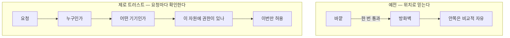

# G. 꼭 아는 보안 용어

> **오늘의 질문** — 회의에서 제로 트러스트라는 말이 나왔을 때, 그게 제품 이름인지 설계 방침인지 구분이 됩니까.

[부록 A](a-glossary.md) 는 **본문에 나온 말**을 가나다순으로 모은 것입니다.
이 부록은 다릅니다. **먼저 알아야 하는 순서**로 추렸습니다.

용어를 따로 묶는 이유가 있습니다.
보안에서 말이 틀리면 대책이 틀어집니다.
incident 와 breach 를 같은 말로 쓰면 공지가 틀어지고,
mitigation 을 조치 완료로 읽으면 안 고쳐진 채로 넘어갑니다.
<mark>**말을 맞추는 것이 통제를 맞추는 일의 앞단입니다.**</mark>

영어 표기를 같이 답니다.
표준과 공급사 공지는 영어로 먼저 나오고,
한국어로 옮기는 과정에서 뜻이 갈리는 말이 많기 때문입니다.
영어를 공부하자는 것이 아니라 **같은 것을 가리키게 하자는 것**입니다.

---

## 1. 반드시 아는 말 열 개

표로 훑기 전에 열 개만 제대로 봅니다.
이 열 개를 모르면 나머지 단어를 알아도 문서가 안 읽힙니다.

### Zero Trust (제로 트러스트)

"**아무것도 기본으로 믿지 않는다**"는 설계 방침입니다.

> **말을 만든 사람** — Forrester 의 John Kindervag 가 쓴 보고서
> 「No More Chewy Centers: Introducing The Zero Trust Model Of Information Security」
> 에서 널리 퍼졌습니다(⚠️ F-132). 제목의 "쫄깃한 속"이 요점입니다.
> 바깥은 단단하고 안은 말랑한 구조를 그만두자는 말입니다.
> 자유 이용 사진이 없어 초상은 넣지 않았습니다.
가장 많이 오해받는 말이라 길게 적습니다.

예전 방식은 **경계**로 나눴습니다.
방화벽 안쪽은 믿고 바깥쪽은 안 믿습니다.
한 번 들어온 사람은 안에서는 비교적 자유롭게 움직입니다.

이 전제가 깨진 지 오래입니다.
직원은 집에서 일하고, 서비스는 클라우드에 있고,
협력사와 에이전트가 안쪽에 들어와 있습니다.
<mark>**"안"이 어디인지 말할 수 없게 됐습니다.**</mark>

제로 트러스트는 믿음의 단위를 바꿉니다.
망의 위치가 아니라 <mark class="t">**요청 하나하나**</mark>를 봅니다.
누가, 어떤 기기로, 무엇에, 지금 접근하는가를 매번 확인합니다.
미국 NIST 가 SP 800-207 로 정리해 두었고
[2.5](../part2/05-rules-global.md) 에 찾아가는 자리를 적어 두었습니다.

**아래쪽에는 안과 밖이 없습니다.** 그것이 핵심입니다.

**흔한 오해 셋을 짚습니다.**

| 오해 | 실제 |
|---|---|
| 제품을 사면 된다 | 제품이 아니라 설계 방침입니다. 사서 켜는 것이 아닙니다 |
| VPN 을 없애는 것이다 | VPN 을 없애는 것이 목표가 아닙니다. **위치로 믿는 것**을 그만두는 것입니다 |
| 한 번에 전환한다 | 한 번에 못 합니다. 가장 중요한 자원 하나부터 좁혀 갑니다 |

**어디서부터 하나** — 세 가지를 먼저 봅니다.
신원을 한곳에서 관리하고, 기기 상태를 확인하고,
접근을 자원 단위로 쪼갭니다.
[부록 F](f-server-audit.md) 의 C 와 D 영역이 그 입구입니다.

### Attack Surface (공격면)

공격자가 건드릴 수 있는 모든 지점의 합입니다.
열린 포트, 로그인 화면, API, 직원 계정, 협력사 경로가 전부 들어갑니다.
**줄이는 방법은 하나뿐입니다. 안 쓰는 것을 끕니다.**

### Least Privilege (최소 권한)

필요한 만큼만 준다는 원칙입니다.
문서에서는 **PoLP** (Principle of Least Privilege) 로도 줄여 씁니다.
권한을 줄이는 것이 아니라 **처음부터 적게 주는 것**이 핵심입니다.

### Blast Radius (폭발 반경)

하나가 뚫렸을 때 피해가 닿는 범위입니다.
원래 폭발물 용어인데 보안과 클라우드 설계에서 그대로 씁니다.
"이 계정이 털리면 어디까지 가나"가 그 계정의 폭발 반경입니다.

### Defense in Depth (심층 방어)

한 겹이 뚫려도 다음 겹이 남게 쌓는 방식입니다.
겹을 쌓는 것이지 **같은 겹을 두껍게 하는 것이 아닙니다.**
방화벽 두 대를 나란히 놓는 것은 심층 방어가 아닙니다.

### Assume Breach (가정 침해)

**이미 뚫렸다고 가정하고** 설계하는 방식입니다.
"막았나"가 아니라 "뚫렸으면 무엇이 보이나"를 묻습니다.
제로 트러스트와 짝으로 자주 나옵니다.

### Dwell Time (체류 시간)

침입한 시점부터 **발각될 때까지** 걸린 시간입니다.
이 책의 4부 사건들이 대부분 이 숫자의 이야기입니다.
2025년 통신사 사건은 최초 감염과 결정적 유출 사이가
3년 8개월이었습니다(✅ F-020).

함께 나오는 말이 둘 있습니다.
**MTTD** (Mean Time To Detect, 평균 탐지 시간) 와
**MTTR** (Mean Time To Respond, 평균 대응 시간) 입니다.

### Lateral Movement (내부 이동)

들어온 지점에서 옆으로 옮겨 다니는 단계입니다.
직역하면 측면 이동인데 **내부 이동**으로 더 많이 옮깁니다.
망 분리와 최소 권한이 이것을 막기 위해 있습니다.

### Credential (자격증명)

신분을 증명하는 것 전부입니다.
비밀번호, 토큰, API 키, 인증서가 다 들어갑니다.
**비밀번호보다 넓은 말**이라 번역할 때 자주 좁아집니다.

### Prompt Injection (프롬프트 인젝션)

지시문에 다른 지시를 끼워 넣어 모델의 목표를 바꾸는 공격입니다.
에이전트 시대의 핵심 단어라 아래 4번에서 따로 다룹니다.

---

## 2. 공격 쪽 단어

| 한국어 | English | 한 줄 뜻 |
|---|---|---|
| 초기 침투 | initial access | 처음 발판을 얻는 단계 |
| 내부 이동 | lateral movement | 안에서 옆으로 옮겨 다니는 것 |
| 권한 상승 | privilege escalation | 더 높은 권한을 얻는 것 |
| 지속성 확보 | persistence | 재부팅과 패치 뒤에도 남는 발판 |
| 유출 | exfiltration | 데이터를 밖으로 빼내는 것 |
| 위협 행위자 | threat actor | 공격하는 주체. 국적을 단정하지 않을 때 씁니다 |
| 수법 묶음 | TTP | Tactics, Techniques, Procedures. 전술, 기법, 절차 |
| 침해 지표 | IoC | Indicator of Compromise. 침해를 가리키는 흔적 |
| 제로데이 | zero-day | 아직 공개되지도 고쳐지지도 않은 취약점 |
| 취약점 번호 | CVE | 전 세계가 공유하는 취약점 식별 번호 |
| 심각도 점수 | CVSS | 취약점의 심각도를 0~10 으로 매긴 점수 |
| 악용 확인 목록 | KEV | Known Exploited Vulnerabilities. 실제로 악용이 확인된 목록 |
| 공급망 공격 | supply chain attack | 납품하는 쪽을 뚫어 받는 쪽을 치는 것 |
| 사회공학 | social engineering | 기술이 아니라 사람을 속이는 것 |
| 중간자 피싱 | AiTM | Adversary in the Middle. 가짜 화면이 실시간 중계하는 피싱 |
| 정상 도구 악용 | living off the land | 악성코드 없이 원래 있던 도구만 쓰는 것 |

**실무에서 가장 자주 쓰는 셋은 CVE, CVSS, KEV 입니다.**
CVSS 가 높아도 실제 악용이 없으면 급하지 않을 수 있고,
CVSS 가 중간이어도 KEV 에 올라 있으면 오늘 고쳐야 합니다.
<mark>**점수보다 악용 여부가 먼저입니다.**</mark>

---

## 3. 방어 쪽 단어

| 한국어 | English | 한 줄 뜻 |
|---|---|---|
| 제로 트러스트 | zero trust | 위치로 믿지 않고 요청마다 확인 |
| 심층 방어 | defense in depth | 겹겹이 쌓기 |
| 최소 권한 | least privilege | 필요한 만큼만 |
| 폭발 반경 | blast radius | 하나 뚫렸을 때 닿는 범위 |
| 기본 거부 | deny by default | 허용 목록에 없으면 막기 |
| 허용 목록 | allowlist | 허가한 것만 통과 |
| 차단 목록 | denylist | 막을 것만 나열. 허용 목록보다 약합니다 |
| 망 분리 | segmentation | 망을 쪼개 이동을 제한 |
| 미세 분리 | microsegmentation | 워크로드 단위까지 더 잘게 쪼개기 |
| 굳히기 | hardening | 기본 설정을 안전한 쪽으로 바꾸기 |
| 미끼 | canary, honeypot | 건드리면 그 자체가 신호인 덫 |
| 불변 백업 | immutable backup | 정해진 기간 지울 수 없는 백업 |
| 복구 목표 시간 | RTO | Recovery Time Objective. 언제까지 복구할 것인가 |
| 복구 목표 시점 | RPO | Recovery Point Objective. 어느 시점까지 되살릴 것인가 |
| 완화 / 근본 조치 | mitigation / remediation | 임시로 덜어내기 / 원인 제거 |

**mitigation 과 remediation 을 섞어 쓰면 안 됩니다.**
공지문에 mitigation 만 있으면 <mark class="w">**아직 고쳐지지 않았다**</mark>는 뜻입니다.
우회 설정으로 버티라는 말입니다.

---

## 4. 에이전트 시대 단어

여기가 가장 빨리 바뀌는 묶음입니다.
그래서 **제품 이름이 아니라 개념 이름**만 적습니다.

| 한국어 | English | 한 줄 뜻 |
|---|---|---|
| 에이전트 | agent | 목표를 받아 스스로 계획하고 도구로 실행하는 프로그램 |
| 도구 | tool | 에이전트가 부를 수 있는 기능 하나 |
| 도구 권한 | agency | 에이전트에게 쥐여 준 행동 능력의 범위 |
| 최소 도구 권한 | least agency | 최소 권한의 에이전트 판. 쥐여 주는 도구를 줄입니다 |
| 프롬프트 인젝션 | prompt injection | 지시문에 다른 지시를 끼워 목표를 바꾸기 |
| 간접 인젝션 | indirect prompt injection | 에이전트가 **읽는 데이터**에 명령을 숨기기 |
| 제로클릭 | zero-click | 사용자가 아무것도 누르지 않아도 성립 |
| 탈옥 | jailbreak | 모델의 제한을 벗겨내려는 시도 |
| 가드레일 | guardrail | 모델 앞뒤에 세우는 검사와 제한 |
| 사람 승인 | human in the loop | 중요한 행동 앞에 사람을 세우기 |
| 격리 실행 | sandbox | 나가지도 건드리지도 못하는 칸 안에서 돌리기 |
| 메모리 오염 | memory poisoning | 기억을 더럽혀 다음 대화까지 영향 남기기 |
| 자율 루프 | autonomous loop | 결과를 보고 다음 수를 바꾸며 도는 것 |
| 패키지 환각 | package hallucination | 없는 패키지를 있는 것처럼 말하기 |
| 슬롭스쿼팅 | slopsquatting | 환각 이름을 공격자가 선점하기 |
| 출처 추적 | provenance | 이 코드와 산출물이 어디서 왔는지 |
| 기계 신원 | machine identity | 사람이 아닌 것의 계정. 에이전트 포함 |

### 에이전트 시대에 꼭 짚을 네 가지

단어만으로는 부족한 자리가 넷 있습니다.

**1. 위험은 모델이 아니라 도구에 있습니다.**
문서에서 `agency` 라는 말이 나오면 그 자리를 보십시오.
읽기만 하는 에이전트와 명령을 실행하는 에이전트는
같은 모델을 써도 다른 위험입니다.
그래서 평가 질문이 "이 모델이 안전한가"가 아니라
"**이 도구를 이 에이전트에게 줘야 하나**"로 바뀝니다.

**2. 프롬프트 인젝션은 "완전 차단"으로 적히지 않습니다.**
영문 문서에서 이 주제의 결론은 거의 항상
`reduce the blast radius` 나 `assume it will succeed` 쪽입니다.
<mark class="w">**막겠다고 적힌 문서는 의심해 보십시오.**</mark>
모델에게 시스템 지시와 입력 데이터가 같은 글자로 보이는 한,
입력 검증으로 푸는 문제가 아닙니다.

**3. 제로 트러스트가 에이전트에도 그대로 적용됩니다.**
에이전트는 사람도 프로그램도 아닌 중간 존재입니다.
사람처럼 판단하고 프로그램처럼 빠릅니다.
그래서 사람 계정을 빌려 주면 안 됩니다.
**자기 신원을 주고, 권한을 따로 매기고, 로그를 따로 남깁니다.**

**4. 참고할 목록이 하나 있습니다.**
OWASP 가 에이전트 응용을 대상으로 한 상위 목록을 냈습니다.
에이전트 목표 탈취, 도구 오용, 신원과 권한 남용 같은 항목이
앞쪽에 있습니다(⚠️ F-074).
무엇부터 볼지 정할 때 쓰기 좋습니다.

---

## 5. 신원과 데이터 단어

| 한국어 | English | 한 줄 뜻 |
|---|---|---|
| 인증 | authentication (authn) | 누구인지 확인 |
| 인가 | authorization (authz) | 무엇을 해도 되는지 확인 |
| 신원 관리 | IAM | Identity and Access Management |
| 역할 기반 권한 | RBAC | 역할에 권한을 매고 사람을 역할에 넣기 |
| 속성 기반 권한 | ABAC | 상황과 속성으로 그때그때 판단 |
| 단일 로그인 | SSO | 한 번 로그인으로 여러 서비스 |
| 다중 인증 | MFA | 비밀번호 말고 하나 더 |
| 패스키 | passkey | 기기에 둔 열쇠로 로그인. 피싱에 강합니다 |
| 비밀 | secret | 코드 밖에 둬야 하는 값. 키, 토큰, 비밀번호 |
| 교체 | rotation | 열쇠를 주기적으로 갈아 끼우기 |
| 단명 자격증명 | short-lived credential | 금방 만료되는 열쇠 |
| 저장 중 암호화 | encryption at rest | 디스크에 있을 때 |
| 전송 중 암호화 | encryption in transit | 네트워크를 지날 때 |
| 사용 중 암호화 | encryption in use | 메모리에서 처리될 때 |
| 개인식별정보 | PII | Personally Identifiable Information |
| 최소 보유 | data minimization | 안 가지고 있기. 없는 것은 안 털립니다 |

---

## 6. 사고 대응 단어

| 한국어 | English | 한 줄 뜻 |
|---|---|---|
| 사고 | incident | 이상이 생긴 일. 유출이 확인되지 않아도 씁니다 |
| 침해 | breach | 데이터가 실제로 나갔거나 접근된 것 |
| 사고 대응 | IR | Incident Response |
| 대응 각본 | playbook | 상황별로 미리 적어 둔 절차 |
| 분류 | triage | 먼저 볼 것을 고르는 단계 |
| 봉쇄 | containment | 더 번지지 않게 막기 |
| 제거 | eradication | 발판을 걷어내기 |
| 복구 | recovery | 서비스를 되돌리기 |
| 사후 분석 | postmortem | 끝난 뒤 돌아보기 |
| 책임 추궁 없는 | blameless | 사람이 아니라 구조를 보는 방식 |
| 공개 | disclosure | 외부에 알리는 것 |
| 권고문 | advisory | 공급사나 기관이 내는 공지 |

**incident 와 breach 를 구분해야 합니다.**
공지문에 incident 라고만 적혀 있으면
**아직 유출이 확인되지 않았다**는 뜻일 때가 많습니다.
기사에서 둘을 섞어 "유출"로 옮기는 일이 흔합니다.

---

## 7. 헷갈리는 짝

| 짝 | 차이 |
|---|---|
| vulnerability / exploit | 약점 그 자체 / 그 약점을 실제로 쓰는 방법 |
| threat / risk | 위협은 있을 수 있는 일 / 위험은 그것이 우리에게 얼마나 아픈가 |
| authentication / authorization | 누구인지 / 무엇을 해도 되는지 |
| encryption / hashing / encoding | 되돌릴 수 있음 / 되돌릴 수 없음 / 보안과 무관한 표현 변환 |
| incident / breach | 이상이 생김 / 데이터가 실제로 나감 |
| security / compliance | 안전한 것 / 기준을 충족한 것. 같지 않습니다 |
| mitigation / remediation | 임시로 덜어냄 / 원인 제거 |
| allowlist / denylist | 허가한 것만 통과 / 막을 것만 나열 |

**encoding 을 암호화라고 옮긴 문서를 만나면 그 문서 전체를 의심하십시오.**
Base64 는 암호가 아니라 표현 방식입니다. 누구나 되돌립니다.

---

## 8. 용어가 실제로 쓰이는 자리

취약점 권고문 한 장이 이 용어들이 한꺼번에 나오는 자리입니다.
통째로 읽지 않고 이 순서로 봅니다.

| 순서 | 무엇을 | 왜 |
|---|---|---|
| 1 | **Affected versions** | 우리 것이 해당되는지부터 |
| 2 | **Exploitation status** | 실제 악용 중인지. 여기서 급한지가 갈립니다 |
| 3 | **Mitigation / Workaround** | 지금 당장 할 수 있는 것 |
| 4 | **Fixed version** | 어디까지 올려야 끝나는지 |
| 5 | CVSS 점수 | 마지막에 봅니다. 참고값입니다 |

공지문에 자주 나오는 표현도 뜻을 정해 두면 흔들리지 않습니다.

| 문장 | 읽는 법 |
|---|---|
| actively exploited in the wild | 이미 실제 공격에 쓰이고 있습니다. **가장 급한 신호** |
| no evidence of exploitation | 악용 증거가 없다. 없다는 것이지 안전하다는 뜻이 아닙니다 |
| out of an abundance of caution | 확인되지 않았지만 넉넉히 잡아 조치했다 |
| no customer data was accessed | 접근되지 않았다. **유출과 접근은 다른 말입니다** |
| we have no indication that | 지표가 없다. 조사 중일 때 자주 씁니다 |
| unauthenticated remote | 로그인 없이 원격에서 됩니다. 가장 나쁜 조합 |

---

## 9. 외울 것을 줄이는 법

용어를 전부 외울 필요는 없습니다. **축을 셋만 잡아 두십시오.**

1. **누가 무엇에 닿는가** — identity, access, privilege, agency
2. **얼마나 번지는가** — blast radius, lateral movement, segmentation
3. **언제 알아채는가** — dwell time, detection, MTTD, logging

새 단어를 만나면 이 셋 중 어디에 속하는지만 정합니다.
속을 자리가 없으면 대개 제품 이름이고, 외울 필요가 없습니다.

---

---

## 개념 확인

**Q.** 공급사 공지에 mitigation 만 적혀 있고 fixed version 이 없습니다. 무슨 뜻입니까.

1. 조치가 끝났다
2. 아직 고쳐지지 않았고 우회 설정으로 버티라는 뜻이다
3. 우리 환경은 영향이 없다
4. 패치가 필요 없다

답 보기

**2번.** mitigation 은 임시로 덜어내는 것이고
remediation 이 원인을 없애는 것입니다.
둘을 섞어 "조치 완료"로 읽으면 **안 고쳐진 채로 넘어갑니다.**

## 한 줄 요약

**용어가 어긋나면 대책이 어긋납니다.**
같은 말을 같은 뜻으로 쓰는 것이 첫 번째 통제입니다.

---

## 더 볼 곳

- [부록 A 용어집](a-glossary.md) — 본문에 나온 말 전부. 가나다순
- [1.2 방어를 세우는 눈 열 가지](../part1/02-defense.md) — 심층 방어, 최소 권한, 폭발 반경, 가정 침해
- [1.4 AI 시대에 새로 생긴 열 가지](../part1/04-ai-era.md) — 에이전트 단어의 개념 설명
- [1.5 요즘 들어오는 수법 열 가지](../part1/05-recent-attacks.md)
- [2.5 해외 프레임워크](../part2/05-rules-global.md) — NIST SP 800-207 을 비롯한 원문 찾아가는 자리
- [3.7 에이전트 공격은 어떻게 도는가](../part3/07-agent-attacks.md)
- [부록 F 우리 서버 안전 점검 100점](f-server-audit.md) — C 와 D 영역이 제로 트러스트의 입구입니다

---

**출처**

사실마다 근거를 직접 열어 볼 수 있게 링크를 답니다.
확인 날짜와 원문 요지는 [`research/facts.yaml`](../research/facts.yaml) 에 있습니다.

| 사실 | 확인 | 근거를 직접 보기 |
|---|---|---|
| `F-020` | ✅ | [news.nate.com](https://news.nate.com/view/20250704n26170?mid=n0100) — 2차(과기정통부 발표 인용) |
| `F-074` | ⚠️ | [cycode.com](https://cycode.com/blog/owasp-top-10-agentic-applications/) — 2차 |
| `F-132` | ⚠️ | [forrester.com](https://www.forrester.com/report/no-more-chewy-centers-the-zero-trust-model-of-information-security/RES56682) — 2차(발행사 보고서 소개 페이지. 본문 비공개) |
