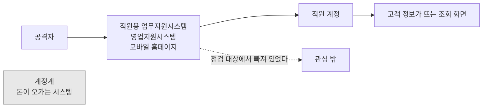

# 2026년 가을, 은행 여섯 곳

> **오늘의 질문** — 우리 회사에서 아무도 점검하지 않는 시스템은 몇 개입니까.

<!-- [장면 필요] 사고 기사가 난 다음 날 조직이 움직였던, 또는 안 움직였던 날.
     저자가 직접 겪은 장면 한 문단. 여기가 "이건 우리 이야기다"로 넘어가는 자리다.
     채우지 않을 거면 이 주석을 지우고 그대로 간다. -->

## 엿새

2026년 9월 27일 밤 11시 19분. 국민은행의 직원용 모바일 업무지원시스템에 외부 접속이 들어왔습니다.
접속은 29일 오후 6시까지 약 43시간 동안 이어졌습니다(⚠️ F-005, 국회 정무위 의원실 자료).

같은 기간 신한, 하나, 부산, NH농협, 우리은행에서도 같은 흔적이 나왔습니다.
금융당국은 9월 28일부터 10월 3일까지의 공격에서 공통 IP 와 유사한 AI 활용 수법을 발견했고,
최소 여섯 곳을 같은 주체의 공격으로 추정했습니다(✅ F-001). 증권과 카드와 보험사에도
시도가 있었습니다(✅ F-007).

보도 기준으로 신한은행 고객 25,729명, 국민은행 119명, 하나은행 89명,
부산은행의 외주 개발직원 11명의 정보가 나갔습니다. 주민등록번호 66건과 연계정보 97건이
포함됐습니다. 우리은행과 농협은행은 침입 방지 시스템이 작동해 유출이 없었습니다
(⚠️ F-003, 조사 중이라 수치는 바뀔 수 있습니다).

## 들어온 곳

숫자보다 중요한 것은 들어온 자리입니다.

국민은행은 직원용 모바일 업무지원시스템이었습니다. 하나은행은 영업지원시스템이었습니다.
하나은행은 그 시스템이 인터넷뱅킹이나 모바일뱅킹 거래 시스템과 별개라고 밝혔습니다(✅ F-004).
신한은행은 모바일 홈페이지였고, 공격자는 대출신청 결과를 포함한 여섯 개 서비스를
집중적으로 조회했습니다(⚠️ F-006).

계정계가 뚫린 것이 아닙니다. **그 주변이 뚫렸습니다.**

들어온 곳은 제각각입니다. 직원용 업무지원시스템, 영업지원시스템, 모바일 홈페이지.
하나로 묶이지 않습니다. 공통점은 하나뿐입니다.
**돈이 오가는 핵심 거래 시스템이 아니었다는 것**입니다.

이 차이가 이 책의 출발점입니다. 은행은 돈이 지나가는 길을 지킵니다. 거기에는 예산이 가고
감사가 가고 사람이 갑니다. 그 바깥에 있는 시스템에는 그만큼 가지 않습니다.
중요하지 않아서가 아닙니다. <mark>**중요한 것의 목록에 올라가 있지 않아서입니다.**</mark>

공격자는 목록을 보지 않습니다. 열려 있는 문을 봅니다.

회색 상자가 **지키던 곳**입니다. 거기는 뚫리지 않았습니다.

## 왜 하필 거기였나

이 구조는 이번에 처음 생긴 것이 아닙니다.
오래된 원리 세 가지가 같은 자리에서 겹쳤을 뿐입니다.
[1부](../part1/01-attack.md) 의 개념 마흔 개는 이 셋을 잘게 쪼갠 것입니다.

<mark>**첫째, 보안 수준은 평균이 아니라 최저값으로 정해집니다.**</mark>

열 개 중 아홉 개를 잘 지켜도 안 지킨 하나로 들어옵니다.
평균은 올라가는데 최저값은 그대로입니다.
투자를 늘려도 그 돈이 이미 단단한 곳으로 가면 최저값은 움직이지 않습니다.
은행들에 준비가 없었던 것이 아닙니다. 준비가 간 자리가 달랐습니다.

**둘째, 중요도와 닿는 범위가 어긋나 있습니다.**

중요도는 그 시스템이 하는 일로 매깁니다.
직원 게시판은 돈을 옮기지 않으니 낮게 매겨집니다.
그런데 거기 들어가는 열쇠는 직원 계정입니다.
그 계정은 다른 곳에도 들어갑니다.

중요도는 <mark>**하는 일**</mark>에서 나오고 위험은 <mark>**닿는 범위**</mark>에서 나옵니다.
둘이 어긋난 자리가 가장 싼 입구입니다.
공격자는 그 어긋남을 찾습니다.

**셋째, 방어와 공격은 셈법이 다릅니다.**

방어하는 쪽은 전부를 지켜야 합니다. 공격하는 쪽은 하나만 열면 됩니다.
그래서 방어 비용은 시스템 개수를 따라 늘어납니다.
공격 비용은 가장 허술한 하나에서 멈춥니다.

이 비대칭은 구조라서 없앨 수 없습니다. 좁힐 수만 있습니다.
좁히는 방법이 둘입니다. 지켜야 할 개수를 줄이거나,
뚫렸을 때 공격자가 가져갈 것을 줄이는 것입니다.
전자가 [2부](../part2/01-assets.md) 와 [3부](../part3/01-coding.md) 이고
후자가 [5부](../part5/01-unknown.md) 입니다.
지금 들어오는 수법만 먼저 보고 싶다면 [1.5](../part1/05-recent-attacks.md) 로 가도 됩니다.

## 도구의 국적

이번 사건에서 같은 주체로 추정하는 핵심 근거는 중국어 기반 AI 자율 침투 테스트 플랫폼의
흔적이었습니다(⚠️ F-002).

여기서 한 번 멈춰야 합니다. 그 도구는 공개 플랫폼입니다. 누구나 받아서 씁니다.
**도구의 국적은 공격자의 국적이 아닙니다.** 이 책은 공격 주체를 단정하지 않습니다.
당국이 추정이라고 말하면 추정이라고 적습니다.

단정하지 않는 것은 조심스러워서가 아닙니다. 틀린 귀속은 방어를 망치기 때문입니다.
"중국발 공격"이라고 정리해 버리면 대책이 차단 목록으로 끝납니다. 실제로 막아야 하는 것은
점검되지 않은 시스템인데 말입니다.

## 달라진 것

AI 가 공격을 새로 발명하지는 않았습니다. 직원용 시스템을 노리는 것은 20년 된 수법입니다.
달라진 것은 **비용**입니다.

예전에는 조직 하나를 노리려면 사람이 붙어서 며칠을 봐야 했습니다. 지금은 같은 일을
자동으로 돌립니다. 그래서 여섯 곳을 엿새에 훑는 일이 가능해집니다.
공격이 사람 수의 문제였다가 비용 곡선의 문제가 됐습니다.

이 비용 곡선은 방어 쪽에서도 바뀝니다. 금융보안원은 이번 사태 이전인 2025년 말에
모의해킹 조직을 6명에서 20명으로 늘리고 AI 레드팀을 신설했습니다(✅ F-008).
준비가 없었던 것이 아닙니다. 그런데도 뚫렸습니다.

<mark>**준비의 양이 아니라 준비의 범위가 문제였습니다.**</mark>

## 이 책이 하려는 것

보안 책은 대개 "이렇게 하면 안전합니다"로 끝납니다. 이 책은 그 문장을 쓰지 않습니다.
안전한 시스템은 없습니다. 있는 것은 <mark>뚫렸을 때 공격자가 얻을 것이 적은 시스템,
뚫린 것을 빨리 아는 시스템, 빨리 돌아오는 시스템</mark>입니다.

<figure class="quote">
  
  <blockquote>
    
&ldquo;The only truly secure system is one that is powered off, cast in a block of concrete and sealed in a lead-lined room with armed guards &mdash; and even then I have my doubts.&rdquo;

    
완전히 안전한 시스템은 전원이 꺼진 채 콘크리트에 묻혀 납으로 둘러싼 방에 무장 경비와 함께 봉인된 것뿐입니다. 그래도 저는 의심스럽습니다.

  </blockquote>
  <figcaption>Gene Spafford — 퍼듀대 교수. 1989년에 인용된 말입니다 (⚠️ F-131)</figcaption>
</figure>

농담처럼 들리지만 설계 전제입니다.
**안전을 목표로 두면 끝이 없고, 피해를 목표로 두면 끝이 있습니다.**

공격자는 돈을 법니다. 들인 비용보다 얻는 것이 적으면 다른 곳으로 갑니다.
완벽한 방어 대신 **경제성을 무너뜨리는 쪽**이 훨씬 현실적입니다.

경제성을 무너뜨리는 자리는 침입 이전이 아니라 이후입니다.

공격은 한 번의 침입이 아니라 과정이기 때문입니다.
표적을 고르고, 들어오고, 옆으로 퍼지고, 머물면서 권한을 모으고,
마지막에 가지고 나갑니다.
피해는 대개 뒤쪽에서 납니다. 들어온 것 자체로는 가져갈 것이 없습니다.

2025년 통신사 사건은 최초 감염이 2021년 8월,
결정적 유출이 2025년 4월이었습니다(✅ F-020).
그 3년 8개월이 전부 뒤쪽 단계였습니다.
경계선에만 방어를 쌓으면 이 긴 구간이 통째로 비어 있습니다.

그래서 침입을 막는 일과 별개로 세 가지를 봅니다.

- **얻을 것을 줄인다** — 훔쳐도 쓸 수 없으면 가져갈 이유가 없습니다
- **머무는 시간을 줄인다** — 탐지가 늦으면 뒤쪽 단계가 그만큼 길어집니다
- **돌아오는 시간을 줄인다** — 복구가 빠르면 협박이 통하지 않습니다

셋 다 침입을 막지 못합니다. 대신 침입의 값을 떨어뜨립니다.
이 책 전체가 이 문장의 변주입니다.
우리 조직이 지금 어디쯤인지는 [부록 F](../appendix/f-server-audit.md) 에서 점수로 재 볼 수 있습니다.

그 일을 세 축으로 나눠서 봅니다. 옛말에서 가져왔습니다.

| 축 | 무엇을 | 어디서 |
|---|---|---|
| 적을 안다 | 공격자가 무엇을 보고 어떻게 고르는가 | 1부, 4부 |
| 나를 안다 | 내 자산, 데이터, 신원, 사각지대, 탐지 속도 | 2부, 3부 |
| 미지에 대비한다 | 책에 없는 공격을 구조로 막는 법 | 5부 |

## 읽는 법

**1부는 짧습니다.** 개념 하나에 한 쪽입니다. 정의와 왜 중요한지와 무엇을 할지까지만 적습니다.
개념 설명이 길어서 좋을 일이 없습니다. 길게 풀 것은 뒤에서 사건과 함께 풉니다.

**뒤로 갈수록 풀어 씁니다.** 2부는 자기 조직에 대보는 절차, 3부는 코드와 설정,
4부는 사건 열 편입니다.

**4부가 무게 중심입니다.** 2011년 농협부터 2026년 금융권까지, 그리고 Equifax, MOVEit,
MGM, Salt Typhoon, AI 가 주도한 첩보 캠페인, npm 웜까지. 사건마다 경과와 실패 지점과
무엇이 있었으면 막혔는지를 끝까지 따라갑니다.

급하면 4부부터 읽어도 됩니다. 사건 열 편이 이 책의 요약입니다.

## 하나만 약속합니다

이 책은 **지어내지 않습니다.**

본문의 모든 날짜와 수치와 조문은 `research/facts.yaml` 에 먼저 등록한 것만 씁니다.
각 사실에는 출처와 확인 날짜가 붙어 있고, 확인 수준을 세 단계로 표시했습니다.

| 표시 | 뜻 |
|---|---|
| ✅ | 1차 출처이거나 서로 독립적인 두 곳 이상에서 확인했습니다 |
| ⚠️ | 출처가 하나거나 출처끼리 다릅니다. 본문에서도 단서를 달았습니다 |
| 🔍 | 확인하지 못했습니다. 그래서 본문에 쓰지 않았습니다 |

유명한 사건인데 이 책에 없다면, 1차 출처를 찾지 못해서 뺀 것입니다.
부록 D 「이 책에 싣지 못한 것」에 그 목록이 있습니다.

보안에서 틀린 숫자는 틀린 대책을 부릅니다. 모르는 것을 아는 척하지 않는 쪽이
한 줄 더 쓰는 것보다 낫습니다.

---

다시 질문으로 돌아갑니다.

**우리 회사에서 아무도 점검하지 않는 시스템은 몇 개입니까.**

세어 보지 않았다면, 그 수를 모르는 것이 지금 가장 큰 취약점입니다.
[2.1](../part2/01-assets.md) 에서 그 수를 세는 법부터 시작합니다.

---

## 개념 확인

**Q.** 2026년 금융권 사건에서 공격이 들어온 시스템들의 공통점은 무엇입니까.

1. 전부 인터넷뱅킹 거래 시스템이었다
2. 전부 외주사가 운영하던 시스템이었다
3. 돈이 오가는 핵심 거래 시스템이 아니어서 점검 대상에서 빠져 있었다
4. 전부 같은 제품의 같은 취약점을 썼다

답 보기

**3번.** 들어온 자리는 직원용 업무지원시스템, 영업지원시스템,
모바일 홈페이지로 제각각이었습니다. 하나로 묶이지 않습니다.
공통점은 **중요한 것의 목록에 올라가 있지 않았다**는 것뿐입니다.

---

**출처**

사실마다 근거를 직접 열어 볼 수 있게 링크를 답니다.
확인 날짜와 원문 요지는 [`research/facts.yaml`](../research/facts.yaml) 에 있습니다.

| 사실 | 확인 | 근거를 직접 보기 |
|---|---|---|
| `F-001` | ✅ | [seoul.co.kr](https://www.seoul.co.kr/news/economy/2026/10/04/20261004500025) — 2차(언론, 금융당국 인용) |
| `F-002` | ⚠️ | — 원문이 내려갔습니다. 대체 출처를 찾는 중입니다 |
| `F-003` | ⚠️ | [newspim.com](https://www.newspim.com/news/view/20261002001278) — 2차 |
| `F-004` | ✅ | [newspim.com](https://www.newspim.com/news/view/20261002001278) — 2차 |
| `F-005` | ⚠️ | [seoul.co.kr](https://www.seoul.co.kr/news/economy/2026/10/04/20261004500025) — 2차(의원실 자료 인용) |
| `F-006` | ⚠️ | [busan.com](https://www.busan.com/view/busan/view.php?code=2026100418075759253) — 2차 |
| `F-007` | ✅ | [seoul.co.kr](https://www.seoul.co.kr/news/economy/2026/10/04/20261004500025) — 2차 |
| `F-008` | ✅ | [m.boannews.com](https://m.boannews.com/html/detail.html?idx=141206) — 2차 |
| `F-020` | ✅ | [news.nate.com](https://news.nate.com/view/20250704n26170?mid=n0100) — 2차(과기정통부 발표 인용) |
| `F-131` | ⚠️ | [en.wikiquote.org](https://en.wikiquote.org/wiki/Gene_Spafford) — 2차(위키인용집. 1차 지면 미확인) |
