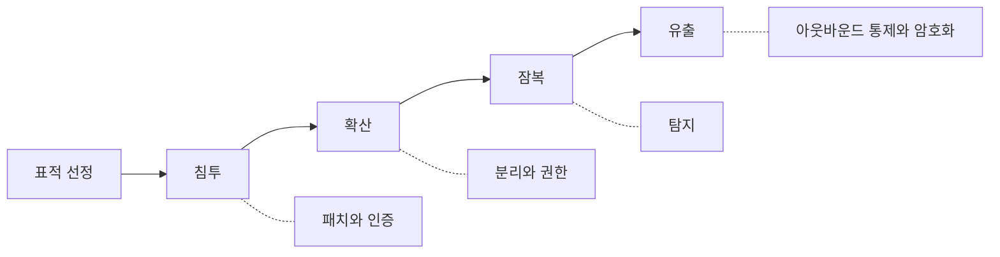

# 1.1 공격을 보는 눈 열 가지

> 한 쪽에 하나씩입니다. 개념 하나를 정의와 이유와 할 일까지만 적었습니다.
> 길게 풀어야 할 것은 4부에서 사건과 함께 풉니다.

---

## 1. 가장 약한 고리

**한 줄** — 보안 수준은 평균이 아니라 최저값으로 정해집니다.

방화벽을 아무리 잘 쌓아도 옆에 열린 문이 하나 있으면 그 문으로 들어옵니다.
공격자는 전체를 평가하지 않습니다. 가장 싼 입구 하나를 찾습니다.

여기서 흔한 착각이 생깁니다. 보안 투자를 늘리면 안전해진다고 생각하는 것입니다.
투자가 이미 단단한 곳에만 가면 최저값은 그대로입니다.

2026년 금융권 사건에서 공격은 직원용 업무지원 시스템으로 들어왔고,
그 시스템들은 당국 점검 대상에서 빠져 있었습니다(✅ F-004).
**점검 대상에서 빠졌다는 것은 관심에서도 빠졌다는 뜻입니다.**

최저값을 올리려면 최저값이 어디인지부터 알아야 합니다. 그래서 자산 목록이
보안의 첫 단계입니다. 목록에 없는 것은 평가도 안 되고 투자도 안 갑니다.

**무엇을 할 것** — 가장 잘 지키는 시스템이 아니라 가장 안 보는 시스템을 한 개 적어 보십시오.

---

## 2. 공격의 경제성

**한 줄** — 공격자는 들인 비용보다 얻는 것이 많을 때만 움직입니다.

공격자는 악당이기 전에 사업자입니다. 시간과 도구와 위험을 투입하고 돈을 회수합니다.
회수가 안 되면 다음 표적으로 갑니다. 이 단순한 사실이 방어의 방향을 바꿉니다.

완벽한 방어를 목표로 하면 비용이 무한해집니다. 대신 **공격자의 수지를 맞지 않게**
만들 수 있습니다. 데이터를 제대로 암호화해 두면 훔쳐도 쓰기 어렵습니다.
권한을 좁혀 두면 계정 하나로 갈 수 있는 곳이 적습니다.
탐지가 빠르면 머물 시간이 짧습니다.

셋 다 공격을 막지는 못합니다. 대신 **같은 노력으로 얻는 것을 줄입니다.**
이 책 전체가 이 한 문장의 변주입니다.

**무엇을 할 것** — "뚫리면 저쪽이 뭘 얻지"를 시스템마다 한 줄로 적어 보십시오.

---

## 3. 공격 생애주기

**한 줄** — 공격은 한 번의 침입이 아니라 다섯 단계의 과정입니다.

표적 선정, 침투, 확산, 잠복, 유출입니다. 사람들은 침투만 생각합니다.
그래서 방어도 경계선에 몰립니다.

실제 피해는 뒤쪽 단계에서 납니다. 들어온 것 자체로는 손해가 적습니다.
들어와서 옆으로 퍼지고, 오래 머물면서 권한을 모으고, 마지막에 가져 나갈 때 큽니다.
2025년 통신사 사건에서 최초 감염은 2021년 8월이었고 결정적 유출은 2025년 4월이었습니다
(✅ F-020). 그 사이 3년 8개월이 뒤쪽 단계였습니다.

다섯 단계마다 막는 방법이 다릅니다. 침투는 패치와 인증, 확산은 분리와 권한,
잠복은 탐지, 유출은 아웃바운드 통제와 암호화입니다. 한 군데만 잘해도 피해가 줄어듭니다.

**무엇을 할 것** — 내 조직이 다섯 단계 중 어디에 투자가 몰려 있는지 보십시오.

---

## 4. 공격면

**한 줄** — 공격자가 건드릴 수 있는 모든 지점의 합입니다.

열린 포트, 공개된 웹 서비스, 로그인 화면, API, 업로드 기능, 직원 계정, 협력사 접속 경로.
전부 공격면입니다. 넓을수록 지킬 것이 많아집니다.

공격면은 저절로 늘어납니다. 테스트하려고 띄운 서버, 한 번 쓰고 안 지운 관리 페이지,
퇴사자 계정, 더 이상 안 쓰는 API. 아무도 늘렸다고 생각하지 않는데 늘어나 있습니다.

줄이는 방법은 하나뿐입니다. **안 쓰는 것을 끕니다.** 보안 장비를 사는 것보다 싸고
확실합니다. 끄기 전에 목록이 필요하니 다시 자산 목록으로 돌아옵니다.

**무엇을 할 것** — 외부에서 접근 가능한 주소를 전부 뽑아 보고, 모르는 것이 있는지 보십시오.

---

## 5. 주변부

**한 줄** — 핵심이 아니라는 이유로 점검 대상에서 빠진 시스템입니다.

직원 게시판, 업무지원 포털, 영업점 조회 도구, 외주 개발자용 환경.
핵심 업무를 처리하지 않으니 중요도가 낮게 매겨집니다.

문제는 **주변부가 핵심과 연결되어 있다**는 점입니다. 직원 업무 시스템은 직원 계정으로
들어갑니다. 그 계정은 다른 시스템에도 쓰입니다. 포털에는 고객 정보가 조회 결과로 떠 있습니다.
중요도는 낮은데 닿을 수 있는 범위는 넓습니다.

공격자는 이 불일치를 노립니다. 가장 싼 입구로 들어와서 비싼 것에 닿습니다.
2026년 금융권 사건이 이 구조를 그대로 보여 줬습니다.

**무엇을 할 것** — 점검 대상 목록에 없는 시스템을 세어 보십시오. 그 수가 이 책의 첫 질문입니다.

---

**공격은 한 번의 침입이 아니라 다섯 단계입니다**

## 6. 초기 침투 경로

**한 줄** — 공격자가 처음 발을 들인 지점입니다.

실제 사건에서 초기 침투 경로는 몇 가지로 수렴합니다. 패치 안 된 소프트웨어,
탈취된 계정, 사람을 속인 전화나 메일, 협력사를 거친 접속입니다.
화려한 제로데이는 생각보다 드뭅니다.

이것은 좋은 소식입니다. **대부분의 사건은 알려진 문제로 시작합니다.**
Equifax 는 패치가 나온 지 78일 동안 적용하지 않았습니다(✅ F-050).
Salt Typhoon 에 대해 미국 기관들은 새로운 기법이 관찰되지 않았다고 밝혔습니다(✅ F-058).

새로운 공격을 걱정하기 전에 오래된 구멍부터 세어야 합니다. 순서가 반대면
비싼 도구를 사 놓고 기본을 놓칩니다.

**무엇을 할 것** — 지난 1년간 적용하지 못한 보안 패치의 수를 세어 보십시오.

---

## 7. 내부 이동

**한 줄** — 한 지점에서 다른 지점으로 옮겨 다니는 단계입니다.

첫 침투 지점은 대개 값이 없습니다. 직원 노트북 한 대, 주변부 서버 하나입니다.
공격자는 거기서 자격증명을 줍고 옆 시스템에 들어갑니다. 이 과정을 반복해서
값이 있는 곳까지 갑니다.

내부 이동이 쉬운 이유는 보통 **내부를 신뢰하기** 때문입니다. 경계만 지키고
안쪽은 서로 자유롭게 통신하게 둡니다. 그러면 한 대가 뚫린 순간 전부 뚫린 것과 같아집니다.

막는 방법은 분리와 권한입니다. 서버끼리 꼭 필요한 통신만 허용하고,
계정마다 닿을 수 있는 범위를 좁힙니다. 지루하고 티가 안 나는 일인데
사고 크기를 크게 줄입니다. 3.6 에서 다시 다룹니다.

**무엇을 할 것** — 서버 한 대가 뚫렸다고 가정하고 거기서 어디까지 갈 수 있는지 그려 보십시오.

---

## 8. 권한 상승

**한 줄** — 낮은 권한으로 들어와 높은 권한을 얻는 단계입니다.

일반 계정으로 들어와 관리자 권한을 손에 넣습니다. 방법은 여러 가지인데
결과는 같습니다. 그 시점부터 공격자는 정상 관리자와 구분되지 않습니다.

여기가 탐지가 어려워지는 지점입니다. 관리자가 하는 일은 원래
설정을 바꾸고 계정을 만들고 권한을 주는 일입니다.
공격자가 같은 일을 해도 이상해 보이지 않습니다.

그래서 관리자 권한은 **평소에 아무도 안 들고 있어야** 합니다. 필요할 때만 받고
쓰고 나면 돌려주는 방식입니다. 상시로 들고 있는 관리자 계정의 수가
그 조직의 위험 수준을 거의 그대로 보여 줍니다.

**무엇을 할 것** — 지금 관리자 권한을 상시 보유한 계정이 몇 개인지 세어 보십시오.

---

## 9. 장기 잠복

**한 줄** — 들어온 뒤 발견되기까지 머무는 기간입니다.

피해 크기를 정하는 것은 침입 시점이 아니라 **발견 시점**입니다.
하루 만에 찾으면 계정 몇 개로 끝납니다. 3년이 걸리면 그 사이의 모든 것이 나갑니다.

통신사 사건은 2021년 8월 최초 감염에서 2025년 7월 최종 조사 발표까지 갔습니다(✅ F-020).
농협 사건에서는 외주 직원 노트북이 감염된 2010년 9월부터 약 7개월 뒤에
파괴 명령이 실행됐습니다(⚠️ F-044).

잠복 기간을 줄이는 것은 방어가 아니라 **관측**의 문제입니다. 로그가 없으면
며칠 전 일도 모릅니다. 통신사 조사에서는 2024년 이전 로그가 1년 치도 없어
확인할 방법 자체가 없다는 지적이 나왔습니다(⚠️ F-023).

**무엇을 할 것** — 3개월 전 어느 계정이 무엇을 했는지 지금 조회할 수 있는지 시험해 보십시오.

---

## 10. 유출과 이중 협박

**한 줄** — 요즘 공격은 암호화보다 반출에 무게를 둡니다.

예전 랜섬웨어는 파일을 잠그고 열쇠를 팔았습니다. 백업이 있으면 안 내도 됐습니다.
그래서 공격자가 방식을 바꿨습니다. 먼저 가져 나가고, 공개하겠다고 협박합니다.
백업이 있어도 소용없습니다.

MOVEit 캠페인에서 Clop 은 암호화 없이 데이터 탈취와 공개 협박에 집중했습니다(✅ F-052, ⚠️ F-053).
Shai-Hulud 2차 파동은 자격증명 탈취에 실패하면 파일을 파괴하는 동작까지 넣었습니다(✅ F-077).

막는 지점은 들어오는 쪽이 아니라 **나가는 쪽**입니다. 서버가 바깥으로 아무 데나
연결할 수 있으면 유출을 못 막습니다. 아웃바운드 통제가 백업보다 중요해진 이유입니다.

**무엇을 할 것** — 서버가 외부로 나가는 통신이 허용 목록으로 제한되어 있는지 확인하십시오.

---

## 개념 확인

**Q.** 보안 투자를 늘렸는데 보안 수준이 그대로인 일이 있습니다. 왜 그렇습니까.

1. 투자 금액이 아직 부족해서
2. 보안 수준은 평균이 아니라 최저값으로 정해지는데, 투자가 이미 단단한 곳에만 갔기 때문
3. 제품끼리 호환되지 않아서
4. 직원 교육이 빠져서

답 보기

**2번.** 공격자는 전체를 평가하지 않습니다. 가장 싼 입구 하나를 찾습니다.
최저값을 올리려면 최저값이 어디인지부터 알아야 하고,
그래서 자산 목록이 보안의 첫 단계입니다.

---

**출처**

사실마다 근거를 직접 열어 볼 수 있게 링크를 답니다.
확인 날짜와 원문 요지는 [`research/facts.yaml`](../research/facts.yaml) 에 있습니다.

| 사실 | 확인 | 근거를 직접 보기 |
|---|---|---|
| `F-004` | ✅ | [newspim.com](https://www.newspim.com/news/view/20261002001278) — 2차 |
| `F-020` | ✅ | [news.nate.com](https://news.nate.com/view/20250704n26170?mid=n0100) — 2차(과기정통부 발표 인용) |
| `F-023` | ⚠️ | [news.nate.com](https://news.nate.com/view/20250704n26170?mid=n0100) — 2차 |
| `F-044` | ⚠️ | [m.boannews.com](https://m.boannews.com/html/detail.html?idx=29192) — 2차 |
| `F-050` | ✅ | [oversight.house.gov](https://oversight.house.gov/wp-content/uploads/2018/12/Equifax-Report.pdf) — 1차(미 하원 감독위 보고서) |
| `F-052` | ✅ | [bankinfosecurity.com](https://www.bankinfosecurity.com/latest-moveit-data-breach-victim-tally-455-organizations-a-22650) — 2차(집계기관 인용) |
| `F-053` | ⚠️ | [flashpoint.io](https://flashpoint.io/blog/clop-ransomware-moveit-vulnerability/) — 2차 |
| `F-058` | ✅ | [darkreading.com](https://www.darkreading.com/cyberattacks-data-breaches/cisa-issue-guidance-telecoms-salt-typhoon-threat) — 2차 |
| `F-077` | ✅ | [zscaler.com](https://www.zscaler.com/blogs/security-research/shai-hulud-v2-poses-risk-npm-supply-chain) — 2차 |
