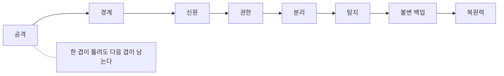

# 1.2 방어를 세우는 눈 열 가지

---

## 1. 심층 방어

**한 줄** — 막는 장치를 여러 겹으로 두어, 하나가 뚫려도 다음이 남게 합니다.

성벽 하나짜리 방어는 그 성벽이 뚫리는 날 끝납니다. 겹을 두면 공격자가
각 겹마다 다시 비용을 써야 합니다. 비용이 올라가면 중간에 포기합니다.

겹은 종류가 달라야 합니다. 방화벽을 두 대 놓는 것은 한 겹입니다.
네트워크에서 막고, 인증에서 막고, 권한에서 막고, 데이터에서 막고, 탐지에서 잡는 것이 다섯 겹입니다.
같은 실패 원인으로 동시에 무너지지 않아야 겹입니다.

현실에서 겹이 무너지는 이유는 대개 **다 통과시키는 예외**입니다.
운영 편의로 뚫어 둔 우회 경로 하나가 다섯 겹을 한 겹으로 만듭니다.

**무엇을 할 것** — "운영 편의상" 열어 둔 예외 경로를 목록으로 만들어 보십시오.

---

## 2. 최소 권한

**한 줄** — 일에 필요한 만큼만 권한을 줍니다.

남는 권한은 평소에 아무 일도 하지 않습니다. 사고가 난 날에만 일합니다.
그날 그 권한은 그대로 공격자의 권한이 됩니다.

최소 권한이 안 지켜지는 이유는 기술이 아니라 **귀찮음**입니다. 필요한 권한을
정확히 계산하려면 업무를 알아야 하고, 모자라면 민원이 옵니다. 그래서 넉넉하게 줍니다.
한 번 넉넉하게 준 권한은 줄지 않습니다.

실무에서 쓸 수 있는 타협이 있습니다. 새로 만드는 계정만 최소로 주고,
기존 계정은 6개월에 한 번 쓰지 않은 권한을 회수하는 것입니다.
전수 조사보다 끝납니다.

**무엇을 할 것** — 지난 90일간 한 번도 쓰지 않은 권한을 조회할 수 있는지 확인하십시오.

---

<figure class="shot">
  
  <figcaption>히메지성의 성벽. 한 겹을 넘어도 다음 겹이 남습니다. 심층 방어는 같은 담을 두껍게 쌓는 것이 아니라 성격이 다른 겹을 세우는 일입니다. 사진 そらみみ, <a href="https://creativecommons.org/licenses/by-sa/3.0">CC BY-SA 3.0</a></figcaption>
</figure>

## 3. 폭발 반경

**한 줄** — 한 지점이 뚫렸을 때 공격자가 닿을 수 있는 범위입니다.

침입은 막기 어렵지만 반경은 설계로 줄일 수 있습니다. 그래서 현실적인 목표입니다.
"이 서버가 뚫리면 어디까지 가나"를 그려 보면 대개 생각보다 멀리 갑니다.

반경을 줄이는 수단은 셋입니다. 계정을 나누고, 망을 나누고, 데이터를 나눕니다.
운영 계정으로 개발 서버에 못 들어가게 하고, 서버끼리 꼭 필요한 통신만 열고,
한 데이터베이스에 모든 고객 정보를 몰아 두지 않는 것입니다.

세 가지 다 운영이 불편해집니다. 그 불편이 사고 크기를 줄이는 값입니다.
불편을 감수할 범위를 미리 정해 두지 않으면 사고 뒤에 후회로 끝납니다.

**무엇을 할 것** — 가장 중요한 데이터베이스에 접근 가능한 서버 수를 세어 보십시오.

---

## 4. 가정 침해

**한 줄** — 이미 뚫렸다고 가정하고 설계합니다.

경계 방어는 "안은 안전하다"를 전제합니다. 이 전제가 깨지는 순간 안쪽은 무방비입니다.
가정 침해는 그 전제를 버립니다.

버리면 질문이 바뀝니다. "어떻게 막을까"에서 "들어와 있다면 어떻게 알아챌까"로 갑니다.
두 번째 질문은 답하기가 훨씬 구체적입니다. 로그, 이상 행동 탐지, 카나리, 정기 점검이
전부 여기서 나옵니다.

가정 침해를 받아들이면 보안 회의의 성격도 바뀝니다. "뚫릴 수 있나"를 다투지 않고
"뚫렸을 때 몇 시간 안에 아나"를 다투게 됩니다. 두 번째가 생산적인 회의입니다.

**무엇을 할 것** — 다음 보안 회의에서 "이미 들어와 있다면"으로 시작해 보십시오.

---

## 5. 기본값 차단

**한 줄** — 허용 목록에 없으면 막습니다.

차단 목록 방식은 아는 위협만 막습니다. 모르는 것은 통과합니다.
허용 목록 방식은 반대입니다. 모르는 것은 막힙니다.

운영 부담은 허용 목록이 큽니다. 필요한 것을 하나씩 열어야 하고,
새 기능이 나올 때마다 다시 열어야 합니다. 그래서 다들 차단 목록을 씁니다.

그런데 유출을 막는 자리에서는 허용 목록 말고 답이 없습니다.
서버가 어디로든 나갈 수 있으면 유출 경로를 셀 수 없습니다.
**들어오는 쪽은 차단 목록으로 버텨도, 나가는 쪽은 허용 목록이어야 합니다.**

**무엇을 할 것** — 운영 서버의 아웃바운드가 허용 목록인지 지금 확인하십시오.

---

**심층 방어는 같은 겹을 두껍게 하는 것이 아닙니다**

## 6. 분리

**한 줄** — 성격이 다른 것을 같은 곳에 두지 않습니다.

운영과 개발, 관리망과 업무망, 고객 데이터와 내부 데이터, 사람 계정과 서비스 계정.
섞여 있으면 하나의 사고가 전부로 번집니다.

자주 깨지는 자리가 둘 있습니다.

**운영과 개발.** 테스트하려고 운영 데이터를 복사해 개발 환경에 둡니다.
개발 환경은 보안 수준이 낮습니다. 그 순간 고객 데이터의
보안 수준이 개발 환경 수준으로 떨어집니다.

**외주 구간.** 외주 인력에게 운영 데이터 접근을 주고 그 접근이 무엇을 할 수 있는지
따로 보지 않습니다. 2014년 카드 3사 사건에서는 위탁 개발에 투입된 외주 직원이
USB 로 고객 정보를 반출했습니다(✅ F-041). **계약 기간 중에 일어난 일입니다.**
4.4 에서 자세히 봅니다.

**무엇을 할 것** — 개발 환경에 실제 고객 데이터가 있는지 확인하십시오.

---

## 7. 불변 백업

**한 줄** — 정해진 기간 동안 지우거나 고칠 수 없는 백업입니다.

랜섬웨어 대응의 정답은 오래전부터 백업이었습니다. 그래서 공격자는
백업부터 지우는 법을 배웠습니다. 관리자 권한을 얻으면 백업도 관리자 권한 아래 있습니다.

불변 백업은 그 전제를 끊습니다. 쓰고 나면 정해진 기간 동안 아무도,
관리자조차 못 지우게 잠급니다. 공격자가 전체를 장악해도 그 백업은 남습니다.

백업에서 또 하나 중요한 것은 **복원 연습**입니다. 백업이 있는 것과 복원되는 것은
다른 일입니다. 연습해 본 적 없는 복원 절차는 사고 당일에 처음 해 보게 됩니다.

**무엇을 할 것** — 마지막으로 복원을 실제로 해 본 날짜를 확인하십시오.

---

## 8. 패치 수명

**한 줄** — 패치가 나온 날부터 적용한 날까지의 기간입니다.

이 숫자가 그 조직의 운영 성숙도를 거의 그대로 보여 줍니다.
취약점은 공개된 순간부터 공격 도구에 들어갑니다. Equifax 사건에서
공개 익스플로잇은 24시간 안에 등장했고 패치는 78일간 적용되지 않았습니다(✅ F-050).

패치가 늦는 이유는 대개 기술이 아닙니다. 어디에 무엇이 깔려 있는지 몰라서,
그리고 내렸다 올리는 창을 못 잡아서입니다. 둘 다 자산 목록과 운영 절차의 문제입니다.

목표 기간을 숫자로 정해 두는 것이 출발점입니다. 외부 노출 자산은 며칠,
내부 자산은 며칠로 정하고 못 지키면 이유를 남깁니다. 숫자가 없으면 늦는 줄도 모릅니다.

**무엇을 할 것** — 외부 노출 자산의 패치 목표 기간이 문서로 있는지 확인하십시오.

---

## 9. 탐지와 대응 시간

**한 줄** — 침입을 알아채기까지, 그리고 끊기까지 걸리는 시간입니다.

두 숫자가 피해 크기를 거의 결정합니다. 막은 횟수는 셀 수 없지만
이 두 숫자는 잴 수 있습니다. 그래서 보안 지표로 쓸 수 있습니다.

재려면 기준이 필요합니다. 지난 사고에서 침입 시점과 인지 시점이 각각 언제였는지,
인지부터 차단까지 몇 시간이 걸렸는지를 적어 두는 일부터 시작합니다.
사고가 없었다면 모의훈련으로 만듭니다.

2026년 금융권 사건에서 한 은행의 비정상 접속은 약 43시간 동안 이어졌습니다(⚠️ F-005).
43시간은 길어 보이지만 업계 평균보다 짧은 축입니다. 그만큼 보통은 더 깁니다.

**무엇을 할 것** — 가장 최근 보안 알림을 받고 조치까지 몇 분 걸렸는지 확인하십시오.

---

## 10. 복원력

**한 줄** — 뚫린 뒤 원래 상태로 돌아오는 능력입니다.

보안을 사고 예방으로만 보면 사고가 나는 날 아무 준비가 없습니다.
복원력은 사고를 전제로 합니다. 얼마나 빨리, 얼마나 온전히 돌아오는가입니다.

복원력에는 세 가지가 필요합니다. 깨끗한 백업, 다시 세울 수 있는 절차,
그리고 누가 무엇을 할지 적힌 문서입니다. 세 번째가 제일 자주 빠집니다.
사고 당일에 결정권자를 찾는 데 시간이 가장 많이 갑니다.

2011년 농협 사건에서 일부 업무는 다음 날 돌아왔지만 전체 정상화는 18일이 걸렸습니다(⚠️ F-043).
복원 시간은 기술만의 문제가 아니라 준비의 문제입니다.

**무엇을 할 것** — 사고 발생 시 연락 순서와 결정권자가 적힌 문서가 있는지 확인하십시오.

---

## 개념 확인

**Q.** 방화벽 두 대를 나란히 놓는 것은 심층 방어입니까. 아니라면 왜 그렇습니까. (주관식)

답 보기

**심층 방어가 아닙니다.** 같은 겹을 두껍게 한 것입니다.
심층 방어는 **성격이 다른 겹**을 쌓아, 한 겹이 뚫려도 다음 겹이
남아 있게 만드는 것입니다. 같은 방식의 방어는 같은 수법에 같이 뚫립니다.

---

**출처**

사실마다 근거를 직접 열어 볼 수 있게 링크를 답니다.
확인 날짜와 원문 요지는 [`research/facts.yaml`](../research/facts.yaml) 에 있습니다.

| 사실 | 확인 | 근거를 직접 보기 |
|---|---|---|
| `F-005` | ⚠️ | [seoul.co.kr](https://www.seoul.co.kr/news/economy/2026/10/04/20261004500025) — 2차(의원실 자료 인용) |
| `F-041` | ✅ | [thescoop.co.kr](https://www.thescoop.co.kr/news/articleView.html?idxno=25228) — 2차 |
| `F-043` | ⚠️ | [ko.wikipedia.org](https://ko.wikipedia.org/wiki/%EB%86%8D%ED%98%91_%EC%A0%84%EC%82%B0%EB%A7%9D_%EB%A7%88%EB%B9%84_%EC%82%AC%ED%83%9C) — 3차(위키) |
| `F-050` | ✅ | [oversight.house.gov](https://oversight.house.gov/wp-content/uploads/2018/12/Equifax-Report.pdf) — 1차(미 하원 감독위 보고서) |
