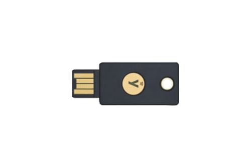
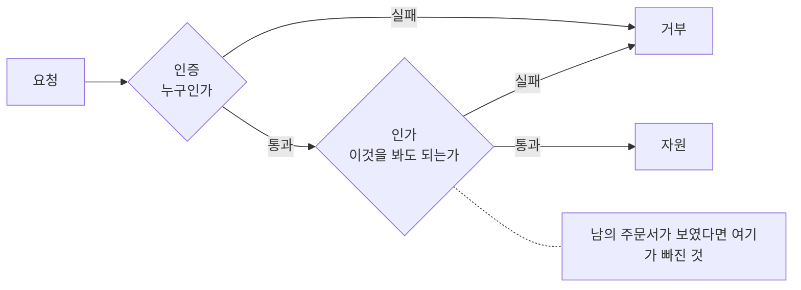

# 1.3 신원과 데이터 열 가지

---

## 1. 인증과 인가

**한 줄** — 인증은 누구인지 확인하는 일이고, 인가는 무엇을 해도 되는지 정하는 일입니다.

둘을 섞으면 사고가 납니다. 가장 흔한 형태는 로그인만 확인하고
"이 사람이 이 데이터를 봐도 되는지"는 확인하지 않는 것입니다.
주소창의 번호만 바꾸면 남의 정보가 나오는 화면이 여기서 나옵니다.

인증은 보통 한 곳에서 합니다. 로그인 모듈 하나를 잘 만들면 됩니다.
인가는 다릅니다. **요청마다, 데이터마다** 따져야 합니다. 그래서 빠뜨리기 쉽습니다.

검증 위치도 중요합니다. 화면에서 버튼을 숨기는 것은 인가가 아닙니다.
서버가 요청을 받을 때 다시 확인해야 인가입니다. 화면은 공격자가 안 씁니다.

**무엇을 할 것** — 최근 만든 조회 API 하나를 골라 소유자 검증이 서버에 있는지 보십시오.

---

## 2. 다중 인증

**한 줄** — 비밀번호 말고 하나를 더 확인하는 방식입니다.

비밀번호는 유출되고 재사용되고 추측됩니다. 하나를 더 두면 비밀번호가 새도
바로 들어오지 못합니다. 효과가 큰 몇 안 되는 조치입니다.

다만 다중 인증도 종류에 따라 강도가 다릅니다. 문자로 받는 인증번호는
사람이 불러 줄 수 있습니다. 앱 알림 승인은 계속 눌러 대면 지쳐서 승인합니다.
둘 다 **사람을 속이면 뚫립니다.**

**이 책이 다룬 사건에서 다중 인증은 기술로 깨지지 않았습니다. 사람을 통해 우회됐습니다.**
전화로 자격증명을 재설정받는 식입니다(⚠️ F-056). 4.7 에서 자세히 봅니다.

**무엇을 할 것** — 지금 쓰는 다중 인증이 전화로 불러 줄 수 있는 종류인지 확인하십시오.

---

## 3. 패스키

**한 줄** — 기기에 저장된 열쇠로 로그인하는 방식입니다.

비밀번호나 인증번호 같은 "사람이 옮길 수 있는 값"이 없습니다.
브라우저가 접속한 도메인을 확인하고 그 도메인의 열쇠만 씁니다.
그래서 가짜 사이트에 입력될 것 자체가 없습니다.

이것이 다른 방식과 갈리는 지점입니다. 문자 인증번호는 가짜 사이트에 칠 수 있습니다.
패스키는 못 칩니다. 피싱 저항이라는 말은 이 뜻입니다.

전부 바꾸기는 아직 어렵습니다. 그래서 **고위험 인물부터** 적용합니다.
관리자, 재무, 인사, 경영진처럼 계정이 뚫렸을 때 피해가 큰 자리입니다.
전면 전환보다 이쪽이 빠르고 효과가 큽니다.

**무엇을 할 것** — 관리자 계정만이라도 패스키로 바꿀 수 있는지 알아보십시오.

---

<figure class="shot">
  
  <figcaption>하드웨어 보안 키. 접속한 주소가 다르면 아예 동작하지 않아서, 코드를 옮겨 적는 방식의 다중 인증과 달리 중계형 피싱이 성립하지 않습니다. 사진 FelixLadd, <a href="https://creativecommons.org/licenses/by-sa/4.0">CC BY-SA 4.0</a></figcaption>
</figure>

## 4. 단명 자격증명

**한 줄** — 몇 분에서 몇 시간 안에 만료되는 열쇠입니다.

영구 API 키는 한 번 새면 **영원히 유효합니다.** 저장소에 실수로 올린 키는
지워도 커밋 기록에 남고, 몇 년 뒤에도 그대로 동작합니다.
단명 자격증명은 그 창을 닫습니다.

바꾸는 비용은 생각보다 낮습니다. 대부분의 클라우드와 인증 체계가
임시 자격증명 발급을 이미 지원합니다. 문제는 기존 코드가 영구 키를 전제로
짜여 있다는 점입니다. 그래서 새로 만드는 것부터 적용합니다.

측정도 함께 합니다. 지금 조직에 영구 키가 몇 개인지, 마지막으로 교체한 날이
언제인지 세어 봅니다. 세어 보면 대개 아무도 몰랐다는 사실을 알게 됩니다.

**무엇을 할 것** — 만료 없는 API 키의 개수를 세어 보십시오.

---

## 5. 비밀 관리

**한 줄** — 열쇠와 비밀번호를 코드와 설정 파일 밖에 두는 일입니다.

소스 코드에 박힌 비밀은 저장소를 볼 수 있는 모든 사람이 봅니다.
저장소가 공개로 바뀌는 사고가 나면 전 세계가 봅니다.
깃 기록에 남으면 파일을 지워도 과거 커밋에 남아 있습니다.

로그도 같은 문제를 일으킵니다. 요청 전체를 찍는 디버그 로그에
토큰과 비밀번호가 그대로 들어갑니다. 로그는 보통 여러 사람이 보고
오래 보관하니 더 나쁩니다.

2025년 통신사 조사에서는 인증 서버의 계정 정보를 다른 서버에 평문으로 저장해
인증 기준을 위반했다는 지적이 나왔습니다(✅ F-022).

**무엇을 할 것** — 저장소 전체에서 비밀 문자열을 찾는 검사를 한 번 돌려 보십시오.

---

**인증과 인가는 다른 관문입니다**

## 6. 기계 신원

**한 줄** — 사람이 아닌 것들의 계정입니다.

서비스 계정, 배치 작업, API 키, 컨테이너, 그리고 이제 에이전트까지.
수로 보면 사람 계정보다 훨씬 많습니다. 그런데 관리는 거의 안 됩니다.

사람 계정에는 입사와 퇴사가 있어서 생성과 삭제가 따라옵니다.
기계 신원에는 그런 절차가 없습니다. 만들 때는 티켓 하나로 만들고
없앨 때는 아무도 없애지 않습니다. 쓰는지 안 쓰는지도 모릅니다.

기계 신원이 위험한 또 하나의 이유는 **권한이 큽니다.** 자동화하려고 만들었으니
사람보다 넓게 줍니다. 그 큰 권한이 아무 감시 없이 남아 있습니다.

**무엇을 할 것** — 조직에 서비스 계정이 몇 개인지, 소유자가 적혀 있는지 확인하십시오.

---

## 7. 데이터 분류

**한 줄** — 데이터마다 민감도를 매겨 두는 일입니다.

분류가 없으면 보호 수준을 정할 수 없습니다. 전부 똑같이 지키면
비용이 감당 안 되고, 전부 똑같이 안 지키면 민감한 것이 샙니다.

실무에서 쓸 만한 분류는 단순합니다. 세 단계면 충분합니다.
공개해도 되는 것, 내부용, 새면 법적 책임과 고객 피해가 생기는 것.
단계를 다섯 개 이상 만들면 아무도 안 씁니다.

분류의 값은 등급을 매기는 데 있지 않습니다. **어디에 있는지 알게 되는 데** 있습니다.
분류 작업을 하면 "이 데이터가 왜 여기 있지" 하는 자리가 반드시 나옵니다.
그 자리를 찾는 것이 목적입니다.

**무엇을 할 것** — 가장 민감한 데이터가 몇 개의 시스템에 복사되어 있는지 세어 보십시오.

---

## 8. 최소 보유

**한 줄** — 필요한 기간만 갖고 있다가 지웁니다.

없는 데이터는 샐 수 없습니다. 가장 확실한 보호입니다.
그런데 대부분의 조직은 데이터를 지우지 않습니다. 언젠가 쓸까 봐,
그리고 지우는 일에 아무도 책임을 안 지고 싶어서입니다.

보유 기간을 정해 두는 일은 법적 요건이기도 하고 보안 조치이기도 합니다.
롯데카드 사건에서 유출된 데이터는 특정 기간의 결제 과정에서 생성된 것이었습니다(✅ F-032).
그 기간의 데이터가 그 자리에 없었다면 유출 범위가 달라졌을 것입니다.

지우기 어려우면 **가명 처리나 마스킹**이라도 적용합니다.
원본이 필요한 자리는 생각보다 적습니다.

**무엇을 할 것** — 3년 넘은 고객 데이터를 지금 지울 수 있는지, 절차가 있는지 확인하십시오.

---

## 9. 암호화의 세 자리

**한 줄** — 전송 중, 저장 중, 사용 중에서 보호하는 자리가 다릅니다.

전송 중 암호화는 HTTPS 입니다. 대부분 되어 있습니다.
저장 중 암호화는 디스크와 데이터베이스입니다. 되어 있다고 하는데
열쇠가 같은 서버에 있으면 서버를 뚫은 공격자에게는 없는 것과 같습니다.
사용 중에는 메모리에 평문으로 올라가므로 거의 보호되지 않습니다.

그래서 "암호화했습니다"는 답이 아닙니다. **어느 자리에서, 열쇠는 어디에 두고**
암호화했는지가 답입니다. 열쇠 관리가 암호화의 전부라고 해도 무리가 아닙니다.

국내 요건은 비밀번호에 해시함수를, 주민등록번호와 계좌번호 등에는 블록암호를 쓰도록
안내합니다(⚠️ F-114). 요건 충족과 실제 안전은 별개이니 둘 다 봅니다.

**무엇을 할 것** — 데이터베이스 암호화 열쇠가 같은 서버에 있는지 확인하십시오.

---

## 10. 접속기록

**한 줄** — 누가 언제 무엇에 접근했는지 남긴 기록입니다.

법령에서 쓰는 용어이자 사고 조사의 유일한 근거입니다.
기록이 없으면 무엇이 나갔는지도 모릅니다. 유출 규모를 못 밝히면
통지도, 보상도, 재발 방지도 다 흐려집니다.

기록에서 중요한 것은 세 가지입니다. 보관 기간, 변조 방지, 그리고
**서버 밖에 두는 것**입니다. 공격자가 서버를 장악하면 그 서버의 로그부터 지웁니다.
같은 서버에만 있는 로그는 사고 때 없는 로그입니다.

통신사 조사에서는 2024년 이전 로그가 1년 치도 남아 있지 않아 유출 여부를
확인할 방법 자체가 없다는 지적이 나왔습니다(⚠️ F-023). 로그가 보안 장비보다
먼저인 이유입니다.

**무엇을 할 것** — 접속기록이 원본 서버 밖에 복제되고 있는지 확인하십시오.

---

## 개념 확인

**Q.** 로그인은 정상으로 됐는데 남의 주문서가 보였습니다. 무엇이 빠진 것입니까.

1. 인증
2. 인가
3. 암호화
4. 로그

답 보기

**2번 인가.** 인증은 누구인지 확인하는 일이고,
인가는 그 사람이 이 자원을 봐도 되는지 확인하는 일입니다.
로그인에 성공했다는 것은 인증만 통과했다는 뜻입니다.

---

**출처**

사실마다 근거를 직접 열어 볼 수 있게 링크를 답니다.
확인 날짜와 원문 요지는 [`research/facts.yaml`](../research/facts.yaml) 에 있습니다.

| 사실 | 확인 | 근거를 직접 보기 |
|---|---|---|
| `F-022` | ✅ | [news.nate.com](https://news.nate.com/view/20250704n26170?mid=n0100) — 2차(과기정통부 발표 인용) |
| `F-023` | ⚠️ | [news.nate.com](https://news.nate.com/view/20250704n26170?mid=n0100) — 2차 |
| `F-032` | ✅ | [khan.co.kr](https://www.khan.co.kr/article/202509181346001) — 2차 |
| `F-056` | ⚠️ | — 원문이 내려갔습니다. 대체 출처를 찾는 중입니다 |
| `F-114` | ⚠️ | [seed.kisa.or.kr](https://seed.kisa.or.kr/kisa/bbs/faq.do) — 1차(KISA) |
