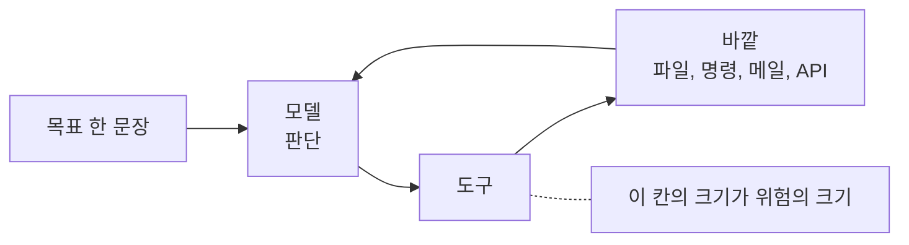

# 1.4 AI 시대에 새로 생긴 열 가지

> 앞의 서른 가지는 20년 된 개념입니다. 이 열 가지는 최근 몇 해에 생겼습니다.
> 새로운 공격이라서가 아니라, **기존 전제가 깨지는 자리**라서 따로 묶었습니다.

---

## 1. 에이전트

**한 줄** — 목표를 받아서 스스로 계획하고 도구를 써서 실행하는 프로그램입니다.

챗봇과 다릅니다. 챗봇은 답을 돌려줍니다. 에이전트는 **행동합니다.**
파일을 읽고, 명령을 실행하고, API 를 부르고, 메일을 보냅니다.

보안에서 이 차이는 결정적입니다. 잘못된 답은 사람이 걸러낼 수 있지만
잘못된 행동은 이미 일어난 뒤에 알게 됩니다. 그래서 에이전트를 평가할 때
"얼마나 똑똑한가"보다 "무엇을 할 수 있는가"를 먼저 봅니다.

에이전트는 사용자도 아니고 프로그램도 아닌 중간 존재입니다.
사용자처럼 판단하고 프로그램처럼 빠릅니다. 기존 권한 체계가 이 조합을
전제하지 않고 만들어졌습니다.

**무엇을 할 것** — 조직에서 돌고 있는 에이전트가 몇 개이고 각각 무엇을 할 수 있는지 적어 보십시오.

---

## 2. 도구 권한

**한 줄** — 에이전트에게 쥐여 준 행동 능력의 범위입니다.

에이전트의 위험은 모델이 아니라 도구에서 옵니다. 읽기만 하는 도구를 준 에이전트는
최악의 경우에도 정보를 잘못 요약합니다. 쉘을 준 에이전트는 최악의 경우에 서버를 지웁니다.

그래서 질문이 바뀝니다. "이 모델을 믿을 수 있나"가 아니라
"**이 도구를 이 에이전트에게 줘야 하나**"입니다. 두 번째 질문은 답할 수 있습니다.

실무 기준은 하나로 충분합니다. 되돌릴 수 없는 행동에는 사람 승인을 겁니다.
삭제, 송금, 외부 발송, 권한 변경, 배포입니다. 나머지는 풀어도 됩니다.

**무엇을 할 것** — 에이전트가 사람 승인 없이 할 수 있는 되돌릴 수 없는 행동을 찾아 보십시오.

---

## 3. 프롬프트 인젝션

**한 줄** — 지시문에 다른 지시를 끼워 넣어 모델의 목표를 바꾸는 공격입니다.

전통적인 인젝션은 데이터와 코드를 구분하지 못해서 생겼습니다.
프롬프트 인젝션도 같은 구조입니다. 모델에게는 **시스템 지시와 사용자 입력이
똑같은 글자**로 보입니다. 경계가 문법이 아니라 관습으로만 있습니다.

그래서 완전히 막는 방법이 아직 없습니다. 필터를 두면 우회가 나오고,
구분자를 두면 구분자를 흉내 냅니다. 입력 검증으로 푸는 문제가 아닙니다.

현실적인 대응은 **성공해도 피해가 작게** 만드는 쪽입니다.
목표가 바뀌어도 할 수 있는 일이 적으면 피해도 적습니다. 다시 도구 권한으로 돌아옵니다.

**무엇을 할 것** — 프롬프트 인젝션이 성공했다고 가정하고 그 에이전트가 할 수 있는 일을 적어 보십시오.

---

## 4. 간접 프롬프트 인젝션

**한 줄** — 사용자가 아니라 에이전트가 읽는 데이터에 명령을 숨기는 공격입니다.

사용자는 아무것도 안 했는데 공격이 성립합니다. 에이전트가 웹페이지를 읽고,
메일을 요약하고, 문서를 검색하는 그 순간에 들어옵니다.

OWASP 가 인용한 EchoLeak 사례가 이 구조입니다. 조작된 메일 한 통이
사용자 조작 없이 기밀 메일과 파일의 유출을 유발했습니다(⚠️ F-075).
사용자는 메일을 열지도 않았습니다.

핵심은 전제가 깨졌다는 점입니다. 기존 보안은 **사용자가 무언가를 해야**
공격이 성립한다고 가정했습니다. 교육과 경고창이 거기 기대 있습니다.
간접 인젝션에는 누를 버튼이 없습니다.

**무엇을 할 것** — 에이전트가 외부 콘텐츠를 읽는 경로를 전부 적어 보십시오. 그게 공격면입니다.

---

## 5. 메모리 오염

**한 줄** — 에이전트가 기억하는 내용을 오염시켜 오래 영향을 남기는 공격입니다.

한 번의 인젝션은 그 대화에서 끝납니다. 메모리에 남으면 다음 대화에도 작동합니다.
공격자가 한 번 심어 두고 떠나도 계속 동작합니다.

이것은 앞에서 본 **장기 잠복의 AI 판**입니다. 들어온 시점이 아니라
발견 시점이 피해를 정합니다. 그런데 메모리 오염은 로그에도 잘 안 남습니다.
기억이 바뀌는 것은 침입처럼 보이지 않기 때문입니다.

대응은 두 가지입니다. 메모리에 쓰는 것을 검증하고, 중요한 작업에는
기억을 쓰지 않는 일회성 컨텍스트를 씁니다. 편의와 안전이 정면으로 부딪치는 자리입니다.

**무엇을 할 것** — 에이전트 메모리에 무엇이 쌓이는지 한 번 열어 보십시오.

---

**에이전트의 위험은 모델이 아니라 도구에서 옵니다**

## 6. 패키지 환각과 슬롭스쿼팅

**한 줄** — 모델이 지어낸 패키지 이름을 공격자가 선점해 악성 코드를 올리는 공격입니다.

모델은 없는 패키지를 있는 것처럼 말합니다. 한 연구에서 제안된 패키지의 19.7% 가
존재하지 않았고, 고유한 환각 이름이 205,000개 넘게 관찰됐습니다(⚠️ F-079).

여기까지는 품질 문제입니다. 공격이 되는 이유는 **환각이 반복되기** 때문입니다.
같은 이름이 여러 번 나오고, 58% 넘는 이름이 반복 등장했으며
43% 는 같은 프롬프트 열 번에서 일관되게 나타났습니다(⚠️ F-079).

반복되면 선점할 수 있습니다. 공격자가 그 이름으로 패키지를 올려 두면
다음에 같은 환각을 본 개발자가 설치합니다. 오타가 아니라서 맞춤법 검사로도 안 잡힙니다.

**무엇을 할 것** — 에이전트가 제안한 패키지를 설치 전에 실재 확인하는 절차가 있는지 보십시오.

---

## 7. 자율 침투 루프

**한 줄** — 탐색하고 시도하고 결과를 보고 다음을 정하는 과정을 사람 없이 도는 것입니다.

공격 자동화는 원래 있었습니다. 스크립트는 정해진 순서를 반복합니다.
자율 루프는 다릅니다. **결과를 보고 다음 수를 바꿉니다.** 막히면 우회하고,
열리면 파고듭니다. 사람이 하던 판단 부분이 자동화됐습니다.

2025년에 보고된 캠페인에서 전술적 작업의 80~90% 가 사람 개입 없이 수행됐고,
사람은 표적 선정과 유출 승인 같은 전략적 판단에만 관여했습니다(✅ F-071).

이것이 비용 곡선을 바꿉니다. 사람 한 명이 조직 하나를 보던 것이
조직 서른 개를 보게 됩니다. 공격자 수는 그대로인데 표적 수가 늘어납니다.

**무엇을 할 것** — "우리는 작아서 표적이 아니다"라는 전제를 다시 보십시오.

---

## 8. 멀티 에이전트 분업

**한 줄** — 역할이 다른 에이전트 여럿이 나눠서 일하는 구조입니다.

총괄이 계획을 세우고, 탐색 담당이 훑고, 실행 담당이 시도합니다.
사람 조직과 같은 구조인데 속도가 다릅니다.

분업이 생기면 **속도의 상한이 사라집니다.** 사람 팀은 회의와 인수인계에서
시간을 씁니다. 에이전트 팀은 그 비용이 거의 없습니다.
2025년에 보고된 캠페인에서 전술적 작업의 80~90% 가 사람 개입 없이 수행됐습니다(✅ F-071).

방어 쪽에서도 같은 구조가 가능합니다. 다만 방어는 오탐의 대가가 크고
자동 차단의 위험이 커서 도입이 느립니다. 비대칭이 당분간 이어집니다.

**무엇을 할 것** — 사람이 하루 걸려 보는 점검 중 자동화할 수 있는 것을 하나 고르십시오.

---

## 9. 검토 피로

**한 줄** — 생성되는 양이 사람의 검토 능력을 넘어서는 상태입니다.

에이전트가 코드를 빨리 씁니다. 리뷰어는 그대로입니다.
변경이 쌓이면 어느 지점부터 사람이 제대로 안 봅니다.
그 지점이 어디인지는 조직마다 다른데, **있다는 것은 분명합니다.**
이것이 가장 조용한 위험입니다. 사고처럼 보이지 않기 때문입니다.

기존 코드 리뷰는 "사람이 쓴 코드를 사람이 본다"를 전제했습니다.
작성 속도와 검토 속도가 비슷했으니 성립했습니다. 그 전제가 깨졌습니다.

답은 더 열심히 보는 것이 아닙니다. **기계가 먼저 거르는 것**입니다.
사람이 판단할 가치가 있는 것만 사람에게 올라오게 만들어야 합니다.
인가 검증 누락, 비밀 문자열, 새 의존성 같은 것은 자동 검사가 더 잘합니다.

**무엇을 할 것** — 병합 전에 자동으로 거르는 검사가 몇 가지인지 세어 보십시오.

---

## 10. 에이전트의 신원

**한 줄** — 에이전트에게 사람 계정을 빌려 주지 않고 자기 신원을 주는 것입니다.

지금 대부분의 에이전트는 사람 계정으로 돕니다. 만든 사람의 토큰을 씁니다.
그러면 로그에 사람 이름이 찍힙니다. 누가 한 일인지 구분할 수 없습니다.

구분이 안 되면 세 가지가 동시에 망가집니다. 권한을 좁힐 수 없고,
이상 행동을 탐지할 수 없고, 사고 때 책임을 가릴 수 없습니다.
OWASP 의 에이전트 목록에서도 신원과 권한 남용이 상위 항목입니다(⚠️ F-074).

에이전트마다 자기 계정을 주고, 권한을 따로 매기고, 로그를 따로 남깁니다.
사람 계정으로 돌리는 편의보다 이쪽의 값이 큽니다.

**무엇을 할 것** — 에이전트 활동이 사람 계정 로그와 섞여 있는지 확인하십시오.

---

> ### 여기까지가 개념입니다
>
> 마흔 가지를 짧게 봤습니다. 외울 필요는 없습니다. 4부에서 사건을 읽을 때
> 이 말들이 다시 나옵니다. 그때 이해하면 됩니다.
>
> 다음 2부부터는 자기 조직에 대보는 자리입니다.

---

## 개념 확인

**Q.** 에이전트의 위험을 평가할 때 이 책이 권하는 질문은 무엇입니까.

1. 이 모델이 얼마나 똑똑한가
2. 이 모델을 믿을 수 있나
3. 이 도구를 이 에이전트에게 줘야 하나
4. 이 모델은 무엇으로 학습했나

답 보기

**3번.** 위험은 모델이 아니라 도구에서 옵니다.
읽기만 하는 에이전트는 최악의 경우 잘못 요약하고,
쉘을 쥔 에이전트는 최악의 경우 서버를 지웁니다.
1번과 2번은 답할 수 없는 질문이고, 3번은 답할 수 있습니다.

---

**출처**

사실마다 근거를 직접 열어 볼 수 있게 링크를 답니다.
확인 날짜와 원문 요지는 [`research/facts.yaml`](../research/facts.yaml) 에 있습니다.

| 사실 | 확인 | 근거를 직접 보기 |
|---|---|---|
| `F-071` | ✅ | [assets.anthropic.com](https://assets.anthropic.com/m/ec212e6566a0d47/original/Disrupting-the-first-reported-AI-orchestrated-cyber-espionage-campaign.pdf) — 1차 |
| `F-074` | ⚠️ | [cycode.com](https://cycode.com/blog/owasp-top-10-agentic-applications/) — 2차 |
| `F-075` | ⚠️ | [cycode.com](https://cycode.com/blog/owasp-top-10-agentic-applications/) — 2차 |
| `F-079` | ⚠️ | [socket.dev](https://socket.dev/blog/slopsquatting-how-ai-hallucinations-are-fueling-a-new-class-of-supply-chain-attacks) — 2차(논문 인용) |
