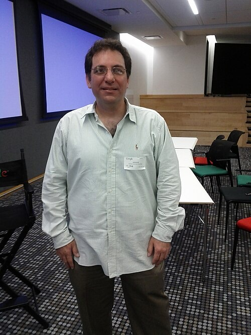
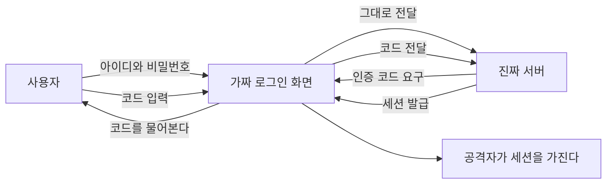

# 1.5 요즘 들어오는 수법 열 가지

> 앞의 마흔 가지가 개념이라면 이 열 가지는 **지금 실제로 들어오는 모양**입니다.
> 수법마다 어떻게 도는지와 막는 법을 같이 적었습니다.
>
> **공격 절차는 적지 않습니다.** 명령어, 페이로드, 도구 사용법은 없습니다.
> 구조와 막는 자리까지입니다. 그 선은 이 책 전체에서 같습니다.

---

## 1. 헬프데스크에 전화하기

<figure class="quote">
  
  <blockquote>
    
사람을 속이는 쪽이 기계를 뚫는 쪽보다 쌉니다.

    
1990년대의 침입자이자 뒤에 보안 컨설턴트가 된 Kevin Mitnick 은
    사회공학과 그 방어 교육을 업으로 삼았습니다. 그가 다룬 것이 이 수법입니다.

  </blockquote>
  <figcaption>Kevin Mitnick — 사진은 위키미디어 커먼즈. 인용문이 아니라 요약입니다</figcaption>
</figure>

**어떻게 도는가** — 공격자가 직원을 사칭해 IT 지원에 전화를 겁니다.
이름, 소속, 상사 이름은 공개된 채용 정보와 소셜 프로필에서 모읍니다.
비밀번호나 다중 인증 수단을 재설정해 달라고 합니다.

MGM Resorts 사건에서 통화는 약 10분이었습니다(⚠️ F-054).
Caesars 는 외주 헬프데스크가 설득당했고 1,500만 달러를 지급했습니다(⚠️ F-055).
MGM, Caesars, Transport for London 세 건의 초기 침투 경로가 전부 같았습니다(✅ F-056).

**왜 통하는가** — <mark>기술이 아니라 절차의 구멍입니다.</mark>
헬프데스크의 성과 지표는 대개 처리 속도입니다.
의심하면 느려지고, 느려지면 평가가 나빠집니다.
제도가 의심하지 말라고 가르친 셈입니다.

**막는 법**

- 재설정 요청에 **되전화**를 겁니다. 인사 기록에 있는 번호로만 겁니다
- 관리자급 계정은 재설정 자체를 전화로 받지 않습니다
- 상급자 승인 한 단계를 넣습니다. 느려지는 것이 목적입니다
- 외주 헬프데스크에도 같은 절차를 계약서에 적습니다

**더 볼 곳** — [4.7 전화 한 통 (MGM 과 Caesars)](../part4/07-helpdesk.md), [부록 B-7 헬프데스크 재설정 절차](../appendix/b-checklists.md)

---

## 2. 다중 인증을 중계해서 뚫기

**어떻게 도는가** — 가짜 로그인 화면이 진짜 서버와 실시간으로 중계합니다.
사용자가 가짜 화면에 아이디와 비밀번호를 넣으면 그대로 진짜로 전달되고,
진짜가 요구한 인증 코드도 사용자에게 물어서 다시 전달합니다.
사용자는 정상 로그인된 것처럼 보이고, 공격자는 **세션을 가져갑니다.**

<mark class="t">세션(session)은 한 번 로그인한 뒤 그 상태를 유지해 주는 증표입니다.</mark>
이것을 쥐면 비밀번호를 몰라도 로그인한 사람 행세를 할 수 있습니다.

**왜 통하는가** — 코드를 읽어서 옮겨 적는 방식의 다중 인증은
"누구에게 주는지"를 확인하지 않습니다.
문자, 앱 생성 코드, 푸시 승인이 전부 여기 해당합니다.
한 번 세션을 뺏기면 그다음부터 인증은 다시 묻지 않습니다.

**막는 법**

- 관리자부터 **패스키나 하드웨어 키**로 옮깁니다. 패스키(passkey)는 기기에 보관된 열쇠로 로그인하는 방식이고, 하드웨어 키는 USB 처럼 꽂는 물리 열쇠입니다. 둘 다 **접속한 주소가 다르면 아예 동작하지 않아서** 중계가 성립하지 않습니다
- 푸시 승인에는 숫자 맞추기를 켭니다. 무턱대고 누르는 것을 줄입니다
- 세션 토큰을 기기와 묶고, 중요한 작업에는 재인증을 겁니다
- 평소와 다른 위치에서 새 세션이 생기면 알림을 받습니다

**더 볼 곳** — [1.3 신원과 데이터](03-identity-data.md) 의 다중 인증과 패스키, [2.2 신원과 접근 통제](../part2/02-identity.md), [부록 F 의 D 영역](../appendix/f-server-audit.md)

---

## 3. 파일 전송 솔루션 한 곳을 뚫어 전부 가져가기

**어떻게 도는가** — 여러 조직이 공통으로 쓰는 제품의 취약점을 찾아
자동화된 형태로 한꺼번에 악용합니다.
MOVEit Transfer 사건이 그랬습니다. 피해 조직이 2023-07-26 기준 455곳,
08-14 기준 670곳, 최종 1,000곳을 넘겼습니다(✅ F-052).

**왜 통하는가** — 파일 전송 제품에는 **옮기는 중인 데이터가 전부 모입니다.**
계약서, 명단, 정산 자료가 한곳을 지나갑니다.
게다가 외부와 주고받아야 하니 인터넷에 열려 있습니다.
공격자 입장에서는 한 번 투자해 수백 곳을 얻습니다.

**막는 법**

- 경계에 선 제품은 **따로 목록을 만들고** 패치 목표를 더 짧게 잡습니다
- 전송 제품에 데이터를 쌓아 두지 않습니다. 옮기면 지웁니다
- 그 제품 계정의 권한을 전송에만 묶습니다
- 공급사 보안 공지 구독자를 사람 이름으로 지정합니다

**더 볼 곳** — [1.2 방어를 세우는 눈](02-defense.md) 의 패치 수명, [4.6 하나를 뚫어 천 곳 (MOVEit)](../part4/06-moveit.md), [3.3 서버 구성](../part3/03-server.md)

---

## 4. 암호화하지 않고 공개하겠다고 협박하기

**어떻게 도는가** — 예전 랜섬웨어는 파일을 잠그고 열쇠를 팔았습니다.
요즘은 잠그지 않고 **가져가서 공개하겠다**고 합니다.
Clop 은 MOVEit 캠페인에서 이 방식에 집중했습니다(⚠️ F-053).

**왜 통하는가** — 백업이 좋아졌기 때문입니다.
복원할 수 있으면 열쇠를 살 이유가 없습니다.
그런데 <mark class="w">**이미 나간 데이터는 백업으로 되돌릴 수 없습니다.**</mark>
방어가 좋아진 자리를 피해서 협상력이 남는 자리로 옮긴 것입니다.

**막는 법**

- 백업만으로는 부족합니다. **나가는 것**을 막아야 합니다
- 아웃바운드(outbound, 우리 서버가 바깥으로 나가는 통신)를 허용 목록으로 제한합니다. 허가한 목적지 외에는 나가지 못하게 막는 것입니다
- 대량 조회와 대량 반출에 임계값 알림을 겁니다. 평소 하루 100건을 보던 계정이 1만 건을 보면 알림이 오게 하는 식입니다
- 데이터를 적게 들고 있습니다. 없는 것은 나갈 수 없습니다
- 공지와 신고 문안을 미리 써 둡니다. 협박 받고 쓰면 늦습니다

**더 볼 곳** — [1.1 공격을 보는 눈](01-attack.md) 의 유출과 이중 협박, [1.3 신원과 데이터](03-identity-data.md) 의 최소 보유, [부록 B-6 사고 공지문 3단계](../appendix/b-checklists.md)

---

## 5. 패키지 생태계에서 스스로 번지는 웜

**어떻게 도는가** — 패키지 하나가 감염되면 설치 과정에서 환경의 토큰을 찾고,
그 토큰으로 접근 가능한 다른 패키지에 자기를 심습니다.
Shai-Hulud 는 2025-09-15 공개 시점에 500개 넘는 패키지를 감염시켰습니다(✅ F-076).
2차 파동은 몇 시간 만에 700개 넘는 패키지로 번졌고,
487개 조직에서 약 14,000개의 비밀이 노출됐습니다(✅ F-077).

<figure class="quote">
  
  <blockquote>
    
1988년 11월 2일

    
모리스 웜이 MIT 망에서 퍼지기 시작했습니다.
    스스로 번지는 프로그램이 망 전체를 멈출 수 있다는 것을 처음 보여 준 사건이고,
    미국 CFAA 아래 내려진 최초의 중범죄 유죄 판결로 이어졌습니다.

  </blockquote>
  <figcaption>Robert Tappan Morris — 1988 (⚠️ F-134)</figcaption>
</figure>

**38년 전 구조가 그대로입니다.** 스스로 번지고, 번지는 속도가 사람 속도가 아닙니다.
달라진 것은 망이 아니라 **패키지 생태계로 무대가 옮겨졌다**는 점입니다.

**왜 통하는가** — 설치는 코드 실행이기 때문입니다.
그리고 개발자 노트북과 빌드 서버에는 **토큰이 모여 있습니다.**
사람이 퍼뜨리는 것이 아니라 설치가 퍼뜨립니다. 속도가 다릅니다.

**막는 법**

- 버전을 고정하고 잠금 파일을 커밋합니다. 잠금 파일(lock file)은 어떤 패키지의 어느 버전을 썼는지 정확히 적어 둔 파일입니다. 이것이 없으면 다음 설치 때 새 버전이 조용히 들어옵니다
- 설치 단계 스크립트 실행을 막거나 격리된 곳에서만 허용합니다
- 빌드에 쓰는 토큰은 **단명 자격증명**으로 바꿉니다. 몇 분이나 몇 시간 뒤 저절로 만료되는 열쇠입니다. 훔쳐도 금방 쓸모가 없어집니다
- 사내 미러(공개 저장소를 사내에 복제해 둔 것)를 두고 새 버전은 며칠 늦춰 반영합니다. 그 며칠 사이에 대개 발각됩니다
- 유출된 토큰을 빨리 갈아 끼우는 절차를 미리 돌려 봅니다

**더 볼 곳** — [1.3 신원과 데이터](03-identity-data.md) 의 단명 자격증명, [4.10 설치 한 줄 (npm)](../part4/10-supply-npm.md), [3.2 코딩 에이전트를 쓰면 놓치는 것](../part3/02-agents.md)

---

## 6. 모델이 지어낸 패키지 이름 선점하기

**어떻게 도는가** — 모델은 없는 패키지를 있는 것처럼 말합니다.
한 연구에서 제안된 패키지의 19.7% 가 존재하지 않았고,
고유한 환각 이름이 205,000개를 넘었습니다(⚠️ F-079).
문제는 같은 이름이 반복해서 나온다는 점입니다.
반복되면 공격자가 그 이름을 **미리 올려 둘 수 있습니다**(⚠️ F-078).

**왜 통하는가** — 오타가 아니기 때문입니다.
맞춤법 검사에도 안 걸리고, 이름 자체가 그럴듯합니다.
무엇보다 <mark class="w">**에이전트가 제안했다는 사실이 신뢰로 작동합니다.**</mark>

**막는 법**

- 설치 전에 실재를 확인합니다. 배포 이력, 저장소, 관리자를 봅니다
- 만들어진 지 얼마 안 된 패키지는 보류합니다
- 허용 목록 방식의 사내 레지스트리를 씁니다. 레지스트리(registry)는 패키지를 받아 오는 창구이고, 허가한 것만 통과시키게 할 수 있습니다
- 에이전트가 추가한 의존성은 PR 에서 **따로 표시**되게 합니다

**더 볼 곳** — [1.4 AI 시대에 새로 생긴 열 가지](04-ai-era.md) 의 패키지 환각, [3.8 코드를 쓸 때 보안을 같이 쓰는 법](../part3/08-secure-coding.md)

---

## 7. 사용자가 아무것도 안 해도 성립하는 인젝션

**어떻게 도는가** — 공격자가 에이전트에게 말을 거는 것이 아니라,
에이전트가 **읽을 데이터 안에** 지시를 숨깁니다.
메일, 웹페이지, 문서, 이슈 본문이 통로입니다.
EchoLeak 은 조작된 메일 한 통으로 사용자 조작 없이
기밀 메일과 파일의 유출을 유발했습니다(⚠️ F-075).

**왜 통하는가** — 모델에게는 시스템 지시와 읽어 온 데이터가
**똑같은 글자**로 보입니다. 경계가 문법이 아니라 관습으로만 있습니다.
기존 보안은 사용자가 무언가를 눌러야 공격이 성립한다고 가정했습니다.
여기에는 누를 버튼이 없습니다.

**막는 법**

- 완전 차단을 목표로 하지 않습니다. **성공해도 피해가 작게** 만듭니다
- 외부 콘텐츠를 읽는 에이전트에게 쓰기 권한과 외부 발송을 함께 주지 않습니다
- 되돌릴 수 없는 행동에는 사람 승인을 겁니다
- 에이전트의 아웃바운드 목적지를 허용 목록으로 묶습니다

**더 볼 곳** — [1.4 AI 시대에 새로 생긴 열 가지](04-ai-era.md) 의 프롬프트 인젝션 두 항목, [3.7 에이전트 공격은 어떻게 도는가](../part3/07-agent-attacks.md)

---

## 8. 경계에 선 장비의 취약점

**어떻게 도는가** — VPN 장비, 방화벽, 원격 접속 게이트웨이처럼
인터넷에 직접 닿는 장비의 취약점을 노립니다.
뚫리면 인증 절차 자체를 건너뛰고 내부에 섭니다.
문을 따는 것이 아니라 **문틀째 들어내는 쪽**에 가깝습니다.

**왜 통하는가** — 이 장비들은 **보안 장비라서 더 늦게 패치됩니다.**
멈추면 전사가 멈추니 점검 창을 잡기 어렵습니다.
그리고 보안 제품이라는 이유로 의심 대상에서 빠집니다.

**막는 법**

- 경계 장비를 별도 목록으로 관리하고 패치 목표를 가장 짧게 잡습니다
- 관리 화면을 인터넷에 열지 않습니다
- 장비 자체의 로그를 밖으로 보냅니다. 장비 안에만 두지 않습니다
- 패치 창을 미리 정기화합니다. 사고 나고 잡으면 늦습니다

**더 볼 곳** — [1.1 공격을 보는 눈](01-attack.md) 의 초기 침투 경로, [3.3 서버 구성](../part3/03-server.md), [4.8 새로운 기법은 없었다 (Salt Typhoon)](../part4/08-salt-typhoon.md)

---

## 9. 멀쩡한 계정과 원래 있던 도구만 쓰기

**어떻게 도는가** — 악성코드를 심지 않습니다.
훔친 계정으로 로그인하고, 운영체제에 원래 있는 관리 도구만 씁니다.
Salt Typhoon 에 대해 각국 기관은 확인된 침해가
기존 약점과 일치하며 **새로운 기법은 관찰되지 않았다**고 밝혔습니다(✅ F-058).

**왜 통하는가** — 탐지가 대부분 **나쁜 파일**을 찾도록 만들어져 있기 때문입니다.
나쁜 파일이 없으면 걸리지 않습니다.
로그에는 정상 로그인과 정상 명령만 남습니다.

**막는 법**

- 파일이 아니라 **행동**으로 봅니다. 누가, 언제, 어디서, 평소와 다른가
- 관리 도구 사용에 기준선(평소에는 어느 정도인지를 적어 둔 기준)을 만들어 둡니다. 기준이 없으면 벗어난 것도 안 보입니다
- 계정마다 평소 접속 시간대와 위치를 압니다
- 아무도 건드릴 일 없는 카나리(canary) 계정과 파일을 심습니다. 누가 건드리면 그 자체가 침입 신호인 미끼입니다. 광산에서 가스를 먼저 알아채던 새에서 온 말입니다

**더 볼 곳** — [1.1 공격을 보는 눈](01-attack.md) 의 장기 잠복, [2.3 탐지와 대응](../part2/03-detect.md), [5.1 책에 없는 공격에 대비하기](../part5/01-unknown.md)

---

## 10. 핵심 대신 주변부로 들어오기

**어떻게 도는가** — 돈이 오가는 시스템이 아니라 그 옆을 칩니다.
직원용 업무지원시스템, 영업지원시스템, 모바일 홈페이지가 그렇습니다.
2026년 금융권 사건에서 들어온 자리가 전부 여기였고,
그 시스템들은 당국 점검 대상에서 빠져 있었습니다(✅ F-004).

**왜 통하는가** — 중요도는 **하는 일**로 매기는데
위험은 **닿는 범위**에서 나오기 때문입니다.
직원 게시판은 돈을 옮기지 않지만 직원 계정으로 들어갑니다.
그 계정은 다른 곳에도 들어갑니다.

**막는 법**

- 점검 대상 목록에 없는 시스템을 먼저 셉니다. 그 수가 이 책의 첫 질문입니다
- 사내 전용 시스템에도 외부 서비스와 같은 기준을 적용합니다
- 주변부에서 핵심으로 가는 경로를 끊습니다. 계정과 망 양쪽에서 끊습니다
- 주변부 시스템에 고객 정보가 조회 결과로 뜨는지 확인합니다

**더 볼 곳** — [1.1 공격을 보는 눈](01-attack.md) 의 주변부, [4.1 엿새 동안 은행 여섯 곳](../part4/01-finance-2026.md), [부록 F 우리 서버 안전 점검](../appendix/f-server-audit.md)

---

## 열 가지를 관통하는 것

새로 발명된 공격이 거의 없습니다.
2번과 6번과 7번만 최근 몇 해의 산물이고 나머지는 오래된 수법입니다.

달라진 것은 <mark>**싸졌다는 점**</mark>입니다.
사람이 붙어서 며칠 걸리던 일을 자동으로 돌립니다.
그래서 "우리는 작아서 표적이 아니다"가 깨집니다.
표적 선정에 드는 비용이 거의 0 이면 작은 곳도 목록에 들어갑니다.

막는 법도 거의 겹칩니다. 열 가지를 세 줄로 줄이면 이렇습니다.

1. **들어오는 길을 줄인다** — 안 쓰는 것을 끄고, 경계 장비를 먼저 패치합니다
2. **들어와도 멀리 못 가게 한다** — 권한을 좁히고 망을 나눕니다
3. **나가는 것을 막고 본다** — 아웃바운드를 제한하고 행동으로 탐지합니다

---

## 우리 조직 체크 3문항

1. 헬프데스크가 전화로 비밀번호를 재설정해 줍니까. 되전화 절차가 있습니까.
2. 관리자 계정이 코드 입력 방식의 다중 인증에만 기대고 있습니까.
3. 서버가 아무 데나 바깥으로 나갈 수 있습니까.

---

---

## 개념 확인

**Q.** 문자나 앱으로 받은 코드를 쓰는 다중 인증이 중계형 피싱에 뚫리는 이유는 무엇입니까.

1. 코드 자릿수가 짧아서
2. 코드를 **누구에게 주는지**를 확인하지 않기 때문
3. 문자가 암호화되지 않아서
4. 코드 유효 시간이 너무 길어서

답 보기

**2번.** 사용자는 가짜 화면에 코드를 넣고, 가짜는 그것을 진짜에 전달합니다.
코드 자체는 멀쩡합니다. 받는 쪽을 확인하지 않는 것이 구멍입니다.
패스키와 하드웨어 키는 **접속한 주소가 다르면 아예 동작하지 않아** 이 구조가 성립하지 않습니다.

## 한 줄 요약

**수법은 대부분 오래됐고 싸졌을 뿐입니다.**
새 수법을 쫓는 것보다 들어온 다음을 좁히는 쪽이 오래 갑니다.

---

**출처**

사실마다 근거를 직접 열어 볼 수 있게 링크를 답니다.
확인 날짜와 원문 요지는 [`research/facts.yaml`](../research/facts.yaml) 에 있습니다.

| 사실 | 확인 | 근거를 직접 보기 |
|---|---|---|
| `F-004` | ✅ | [newspim.com](https://www.newspim.com/news/view/20261002001278) — 2차 |
| `F-052` | ✅ | [bankinfosecurity.com](https://www.bankinfosecurity.com/latest-moveit-data-breach-victim-tally-455-organizations-a-22650) — 2차(집계기관 인용) |
| `F-053` | ⚠️ | [flashpoint.io](https://flashpoint.io/blog/clop-ransomware-moveit-vulnerability/) — 2차 |
| `F-054` | ⚠️ | [adaptivesecurity.com](https://www.adaptivesecurity.com/blog/mgm-ransomware-attack) — 2차 |
| `F-055` | ⚠️ | [adaptivesecurity.com](https://www.adaptivesecurity.com/blog/mgm-ransomware-attack) — 2차 |
| `F-056` | ⚠️ | — 원문이 내려갔습니다. 대체 출처를 찾는 중입니다 |
| `F-058` | ✅ | [darkreading.com](https://www.darkreading.com/cyberattacks-data-breaches/cisa-issue-guidance-telecoms-salt-typhoon-threat) — 2차 |
| `F-075` | ⚠️ | [cycode.com](https://cycode.com/blog/owasp-top-10-agentic-applications/) — 2차 |
| `F-076` | ✅ | [unit42.paloaltonetworks.com](https://unit42.paloaltonetworks.com/npm-supply-chain-attack/) — 2차(보안업체 분석) |
| `F-077` | ✅ | [zscaler.com](https://www.zscaler.com/blogs/security-research/shai-hulud-v2-poses-risk-npm-supply-chain) — 2차 |
| `F-078` | ⚠️ | [en.wikipedia.org](https://en.wikipedia.org/wiki/Slopsquatting) — 3차(위키) |
| `F-079` | ⚠️ | [socket.dev](https://socket.dev/blog/slopsquatting-how-ai-hallucinations-are-fueling-a-new-class-of-supply-chain-attacks) — 2차(논문 인용) |
| `F-134` | ⚠️ | [en.wikipedia.org](https://en.wikipedia.org/wiki/Morris_worm) — 2차(위키백과) |
