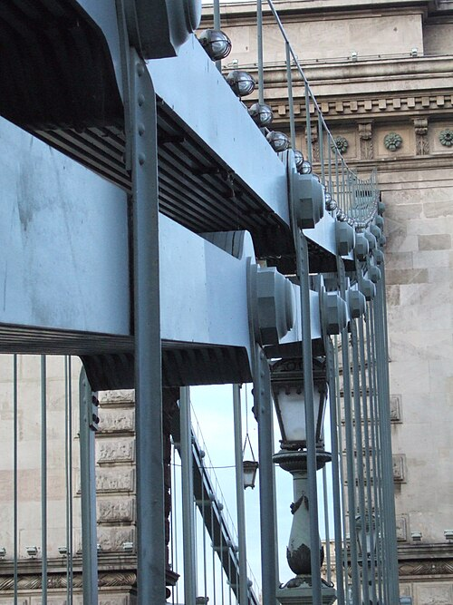
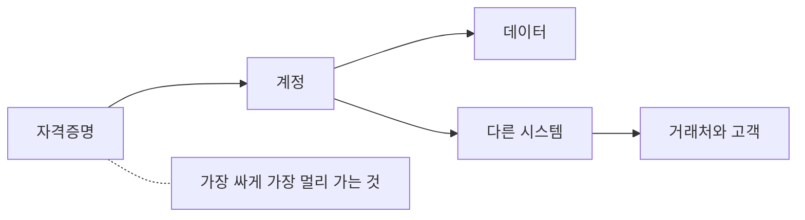

# 1.6 공격자는 누구이고 무엇을 노리는가

> **오늘의 질문** — 우리가 뚫리면 저쪽은 무엇을 얻습니까. 한 줄로 쓸 수 있습니까.

앞의 쉰 가지는 **무엇이 일어나는가**였습니다.
이 장은 **누가 왜 하는가**입니다.

순서를 뒤로 둔 이유가 있습니다.
공격자를 먼저 이야기하면 영화가 되기 때문입니다.
후드를 쓴 사람, 어두운 방, 초록색 글자.
그 그림은 하나도 맞지 않고, 무엇보다 **방어에 쓸모가 없습니다.**

쓸모 있는 그림은 이것입니다.
**공격자는 악당이기 전에 계산하는 사람입니다.**

---

## 넷으로 나눕니다

목적이 다르면 행동이 다르고, 행동이 다르면 보이는 흔적도 다릅니다.

| 유형 | 목적 | 성공이란 | 특징 |
|---|---|---|---|
| **금전형** | 돈 | 빨리 현금화 | 수지가 안 맞으면 떠납니다 |
| **첩보형** | 정보 | 오래 들키지 않기 | 조용합니다. 파괴하지 않습니다 |
| **과시형** | 주목 | 보이는 것 | 일부러 티를 냅니다 |
| **내부자** | 돈, 원한, 실수 | 이미 들어와 있음 | 침입 흔적이 없습니다 |

가장 자주 만나는 쪽은 **금전형**입니다.
가장 늦게 발견하는 쪽은 **첩보형**입니다.
조용한 것이 목적이기 때문입니다.
2025년 통신사 사건에서 최초 감염과 결정적 유출 사이가
3년 8개월이었습니다(✅ F-020).

**유형을 먼저 생각하면 어디를 볼지가 정해집니다.**
금전형이면 대량 반출과 결제 흐름을 보고,
첩보형이면 조용한 장기 접속과 관리 도구 사용을 봅니다.

---

## 심리 — 사업자처럼 행동합니다

<figure class="shot">
  
  <figcaption>세체니 다리의 사슬. 보안 수준은 평균이 아니라 최저값으로 정해집니다. 공격자는 전체를 평가하지 않고 가장 싼 입구 하나를 찾습니다. 사진 Frankemann, <a href="https://creativecommons.org/licenses/by-sa/4.0">CC BY-SA 4.0</a></figcaption>
</figure>

다섯 가지가 반복해서 관찰됩니다.

**1. 가장 싼 입구를 고릅니다.**
우리가 가장 잘 지키는 곳이 아니라 **가장 안 보는 곳**으로 들어옵니다.
2026년 금융권 사건에서 들어온 자리는 전부
점검 대상 목록 밖이었습니다(✅ F-004).

**2. 새 기법보다 되는 기법을 씁니다.**
국가급 공격자도 그렇습니다.
각국 기관은 Salt Typhoon 에 대해
**새로운 기법은 관찰되지 않았다**고 밝혔습니다(✅ F-058).
제로데이는 비쌉니다. 열려 있는 문이 있으면 쓰지 않습니다.

**3. 회수가 안 되면 떠납니다.**
Clop 은 MOVEit 캠페인 하나로 큰 금액을 벌었을 가능성이 제기됐고(⚠️ F-053),
Caesars 는 1,500만 달러를 지급했습니다(⚠️ F-055).
**돈이 되니까 다시 옵니다.** 반대로 수지가 안 맞으면 다음 표적으로 갑니다.
이 지점이 방어가 손댈 수 있는 유일한 자리입니다.

**4. 시간이 우리 편이 아닙니다.**
방어는 매일 성공해야 하고 공격은 한 번만 성공하면 됩니다.
그래서 공격자는 **기다릴 수 있습니다.**
패치가 늦어지는 분기, 담당자가 바뀌는 달, 연휴를 고릅니다.

**5. 위험을 관리합니다.**
잡힐 가능성, 송환될 가능성, 시끄러워질 가능성을 계산합니다.
**덜 아픈 표적이 있으면 그쪽으로 갑니다.**

---

## 무엇을 노리는가

값이 매겨지는 순서가 대체로 정해져 있습니다.

| 노리는 것 | 왜 비싼가 | 이 책의 어디 |
|---|---|---|
| **자격증명** | 가장 싸게 가장 멀리 갑니다 | [4.7](../part4/07-helpdesk.md) |
| **못 바꾸는 개인정보** | 주민등록번호는 갈아 끼울 수 없습니다 | [4.1](../part4/01-finance-2026.md) |
| **협박 재료** | 공개되면 아픈 것. 백업으로 못 되돌립니다 | [4.6](../part4/06-moveit.md) |
| **접근 그 자체** | 직접 안 써도 되팔 수 있습니다 | [4.8](../part4/08-salt-typhoon.md) |
| **공급망 위치** | 하나를 뚫어 수백 곳에 닿습니다 | [4.10](../part4/10-supply-npm.md) |

표의 아래로 갈수록 **우리 데이터가 아니라 우리 자리**가 표적입니다.
"우리는 가진 게 없다"가 안 통하는 이유입니다.
가진 것이 없어도 **누군가에게 닿는 통로**이면 값이 매겨집니다.

---

## "우리는 작아서 표적이 아니다"

오래 통하던 말이었습니다. 표적을 고르는 데 사람이 들었기 때문입니다.

그 비용이 내려갔습니다.
2025년에 보고된 캠페인에서 전술적 작업의 80~90% 가
사람 개입 없이 수행됐고, 표적은 약 30개 조직이었습니다(✅ F-071).

**표적 선정이 공짜에 가까워지면 작은 곳도 목록에 들어갑니다.**
작다는 것은 더 이상 방패가 아닙니다.
다만 여전히 **얻을 것이 적으면 덜 옵니다.** 그쪽이 손댈 수 있는 자리입니다.

---

## 국적과 귀속 — 여기부터 조심합니다

가장 많이 묻는 질문이고, 가장 자주 틀리는 자리입니다.

### 왜 국적 이야기가 나오는가

조사에서 나오는 단서는 대개 이런 것들입니다.

| 단서 | 어떻게 읽히나 |
|---|---|
| 도구와 문서의 언어 | 중국어, 러시아어 같은 표기 |
| 활동 시간대 | 특정 표준시의 업무 시간에 몰림 |
| 사용한 플랫폼 | 특정 국가에서 만든 도구 |
| 거쳐 온 인프라 | 서버와 IP 의 위치 |
| 표적의 성격 | 국가 이익과 맞아떨어지는가 |

### 그런데 이 단서들은 약합니다

**도구는 공개되어 있습니다.** 2026년 금융권 사건에서
동일 주체 추정의 핵심 근거는 중국어 기반 AI 자율 침투 테스트 플랫폼의
흔적이었습니다. 다만 그 도구는 **공개 플랫폼이라 중국발 공격으로
단정할 수 없습니다**(⚠️ F-002).

**인프라는 빌립니다.** 서버와 IP 는 돈을 내면 어디서든 빌립니다.
경유지의 국적은 출발지의 국적이 아닙니다.

**흔적은 일부러 남길 수 있습니다.**
남의 언어로 주석을 달고 남의 시간대에 맞춰 일하는 것은 어렵지 않습니다.
이것을 **거짓 깃발**이라고 부릅니다.

### 공개 귀속은 무게가 다릅니다

그렇다고 국적을 말할 수 없다는 뜻은 아닙니다.
**정부 기관이 이름을 걸고 지목하는 것**은 다른 종류의 진술입니다.

2024년 11월 13일, 미국 FBI 와 CISA 는 공동 성명에서
조사 결과 **중화인민공화국이 상업용 통신 인프라를 표적으로 삼은
광범위한 사이버 첩보 캠페인**이 확인됐다고 밝혔습니다(✅ F-060).

둘의 차이를 분명히 해 둡니다.

| | 흔적 기반 추정 | 기관의 공개 귀속 |
|---|---|---|
| 근거 | 도구, 언어, 시간대 | 비공개 정보를 포함한 종합 판단 |
| 책임 | 지는 사람이 없음 | 기관이 이름을 걸음 |
| 이 책의 표기 | **추정이라고 적습니다** | 발표 사실 그대로 적습니다 |

**그래도 공개 귀속이 최종 판결은 아닙니다.** 정부 발표도 정보 활동의 일부이고
근거 전부가 공개되지는 않습니다. 이 책은 **누가 언제 무엇을 발표했는지**까지 적고
거기서 멈춥니다.

### 틀린 귀속이 방어를 망치는 방식

이것이 이 절의 핵심입니다.

"중국발 공격"으로 정리해 버리면 대책이 **차단 목록**으로 끝납니다.
특정 국가 IP 를 막고 회의가 종료됩니다.
그런데 실제로 막아야 했던 것은 **점검되지 않은 시스템**입니다.

귀속은 **정책과 외교의 언어**이고,
방어는 **구조의 언어**입니다.
둘을 섞으면 할 일이 사라집니다.

> **이 책의 규칙** — 당국이 추정이라고 말하면 추정이라고 적습니다.
> 기관이 지목하면 그 기관이 지목했다고 적습니다.
> **우리가 대신 단정하지 않습니다.**

### 그래도 알아 둘 것

국적을 단정하지 않는 것과 **유형을 읽는 것**은 다릅니다.

- 통신, 에너지, 정부를 노리고 **조용히 오래 머무는** 공격은 첩보형에 가깝습니다
- 빠르게 암호화하거나 협박하는 공격은 금전형에 가깝습니다
- 이 구분은 국적을 몰라도 가능하고, **방어에 바로 쓰입니다**

---

## 그래서 방어가 어떻게 달라지나

| 공격자 유형 | 먼저 볼 것 | 먼저 줄일 것 |
|---|---|---|
| 금전형 | 대량 조회와 대량 반출 | 들고 있는 데이터의 양 |
| 첩보형 | 조용한 장기 접속, 관리 도구 사용 | 체류 시간, 망 분리 |
| 과시형 | 외부 노출면, 공개 서비스 | 공격면 |
| 내부자 | 권한 밖 접근, 퇴사 전후 행동 | 최소 권한, 계정 회수 |

네 줄 중 **오른쪽 칸이 전부 이 책의 앞 장들**입니다.
공격자를 읽는 일은 새 대책을 만드는 일이 아니라
**이미 아는 대책의 순서를 정하는 일**입니다.

---

## 우리 조직 체크 3문항

1. 우리가 뚫리면 저쪽이 무엇을 얻는지 한 줄로 쓸 수 있습니까.
2. 우리 데이터가 아니라 우리 **자리**를 노릴 이유가 있습니까. 거래처 몇 곳에 닿습니까.
3. 지난 사고 회의에서 "어느 나라"가 "무엇을 고칠까"보다 오래 논의되지 않았습니까.

---

## 개념 확인

**Q.** 공격에 쓰인 도구가 특정 국가에서 만든 것으로 확인됐습니다. 이때 할 수 있는 말은 무엇입니까.

1. 그 나라가 공격했다고 결론 낼 수 있다
2. 그 나라 IP 를 차단하면 대책이 끝난다
3. 도구의 출처일 뿐이고, 공개 도구라면 누구나 쓸 수 있다
4. 공격자의 언어를 특정할 수 있다

답 보기

**3번.** 2026년 금융권 사건이 정확히 이 구조였습니다.
흔적은 중국어 기반 플랫폼이었지만 **공개 플랫폼이라 단정할 수 없습니다**(⚠️ F-002).

2번이 특히 위험합니다. 차단 목록으로 회의가 끝나면
정작 막아야 했던 **점검되지 않은 시스템**은 그대로 남습니다.

반대로 FBI 와 CISA 가 이름을 걸고 발표한 것처럼
**기관의 공개 귀속은 무게가 다릅니다**(✅ F-060).
그것은 그대로 적되, 우리가 대신 단정하지는 않습니다.

## 한 줄 요약

**공격자는 계산하는 사람입니다.**
국적을 맞히는 것보다 **얻을 것을 줄이는 쪽**이 언제나 더 많이 막습니다.

---

**출처**

사실마다 근거를 직접 열어 볼 수 있게 링크를 답니다.
확인 날짜와 원문 요지는 [`research/facts.yaml`](../research/facts.yaml) 에 있습니다.

| 사실 | 확인 | 근거를 직접 보기 |
|---|---|---|
| `F-002` | ⚠️ | — 원문이 내려갔습니다. 대체 출처를 찾는 중입니다 |
| `F-004` | ✅ | [newspim.com](https://www.newspim.com/news/view/20261002001278) — 2차 |
| `F-020` | ✅ | [news.nate.com](https://news.nate.com/view/20250704n26170?mid=n0100) — 2차(과기정통부 발표 인용) |
| `F-053` | ⚠️ | [flashpoint.io](https://flashpoint.io/blog/clop-ransomware-moveit-vulnerability/) — 2차 |
| `F-055` | ⚠️ | [adaptivesecurity.com](https://www.adaptivesecurity.com/blog/mgm-ransomware-attack) — 2차 |
| `F-058` | ✅ | [darkreading.com](https://www.darkreading.com/cyberattacks-data-breaches/cisa-issue-guidance-telecoms-salt-typhoon-threat) — 2차 |
| `F-060` | ✅ | [cisa.gov](https://www.cisa.gov/news-events/news/joint-statement-fbi-and-cisa-peoples-republic-china-prc-targeting-commercial-telecommunications) — 1차(FBI 와 CISA 공동 성명) |
| `F-071` | ✅ | [assets.anthropic.com](https://assets.anthropic.com/m/ec212e6566a0d47/original/Disrupting-the-first-reported-AI-orchestrated-cyber-espionage-campaign.pdf) — 1차 |
