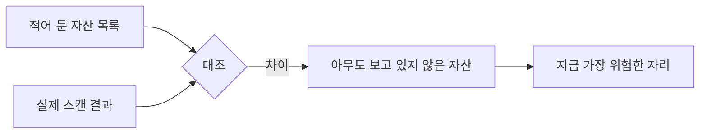
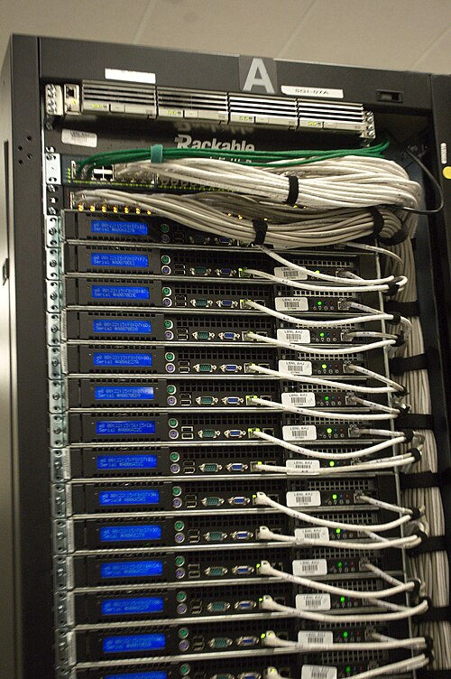

# 2.1 자산과 데이터

> 읽는 길: 경영진은 「자가진단 다섯 문항」과 「우리 조직 적용표」만 보셔도 됩니다.

> **오늘의 질문** — 우리가 가진 서버와 서비스의 목록을 지금 5분 안에 뽑을 수 있습니까.

## 세어 보지 않은 것

여는 글의 질문으로 돌아갑니다. 아무도 점검하지 않는 시스템은 몇 개입니까.

이 질문에 답하려면 먼저 전체가 몇 개인지 알아야 합니다. 그런데 대부분의 조직은
그 수를 모릅니다. 모른다는 사실조차 모릅니다. 서버 목록 파일은 있는데
3년 전 것이고, 그 사이 클라우드에 띄운 것과 외주가 만든 것과
테스트하려고 올린 것이 빠져 있습니다.

2026년 금융권 사건에서 공격이 들어온 직원용 업무지원 시스템들은
금융당국 점검 대상에서 빠져 금융사 자체 점검에 맡겨져 있었습니다(✅ F-004).
점검 대상 목록과 실제 자산 목록이 달랐던 것입니다.

**보이지 않는 것은 지킬 수 없습니다.** 이 장은 보이게 만드는 일을 다룹니다.

## 자산 목록을 만드는 가장 빠른 방법

완벽한 목록을 만들려고 하면 시작을 못 합니다. 세 번에 나눠서 합니다.

**1차. 밖에서 봅니다.** 조직이 가진 도메인에서 출발해 외부에서 접근 가능한
주소를 전부 찾습니다. DNS 레코드, 인증서 투명성 로그, 클라우드 계정의
공인 IP 목록이 출발점입니다. 반나절이면 끝납니다.

<!-- [장면 필요] 자산 목록을 처음 만들어 보고 놀란 개수. 무엇이 나왔는지.
     "거의 항상 나온다"를 실제 숫자 하나로 바꿀 수 있는 자리다. -->

이 단계에서 거의 항상 모르는 것이 나옵니다. 끝난 캠페인 페이지,
퇴사자가 띄워 둔 데모, 외주가 만든 임시 서버. 1차의 목적은
**놀라는 것**입니다. 놀랐다면 성공입니다.

**2차. 안에서 셉니다.** 클라우드 콘솔, 가상화 관리 도구, 자산 관리 시스템,
결제 내역을 긁습니다. 결제 내역이 의외로 정확합니다. 돈이 나가는 것은
누군가 쓰고 있다는 뜻이니까요.

**3차. 사람에게 묻습니다.** 팀마다 "여러분이 쓰는 시스템을 적어 주세요"를 돌립니다.
1차와 2차에서 안 나온 것이 여기서 나옵니다. 사내 위키, 공유 드라이브,
외부 SaaS, 협력사가 운영해 주는 것들입니다.

세 번을 돌리면 목록의 큰 덩어리가 찹니다. **완벽하지 않습니다.**
그래도 빈 목록보다는 쓸모가 있습니다. 나머지를 채우려고 반년을 쓰느니
지금 가진 것으로 시작하는 쪽이 낫습니다.

목록은 완성하는 것이 아니라 **갱신하는 것**입니다. 마지막 칸이 확인 날짜인 이유입니다.

**목록과 실제의 차이가 가장 위험한 자산입니다**

<figure class="shot">
  
  <figcaption>데이터센터 랙 뒷면. 목록에 적힌 것과 실제로 꽂혀 있는 것이 같은지는 세어 봐야 압니다. 사진 Derrick Coetzee from Berkeley, CA, USA, <a href="http://creativecommons.org/publicdomain/zero/1.0/deed.en">CC0</a></figcaption>
</figure>

## 목록에 반드시 있어야 하는 칸

이름과 IP 만 적은 목록은 쓸모가 적습니다. 아래 다섯 칸이 있어야
"다음에 무엇을 할지"가 나옵니다.

| 칸 | 왜 필요한가 |
|---|---|
| 담당자 | 비어 있으면 아무도 안 고칩니다. 가장 중요한 칸입니다 |
| 외부 노출 여부 | 패치 우선순위가 여기서 갈립니다 |
| 다루는 데이터 등급 | 뚫렸을 때 피해 크기를 정합니다 |
| 점검 대상 여부 | 이 칸의 "아니오"가 이 책의 첫 질문입니다 |
| 마지막 확인 날짜 | 오래된 줄은 믿지 않습니다 |

담당자 칸이 비어 있는 자산의 수를 세어 보십시오. 그 수가 조직이 실제로
관리하지 못하는 범위입니다.

## 데이터는 시스템보다 넓게 퍼집니다

자산 목록을 다 만들어도 데이터 지도는 따로 필요합니다.
고객 정보는 데이터베이스에만 있지 않기 때문입니다.

같은 고객 정보가 보통 이런 자리에 복사되어 있습니다.

- 운영 데이터베이스
- 분석용 사본과 데이터 웨어하우스
- 개발 환경에 복사해 둔 테스트 데이터
- 로그와 모니터링 도구
- 백업
- 담당자 노트북의 엑셀 파일
- 고객센터 도구와 외부 SaaS

**일곱 자리 중 몇 자리를 지키고 있습니까.** 세어 보십시오.
공격자는 가장 안 지키는 자리를 씁니다. 1.1 의 「가장 약한 고리」입니다.

롯데카드 사건에서 유출된 데이터는 특정 기간의 결제 과정에서 생성된 것이었습니다(✅ F-032).
어느 자리에서 생성되고 어디에 남는지를 아는 것이 출발점입니다.

## 자가진단 다섯 문항

답이 "모른다"인 항목이 이 조직의 위험 순서입니다.

**1. 자산 가시성** — 외부에서 접근 가능한 우리 주소를 전부 댈 수 있습니까.

**2. 점검 사각지대** — 어떤 점검에도 들어가지 않는 시스템이 몇 개입니까.

**3. 데이터 위치** — 고객 개인정보가 몇 개의 시스템에 있습니까.
핵심 시스템 밖에 얼마나 있습니까.

**4. 신원 체계** — 사람, 외주, 서비스 계정, API 키, 에이전트를 한 화면에서 볼 수 있습니까.

**5. 탐지와 대응 속도** — 지난 사고에서 침입부터 인지까지 몇 시간이었습니까.
인지부터 차단까지는 몇 분이었습니까.

다섯 문항을 분기마다 다시 묻고, 답이 "모른다"에서 숫자로 바뀌는지를 봅니다.
숫자가 좋아지는 것보다 **모른다가 줄어드는 것**이 먼저입니다.

## 최소 보유와 조기 파기

목록을 만들고 나면 다음 질문이 나옵니다. 이것을 다 갖고 있어야 합니까.

없는 데이터는 샐 수 없습니다. 가장 확실하고 가장 싼 보호인데
실무에서 가장 안 하는 일이기도 합니다. 지우는 사람이 책임을 지고
안 지우는 사람은 책임을 안 지는 구조이기 때문입니다.

그 구조를 바꾸려면 **보유 기간을 조직의 결정으로 만들어야** 합니다.
개인의 판단으로 두면 아무도 안 지웁니다. 데이터 종류마다 기간을 정하고
자동으로 지우게 하면 개인의 용기가 필요 없어집니다.

지울 수 없는 데이터는 범위를 줄입니다. 분석에는 가명 처리된 것을 쓰고,
화면에는 마스킹한 것을 보여 주고, 원본은 꼭 필요한 한 곳에만 둡니다.

> ### 금융권 사건에 적용하면
>
> 2026년 사건에서 유출 규모가 은행마다 크게 달랐습니다. 보도 기준으로
> 한 곳은 25,729명, 다른 곳은 119명, 또 다른 곳은 89명이었습니다(⚠️ F-003).
>
> 같은 공격인데 결과가 달랐다는 뜻입니다. 들어온 시스템이 얼마나 많은 데이터에
> 닿을 수 있었는가, 그리고 얼마나 빨리 끊었는가의 차이입니다.
> 부산은행에서는 외주 개발직원 11명의 정보가 나갔습니다. 그 시스템에
> 고객 데이터가 없었다는 뜻이기도 합니다.
>
> **침입을 똑같이 당해도 데이터 배치에 따라 유출 규모가 자릿수로 갈립니다.**
> 고객 기준으로 25,729명에서 89명까지 벌어졌습니다(⚠️ F-003, 보도 기준).

## 우리 조직 적용표

| 지금 가능 | 3개월 내 | 투자 필요 |
|---|---|---|
| 외부 노출 주소 목록 뽑기 | 자산 목록에 담당자 칸 채우기 | 자산 발견 자동화 도구 |
| 점검 대상에 없는 시스템 세기 | 데이터 등급 3단계 정하기 | 데이터 흐름 추적 체계 |
| 개발 환경의 실데이터 확인 | 개발 환경 데이터 가명 처리 | 중앙 비밀 관리 체계 |
| 자가진단 다섯 문항 답하기 | 보유 기간 정책 문서화 | 자동 파기 파이프라인 |

## 체크리스트

- [ ] 외부에서 접근 가능한 주소 목록이 한 달 이내에 갱신됐다
- [ ] 자산 목록에 담당자가 비어 있는 줄이 없다
- [ ] 점검 대상이 아닌 시스템의 수를 숫자로 안다
- [ ] 고객 개인정보가 있는 시스템을 전부 댈 수 있다
- [ ] 개발 환경에 실제 고객 데이터가 없다
- [ ] 데이터 종류별 보유 기간이 문서에 있다
- [ ] 보유 기간이 지난 데이터가 자동으로 지워진다
- [ ] 자가진단 다섯 문항에 "모른다"가 없다

## 이해 점검

1. 자산 목록에서 담당자 칸이 가장 중요한 이유는 무엇입니까.
2. 자산 발견을 세 번에 나눠서 하는 이유는 무엇입니까.
3. 고객 정보가 복사되어 있을 수 있는 자리를 다섯 개 이상 대 보십시오.
4. 같은 공격을 받고도 유출 규모가 달라지는 이유는 무엇입니까.
5. 보유 기간을 개인 판단이 아니라 조직 정책으로 만들어야 하는 이유는 무엇입니까.

## 스터디 가이드 (60분)

- **읽기 15분** — 각자 이 장을 읽고 자가진단 다섯 문항에 혼자 답합니다
- **공유 20분** — 답을 모읍니다. "모른다"가 가장 많이 나온 문항을 찾습니다
- **실습 20분** — 외부 노출 주소를 실제로 뽑아 봅니다. 모르는 것이 나오는지 봅니다
- **정리 5분** — 다음 달까지 담당자를 채울 자산 열 개를 정합니다

---

## 개념 확인

**Q.** 적어 둔 자산 목록과 실제 스캔 결과가 다를 때, 그 차이는 무엇을 뜻합니까. (주관식)

답 보기

**아무도 보고 있지 않은 자산입니다.** 목록에 없으니 점검도 투자도 가지 않았습니다.
차이가 0 이 아니면 **그 차이가 지금 가장 위험한 자산**입니다.
숫자를 줄이기 전에 차이부터 없앱니다.

## 한 줄 요약

보이지 않는 것은 지킬 수 없고, 목록에 없는 것은 보이지 않습니다.

---

**출처**

사실마다 근거를 직접 열어 볼 수 있게 링크를 답니다.
확인 날짜와 원문 요지는 [`research/facts.yaml`](../research/facts.yaml) 에 있습니다.

| 사실 | 확인 | 근거를 직접 보기 |
|---|---|---|
| `F-003` | ⚠️ | [newspim.com](https://www.newspim.com/news/view/20261002001278) — 2차 |
| `F-004` | ✅ | [newspim.com](https://www.newspim.com/news/view/20261002001278) — 2차 |
| `F-032` | ✅ | [khan.co.kr](https://www.khan.co.kr/article/202509181346001) — 2차 |
