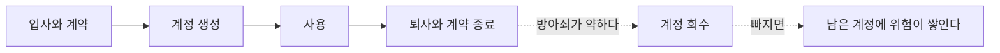

# 2.2 신원과 접근 통제

> 읽는 길: 개발자는 「기계 신원」 절부터 보셔도 됩니다.

> **오늘의 질문** — 어제 퇴사한 사람의 계정은 지금 몇 개 살아 있습니까.

## 경계가 사라진 자리

10년 전 보안 설계는 간단했습니다. 안과 밖을 나누고, 그 사이에 방화벽을 두고,
안은 믿었습니다. 사무실에 앉은 사람과 사무실 밖의 사람이 명확히 달랐습니다.

지금은 다릅니다. 직원은 집에서 접속하고, 외주는 자기 노트북으로 들어오고,
서비스는 클라우드에 있고, 배치 작업은 어디서 도는지 아무도 모르고,
에이전트는 사람 계정을 빌려 씁니다.

경계가 사라지면 남는 통제 지점은 하나뿐입니다. **누가 무엇에 접근하는가.**
그래서 신원이 새로운 경계가 됐습니다. 유행어라서가 아니라
다른 경계가 없어졌기 때문입니다.

## 한 체계에 다섯 종류

조직에는 최소 다섯 종류의 신원이 있습니다. 대부분 따로 관리됩니다.
따로 관리하면 전체를 볼 수 없고, 전체를 못 보면 빠진 것도 못 봅니다.

| 종류 | 누가 만드나 | 누가 없애나 |
|---|---|---|
| 직원 계정 | 인사 절차 | 인사 절차 |
| 외주와 협력사 계정 | 현업 요청 | **대개 아무도** |
| 서비스 계정 | 개발자 | 대개 아무도 |
| API 키와 토큰 | 개발자 | 대개 아무도 |
| 에이전트 | 개발자 | 대개 아무도 |

오른쪽 칸에 "대개 아무도"가 네 번 나옵니다. 이것이 신원 관리의 실상입니다.
직원 계정만 생애주기가 있고 나머지는 생성만 있습니다.

첫 번째 과제는 **한 화면에서 다섯 종류를 다 보는 것**입니다.
도구를 사기 전에 스프레드시트로 시작해도 됩니다. 중요한 것은
"우리 조직의 신원은 N 개다"라는 숫자가 생기는 일입니다.

**만드는 절차는 다 있고 없애는 절차가 없습니다**

## 최소 권한을 현실에서 지키는 법

최소 권한은 모두가 동의하고 아무도 안 지킵니다. 이유는 셋입니다.
필요한 권한을 계산하기 어렵고, 모자라면 민원이 오고, 넉넉히 주면 아무 일도 안 생깁니다.

전수 조사로 바로잡으려 하면 실패합니다. 대신 세 가지를 순서대로 합니다.

**첫째, 신규만 최소로 줍니다.** 오늘부터 만드는 계정에만 적용합니다.
기존 계정은 건드리지 않습니다. 저항이 거의 없습니다.

**둘째, 안 쓴 권한을 회수합니다.** 90일 동안 한 번도 쓰지 않은 권한을
분기마다 회수합니다. 실제로 쓰는 사람은 거의 없으니 민원도 적습니다.
회수 후 필요하면 다시 요청하게 합니다.

**셋째, 상시 관리자를 없앱니다.** 관리자 권한을 평소에 들고 있지 않고
필요할 때 신청해서 받습니다.

여기서 성패를 가르는 것은 **받는 속도**입니다. 바로 받을 수 있으면 지켜집니다.
기다려야 하면 사람들이 우회로를 만듭니다. 공용 계정을 만들거나,
한 번 받은 권한을 안 돌려줍니다. 승인 절차를 설계할 때
**보안 수준보다 소요 시간을 먼저 정하십시오.**

셋 중 세 번째가 가장 효과가 큽니다. 권한 상승 단계에서 공격자가 노리는 것이
바로 상시 관리자 계정이기 때문입니다.

## 다중 인증을 고를 때

다중 인증은 종류에 따라 막는 공격이 다릅니다. 전부 같다고 생각하면
"우리는 MFA 를 씁니다"라고 말하면서 뚫립니다.

| 방식 | 막는 것 | 못 막는 것 |
|---|---|---|
| 문자 인증번호 | 비밀번호 유출 | 전화로 불러 주게 하는 사기, 번호 이동 사기 |
| 앱 인증번호 | 비밀번호 유출, 번호 이동 | 가짜 사이트에 입력 |
| 앱 알림 승인 | 위 전부 | 반복 발송으로 지치게 만드는 공격 |
| 패스키와 보안 키 | 위 전부 + 가짜 사이트 | 기기 자체를 뺏기는 경우 |

**이 책이 다룬 사건 중에 다중 인증이 암호학적으로 깨진 것은 없습니다.**
사람을 통해 우회됐습니다. MGM 과 Caesars 를 포함한 몇몇 사건에서
초기 침투 경로가 헬프데스크에 전화해 자격증명을 재설정받는 방식이었습니다(⚠️ F-056).

**기술로 막을 수 없는 자리를 절차로 막아야 합니다.**

## 헬프데스크가 가장 약한 고리인 이유

헬프데스크의 일은 사람을 도와주는 것입니다. 보안의 일은 의심하는 것입니다.
둘은 정면으로 부딪칩니다.

전화가 옵니다. 급하다고 합니다. 임원이라고 합니다. 회의에 들어가야 한다고 합니다.
헬프데스크 직원이 느끼는 압박은 실제입니다. 거절했다가 진짜 임원이면 곤란해집니다.

그래서 **개인의 판단에 맡기면 안 됩니다.** 조직이 절차로 정해 줘야 합니다.

- 자격증명 재설정은 전화로 하지 않는다. 예외 없음
- 재설정은 등록된 다른 채널로 확인한 뒤에만 한다
- 고위험 계정은 상급자 승인을 추가로 받는다
- 거절해서 생기는 불편은 조직이 책임진다. 담당자 책임이 아니다

마지막 줄이 핵심입니다. 이 문장이 문서에 없으면 앞의 세 줄은 안 지켜집니다.

## 기계 신원

사람 계정보다 수가 많고 권한이 크고 관리가 안 됩니다.
그리고 **에이전트가 들어오면서 종류가 하나 더 늘었습니다**(1.4).
사람 계정은 입사와 퇴사라는 자연적인 상한이 있는데, 기계 신원에는 그게 없습니다.

기계 신원에서 지켜야 할 것은 네 가지입니다.

**소유자를 적습니다.** 소유자가 없는 키는 아무도 못 지웁니다.
지웠다가 무엇이 멈출지 모르니까요. 소유자 칸이 비어 있으면
그 키는 영원히 삽니다.

**만료를 둡니다.** 영구 키를 만들지 않습니다. 길어야 90일로 두고
자동 교체를 붙입니다. 교체가 자동이 아니면 만료일에 장애가 납니다.

**범위를 좁힙니다.** 한 키로 모든 것을 할 수 있게 만들지 않습니다.
읽기 전용으로 충분한 곳에 쓰기 권한을 주지 않습니다.

**로그를 남깁니다.** 어느 키가 언제 무엇을 했는지 남겨야
이상한 사용을 찾을 수 있습니다.

에이전트도 기계 신원입니다. 사람 계정을 빌려 쓰면 로그에서 구분되지 않고,
권한을 따로 좁힐 수도 없습니다. OWASP 의 에이전트 위험 목록에서도
신원과 권한 남용이 상위에 있습니다(⚠️ F-074).

## 끝내는 절차

계정 관리에서 가장 자주 비는 칸은 **끝내는 쪽**입니다.
만드는 절차는 다들 있습니다. 없애는 절차는 드뭅니다.

| 언제 | 무엇을 |
|---|---|
| 직원 퇴사 | 당일 계정 비활성화, 토큰 폐기, 그룹 제거 |
| 외주 계약 종료 | 계약 종료일에 자동 만료되게 미리 설정 |
| 프로젝트 종료 | 그 프로젝트용 서비스 계정과 키 폐기 |
| 담당자 변경 | 자산 목록과 키 소유자 칸 갱신 |
| 에이전트 폐기 | 신원과 토큰 폐기, 메모리 삭제 |

두 번째 줄이 중요합니다. **계약 시작할 때 종료일을 함께 설정**하면
나중에 기억할 필요가 없습니다. 사람의 기억에 의존하는 통제는 실패합니다.

> ### 금융권 사건에 적용하면
>
> 2026년 사건에서 부산은행 피해자는 **외주 개발직원 11명**이었습니다(⚠️ F-003).
> 고객이 아니라 외주 인력의 정보가 나갔습니다.
>
> 외주 인력의 정보가 들어 있는 시스템이 따로 있었다는 뜻입니다.
> 그 시스템은 고객 시스템이 아니니 점검 우선순위가 낮았을 것입니다.
> 그런데 그 안에는 조직에 접근할 수 있는 사람들의 신상이 있었습니다.
>
> **공격자에게 외주 인력 명단은 고객 명단보다 값이 있을 수 있습니다.**
> 다음 공격의 표적 목록이기 때문입니다.

## 우리 조직 적용표

| 지금 가능 | 3개월 내 | 투자 필요 |
|---|---|---|
| 상시 관리자 계정 수 세기 | 신규 계정 최소 권한 적용 | 권한 임시 승격 체계 |
| 퇴사자 계정 잔존 확인 | 헬프데스크 재설정 절차 문서화 | 통합 신원 관리 도구 |
| 영구 API 키 수 세기 | 외주 계정에 종료일 설정 | 비밀 자동 교체 체계 |
| 에이전트 계정 분리 여부 확인 | 관리자만 패스키 전환 | 전사 패스키 전환 |

## 체크리스트

- [ ] 다섯 종류의 신원을 한 화면에서 볼 수 있다
- [ ] 상시 관리자 권한을 가진 계정 수를 안다
- [ ] 90일간 안 쓴 권한을 조회할 수 있다
- [ ] 자격증명 재설정을 전화로 하지 않는다는 규칙이 문서에 있다
- [ ] 거절의 책임을 조직이 진다는 문장이 그 문서에 있다
- [ ] 모든 API 키에 소유자와 만료일이 있다
- [ ] 외주 계정이 계약 종료일에 자동 만료된다
- [ ] 에이전트가 사람 계정이 아닌 자기 신원으로 돈다

## 이해 점검

1. 신원이 새로운 경계가 된 이유는 무엇입니까.
2. 최소 권한을 전수 조사로 적용하면 실패하는 이유는 무엇입니까.
3. 앱 알림 승인 방식이 못 막는 공격은 무엇입니까.
4. 헬프데스크 절차에 "거절의 책임은 조직이 진다"를 넣어야 하는 이유는 무엇입니까.
5. 에이전트에게 사람 계정을 빌려 주면 무엇이 망가집니까.

## 스터디 가이드 (60분)

- **읽기 15분** — 각자 읽습니다
- **실습 20분** — 퇴사자 계정이 남아 있는지 실제로 조회합니다
- **토론 20분** — 헬프데스크에 전화가 왔다고 가정하고 역할극을 합니다.
  한 명은 급한 임원, 한 명은 담당자입니다. 어디서 무너지는지 봅니다
- **정리 5분** — 재설정 절차 초안 세 줄을 적습니다

---

## 개념 확인

**Q.** 이 장이 위험이 쌓이는 자리로 지목한 곳은 어디입니까.

1. 계정을 만드는 절차
2. 계정을 없애는 절차
3. 비밀번호 복잡도 정책
4. 로그 보관 기간

답 보기

**2번.** 만드는 절차는 어느 조직에나 있습니다.
입사와 계약이 그 자체로 방아쇠이기 때문입니다.
없애는 절차는 방아쇠가 약해서 빠지고, 위험은 거기 쌓입니다.

## 한 줄 요약

만드는 절차는 다 있고 없애는 절차는 없습니다. 위험은 없애지 않은 쪽에 쌓입니다.

---

**출처**

사실마다 근거를 직접 열어 볼 수 있게 링크를 답니다.
확인 날짜와 원문 요지는 [`research/facts.yaml`](../research/facts.yaml) 에 있습니다.

| 사실 | 확인 | 근거를 직접 보기 |
|---|---|---|
| `F-003` | ⚠️ | [newspim.com](https://www.newspim.com/news/view/20261002001278) — 2차 |
| `F-056` | ⚠️ | — 원문이 내려갔습니다. 대체 출처를 찾는 중입니다 |
| `F-074` | ⚠️ | [cycode.com](https://cycode.com/blog/owasp-top-10-agentic-applications/) — 2차 |
