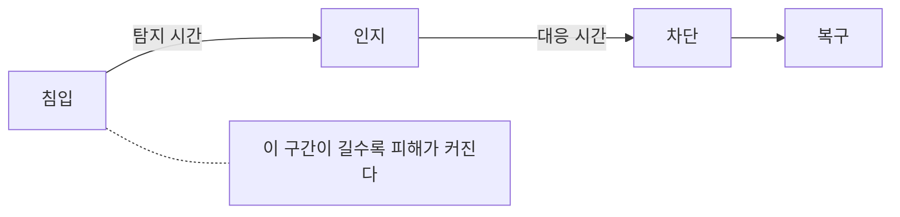

# 2.3 탐지와 대응

> 읽는 길: 경영진은 「72시간」과 「이사회가 물어야 할 것」을 보십시오.

> **오늘의 질문** — 지금 침입이 일어나고 있다면, 우리는 몇 시간 뒤에 압니까.

## 두 개의 시계

사고가 나면 두 개의 시계가 돕니다.

첫 번째는 **공격자의 시계**입니다. 들어온 순간부터 돕니다.
시간이 갈수록 공격자가 얻는 것이 늘어납니다.

두 번째는 **방어자의 시계**입니다. 알아챈 순간부터 돕니다.
시간이 갈수록 피해가 커지고 법적 의무의 기한이 다가옵니다.

둘 사이의 간격이 이 장의 주제입니다. 간격이 짧으면 사고가 사건이 되지 않습니다.
길면 숫자가 자릿수를 바꿉니다.

통신사 사건에서 최초 감염은 2021년 8월, 결정적 유출은 2025년 4월이었습니다(✅ F-020).
그 사이 3년 8개월 동안 공격자의 시계만 돌았습니다.

## 재지 않으면 좋아지지 않습니다

보안에서 가장 흔한 실패는 **아무것도 재지 않는 것**입니다.
막은 횟수는 셀 수 없고, 안전함은 증명할 수 없습니다.
그래서 보안 보고가 "열심히 하고 있습니다"로 끝납니다.

잴 수 있는 숫자는 있습니다. 네 개면 충분합니다.

| 지표 | 무엇을 | 왜 |
|---|---|---|
| 노출 자산 수 | 외부에서 닿는 자산 개수 | 공격면의 크기 |
| 점검 커버리지 | 전체 자산 중 점검 대상 비율 | 사각지대의 크기 |
| 패치 소요 시간 | 패치 공개부터 적용까지 | 운영 성숙도 |
| 탐지와 격리 시간 | 침입부터 인지, 인지부터 차단까지 | 피해 크기를 직접 정함 |

네 숫자 모두 처음에는 "모른다"입니다. **모른다를 숫자로 바꾸는 것이 1년 차 목표**입니다.
숫자가 좋아지는 것은 2년 차 목표입니다.

**재야 하는 시계가 둘입니다**

<figure class="shot">
  
  <figcaption>미국 국가안보국의 보안 관제실. 화면이 많다고 빨리 알아채는 것은 아닙니다. 재는 것이 먼저입니다. 사진 Unknown photographer, 퍼블릭 도메인</figcaption>
</figure>

## 무엇을 보면 알아챌 수 있나

탐지는 장비가 아니라 질문에서 시작합니다. 아래 다섯 가지는 비싼 도구 없이
볼 수 있고, 4부의 사건들에서 실제로 신호가 있었던 자리입니다.

**업무 시간 밖의 관리자 활동.** 새벽 3시에 권한이 바뀌었다면 묻습니다.

**평소 안 쓰던 경로의 로그인.** 처음 보는 나라, 처음 보는 기기, 처음 보는 시간대입니다.

**조회량의 급증.** 한 계정이 평소의 백 배를 조회하면 사람이 하는 일이 아닙니다.
신한은행 사건에서 공격자는 여섯 개 서비스를 집중 조회했습니다(⚠️ F-006).
집중 조회는 패턴으로 보입니다.

**바깥으로 나가는 큰 전송.** 들어오는 것보다 나가는 것을 봅니다.
롯데카드 사건에서 유출 데이터는 약 200GB 였습니다(✅ F-031).
200GB 가 나가는 동안 아무 알림도 울리지 않았다면 그 자리가 비어 있는 것입니다.

**실패한 로그인의 패턴.** 한 계정에 여러 번이 아니라,
여러 계정에 한 번씩 시도하는 쪽이 더 위험합니다. 잠금 정책에 안 걸리기 때문입니다.

다섯 가지 중 하나라도 지금 못 본다면, 도구를 사기 전에 그것부터 봅니다.

## 72시간

2026년 9월 11일 시행된 개정 개인정보 보호법에서 가장 실무적인 변화가
**유출 가능성 통지**입니다(✅ F-090).

기존에는 유출이 확인되면 통지했습니다. 개정 후에는 불법 시스템 접근이나
개인정보 불법 거래 등 객관적 정황이 있을 때, 그 사유를 알게 된 때부터
**72시간 이내**에 통지해야 합니다. 시행령 제39조의2 제1항이 대상을 정하고
제39조의3 제1항이 기한을 정합니다(✅ F-092).

72시간 안에 유출이 확정되면 확정 통지로 갈음하고 두 번 보내지 않습니다.
반대로 유출이 없던 것으로 확인되면 그 사실을 즉시 통지합니다(✅ F-092).

실무에서 이 조항이 바꾸는 것은 하나입니다. **조사 결과를 기다릴 수 없습니다.**
예전에는 "확실해지면 알리자"가 가능했습니다. 이제는 정황 단계에서 시계가 돕니다.

롯데카드 사건에서 8월 14일 발생한 사고의 공식 발표는 9월 18일이었습니다.
35일이 걸렸고, 신고 이후에도 보름 넘게 홈페이지에 유출이 없다는 공지가 떠 있었습니다
(✅ F-032). 현행 기준으로는 성립하기 어려운 대응입니다.

<!-- [장면 필요] 새벽에 알림을 받고 대응해 본 경험.
     그때 가장 오래 걸린 일이 무엇이었는지.
     아래 표의 "결정권자를 찾는 일"을 숫자와 장면으로 뒷받침하는 자리다. -->

## 사고 대응 절차에 반드시 있어야 하는 것

사고 당일에 가장 오래 걸리는 일은 기술 조치가 아닙니다.
**누가 결정하는지 찾는 일**입니다.

| 시점 | 정해 둬야 할 것 |
|---|---|
| 0분 | 누구에게 먼저 연락하는가. 전화번호가 적혀 있는가 |
| 30분 | 서비스를 내릴 권한이 누구에게 있는가 |
| 2시간 | 외부 도움(포렌식, 법무)을 부를 기준은 무엇인가 |
| 12시간 | 72시간 통지 대상인지 누가 판단하는가 |
| 24시간 | 고객과 언론에 누가 무엇을 말하는가 |
| 72시간 | 통지 발송. 누가 보내고 누가 검토하는가 |

이 표가 문서로 없으면 사고 당일에 전부 즉석에서 정하게 됩니다.
그 과정에서 가장 많이 잃는 것이 시간이고, 두 번째로 많이 잃는 것이 증거입니다.

## 증거를 지키는 일

조사가 시작되면 증거가 필요합니다. 그런데 초기 대응이 증거를 지웁니다.
감염된 서버를 재부팅하거나 밀어 버리면 메모리와 흔적이 사라집니다.

통신사 조사에서는 자료 보전 명령을 받고도 서버 두 대를 포렌식 분석이 불가능한
상태로 제출한 점이 지적됐습니다(✅ F-022). 악의가 아니라 서두른 복구였을 수 있지만
결과는 같습니다.

**절차에 "보전 먼저, 복구 나중"을 한 줄로 박아 둡니다.**
격리는 하되 지우지 않습니다. 디스크 이미지를 먼저 뜹니다.
급할수록 이 순서가 흔들리므로 문서가 필요합니다.

## 이사회가 물어야 할 것

경영진이 보안을 챙긴다는 것은 예산을 늘리는 일이 아니라
**숫자를 묻는 일**입니다. 세 가지면 충분합니다.

1. 점검 대상이 아닌 시스템이 몇 개입니까. 작년보다 줄었습니까.
2. 지난 사고에서 침입부터 인지까지 몇 시간이었습니까.
3. 72시간 통지 판단을 누가 합니까. 그 사람이 지금 연락됩니까.

세 질문에 숫자로 답이 나오지 않으면 그 조직은 아직 재고 있지 않은 것입니다.

개정법은 CPO 를 지정하고 변경하고 해제할 때 이사회 의결과
개인정보보호위원회 신고를 의무로 두었습니다. 대상 기준의 매출액 요건은
1,500억 원 이상에서 1,800억 원 초과로 상향됐습니다(✅ F-093).
보안이 이사회 안건이 됐다는 뜻입니다.

> ### 금융권 사건에 적용하면
>
> 국민은행에 대한 비정상 접속은 약 43시간 이어졌습니다(⚠️ F-005).
> 43시간은 길어 보입니다. 그런데 통신사 사건의 3년 8개월과 비교하면 짧습니다.
>
> 더 눈에 띄는 것은 우리은행과 농협은행입니다. 같은 공격을 받았는데
> 침입 방지 시스템이 작동해 유출이 없었습니다(⚠️ F-003).
>
> **같은 날 같은 공격을 받고 결과가 갈렸습니다.** 운이 아니라 준비의 차이입니다.
> 사후에 "우리는 왜 막았나"를 분석한 조직이 다음에도 막습니다.

## 우리 조직 적용표

| 지금 가능 | 3개월 내 | 투자 필요 |
|---|---|---|
| 네 지표의 현재 값 적기 | 사고 대응 연락망 문서화 | 로그 중앙 수집 체계 |
| 72시간 판단 담당자 지정 | 다섯 가지 탐지 질문 알림 설정 | 이상 행동 탐지 도구 |
| "보전 먼저" 절차 한 줄 추가 | 모의훈련 1회 | 외부 포렌식 계약 |
| 이사회 질문 3개 전달 | 통지 문안 초안 준비 | 24시간 모니터링 |

## 체크리스트

- [ ] 네 지표의 현재 값을 숫자로 안다
- [ ] 다섯 가지 탐지 질문 중 못 보는 것이 없다
- [ ] 바깥으로 나가는 대용량 전송에 알림이 걸려 있다
- [ ] 72시간 통지 대상 여부를 판단할 사람이 지정되어 있다
- [ ] 사고 대응 연락망이 문서에 있고 전화번호가 최신이다
- [ ] "보전 먼저, 복구 나중"이 절차에 적혀 있다
- [ ] 최근 1년 내 모의훈련을 했다
- [ ] 통지 문안 초안이 미리 준비되어 있다

## 이해 점검

1. 공격자의 시계와 방어자의 시계는 각각 언제부터 돕니까.
2. 네 가지 지표 중 피해 크기를 가장 직접 정하는 것은 무엇입니까.
3. 여러 계정에 한 번씩 로그인을 시도하는 것이 더 위험한 이유는 무엇입니까.
4. 유출 가능성 72시간 통지가 실무를 바꾸는 지점은 무엇입니까.
5. 초기 대응에서 "보전 먼저"가 필요한 이유는 무엇입니까.

## 스터디 가이드 (60분)

- **읽기 10분** — 각자 읽습니다
- **실습 25분** — 모의 상황을 돌립니다. "방금 외부 보안업체에서 우리 데이터가
  판매되고 있다는 연락이 왔습니다." 72시간 시계가 돕니다.
  누가 무엇을 하는지 순서대로 적습니다
- **점검 20분** — 적은 순서에서 담당자가 비어 있는 칸을 찾습니다
- **정리 5분** — 연락망 문서의 담당자를 정합니다

---

## 개념 확인

**Q.** 탐지와 대응에서 반드시 재야 하는 두 개의 시간은 무엇입니까. (주관식)

답 보기

**침입부터 인지까지**와 **인지부터 차단까지**입니다.
앞의 것이 탐지 시간이고 뒤의 것이 대응 시간입니다.
재지 않는 조직은 좋아지는지도 모릅니다.

## 한 줄 요약

침입 시점이 아니라 발견 시점이 피해를 정하고, 재지 않는 조직은 발견도 못 합니다.

---

**출처**

사실마다 근거를 직접 열어 볼 수 있게 링크를 답니다.
확인 날짜와 원문 요지는 [`research/facts.yaml`](../research/facts.yaml) 에 있습니다.

| 사실 | 확인 | 근거를 직접 보기 |
|---|---|---|
| `F-003` | ⚠️ | [newspim.com](https://www.newspim.com/news/view/20261002001278) — 2차 |
| `F-005` | ⚠️ | [seoul.co.kr](https://www.seoul.co.kr/news/economy/2026/10/04/20261004500025) — 2차(의원실 자료 인용) |
| `F-006` | ⚠️ | [busan.com](https://www.busan.com/view/busan/view.php?code=2026100418075759253) — 2차 |
| `F-020` | ✅ | [news.nate.com](https://news.nate.com/view/20250704n26170?mid=n0100) — 2차(과기정통부 발표 인용) |
| `F-022` | ✅ | [news.nate.com](https://news.nate.com/view/20250704n26170?mid=n0100) — 2차(과기정통부 발표 인용) |
| `F-031` | ✅ | [dailysecu.com](https://www.dailysecu.com/news/articleView.html?idxno=200655) — 2차 |
| `F-032` | ✅ | [khan.co.kr](https://www.khan.co.kr/article/202509181346001) — 2차 |
| `F-090` | ✅ | [lawtimes.co.kr](https://www.lawtimes.co.kr/news/articleView.html?idxno=226491) — 2차(로펌 브리핑) |
| `F-092` | ✅ | [datalaw.kr](https://datalaw.kr/posts/pipa-2026-amendment-comparison/) — 2차(신구조문 대조) |
| `F-093` | ✅ | [lawtimes.co.kr](https://www.lawtimes.co.kr/news/articleView.html?idxno=226491) — 2차 |
