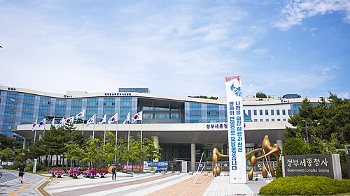
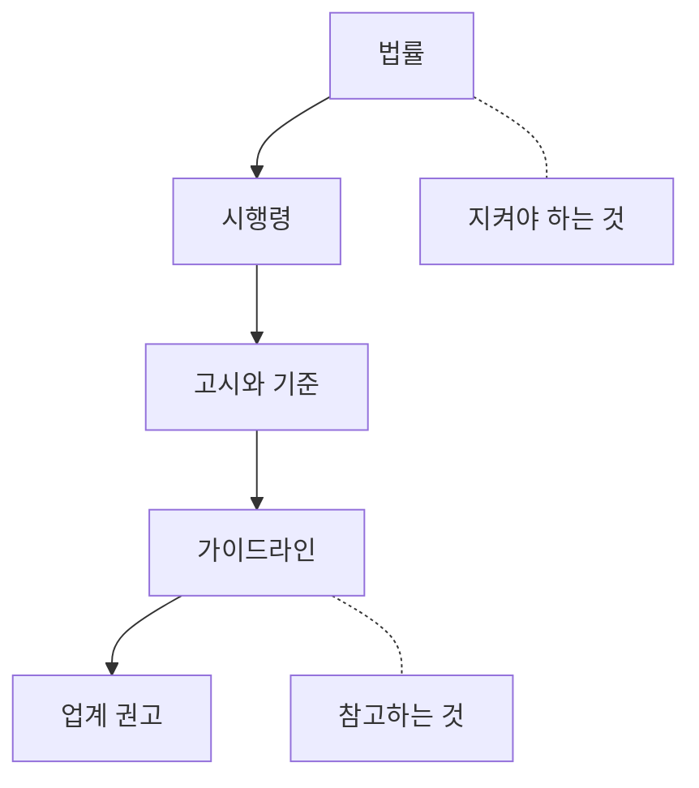

# 2.4 국내 지침 지도

> 읽는 길: 이 장은 읽는 장이 아니라 **찾아보는 장**입니다. 북마크 카드 형식으로 썼습니다.

> **오늘의 질문** — 우리에게 의무인 것과 권고인 것을 구분할 수 있습니까.

## 층이 다섯입니다

보안 담당자가 가장 자주 하는 착각은 모든 지침을 같은 무게로 보는 것입니다.
법과 안내서는 무게가 다릅니다. 안 지켰을 때 일어나는 일이 다릅니다.

| 층 | 무엇 | 안 지키면 | 어디서 보나 |
|---|---|---|---|
| 법률 | 국회가 만든다 | 형사처벌, 과징금 | [국가법령정보센터](https://www.law.go.kr/) |
| 시행령 | 대통령령 | 법률과 같다 | [국가법령정보센터](https://www.law.go.kr/) |
| 고시 | 위원회나 부처가 정한다 | 과태료, 시정명령 | [국가법령정보센터 행정규칙](https://www.law.go.kr/LSW/admRulLsInfoP.do) |
| 안내서와 해설서 | 기관이 낸다 | 직접 제재는 없다 | [개인정보보호위원회](https://www.pipc.go.kr/), [KISA](https://www.kisa.or.kr/) |
| 인증 | ISMS-P 등 | 의무 대상이면 과태료 | [ISMS-P](https://isms.kisa.or.kr/) |

네 번째 줄이 중요합니다. 안내서는 **법이 아닙니다.** 다만 조사받을 때
"안내서대로 했는가"가 판단 재료가 됩니다. 그래서 무시해도 되는 것도 아닙니다.

**의무와 권고를 구분하지 못하면 둘 다 제대로 못 합니다.**
의무를 권고로 알면 제재를 맞고, 권고를 의무로 알면 쓸 데 없는 데 예산을 씁니다.

<figure class="shot">
  
  <figcaption>정부세종청사. 법률과 시행령과 고시가 여기서 나옵니다. 층마다 구속력이 다릅니다. 사진 *Youngjin, <a href="https://creativecommons.org/licenses/by-sa/3.0">CC BY-SA 3.0</a></figcaption>
</figure>

## 북마크 카드 — 개정 개인정보 보호법

> **정식 명칭** 개인정보 보호법 (법률 제21445호)
> **공포** 2026-03-10, **시행** 2026-09-11
> **시행령** 대통령령 제36671호, 같은 날 시행
> **원문** [국가법령정보센터](https://www.law.go.kr/)
> **검증** ✅ F-090, 확인일 2026-10-05
> **읽는 법** 아래 조문 번호는 신구조문 대조 자료 기준입니다.
> **인용해서 쓰실 때는 국가법령정보센터 원문과 한 번 대조하십시오.**
> 조문 번호는 개정으로 밀립니다.

2026년 기준으로 가장 큰 변화입니다. 네 가지만 기억하면 됩니다.

### 1. 징벌적 과징금, 전체 매출액의 최대 10%

징벌적 과징금의 상한이 **전체 매출액의 10%** 입니다(⚠️ F-091).
고의나 중과실, 위반의 반복, 대규모 피해 같은 사정이 요건으로 거론됩니다.

다만 요건이 까다로워 **대부분의 사업자에게는 해당하지 않는다는 지적**도
함께 나옵니다(⚠️ F-091).

> **여기서 이 책은 멈춥니다.**
>
> 요건이 몇 개이고 어떻게 결합되는지, 우리 조직이 거기 해당하는지는
> **독자가 판단할 영역으로 남깁니다.** 이 책이 본 자료는 로펌 브리핑이고,
> 조문 원문이 아닙니다. 조문을 옮겨 적어 드리는 것보다
> **어디를 봐야 하는지 알려 드리는 쪽**이 정확합니다.
>
> 상한이 전체 매출액의 10% 라는 것과, 조건이 까다로워 대부분의 사업자에게는
> 해당하지 않는다는 지적이 있다는 것까지만 이 책에서 가져가십시오.
> **그 이상은 법률 제21445호 원문과 전문가 확인의 영역입니다.**

기억할 것은 **산정 기준이 전체 매출액**이라는 점입니다. 자릿수를 정하는 것은
요율이 아니라 기준입니다.

### 2. 투자하면 깎아 줍니다

개인정보 보호를 위한 투자 시 과징금 감경 제도가 신설됐습니다(⚠️ F-091).

**감경 폭은 이 책에 적지 않습니다.** 수치가 단일 출처이고,
조문상 수치인지 해설자의 표현인지 확인하지 못했습니다.
폭이 궁금하면 시행령의 과징금 부과기준과
[개인정보보호위원회](https://www.pipc.go.kr/) 고시를 보십시오.

실무적으로 이 조항은 예산 승인 논리로 쓸 수 있습니다.
보안 투자를 비용이 아니라 **과징금 감경 요건**으로 설명하면 회의가 짧아집니다.
폭을 몰라도 "감경 제도가 있다"는 것만으로 논리가 섭니다.

### 3. 유출 가능성 72시간 통지

가장 실무를 바꾸는 조항입니다. 불법 시스템 접근이나 개인정보 불법 거래 등
객관적 정황이 있을 때(시행령 제39조의2 제1항), 사유를 알게 된 때부터
72시간 이내에 서면등의 방법으로 통지해야 합니다(시행령 제39조의3 제1항).

72시간 내 유출이 확정되면 법 제34조 제1항의 확정 통지로 갈음하고,
유출이 없던 것으로 확인되면 그 사실을 즉시 통지합니다(✅ F-092).

### 4. CPO 이사회 의결과 신고

일정 규모 이상 처리자는 CPO 를 지정, 변경, 해제할 때 이사회 의결과
개인정보보호위원회 신고를 해야 합니다. 매출액 요건이 1,500억 원 이상에서
**1,800억 원 초과**로 상향됐습니다. 나머지 요건은 같습니다. 민감정보나
고유식별정보 5만 명, 개인정보 100만 명, 재학생 2만 명 이상 대학,
상급종합병원, 공공시스템운영기관입니다(✅ F-093).

**층이 다섯이고 의무와 권고가 섞여 있습니다**

## 북마크 카드 — ISMS-P 인증 의무화

> **무엇** 일정 규모 이상 개인정보처리자의 ISMS-P 인증 의무화
> **시행 예정** 2027년 7월
> **검증** ⚠️ F-094, 확인일 2026-10-05
> **읽는 법** 시행 예정일은 보도 기준입니다.
> **대상 범위는 이 책에 적지 않습니다.** 독자가 직접 확인할 영역입니다.

2027년 7월 시행 예정으로 보도되고 있습니다(⚠️ F-094).

**우리 조직이 대상인지는 이 책이 답할 수 없습니다.** 매출이나 이용자 수 같은
기준은 확정 과정에서 바뀌고, 해당 여부 판단은 조직마다 다릅니다.
[개인정보보호위원회](https://www.pipc.go.kr/) 와
[KISA ISMS-P](https://isms.kisa.or.kr/) 의 공식 안내에서 직접 확인하십시오.

이 책이 드릴 수 있는 것은 **시간 감각**입니다. 인증 준비는 짧게 잡아도 반년입니다.
대상에 들어갈 가능성이 있다면, 범위가 확정되고 나서 시작하면 늦습니다.
**지금 할 일은 준비가 아니라 해당 여부 확인입니다.**

## 이름만 적고 넘어가는 것

아래는 **이 책의 범위 밖**입니다. 이름과 찾을 곳만 적습니다.
해당 여부와 조문 해석은 독자와 전문가의 영역입니다.

| 무엇 | 언제 봐야 하나 | 어디서 |
|---|---|---|
| 개인정보의 안전성 확보조치 기준 | 개인정보를 처리하면 **거의 항상** | [국가법령정보센터 행정규칙](https://www.law.go.kr/LSW/admRulLsInfoP.do) |
| 정보통신망법 | 정보통신서비스 제공자면 | [국가법령정보센터](https://www.law.go.kr/) |
| 전자금융거래법, 전자금융감독규정 | 금융업이면 | [금융위원회](https://www.fsc.go.kr/), [국가법령정보센터](https://www.law.go.kr/) |
| 신용정보법 | 신용정보를 다루면 | [국가법령정보센터](https://www.law.go.kr/) |
| 정보통신기반보호법 | 주요정보통신기반시설로 지정됐으면 | [국가법령정보센터](https://www.law.go.kr/) |
| AI 기본법 | AI 를 만들거나 쓰면 | [국가법령정보센터](https://www.law.go.kr/) |
| CSAP | 공공에 클라우드를 공급하면 | [KISA 클라우드보안인증](https://isms.kisa.or.kr/main/csap/intro/) |

**첫 줄이 가장 중요합니다.** 개인정보를 처리하는 거의 모든 조직에 적용되는데,
개정 시행일이 자료마다 **2026-10-30 과 10-31 로 갈립니다.**
이 책은 어느 쪽인지 적지 않습니다. **고시 부칙을 직접 보십시오.**
접속기록 점검 주기 완화가 이 날짜에 걸려 있어서, 하루 차이가 위반 여부를 가릅니다.

전부 다루면 이 장이 두 배가 되고, 그래도 각 조직의 해당 여부는 답이 안 나옵니다.
**법령 지도는 지도까지가 책의 몫입니다.**

이 책은 확인하지 못한 것을 적지 않습니다. **틀린 조문은 틀린 대책을 부릅니다.**
그래서 다음 절에 **스스로 확인하는 절차**를 적어 두었습니다.
이 장이 낡아도 그 절차는 삽니다.

## 스스로 확인하는 법

이 장이 낡아도 쓸 수 있게, 확인하는 절차를 적어 둡니다.

**1단계. 정식 명칭을 찾습니다.** 줄임말로 검색하면 블로그가 나옵니다.
정식 명칭으로 [국가법령정보센터](https://www.law.go.kr/) 에서 찾습니다.
고시와 훈령은 본문이 아니라 [행정규칙](https://www.law.go.kr/LSW/admRulLsInfoP.do) 쪽입니다.

**2단계. 시행일을 봅니다.** 공포일과 시행일은 다릅니다.
개정안이 공포됐어도 시행 전이면 지금 의무가 아닙니다.
반대로 시행일이 지났는데 모르고 있으면 이미 위반입니다.

**3단계. 부칙을 읽습니다.** 본문보다 부칙에 중요한 것이 많습니다.
어느 조항이 언제부터 적용되는지, 유예 기간이 있는지가 부칙에 있습니다.
시행일이 자료마다 다른 경우는 대개 부칙을 안 읽어서 생깁니다.

**4단계. 조문 번호를 적어 둡니다.** "개인정보 보호법에 따르면"은 근거가 아닙니다.
"법 제34조 제1항"이 근거입니다. 나중에 다시 확인할 때도 조문 번호가 있어야 빠릅니다.

**5단계. 확인 날짜를 남깁니다.** 법은 바뀝니다. 확인 날짜가 없는 메모는
6개월 뒤에 믿을 수 없습니다.

## 조직에서 쓰는 법

법령 지도는 보안팀만 보면 소용이 없습니다. 아래 세 자리에 붙여야 작동합니다.

**사고 대응 절차에.** 72시간 통지 판단을 누가 하는지 적습니다.
사고 당일에 법을 찾아보면 늦습니다.

**예산 요청서에.** 투자 감경 조항과 과징금 상한을 함께 씁니다.
보안 투자를 비용이 아니라 위험 조정으로 설명하는 근거가 됩니다.

**계약서에.** 외주와 협력사 계약에 안전조치 의무와 사고 통지 의무를 넣습니다.
사고가 협력사에서 나도 책임은 함께 옵니다.

> ### 금융권 사건에 적용하면
>
> 2026년 사건에서 공격이 집중된 직원용 업무지원 시스템은
> 당국 점검 대상에서 빠져 금융사 자체 점검에 맡겨져 있었습니다(✅ F-004).
>
> 법령 준수와 실제 안전이 갈리는 지점이 여기입니다.
> **점검 대상 목록은 최소선이지 전부가 아닙니다.** 규제 대상만 점검하면
> 규제가 보지 않는 곳이 입구가 됩니다.
>
> 규제를 지키는 일과 안전해지는 일은 겹치지만 같지 않습니다.
> 이 장은 전자를, 나머지 장은 후자를 다룹니다.

## 우리 조직 적용표

| 지금 가능 | 3개월 내 | 투자 필요 |
|---|---|---|
| CPO 대상 요건 해당 여부 확인 | 72시간 통지 절차 문서화 | 개인정보 영향평가 |
| 매출액 1,800억 기준 대조 | ISMS-P 대상 범위 확인 | ISMS-P 인증 준비 |
| 조문 번호 메모 양식 만들기 | 외주 계약서 보안 조항 점검 | 법무 자문 계약 |

## 체크리스트

- [ ] CPO 이사회 의결 대상인지 확인했다
- [ ] 72시간 통지 판단 담당자가 지정되어 있다
- [ ] 통지 대상 정황의 예시가 절차에 적혀 있다
- [ ] ISMS-P 의무화 대상 가능성을 확인했다
- [ ] 보안 투자 요청서에 과징금 감경 조항을 인용했다
- [ ] 외주 계약서에 안전조치와 사고 통지 의무가 있다
- [ ] 법령 메모에 조문 번호와 확인 날짜가 있다

## 이해 점검

1. 안내서와 고시의 차이는 무엇입니까.
2. 과징금 산정 기준이 전체 매출액이라는 점이 왜 자릿수를 정합니까.
   그리고 이 책이 적용 요건을 적지 않고 멈춘 이유는 무엇입니까.
3. 유출 가능성 통지와 확정 통지는 어떻게 이어집니까.
4. 법령을 확인할 때 부칙을 읽어야 하는 이유는 무엇입니까.
5. 규제 대상 점검만으로 부족한 이유를 2026년 사건으로 설명해 보십시오.

## 스터디 가이드 (60분)

- **읽기 10분** — 각자 읽습니다
- **실습 25분** — [국가법령정보센터](https://www.law.go.kr/) 에서 개인정보 보호법 제34조를 직접 찾아
  조문 번호와 시행일을 적어 봅니다. 이 장의 내용과 맞는지 대조합니다
- **토론 20분** — 우리 조직이 CPO 이사회 의결 대상인지 함께 판단합니다
- **정리 5분** — 확인하지 못한 항목을 목록으로 남깁니다

---

## 개념 확인

**Q.** 이 책이 북마크 카드로 정리한 유출 통지 기한은 얼마입니까.

1. 24시간
2. 48시간
3. 72시간
4. 7일

답 보기

**3번 72시간.** 기준은 유출이 확정된 때가 아니라
**유출 가능성을 알게 된 때**입니다.
다만 우리 조직에 해당되는지와 예외는 조문 원문으로 직접 확인하십시오.

## 한 줄 요약

의무와 권고를 구분하고, 조문 번호와 시행일과 확인 날짜를 함께 적습니다.

---

> **면책** 이 장은 법령을 찾아가는 안내이지 법률 자문이 아닙니다.
> 실제 판단은 원문을 확인하고 전문가의 검토를 받으십시오.

**출처**

사실마다 근거를 직접 열어 볼 수 있게 링크를 답니다.
확인 날짜와 원문 요지는 [`research/facts.yaml`](../research/facts.yaml) 에 있습니다.

| 사실 | 확인 | 근거를 직접 보기 |
|---|---|---|
| `F-004` | ✅ | [newspim.com](https://www.newspim.com/news/view/20261002001278) — 2차 |
| `F-090` | ✅ | [lawtimes.co.kr](https://www.lawtimes.co.kr/news/articleView.html?idxno=226491) — 2차(로펌 브리핑) |
| `F-091` | ⚠️ | [lawtimes.co.kr](https://www.lawtimes.co.kr/news/articleView.html?idxno=226491) — 2차 |
| `F-092` | ✅ | [datalaw.kr](https://datalaw.kr/posts/pipa-2026-amendment-comparison/) — 2차(신구조문 대조) |
| `F-093` | ✅ | [lawtimes.co.kr](https://www.lawtimes.co.kr/news/articleView.html?idxno=226491) — 2차 |
| `F-094` | ⚠️ | [lawtimes.co.kr](https://www.lawtimes.co.kr/news/articleView.html?idxno=226491) — 2차 |
