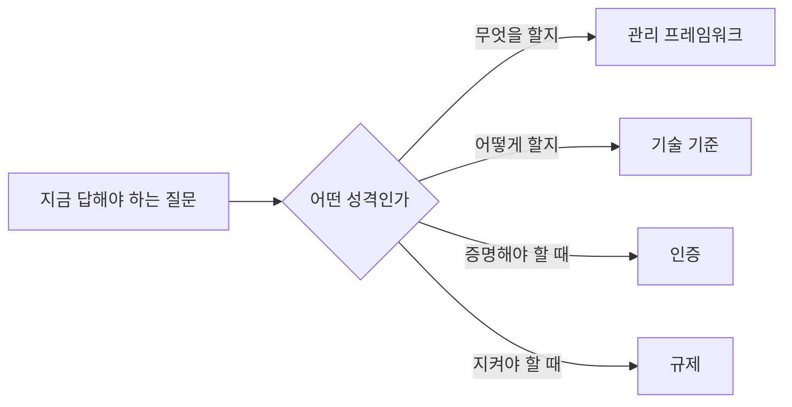

# 2.5 해외 프레임워크

> 읽는 길: 「무엇을 언제 쓰나」 표 하나만 봐도 됩니다.

> **오늘의 질문** — 우리가 지금 참고하는 프레임워크를 왜 그것으로 골랐습니까.

## 버전을 적지 않은 이유

이 장에는 버전 번호와 개정 연도가 거의 없습니다. 일부러 뺐습니다.

표준 문서의 버전은 자주 바뀌고, 2차 자료는 자주 틀립니다.
틀린 버전을 적어 두면 독자가 그것을 근거로 인용하게 됩니다.
그래서 **무엇에 쓰는 물건인지와 어디서 확인하는지**만 적었습니다.
버전이 필요하면 각 기관 사이트에서 직접 확인하십시오.

그래서 이 장에는 **"직접 확인하십시오"가 자주 나옵니다.**
떠넘기는 것이 아니라, 버전과 일정은 책이 가질 수 없는 정보이기 때문입니다.
책이 줄 수 있는 것은 **무엇을 왜 고르는가**이고, 그건 버전이 바뀌어도 삽니다.

## 무엇을 언제 쓰나

프레임워크를 고르는 기준은 명성이 아니라 **지금 답해야 하는 질문**입니다.

| 지금 답해야 하는 질문 | 쓸 것 | 어디서 |
|---|---|---|
| 우리 보안이 전체적으로 어느 수준인가 | NIST CSF | [csrc.nist.gov](https://csrc.nist.gov/) |
| 무엇부터 해야 하나, 순서를 달라 | CIS Controls | [cisecurity.org](https://www.cisecurity.org/controls) |
| 통제 항목을 빠짐없이 훑고 싶다 | NIST SP 800-53 | [csrc.nist.gov](https://csrc.nist.gov/) |
| 경계가 없는 환경을 어떻게 설계하나 | NIST SP 800-207 (제로트러스트) | [csrc.nist.gov](https://csrc.nist.gov/pubs/sp/800/207/final) |
| 고객이나 투자자에게 증명해야 한다 | ISO/IEC 27001 | [iso.org](https://www.iso.org/standard/27001) |
| AI 를 다루는 체계를 증명해야 한다 | ISO/IEC 42001 | [iso.org](https://www.iso.org/standard/42001) |
| 카드 결제를 다룬다 | PCI DSS | [pcisecuritystandards.org](https://www.pcisecuritystandards.org/) |
| 공격자가 실제로 뭘 하는지 알고 싶다 | MITRE ATT&CK | [attack.mitre.org](https://attack.mitre.org/) |
| AI 시스템에 대한 공격을 알고 싶다 | MITRE ATLAS | [atlas.mitre.org](https://atlas.mitre.org/) |
| AI 위험을 관리 체계로 다루고 싶다 | NIST AI RMF | [nist.gov](https://www.nist.gov/itl/ai-risk-management-framework) |
| 웹 애플리케이션 취약점을 훑고 싶다 | OWASP Top 10 | [owasp.org](https://owasp.org/www-project-top-ten/) |
| LLM 애플리케이션 위험을 보고 싶다 | OWASP Top 10 for LLM | [genai.owasp.org](https://genai.owasp.org/) |
| 에이전트 위험을 보고 싶다 | OWASP Top 10 for Agentic | [genai.owasp.org](https://genai.owasp.org/) |

**하나만 고르라면 CIS Controls 입니다.** 순서가 매겨져 있기 때문입니다.
다른 프레임워크는 "무엇을 해야 한다"를 알려 주고, CIS 는 "무엇부터"를 알려 줍니다.
자원이 적은 조직에는 순서가 목록보다 값집니다.

**프레임워크는 답이 아니라 질문 목록입니다**

<figure class="shot">
  
  <figcaption>미국 국립표준기술연구소(NIST). 이 책이 가장 자주 가리키는 곳입니다.
  제로 트러스트 아키텍처(SP 800-207)와 양자내성암호 표준이 여기서 나옵니다.
  사진 Owenusa, 퍼블릭 도메인</figcaption>
</figure>

## 네 가지 성격

위 목록은 섞여 있습니다. 성격이 다른 것을 같은 선반에 두면 헷갈립니다.

**관리 체계** — ISO/IEC 27001, NIST CSF, ISO/IEC 42001.
무엇을 갖춰야 하는지를 조직 차원에서 정합니다. 인증과 연결됩니다.

**통제 목록** — NIST SP 800-53, CIS Controls, PCI DSS.
구체적인 항목 단위로 "이걸 해라"를 줍니다. 실무에 바로 씁니다.

**위협 지식** — MITRE ATT&CK, ATLAS, OWASP Top 10 계열.
공격자가 무엇을 하는지 정리한 것입니다. 탐지 설계와 훈련에 씁니다.

**설계 원칙** — NIST SP 800-207.
어떻게 만들 것인가에 대한 생각의 틀입니다. 바로 적용할 항목은 적습니다.

네 가지를 섞어 쓰는 것은 괜찮습니다. **같은 역할로 두 개를 쓰는 것**이 문제입니다.
관리 체계를 둘 돌리면 문서 작업이 두 배가 되고 얻는 것은 같습니다.

## 에이전트 보안 목록

2025년 12월에 공개된 OWASP Top 10 for Agentic Applications 2026 은
에이전트를 쓰는 조직이라면 한 번은 훑어야 하는 목록입니다.
100명 넘는 전문가가 참여했고 공개 동료 검토를 거쳤습니다(⚠️ F-074).

| ID | 위험 |
|---|---|
| ASI01 | 에이전트 목표 탈취 |
| ASI02 | 도구 오용 |
| ASI03 | 신원과 권한 남용 |
| ASI04 | 에이전트 공급망 |
| ASI05 | 예기치 않은 코드 실행 |
| ASI06 | 메모리와 컨텍스트 오염 |
| ASI07 | 안전하지 않은 에이전트 간 통신 |
| ASI08 | 연쇄 실패 |
| ASI09 | 인간과 에이전트 사이 신뢰 악용 |
| ASI10 | 악성 에이전트 |

1.4 에서 본 개념들과 거의 그대로 겹칩니다. 목록을 외울 필요는 없고,
**에이전트를 새로 붙일 때 열 줄짜리 점검표로** 쓰면 됩니다.

문서가 인용한 사례 중 EchoLeak 이 가장 선명합니다.
제로클릭 간접 프롬프트 인젝션으로, 조작된 메일 한 통이 사용자 조작 없이
기밀 메일과 파일의 유출을 유발했습니다(⚠️ F-075).

## 유럽 규제

EU 규제는 한국 기업에도 적용될 수 있습니다. 유럽에 서비스하거나
유럽 고객 데이터를 다루면 범위에 들어갑니다.

| 무엇 | 누구에게 | 핵심 |
|---|---|---|
| [GDPR](https://eur-lex.europa.eu/eli/reg/2016/679/oj) | 유럽 개인데이터를 다루는 모두 | 개인정보 처리 전반 |
| [NIS2](https://eur-lex.europa.eu/eli/dir/2022/2555/oj) | 주요 산업 사업자 | 사고 보고와 경영진 책임 |
| [DORA](https://eur-lex.europa.eu/eli/reg/2022/2554/oj) | 금융 부문 | 운영 복원력, 제3자 위험 |
| [CRA](https://digital-strategy.ec.europa.eu/en/policies/cyber-resilience-act) | 디지털 제품 제조와 공급 | 제품 보안과 취약점 보고 |
| [AI Act](https://eur-lex.europa.eu/eli/reg/2024/1689/oj) | AI 시스템 제공과 이용 | 위험 등급별 의무 |

**다섯 가지 모두 적용 일정과 단계가 자주 바뀌었습니다.**
이 책은 날짜를 적지 않습니다. [EUR-Lex](https://eur-lex.europa.eu/) 와
[EU 집행위 Digital Strategy](https://digital-strategy.ec.europa.eu/) 에서 직접 확인하십시오.

**우리 조직이 대상인지도 이 책이 답할 수 없습니다.**
유럽에 서비스하는가, 유럽 거주자의 데이터를 다루는가, 어느 업종인가에 따라
갈리고 그 판단은 법률 자문의 영역입니다.

실무에서 기억할 것은 하나입니다. NIS2 와 DORA 는 **사고 보고 기한**이 핵심이고,
그 기한이 국내법보다 짧을 수 있습니다. 유럽 사업이 있다면
사고 대응 절차에 두 개의 시계를 함께 넣어야 합니다.

## 프레임워크로 하지 말아야 할 것

**문서를 목표로 삼지 않습니다.** 통제 항목을 다 채운 문서는
만드는 데 반년이 걸리고 아무도 다시 안 봅니다. 항목 수가 아니라
실제로 바뀐 설정의 수를 셉니다.

**인증을 안전과 혼동하지 않습니다.** 2025년 통신사 사건에서는
계정 정보를 평문으로 저장해 인증 기준을 위반한 점이 지적됐습니다(✅ F-022).
인증을 받았다는 것은 받은 시점에 서류가 맞았다는 뜻입니다.

**전부 적용하지 않습니다.** NIST SP 800-53 의 통제 항목을 다 적용할 수 있는
조직은 거의 없습니다. 고르는 것이 일입니다. 고르는 기준은
2.1 의 자산 목록과 데이터 등급에서 나옵니다.

> ### 금융권 사건에 적용하면
>
> 2026년 사건의 침투 경로는 프레임워크로 보면 평범합니다.
> 노출된 자산, 점검 사각지대, 과도한 데이터 접근 범위.
> CIS Controls 의 앞쪽 항목에 다 있는 내용입니다.
>
> **프레임워크가 없어서 뚫린 것이 아닙니다.** 프레임워크가 가리키는
> 가장 기본적인 항목이 특정 시스템에 적용되지 않아서 뚫렸습니다.
>
> 새 프레임워크를 도입하기 전에, 지금 쓰는 것의 1번 항목이
> 모든 자산에 적용됐는지부터 봅니다.

## 우리 조직 적용표

| 지금 가능 | 3개월 내 | 투자 필요 |
|---|---|---|
| 지금 쓰는 프레임워크 적기 | CIS Controls 상위 항목 자가평가 | ISO/IEC 27001 인증 |
| 역할 중복 확인 | 에이전트에 ASI 열 줄 점검 적용 | NIST CSF 전사 평가 |
| EU 적용 여부 판단 | ATT&CK 으로 탐지 규칙 한 개 설계 | 외부 성숙도 진단 |

## 체크리스트

- [ ] 지금 참고하는 프레임워크와 그 이유를 한 줄로 쓸 수 있다
- [ ] 같은 역할의 프레임워크를 중복해서 돌리고 있지 않다
- [ ] 버전과 확인 날짜를 메모에 적어 두었다
- [ ] 에이전트를 새로 붙일 때 ASI 열 줄을 점검한다
- [ ] 유럽 규제 적용 여부를 판단했다
- [ ] 인증 보유와 실제 통제 작동 여부를 따로 확인한다

## 이해 점검

1. 프레임워크를 고르는 기준은 무엇입니까.
2. 관리 체계와 통제 목록의 차이는 무엇입니까.
3. 자원이 적은 조직에 CIS Controls 를 먼저 권하는 이유는 무엇입니까.
4. 인증 보유가 안전을 보장하지 못하는 이유를 사례로 설명해 보십시오.
5. 이 장에 버전 번호가 거의 없는 이유는 무엇입니까.

## 스터디 가이드 (60분)

- **읽기 10분** — 각자 읽습니다
- **실습 25분** — 우리 조직이 답해야 하는 질문을 먼저 적고,
  「무엇을 언제 쓰나」 표에서 해당 항목을 고릅니다
- **토론 20분** — 지금 쓰고 있는데 왜 쓰는지 설명 못 하는 것이 있는지 봅니다
- **정리 5분** — 버릴 것 하나와 들일 것 하나를 정합니다

---

## 개념 확인

**Q.** 프레임워크를 고를 때 이 장이 제시한 기준은 무엇입니까.

1. 가장 유명한 것
2. 가장 최신 버전
3. 지금 우리가 답해야 하는 질문
4. 인증을 받기 쉬운 것

답 보기

**3번.** 프레임워크는 답이 아니라 **질문 목록**입니다.
명성으로 고르면 우리 질문과 상관없는 항목을 채우게 됩니다.

## 한 줄 요약

프레임워크는 답이 아니라 질문 목록이고, 고르는 기준은 명성이 아니라 지금 답해야 하는 질문입니다.

---

**출처**

사실마다 근거를 직접 열어 볼 수 있게 링크를 답니다.
확인 날짜와 원문 요지는 [`research/facts.yaml`](../research/facts.yaml) 에 있습니다.

| 사실 | 확인 | 근거를 직접 보기 |
|---|---|---|
| `F-022` | ✅ | [news.nate.com](https://news.nate.com/view/20250704n26170?mid=n0100) — 2차(과기정통부 발표 인용) |
| `F-074` | ⚠️ | [cycode.com](https://cycode.com/blog/owasp-top-10-agentic-applications/) — 2차 |
| `F-075` | ⚠️ | [cycode.com](https://cycode.com/blog/owasp-top-10-agentic-applications/) — 2차 |
