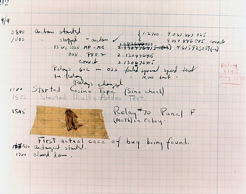
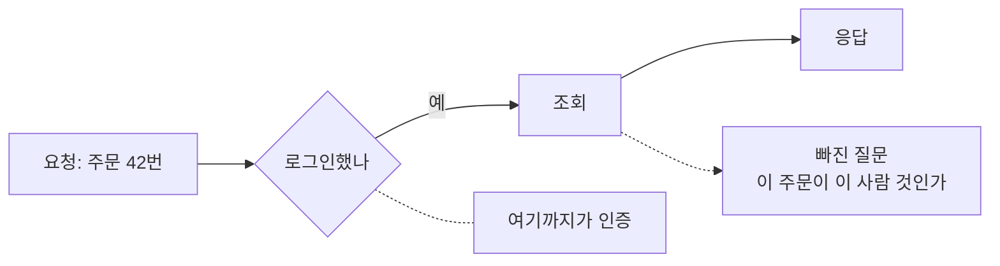

# 3.1 개발자가 놓치기 쉬운 자리

> 읽는 길: 개발자용 장입니다. 다른 분은 「PR 리뷰 질문 20개」만 보셔도 됩니다.

> **오늘의 질문** — 마지막으로 머지한 조회 API 에서 소유자 검증을 어디서 했습니까.

## 새로운 공격이 아니라 오래된 실수

이 장에 나오는 문제들은 전부 10년 넘게 같은 자리에 있었습니다.
그런데도 계속 납니다. 어렵기 때문이 아니라 **눈에 안 띄기 때문**입니다.

기능이 동작하면 코드 리뷰가 통과합니다. 인가 검증이 빠진 코드도 동작합니다.
정상 사용자는 자기 데이터만 요청하니까요. 빠진 것은 테스트에도 안 잡힙니다.
테스트도 정상 경로만 짜기 때문입니다.

그래서 이 장은 **무엇을 추가로 봐야 하는지**의 목록입니다.
아래 코드는 전부 패턴을 보이기 위한 것이고, 공격 입력값은 넣지 않았습니다.

<figure class="shot">
  
  <figcaption>1947년 하버드 Mark II 의 운용 일지. 실제로 끼어 있던 나방을 붙여 두고 <strong>버그를 찾은 첫 사례</strong>라고 적었습니다. 그때도 지금도, 문제는 대개 동작하는 것처럼 보이는 자리에 숨어 있습니다.<br>사진 Courtesy of the Naval Surface Warfare Center,, 퍼블릭 도메인</figcaption>
</figure>

## 1. 인가 검증

가장 흔하고 가장 피해가 큽니다. 로그인은 확인했는데 소유권은 확인하지 않습니다.

```python
# 나쁜 예 — 로그인만 확인한다
@app.get("/orders/{order_id}")
def get_order(order_id: int, user=Depends(current_user)):
    return db.orders.find_one({"id": order_id})
```

```python
# 좋은 예 — 조회 조건에 소유자를 넣는다
@app.get("/orders/{order_id}")
def get_order(order_id: int, user=Depends(current_user)):
    order = db.orders.find_one({"id": order_id, "user_id": user.id})
    if not order:
        raise HTTPException(404)        # 403 이 아니라 404 로 존재 여부를 숨긴다
    return order
```

조회한 뒤에 `if order.user_id != user.id` 로 거르는 방법도 있지만,
**조회 조건에 넣는 쪽**이 낫습니다. 뒤에서 거르는 검사는 빼먹기 쉽고,
로그와 캐시에는 이미 남은 뒤입니다.

관리자 기능에서도 같은 실수가 납니다. "관리자 화면이니까 관리자만 온다"는
가정이 서버에서 다시 확인되지 않으면 주소만 알면 들어갑니다.

**빠진 인가 검증은 정상 흐름에서 드러나지 않습니다**



## 2. 대량 할당

요청으로 받은 객체를 통째로 모델에 넣는 패턴입니다.

```python
# 나쁜 예 — 보낸 필드를 전부 반영한다
def update_profile(user_id, payload: dict):
    db.users.update_one({"id": user_id}, {"$set": payload})
```

```python
# 좋은 예 — 바꿀 수 있는 필드를 명시한다
ALLOWED = {"nickname", "bio", "avatar_url"}

def update_profile(user_id, payload: dict):
    patch = {k: v for k, v in payload.items() if k in ALLOWED}
    db.users.update_one({"id": user_id}, {"$set": patch})
```

허용 목록 방식입니다. 금지 목록으로 짜면 필드가 늘어날 때마다 빠뜨립니다.
`role`, `is_admin`, `balance` 같은 필드가 이 구멍으로 바뀝니다.

## 3. 입력은 검증하고 출력은 변환합니다

둘을 섞으면 둘 다 놓칩니다.

**입력 검증**은 "이 값이 우리 규칙에 맞나"입니다. 길이, 형식, 범위, 허용 목록.
맞지 않으면 거절합니다.

**출력 변환**은 "이 값을 저 맥락에 안전하게 넣나"입니다.
HTML 에 넣을 때, SQL 에 넣을 때, 쉘에 넣을 때, 로그에 넣을 때 방식이 다 다릅니다.

입력에서 특수문자를 지우는 방식으로 출력 문제를 막으려 하면 실패합니다.
맥락이 여러 개인데 입력은 한 번뿐이기 때문입니다.
SQL 은 파라미터 바인딩으로, HTML 은 템플릿 이스케이프로, 각 자리에서 막습니다.

## 4. SSRF

서버가 사용자가 준 주소로 요청을 보내는 기능입니다.
이미지 가져오기, 웹훅 등록, 미리보기 생성에 흔합니다.

```python
# 나쁜 예 — 받은 주소로 그냥 간다
def fetch_preview(url: str):
    return requests.get(url, timeout=3).text
```

```python
# 좋은 예 — 호스트를 허용 목록으로 제한한다
ALLOWED_HOSTS = {"images.example.com", "cdn.example.com"}

def fetch_preview(url: str):
    host = urlparse(url).hostname
    if urlparse(url).scheme != "https" or host not in ALLOWED_HOSTS:
        raise ValueError("허용되지 않은 주소")
    return requests.get(url, timeout=3, allow_redirects=False).text
```

사설 IP 대역을 막는 방식도 쓰이는데, 우회가 많아 허용 목록이 확실합니다.
리다이렉트를 따라가지 않게 하는 것도 중요합니다. 허용된 주소가
다른 곳으로 보낼 수 있기 때문입니다.

**그리고 아웃바운드 통제가 마지막 방어선입니다.** 3.3 에서 다룹니다.

## 5. 실패했을 때 닫힙니까

인증이나 권한 확인이 예외로 실패했을 때 어떻게 되는지를 봅니다.

```python
# 나쁜 예 — 확인에 실패하면 통과시킨다
def has_permission(user, resource):
    try:
        return policy_service.check(user, resource)
    except Exception:
        return True        # 장애 나도 서비스는 되게
```

```python
# 좋은 예 — 확인에 실패하면 막는다
def has_permission(user, resource):
    try:
        return policy_service.check(user, resource)
    except Exception:
        log.error("권한 확인 실패", exc_info=True)
        return False       # 막히는 쪽이 새는 쪽보다 낫다
```

`return True` 는 악의로 쓰지 않습니다. 장애 중에 서비스가 멈추는 것이 싫어서 씁니다.
그런데 권한 서버를 멈추게 만드는 것이 공격의 한 수가 됩니다.

## 6. 비밀이 코드와 로그에 들어갑니다

```python
# 나쁜 예
API_KEY = "sk-live-9f2a..."          # 커밋 기록에 영원히 남는다
log.info("결제 요청", extra={"payload": request_body})   # 카드번호가 찍힌다
```

```python
# 좋은 예
API_KEY = os.environ["PAYMENT_API_KEY"]
log.info("결제 요청", extra={"order_id": order.id, "amount": order.amount})
```

파일에서 지워도 깃 기록에는 남습니다. 이미 커밋했다면
**키를 폐기하고 새로 발급하는 것**이 유일한 조치입니다. 기록을 지우는 것으로는 부족합니다.

로그는 3.5 에서 더 다룹니다. 여기서는 하나만 기억하면 됩니다.
**요청 전체를 찍지 않습니다.** 필요한 필드만 골라 찍습니다.

## 7. 인증 복구 흐름

로그인은 다들 신경 쓰는데 비밀번호 재설정은 그렇지 않습니다.
그런데 공격자는 재설정을 노립니다. 로그인보다 약하기 때문입니다.

- 재설정 토큰이 추측 가능한가. 순번이나 타임스탬프 기반이면 안 됩니다
- 유효 기간이 있는가. 한 번 쓰면 무효가 되는가
- 재설정 후 기존 세션이 전부 끊기는가
- 계정이 존재하는지 알려 주지 않는가. "가입되지 않은 메일입니다"는 정보 제공입니다
- 재설정 요청 횟수에 제한이 있는가

다섯 개 중 **세 번째를 특히 보십시오.** 비밀번호를 바꿨는데
공격자의 세션이 살아 있으면 바꾼 의미가 없습니다.
재설정은 "새 비밀번호를 만드는 일"이 아니라 **"기존 접근을 끊는 일"** 입니다.

## 8. 동시성

같은 요청이 동시에 두 번 오면 어떻게 되는지 봅니다.
쿠폰, 포인트, 재고, 한도 같은 자리에서 사고가 납니다.

```python
# 나쁜 예 — 읽고 판단하고 쓰는 사이에 틈이 있다
coupon = db.get_coupon(code)
if coupon.remaining > 0:
    db.decrement(code)
    issue_reward(user)
```

```python
# 좋은 예 — 조건과 갱신을 한 번에 한다
updated = db.execute(
    "UPDATE coupon SET remaining = remaining - 1 "
    "WHERE code = %s AND remaining > 0", (code,))
if updated == 0:
    raise SoldOut()
issue_reward(user)
```

여기에 **멱등 키**를 함께 둡니다. 같은 요청이 재시도로 두 번 와도
한 번만 처리되게 합니다. 네트워크 재시도는 정상 동작이라서 반드시 옵니다.

## 9. 비즈니스 로직

도구가 못 잡는 영역입니다. 문법적으로 멀쩡한 코드가 업무 규칙을 어깁니다.

- 할인율을 음수로 보내면 금액이 늘어나는가
- 환불을 두 번 요청하면 두 번 나가는가
- 순서를 건너뛰고 마지막 단계를 바로 호출할 수 있는가
- 남의 쿠폰 코드를 내 주문에 붙일 수 있는가
- 수량에 큰 수를 넣으면 넘침이 생기는가

이 질문들은 자동 검사가 못 만듭니다. **업무를 아는 사람이 리뷰에서 물어야** 합니다.
그래서 보안 리뷰에 현업이 한 명 들어가면 효과가 큽니다.

## 10. 의존성

직접 쓴 코드보다 가져다 쓴 코드가 훨씬 많습니다.

- 잠금 파일이 저장소에 있는가. 버전이 고정되는가
- 새 의존성을 추가할 때 사람이 보는 절차가 있는가
- 알려진 취약점 검사가 빌드에 들어가 있는가
- 설치 스크립트가 도는 패키지를 쓰는가

네 번째가 2025년에 크게 문제가 됐습니다. npm 웜이
설치 스크립트로 퍼졌고, 2차 파동에서는 실행 시점이 설치 후에서
설치 전으로 옮겨졌습니다(✅ F-077). 4.10 에서 자세히 봅니다.

## PR 리뷰 질문 20개

리뷰할 때 이 목록을 옆에 둡니다. 전부 묻지 말고 해당하는 것만 묻습니다.

**인가**
1. 이 엔드포인트는 누가 호출할 수 있습니까
2. 소유자 검증이 조회 조건에 들어가 있습니까
3. 관리자 기능이 서버에서 다시 확인됩니까

**입출력**
4. 사용자 입력이 SQL 에 문자열로 붙지 않습니까
5. 화면에 출력할 때 이스케이프됩니까
6. 파일 경로에 사용자 입력이 들어갑니까
7. 받은 객체를 통째로 모델에 넣지 않습니까

**외부 연동**
8. 서버가 사용자가 준 주소로 요청합니까
9. 리다이렉트를 따라갑니까
10. 타임아웃이 설정되어 있습니까

**상태와 실패**
11. 확인에 실패하면 막히는 쪽으로 떨어집니까
12. 동시에 두 번 오면 두 번 처리됩니까
13. 멱등 키가 있습니까
14. 예외 메시지에 내부 정보가 노출됩니까

**비밀과 로그**
15. 새 비밀 문자열이 들어오지 않았습니까
16. 로그에 요청 전체를 찍지 않습니까
17. 에러 추적 도구로 개인정보가 나가지 않습니까

**의존성과 업무**
18. 새 의존성이 추가됐습니까. 왜 필요합니까
19. 금액이나 수량에 음수나 큰 수가 들어오면 어떻게 됩니까
20. 단계를 건너뛰고 호출할 수 있습니까

> ### 금융권 사건에 적용하면
>
> 신한은행 사건에서 공격자는 대출신청 결과를 포함한 여섯 개 서비스를
> 집중적으로 조회했습니다(⚠️ F-006).
>
> 조회라는 점이 눈에 띕니다. 침입해서 데이터베이스를 통째로 가져간 것이 아니라
> **서비스의 정상 기능을 반복해서 불렀습니다.**
>
> 이런 접근을 막는 자리는 방화벽이 아니라 코드입니다.
> 인가 검증과 조회량 제한, 그리고 이상 조회 탐지입니다.
> 1번과 2번 질문이 이 사건을 가리킵니다.

## 우리 조직 적용표

| 지금 가능 | 3개월 내 | 투자 필요 |
|---|---|---|
| PR 템플릿에 질문 5개 넣기 | 비밀 문자열 자동 검사 추가 | 정적 분석 도구 도입 |
| 조회 API 인가 검증 점검 | 의존성 취약점 검사 빌드 연동 | 동적 분석과 모의 침투 |
| fail-closed 여부 확인 | 멱등 키 설계 표준화 | 보안 교육 프로그램 |

## 체크리스트

- [ ] 조회 API 의 소유자 검증이 조회 조건에 들어 있다
- [ ] 받은 객체를 통째로 모델에 넣는 코드가 없다
- [ ] 서버가 사용자 주소로 요청하는 자리에 허용 목록이 있다
- [ ] 권한 확인 실패가 거부로 떨어진다
- [ ] 저장소에 비밀 문자열이 없고 자동 검사가 돈다
- [ ] 비밀번호 재설정 후 기존 세션이 끊긴다
- [ ] 금액과 재고에 조건부 갱신이나 잠금이 적용되어 있다
- [ ] 잠금 파일이 저장소에 있다
- [ ] 의존성 취약점 검사가 빌드에 들어가 있다
- [ ] PR 템플릿에 보안 질문이 들어 있다

## 이해 점검

1. 인가 누락이 테스트에 안 잡히는 이유는 무엇입니까.
2. 소유자 검증을 조회 뒤가 아니라 조회 조건에 넣는 것이 나은 이유는 무엇입니까.
3. 입력 검증으로 출력 문제를 막으려 하면 실패하는 이유는 무엇입니까.
4. `return True` 로 떨어지는 fail-open 이 왜 공격에 쓰입니까.
5. 비즈니스 로직 문제를 자동 검사가 못 잡는 이유는 무엇입니까.

## 스터디 가이드 (60분)

- **읽기 15분** — 각자 읽습니다
- **실습 25분** — 최근 머지된 PR 세 개를 골라 20개 질문으로 리뷰합니다
- **공유 15분** — 가장 많이 걸린 질문이 무엇인지 봅니다. 그게 팀의 약한 자리입니다
- **정리 5분** — PR 템플릿에 넣을 질문 다섯 개를 고릅니다

---

## 개념 확인

**Q.** 인가 검증이 빠진 코드가 리뷰와 테스트를 통과하는 이유는 무엇입니까. (주관식)

<details>
<summary>답 보기</summary>

**동작에 문제가 없기 때문입니다.** 자기 주문서를 조회하는 정상 흐름에서는
올바른 결과가 나옵니다. 빠진 것은 남의 것을 요청했을 때만 드러납니다.
그래서 눈으로 보는 리뷰가 아니라 **고정된 질문 목록**이 필요합니다.

</details>

## 한 줄 요약

빠진 인가 검증은 동작하고 테스트도 통과합니다. 그래서 질문 목록이 필요합니다.

---

**출처**

사실마다 근거를 직접 열어 볼 수 있게 링크를 답니다.
확인 날짜와 원문 요지는 [`research/facts.yaml`](../research/facts.yaml) 에 있습니다.

| 사실 | 확인 | 근거를 직접 보기 |
|---|---|---|
| `F-006` | ⚠️ | [busan.com](https://www.busan.com/view/busan/view.php?code=2026100418075759253) — 2차 |
| `F-077` | ✅ | [zscaler.com](https://www.zscaler.com/blogs/security-research/shai-hulud-v2-poses-risk-npm-supply-chain) — 2차 |
