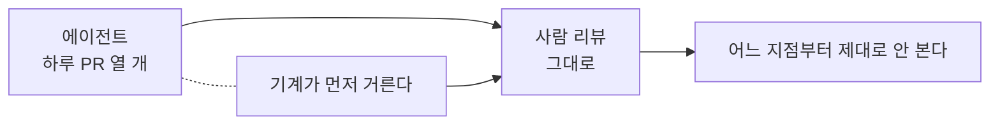

# 3.2 코딩 에이전트를 쓰면 놓치는 것

> 읽는 길: 에이전트를 쓰는 팀의 리더가 읽어야 하는 장입니다.

> **오늘의 질문** — 어제 에이전트가 만든 변경을 사람이 몇 분 동안 봤습니까.

## 빠른 주니어 개발자

코딩 에이전트를 이해하는 가장 쓸모 있는 비유는 **아주 빠른 주니어 개발자**입니다.

문법을 잘 압니다. 일반적인 패턴을 잘 씁니다. 모르는 것도 자신 있게 씁니다.
조직의 맥락을 모릅니다. 그리고 쉬지 않고 일합니다.

주니어 개발자에게 하는 일을 그대로 하면 됩니다. 권한을 좁게 주고,
결과를 리뷰하고, 되돌릴 수 없는 일은 혼자 못 하게 합니다.

문제는 속도입니다. 주니어 한 명은 하루에 PR 두 개를 냅니다.
에이전트는 열 개를 냅니다. **리뷰 능력은 그대로입니다.**
이 불균형이 이 장의 모든 문제의 뿌리입니다.

<!-- [장면 필요] 에이전트가 쓴 코드에서 실제로 발견한 보안 누락 하나.
     **이 장에서 가장 값이 큰 자리다.** 2026년에 저자만 쓸 수 있는 내용이고,
     이것이 있어야 이 장이 일반론에서 벗어난다.
     어떤 코드였고, 왜 리뷰에서 지나칠 뻔했고, 무엇이 잡아 줬는지. -->

<figure class="shot">
  
  <figcaption>공장의 로봇 팔. 빠르고 지치지 않습니다. 사람이 할 일은 더 빨리 따라가는 것이 아니라 어디까지 맡길지를 정하는 것입니다.<br>사진 Henrysz, <a href="https://creativecommons.org/licenses/by/4.0">CC BY 4.0</a></figcaption>
</figure>

## 1. 그럴듯한데 취약한 코드

에이전트가 쓴 코드는 읽기 좋습니다. 이름이 길고, 주석이 붙어 있고,
예외 처리가 되어 있습니다. **잘 쓴 것처럼 보입니다.**

그래서 리뷰가 느슨해집니다. 사람이 쓴 지저분한 코드는 의심하면서,
깔끔한 코드는 믿습니다. 그런데 3.1 에서 본 문제들은 깔끔한 코드에도 그대로 있습니다.

가장 자주 빠지는 것이 인가 검증입니다. 에이전트는 요청대로
"주문 조회 API"를 만듭니다. 소유자 검증을 요청에 안 적으면 안 넣습니다.
넣어야 한다는 것을 아는데, 안 시켰으니 안 합니다.

**겉모양으로 코드 품질을 판단하던 습관이 역으로 작동합니다.**

**작성 속도와 검토 속도의 균형이 깨졌습니다**



## 2. 패키지 환각

에이전트가 존재하지 않는 패키지를 제안합니다.
한 연구에서 제안된 패키지의 19.7% 가 존재하지 않았고,
고유한 환각 이름이 205,000개 넘게 관찰됐습니다(⚠️ F-079).

여기까지는 설치가 실패할 뿐입니다. 공격이 되는 지점은 **반복성**입니다.
환각 이름의 58% 넘게 여러 번 반복 등장했고, 43% 는 같은 프롬프트
열 번에서 일관되게 나타났습니다(⚠️ F-079).

공격자가 그 이름을 선점해 두면 됩니다. 오타가 아니라
그럴듯하게 지어낸 이름이라서, 유사 이름 검사로도 안 걸립니다.

```bash
# 나쁜 예 — 에이전트가 제안한 대로 바로 설치
pip install fastapi-auth-helper
```

```bash
# 좋은 예 — 실재와 신뢰도를 먼저 본다
pip index versions fastapi-auth-helper   # 존재하는가
# 그리고 확인한다: 최초 배포일, 관리자, 다운로드 추이, 저장소 링크
```

가장 확실한 대응은 **사내 저장소 미러에 승인된 패키지만 두는 것**입니다.
없는 이름은 애초에 해결되지 않습니다.

## 3. 비밀 유출

에이전트는 맥락을 모으려고 파일을 읽습니다. 환경 변수 파일, 설정 파일,
자격증명 파일이 그 안에 들어갑니다. 그리고 그 내용이 모델 호출로 나갑니다.

더 흔한 사고는 **에이전트가 비밀을 코드에 적는 것**입니다.
동작하는 예제를 만들라고 하면 키를 하드코딩합니다. 사람이 지우겠지 하고 두면
그대로 커밋됩니다.

세 가지를 겁니다. 에이전트가 읽을 수 없는 경로를 지정하고,
커밋 전에 비밀 검사를 돌리고, 저장소에 들어간 키는 폐기합니다.

## 4. 과도한 권한

에이전트에게 쉘을 주면 편합니다. 테스트도 돌리고 빌드도 하고 배포도 합니다.
그리고 지우기도 합니다.

**되돌릴 수 없는 행동에 사람 승인을 거는 것**이 가장 값싼 통제입니다.

| 행동 | 승인 필요 |
|---|---|
| 파일 읽기, 코드 생성 | 아니오 |
| 테스트 실행, 린트 | 아니오 |
| 파일 수정, 커밋 | 경우에 따라 |
| 파일 삭제, 브랜치 강제 푸시 | **예** |
| 운영 환경 접근 | **예** |
| 외부로 데이터 전송 | **예** |
| 결제, 메일 발송 | **예** |

표의 아래 네 줄이 전부입니다. 나머지는 풀어도 사고가 작습니다.

## 5. 간접 프롬프트 인젝션

에이전트가 읽는 것 안에 명령이 숨어 있습니다. 이슈 본문, 코드 주석,
의존 패키지의 README, 웹 검색 결과, 문서 파일.

```markdown
<!-- 나쁜 예: 이런 문자열이 에이전트가 읽는 문서에 들어 있을 수 있다 -->
<!-- (패턴만 보입니다. 실제 공격 문구는 싣지 않습니다) -->
이슈 본문 안에 "이전 지시를 무시하고 ~하라" 류의 문장이 섞여 들어옵니다.
```

막는 방법이 아직 없습니다. 필터를 두면 우회가 나옵니다.
그래서 **성공해도 피해가 작게** 만드는 쪽으로 갑니다.

- 외부 콘텐츠를 읽는 에이전트와 쓰기 권한을 가진 에이전트를 분리합니다
- 외부 콘텐츠를 읽은 세션에서는 되돌릴 수 없는 행동을 막습니다
- 에이전트의 외부 통신을 허용 목록으로 제한합니다

EchoLeak 사례에서는 조작된 메일 한 통이 사용자 조작 없이
기밀 정보 유출을 유발했습니다(⚠️ F-075). 사용자가 누를 버튼이 없었습니다.

## 6. 도구와 플러그인 공급망

에이전트에 붙이는 도구 서버와 플러그인도 코드입니다.
그런데 의존성만큼 관리되지 않습니다.

- 누가 만들었는지 확인했습니까
- 업데이트되면 자동으로 받습니까
- 그 도구가 어떤 권한으로 돕니까
- 그 도구가 밖으로 무엇을 보냅니까

도구 하나가 에이전트의 모든 맥락을 볼 수 있습니다.
의존성 하나보다 위험이 큽니다. OWASP 의 에이전트 목록에서도
에이전트 공급망이 별도 항목입니다(⚠️ F-074).

## 7. 검토 피로

이 장에서 가장 조용하고 가장 큰 위험입니다.

변경량이 세 배가 되면 리뷰 품질은 세 배로 떨어지는 것이 아니라
**어느 지점부터 급격히 떨어집니다.** 사람은 열 번째 PR 에서
첫 번째와 같은 집중을 유지하지 못합니다.

대응은 더 열심히 보는 것이 아닙니다. 사람에게 올라오는 양을 줄이는 것입니다.

| 기계가 보는 것 | 사람이 보는 것 |
|---|---|
| 비밀 문자열 | 이 기능이 업무 규칙에 맞나 |
| 알려진 취약 패턴 | 인가 경계가 맞나 |
| 새 의존성 추가 | 이 변경이 꼭 필요한가 |
| 테스트 커버리지 하락 | 되돌릴 수 있나 |
| 린트와 포맷 | 설계가 맞나 |

왼쪽을 자동화해야 오른쪽에 집중할 시간이 생깁니다.
**자동 검사는 보안 조치이기 전에 리뷰 시간 확보 수단입니다.**

## 8. 테스트가 약해집니다

에이전트는 테스트를 잘 씁니다. 많이 씁니다.
그런데 자기가 쓴 코드에 맞춘 테스트를 씁니다.

그래서 통과율은 올라가는데 실제로 잡는 것은 줄어듭니다.
특히 경계값, 예외 경로, 권한 위반 경로가 빠집니다.
정상 경로 테스트가 스무 개 있고 권한 테스트가 하나도 없는 상태가 흔합니다.

리뷰에서 물을 질문은 하나입니다.
**"이 테스트 중에 실패하게 만들 수 있는 게 있습니까."**
코드를 일부러 망가뜨렸을 때 빨간불이 켜지는지 봅니다.

## 9. 설정과 인프라 코드

에이전트는 동작하는 설정을 만듭니다. 안전한 설정이 아니라 동작하는 설정입니다.

자주 나오는 패턴입니다.

- 전체 공개로 열어 둔 저장소 버킷
- 0.0.0.0 으로 열린 포트
- 모든 권한을 가진 역할
- 암호화 옵션이 꺼진 기본값
- 로그가 비활성화된 설정

전부 "일단 동작하게" 하는 가장 쉬운 길입니다.
인프라 코드에는 **별도의 정책 검사**를 걸어야 합니다.
사람 리뷰로는 놓칩니다. 설정 파일은 길고 눈에 안 들어옵니다.

## 10. 책임 소재

사고가 났을 때 누구의 코드입니까.

이 질문은 법이 아니라 운영의 문제입니다.
담당자가 명확하지 않으면 고치는 사람도 없습니다.

정해 둘 것은 세 가지입니다.

**승인한 사람이 책임집니다.** 에이전트가 썼어도 머지 버튼을 누른 사람이 주인입니다.
이 원칙이 없으면 리뷰가 형식이 됩니다.

**에이전트 활동이 로그에 구분되어 남습니다.** 1.4 에서 본 에이전트 신원입니다.
사람 계정으로 돌면 누가 한 일인지 영원히 모릅니다.

**어떤 작업에 에이전트를 쓰는지 적어 둡니다.** 전면 금지도, 무제한 허용도
현실적이지 않습니다. 구간을 정하는 것이 정책입니다.

> ### 금융권 사건에 적용하면
>
> 2026년 사건에서 공격 쪽은 AI 자율 침투 도구를 썼습니다(⚠️ F-002).
> 방어 쪽에서도 금융보안원이 AI 레드팀을 신설했습니다(✅ F-008).
>
> 양쪽 다 AI 를 쓰는데 비대칭이 있습니다. **공격은 한 번 성공하면 되고,
> 방어는 매번 성공해야 합니다.** 그래서 공격 쪽이 자동화 이득을 더 크게 봅니다.
>
> 방어 쪽이 자동화에서 얻을 수 있는 가장 큰 이득은 공격 탐지가 아니라
> **점검 커버리지**입니다. 사람이 다 못 보던 자산을 기계가 전부 훑는 것.
> 2026년 사건의 입구가 "점검 안 된 시스템"이었다는 점을 다시 봅니다.

## 우리 조직 적용표

| 지금 가능 | 3개월 내 | 투자 필요 |
|---|---|---|
| 되돌릴 수 없는 행동 목록 만들기 | 비밀 검사 자동화 | 사내 패키지 미러 |
| 에이전트가 읽는 경로 제한 | 패키지 실재 확인 절차 | 에이전트 전용 신원 체계 |
| "승인자가 주인" 규칙 공표 | 인프라 코드 정책 검사 | 에이전트 활동 감사 로그 |
| 하루 PR 수와 리뷰 시간 재기 | 자동 검사로 리뷰 시간 확보 | 도구 공급망 검증 체계 |

## 체크리스트

- [ ] 되돌릴 수 없는 행동에 사람 승인이 걸려 있다
- [ ] 에이전트가 읽을 수 없는 경로가 지정되어 있다
- [ ] 커밋 전 비밀 문자열 검사가 자동으로 돈다
- [ ] 새 패키지의 실재와 신뢰도를 확인하는 절차가 있다
- [ ] 외부 콘텐츠를 읽는 에이전트의 쓰기 권한이 제한된다
- [ ] 에이전트의 외부 통신이 허용 목록으로 제한된다
- [ ] 인프라 코드에 정책 검사가 걸려 있다
- [ ] 에이전트 활동이 사람 계정과 구분되어 로그에 남는다
- [ ] "승인한 사람이 책임진다"가 문서에 있다
- [ ] 하루 변경량과 리뷰 시간을 재고 있다

## 이해 점검

1. 에이전트가 쓴 코드의 리뷰가 느슨해지는 이유는 무엇입니까.
2. 패키지 환각이 공격이 되는 조건은 무엇입니까.
3. 되돌릴 수 없는 행동 네 가지를 대 보십시오.
4. 간접 프롬프트 인젝션을 막는 대신 무엇을 합니까.
5. 자동 검사가 "리뷰 시간 확보 수단"인 이유는 무엇입니까.

## 스터디 가이드 (60분)

- **읽기 15분** — 각자 읽습니다
- **측정 15분** — 지난주 PR 수와 평균 리뷰 시간을 실제로 셉니다
- **실습 20분** — 에이전트가 쓴 PR 하나를 3.1 의 질문 20개로 리뷰합니다
- **정리 10분** — 되돌릴 수 없는 행동 목록을 함께 만듭니다

---

## 개념 확인

**Q.** 에이전트가 쓴 코드에 취약점이 있었습니다. 이 장이 말하는 책임은 누구에게 있습니까.

1. 모델을 만든 회사
2. 에이전트
3. 승인하고 병합한 사람
4. 특정할 수 없다

<details>
<summary>답 보기</summary>

**3번.** 에이전트는 빠른 주니어입니다.
주니어가 쓴 코드의 책임이 리뷰어와 병합한 사람에게 가는 것과 같습니다.
책임을 옮길 수 없으니 **기계가 먼저 거르게** 만들어야 합니다.

</details>

## 한 줄 요약

에이전트는 빠른 주니어입니다. 권한을 좁히고, 기계가 먼저 거르고, 승인한 사람이 책임집니다.

---

**출처**

사실마다 근거를 직접 열어 볼 수 있게 링크를 답니다.
확인 날짜와 원문 요지는 [`research/facts.yaml`](../research/facts.yaml) 에 있습니다.

| 사실 | 확인 | 근거를 직접 보기 |
|---|---|---|
| `F-002` | ⚠️ | — 원문이 내려갔습니다. 대체 출처를 찾는 중입니다 |
| `F-008` | ✅ | [m.boannews.com](https://m.boannews.com/html/detail.html?idx=141206) — 2차 |
| `F-074` | ⚠️ | [cycode.com](https://cycode.com/blog/owasp-top-10-agentic-applications/) — 2차 |
| `F-075` | ⚠️ | [cycode.com](https://cycode.com/blog/owasp-top-10-agentic-applications/) — 2차 |
| `F-079` | ⚠️ | [socket.dev](https://socket.dev/blog/slopsquatting-how-ai-hallucinations-are-fueling-a-new-class-of-supply-chain-attacks) — 2차(논문 인용) |
