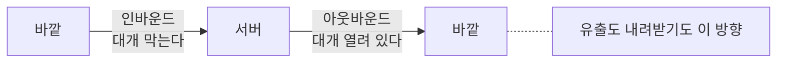
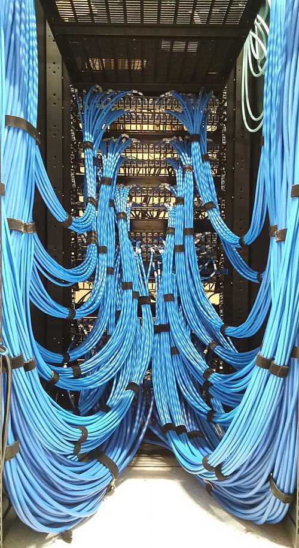

# 3.3 서버 구성

> 읽는 길: 운영을 맡은 분을 위한 장입니다. 「서버 점검 20줄」만 떼어 써도 됩니다.

> **오늘의 질문** — 우리 운영 서버는 인터넷의 아무 주소로나 연결할 수 있습니까.

## 직원용 시스템도 같은 기준입니다

이 장을 여는 문장은 하나입니다.

2026년 금융권 사건에서 공격이 집중된 직원용 업무지원 시스템들은
당국 점검 대상에서 빠져 자체 점검에 맡겨져 있었습니다(✅ F-004).

그러니까 **"고객 시스템이 아니니까"로 기준을 낮추지 않습니다.**
이 장의 모든 항목은 사내 도구에도 똑같이 적용합니다.
사내 도구가 더 위험할 때도 있습니다. 직원 계정으로 들어가고,
그 계정은 다른 곳에도 쓰이기 때문입니다.

## 아웃바운드 통제가 먼저입니다

서버 보안에서 가장 효과가 큰데 가장 안 하는 것이 **나가는 통신 제한**입니다.

들어오는 통신은 다들 막습니다. 방화벽 규칙이 있고 포트를 닫습니다.
나가는 통신은 거의 다 열어 둡니다. 패키지도 받아야 하고 API 도 불러야 하니까요.

그런데 공격의 마지막 단계는 전부 나가는 쪽입니다.
데이터 유출, 명령 수신, 추가 도구 내려받기. 나가는 길이 막혀 있으면
침입에 성공해도 할 수 있는 일이 급격히 줄어듭니다.

```nginx
# 나쁜 예 — 어디로든 나갈 수 있다
# (아웃바운드 규칙 없음)
```

```text
# 좋은 예 — 목적지를 허용 목록으로 제한한다
허용: 사내 패키지 미러, 사내 API 게이트웨이, 로그 수집 서버,
      시각 동기화 서버, 그리고 업무상 꼭 필요한 외부 도메인 목록
기본: 거부
```

처음에는 거부 로그를 보면서 필요한 것을 추가합니다.
2주면 안정됩니다. 그 2주가 아까워서 안 하는 조직이 대부분입니다.

SSRF 방어의 마지막 방어선도 여기입니다(3.1 참조).
코드에서 막지 못해도 네트워크에서 막힙니다.

**들어오는 쪽만 막고 나가는 쪽은 열어 둡니다**



<figure class="shot">
  
  <figcaption>패치 패널. 연결은 눈에 보이는데 <strong>어디로 나갈 수 있는지</strong>는 보이지 않습니다. 아웃바운드가 먼저인 이유입니다.<br>사진 Kbh3rd, <a href="https://creativecommons.org/licenses/by/4.0">CC BY 4.0</a></figcaption>
</figure>

## 분리

성격이 다른 것을 같은 망에 두지 않습니다.

| 나눌 것 | 왜 |
|---|---|
| 운영과 개발 | 개발 환경은 보안 수준이 낮습니다 |
| 업무망과 관리망 | 관리 접근은 별도 경로로만 |
| 웹 계층과 데이터 계층 | 웹이 뚫려도 DB 에 직접 못 가게 |
| 사내 도구와 고객 서비스 | 하나가 뚫려도 다른 쪽으로 못 가게 |
| 외주 구간 | 필요한 시스템에만, 기간을 정해서 |

가장 자주 깨지는 것이 첫 줄입니다. 운영 데이터를 개발 환경에 복사해 두면
개인정보의 보안 수준이 개발 환경 수준으로 떨어집니다.

서버끼리의 통신도 기본 거부로 둡니다. 같은 망 안이라고
서로 자유롭게 통신하게 두면 내부 이동이 쉬워집니다.

## 관리 접근

관리자가 서버에 들어가는 경로를 하나로 모으고 그 경로만 지킵니다.

- 공인 IP 에 관리 포트를 열어 두지 않습니다
- 점프 호스트나 VPN 을 거칩니다
- 그 경로에 다중 인증을 겁니다. 가능하면 패스키입니다
- 공용 계정을 쓰지 않습니다. 누가 들어왔는지 남아야 합니다
- 세션을 기록합니다

마지막 줄이 사고 조사에서 결정적입니다. 누가 언제 무슨 명령을 쳤는지가
남아 있지 않으면 재구성할 수 없습니다.

## 계정과 권한

**사람이 직접 쓰는 계정과 서비스가 쓰는 계정을 나눕니다.**
서비스 계정으로 사람이 로그인하면 누가 했는지 알 수 없습니다.

**루트로 서비스를 돌리지 않습니다.** 서비스마다 전용 계정을 만들고
그 계정에 필요한 권한만 줍니다.

**데이터베이스 권한을 나눕니다.** 애플리케이션 계정에
테이블 삭제 권한이 왜 있는지 물어봅니다. 대개 "기본값이라서"입니다.

```sql
-- 나쁜 예 — 전부 준다
GRANT ALL PRIVILEGES ON app_db.* TO 'app'@'%';

-- 좋은 예 — 필요한 것만, 필요한 곳에서만
GRANT SELECT, INSERT, UPDATE ON app_db.orders TO 'app'@'10.0.1.%';
GRANT SELECT ON app_db.products TO 'app'@'10.0.1.%';
```

접속 가능한 출발지를 제한하는 것도 함께 합니다.
`'%'` 는 어디서든 들어올 수 있다는 뜻입니다.

## 기본값을 바꿉니다

설치 직후 상태가 가장 위험합니다.

- 기본 계정과 기본 비밀번호를 지우거나 바꿉니다
- 쓰지 않는 서비스와 포트를 끕니다
- 관리 콘솔의 기본 경로를 외부에 열어 두지 않습니다
- 디렉터리 목록 노출을 끕니다
- 에러 페이지에 버전과 스택 트레이스를 노출하지 않습니다
- 저장소 버킷의 공개 설정을 확인합니다

마지막 줄을 특히 보십시오. 제품 이름 없이 말하면,
**데이터를 담는 공간이 공개로 열려 있는 경우**입니다.
설정 한 칸이고, 바뀐 줄 아무도 모르고, 밖에서는 그냥 보입니다.

**주기적으로 전수 점검하는 것 말고 방법이 없습니다.**
사람이 안 틀리게 만드는 쪽이 아니라, 틀렸을 때 바로 찾는 쪽으로 갑니다.

## 패치

패치 수명을 숫자로 관리합니다(1.2 참조).

| 자산 | 목표 기간 |
|---|---|
| 외부 노출, 심각도 높음 | 72시간 |
| 외부 노출, 그 외 | 2주 |
| 내부, 심각도 높음 | 2주 |
| 내부, 그 외 | 1개월 |

숫자는 조직마다 다르게 정해도 됩니다. **정해 두는 것 자체**가 중요합니다.
못 지키면 왜 못 지켰는지를 남깁니다. 기록이 쌓이면 구조적 원인이 보입니다.

Equifax 는 패치가 나온 뒤 78일 동안 적용하지 않았습니다(✅ F-050).
그 조직에 패치 정책이 없었던 것이 아닙니다. **지켜지는지 확인하는 절차가 없었습니다.**

## 컨테이너와 인프라 코드

컨테이너를 쓴다고 안전해지지 않습니다. 몇 가지는 오히려 나빠집니다.

- 베이스 이미지에 취약점이 들어옵니다. 이미지 스캔을 빌드에 넣습니다
- 루트로 도는 컨테이너가 기본값인 경우가 많습니다. 사용자를 지정합니다
- 읽기 전용 파일시스템으로 띄울 수 있으면 띄웁니다
- 호스트 경로를 통째로 마운트하지 않습니다
- 이미지에 비밀을 넣지 않습니다. 빌드 기록에 남습니다

인프라 코드는 사람 리뷰로 안 잡힙니다. **정책 검사를 코드로** 겁니다.
공개 설정, 암호화 비활성화, 과도한 권한, 로그 비활성화를 자동으로 거릅니다.

## 백업

3.6 에서 더 다루지만 서버 구성의 일부이므로 여기서 짚습니다.

- 불변 백업을 둡니다. 정해진 기간 동안 아무도 못 지웁니다
- 백업을 운영과 다른 권한 경계에 둡니다
- 복원을 정기적으로 실제로 해 봅니다
- 복원 소요 시간을 잽니다

네 번째가 빠지면 사고 당일에 "백업은 있는데 언제 돌아올지 모릅니다"가 됩니다.

## 외주 구간

2014년 카드 3사 사건에서 외주 직원이 USB 로 1억 건 넘게 반출했고,
법원은 보안 프로그램의 실제 작동 관리 감독 미흡과
외주 직원에 대한 접근권한 제한 미실시를 지적했습니다(✅ F-041, F-042).

외주 구간에서 정할 것은 다섯입니다.

1. 어느 시스템에 접근하는가. 목록으로 적습니다
2. 언제까지인가. 계약 시작할 때 종료일을 설정합니다
3. 어디서 접속하는가. 출발지를 제한합니다
4. 무엇을 반출할 수 있는가. 매체 통제와 다운로드 통제
5. 활동이 어떻게 기록되는가

계약서에도 같은 내용을 넣습니다. 사고가 협력사에서 나도 책임은 함께 옵니다.

## 서버 점검 20줄

새 서버를 띄울 때, 그리고 분기마다 훑습니다.

**네트워크**
1. 공인 IP 에 열린 포트가 목록과 같다
2. 관리 포트가 외부에 열려 있지 않다
3. 아웃바운드가 허용 목록으로 제한된다
4. 서버 간 통신이 기본 거부다

**계정**
5. 기본 계정과 기본 비밀번호가 없다
6. 서비스가 루트로 돌지 않는다
7. 공용 관리 계정이 없다
8. 퇴사자와 종료된 외주 계정이 없다

**접근**
9. 관리 접근이 점프 호스트나 VPN 을 거친다
10. 관리 접근에 다중 인증이 걸려 있다
11. 관리 세션이 기록된다

**데이터**
12. DB 계정 권한이 필요한 것만이다
13. DB 접속 출발지가 제한된다
14. 저장소 버킷이 공개가 아니다
15. 디스크와 DB 암호화가 켜져 있고 열쇠가 분리되어 있다

**운영**
16. 패치 목표 기간이 지켜지고 있다
17. 에러 페이지에 버전과 스택이 노출되지 않는다
18. 로그가 서버 밖으로 전송된다
19. 불변 백업이 있고 최근 복원을 해 봤다
20. 이 서버의 담당자가 자산 목록에 적혀 있다

> ### 금융권 사건에 적용하면
>
> 우리은행과 농협은행은 같은 공격을 받았는데 침입 방지 시스템이 작동해
> 유출이 없었습니다(⚠️ F-003).
>
> 같은 공격, 다른 결과입니다. 차이는 장비가 있고 없고가 아니라
> **그 장비가 그 시스템 앞에 있었는가**였을 가능성이 큽니다.
>
> 보안 장비는 보통 중요 시스템 앞에 둡니다. 주변부 시스템은
> 장비 뒤에 없는 경우가 많습니다. 20줄 점검을 **모든 서버에** 돌려야 하는 이유입니다.

## 우리 조직 적용표

| 지금 가능 | 3개월 내 | 투자 필요 |
|---|---|---|
| 열린 포트 전수 확인 | 아웃바운드 허용 목록 적용 | 네트워크 마이크로 분리 |
| 기본 계정 점검 | 관리 접근 경로 일원화 | 점프 호스트와 세션 기록 |
| DB 권한 점검 | 인프라 코드 정책 검사 | 통합 자산 점검 자동화 |
| 20줄 점검 1회 | 패치 목표 기간 문서화 | 불변 백업 체계 |

## 체크리스트

위 「서버 점검 20줄」이 체크리스트입니다. 부록 B 에도 넣었습니다.

## 이해 점검

1. 아웃바운드 통제가 효과가 큰 이유는 무엇입니까.
2. 개발 환경에 운영 데이터를 복사하면 무엇이 일어납니까.
3. DB 계정에 `'%'` 로 접속 출발지를 열어 두면 무엇이 문제입니까.
4. Equifax 사건에서 빠져 있던 것은 패치 정책입니까, 확인 절차입니까.
5. 사내 도구에 같은 기준을 적용해야 하는 이유는 무엇입니까.

## 스터디 가이드 (60분)

- **읽기 10분** — 각자 읽습니다
- **실습 30분** — 운영 서버 한 대를 골라 20줄 점검을 실제로 돌립니다
- **공유 15분** — 몇 줄에서 걸렸는지 비교합니다
- **정리 5분** — 가장 많이 걸린 항목을 이번 달 과제로 정합니다

---

## 개념 확인

**Q.** 들어오는 통신만 막고 나가는 통신을 열어 두면 무엇을 막지 못합니까. (주관식)

<details>
<summary>답 보기</summary>

**유출과 추가 도구 내려받기입니다.** 둘 다 나가는 방향입니다.
그래서 아웃바운드를 허용 목록으로 묶으면
침입을 못 막아도 **가져 나가는 것은 막힐 수 있습니다.**

</details>

## 한 줄 요약

들어오는 쪽보다 나가는 쪽을 막고, 중요하지 않다고 분류한 서버에 같은 기준을 적용합니다.

---

**출처**

사실마다 근거를 직접 열어 볼 수 있게 링크를 답니다.
확인 날짜와 원문 요지는 [`research/facts.yaml`](../research/facts.yaml) 에 있습니다.

| 사실 | 확인 | 근거를 직접 보기 |
|---|---|---|
| `F-003` | ⚠️ | [newspim.com](https://www.newspim.com/news/view/20261002001278) — 2차 |
| `F-004` | ✅ | [newspim.com](https://www.newspim.com/news/view/20261002001278) — 2차 |
| `F-041` | ✅ | [thescoop.co.kr](https://www.thescoop.co.kr/news/articleView.html?idxno=25228) — 2차 |
| `F-042` | ✅ | [m.boannews.com](https://m.boannews.com/html/detail.html?idx=51708) — 2차 |
| `F-050` | ✅ | [oversight.house.gov](https://oversight.house.gov/wp-content/uploads/2018/12/Equifax-Report.pdf) — 1차(미 하원 감독위 보고서) |
