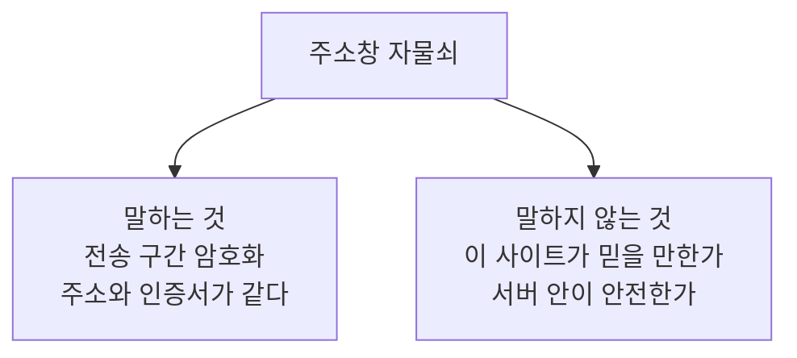

# 3.4 HTTPS 가 해결하지 못하는 것

> 읽는 길: 개발자가 아니면 「자물쇠가 말하지 않는 것」과
> 「사용자에게 뭐라고 말할까」만 보셔도 됩니다.

> **오늘의 질문** — 자물쇠 아이콘이 보이면 그 사이트는 안전합니까.

## 자물쇠가 말하는 것

브라우저 주소창의 자물쇠는 세 가지를 말합니다.

**중간에서 읽히지 않습니다.** 통신 내용이 암호화되어 있습니다.
카페 와이파이에서 옆 사람이 볼 수 없습니다.

**중간에서 바뀌지 않습니다.** 통신 중간에 내용을 조작하면 탐지됩니다.

**접속한 서버가 그 도메인의 서버입니다.** 인증서로 확인합니다.

세 가지 다 중요합니다. 그런데 **이 셋이 전부**입니다.
사람들이 자물쇠에 기대하는 것은 보통 이보다 훨씬 많습니다.

## 자물쇠가 말하지 않는 것

**그 사이트가 선량하다고 말하지 않습니다.**
피싱 사이트도 인증서를 받습니다. 무료로, 몇 분 만에 받습니다.
자물쇠는 "이 도메인의 진짜 서버"라고만 말하지, "믿을 만한 곳"이라고 말하지 않습니다.

오히려 자물쇠 교육이 역효과를 냅니다. "자물쇠를 확인하세요"라고 배운 사용자가
자물쇠가 있는 피싱 사이트를 더 믿습니다.

**서버가 안전하다고 말하지 않습니다.**
서버에 취약점이 있어도 자물쇠는 똑같이 보입니다.
3.1 의 인가 누락이 있어도 자물쇠는 보입니다.

**서버가 뚫리지 않았다고 말하지 않습니다.**
공격자가 서버 안에 있으면 통신은 암호화되어 공격자에게 안전하게 전달됩니다.

**당신의 기기가 깨끗하다고 말하지 않습니다.**
단말에 악성코드가 있으면 암호화되기 전에 가져갑니다.

**데이터가 저장될 때 안전하다고 말하지 않습니다.**
전송 중 암호화일 뿐입니다. 서버 디스크에 어떻게 저장되는지는 별개입니다.

**자물쇠가 말하는 것과 말하지 않는 것**



<figure class="shot">
  
  <figcaption>무료 인증서가 보급되면서 자물쇠는 누구나 달 수 있게 됐습니다. 그래서 자물쇠는 더 이상 믿을 만한 사이트라는 뜻이 아닙니다.<br>사진 ™/® Internet Security Research Group, 퍼블릭 도메인</figcaption>
</figure>

## 그래서 무엇을 해야 하나

HTTPS 는 필요조건이고 충분조건이 아닙니다. 켜 두되,
켰다고 끝났다고 생각하지 않습니다. 아래 항목이 함께 가야 합니다.

### 1. 전부 HTTPS 로

일부만 HTTPS 인 사이트는 없는 것과 비슷합니다.
HTTP 로 들어온 요청을 HTTPS 로 넘기되, 그 첫 요청은 평문입니다.
그 틈을 막는 것이 HSTS 입니다.

```nginx
# 좋은 예 — 브라우저에게 다음부터는 처음부터 HTTPS 로 오라고 알린다
add_header Strict-Transport-Security "max-age=31536000; includeSubDomains" always;
```

`includeSubDomains` 를 켜기 전에 모든 서브도메인이 HTTPS 인지 확인합니다.
아니면 서브도메인이 안 열립니다.

### 2. 쿠키 속성

세션 쿠키가 평문으로 나가거나 스크립트에서 읽히면 HTTPS 가 소용없습니다.

```text
Set-Cookie: session=...; Secure; HttpOnly; SameSite=Lax; Path=/
```

| 속성 | 막는 것 |
|---|---|
| `Secure` | HTTP 로 쿠키가 전송되는 것 |
| `HttpOnly` | 스크립트가 쿠키를 읽는 것 |
| `SameSite` | 다른 사이트에서 요청이 올 때 쿠키가 따라가는 것 |

세 개 다 한 줄이면 됩니다. 그런데 셋 중 하나가 빠진 서비스가 많습니다.

### 3. 콘텐츠 보안 정책

스크립트가 어디서 올 수 있는지 제한합니다.
공격자가 스크립트를 끼워 넣어도 실행되지 않거나, 결과를 밖으로 못 보냅니다.

처음부터 완벽하게 쓰려 하면 서비스가 깨집니다.
보고 전용 모드로 켜서 무엇이 걸리는지 한 달 보고, 그다음 강제합니다.

### 4. 인증서 관리

인증서는 만료됩니다. 수동으로 갱신하면 언젠가 잊습니다.
**자동 갱신을 걸고, 만료 30일 전 알림을 둡니다.**

인증서 최대 유효기간은 **계속 짧아지는 방향**으로 가고 있습니다.
이 책은 구체적인 일정을 적지 않습니다. 일정은
[CA/Browser Forum](https://cabforum.org/) 에서 정하고
단계적으로 바뀌어서, 적는 순간 낡습니다.

방향만 알면 결론은 같습니다. **지금 자동 갱신을 걸어 두십시오.**
기간이 짧아질수록 수동 갱신은 불가능해집니다. 일정을 알든 모르든 할 일은 하나입니다.

### 5. 내부 통신

외부는 HTTPS 인데 내부는 평문인 구성이 흔합니다.
로드밸런서에서 암호화를 끝내고 뒤는 평문으로 보냅니다.

내부를 믿을 수 있던 시절의 설계입니다. 1.2 의 가정 침해를 적용하면
내부도 암호화해야 합니다. 서비스끼리 서로를 인증하는 방식까지 가면 더 낫습니다.

우선순위는 높지 않습니다. 다른 것부터 하고 나서 봅니다.
다만 **"내부는 평문"이라는 사실을 알고 있는 것**과 모르는 것은 다릅니다.

### 6. 설정 점검

TLS 설정은 한 번 잘 해 두면 몇 년 갑니다. 그래서 몇 년 전 설정이 남아 있습니다.
오래된 프로토콜 버전과 약한 암호 모음이 켜져 있는지 주기적으로 봅니다.

점검은 외부 도구로 몇 분이면 됩니다. 분기에 한 번 돌립니다.

## 사용자에게 뭐라고 말할까

"자물쇠를 확인하세요"는 더 이상 유효한 교육이 아닙니다.
대신 이렇게 말합니다.

**주소를 보세요.** 자물쇠가 아니라 도메인 이름을 봅니다.
한 글자 다른 도메인이 가장 흔한 수법입니다.

**링크를 타고 가지 마세요.** 메일이나 문자의 링크 대신
평소 쓰던 앱이나 즐겨찾기로 들어갑니다.

**로그인 화면이 갑자기 나오면 멈추세요.** 이미 로그인되어 있어야 할 자리에
로그인 화면이 뜨면 의심합니다.

**비밀번호 대신 패스키를 쓰세요.** 가장 확실합니다. 가짜 사이트에서는
아예 동작하지 않습니다(1.3 참조).

> ### 금융권 사건에 적용하면
>
> 2026년 금융권 사건에서 HTTPS 는 아무 역할도 하지 않았습니다.
> 공격자는 통신을 가로챈 것이 아니라 **시스템에 들어왔습니다.**
>
> 이것이 이 장의 요점입니다. 실제 사고의 대부분은 전송 구간에서 나지 않습니다.
> 전송 구간은 20년 전에 거의 해결됐습니다. 지금 사고는
> 인가, 신원, 설정, 패치, 사람에서 납니다.
>
> **해결된 문제에 계속 투자하면서 안 해결된 문제를 안 보는 것**이
> 가장 흔한 보안 예산의 실패 유형입니다.

## 우리 조직 적용표

| 지금 가능 | 3개월 내 | 투자 필요 |
|---|---|---|
| 쿠키 속성 세 개 확인 | HSTS 적용 | 내부 구간 암호화 |
| 인증서 만료일 확인 | 인증서 자동 갱신 | 서비스 간 상호 인증 |
| TLS 설정 외부 점검 | CSP 보고 모드 적용 | CSP 강제 적용 |

## 체크리스트

- [ ] 모든 경로가 HTTPS 다
- [ ] HSTS 가 적용되어 있다
- [ ] 세션 쿠키에 Secure, HttpOnly, SameSite 가 있다
- [ ] 인증서가 자동 갱신되고 만료 알림이 있다
- [ ] TLS 설정을 최근 3개월 내에 점검했다
- [ ] CSP 가 최소한 보고 모드로 켜져 있다
- [ ] 내부 구간이 평문인지 아닌지를 알고 있다
- [ ] 사용자 안내에서 "자물쇠 확인"을 유일한 기준으로 쓰지 않는다

## 이해 점검

1. 자물쇠가 보장하는 세 가지는 무엇입니까.
2. 피싱 사이트에도 자물쇠가 있는 이유는 무엇입니까.
3. HSTS 가 막는 틈은 무엇입니까.
4. 쿠키의 `HttpOnly` 가 막는 것은 무엇입니까.
5. "해결된 문제에 계속 투자한다"는 말이 이 장에서 무엇을 가리킵니까.

## 스터디 가이드 (45분)

- **읽기 10분** — 각자 읽습니다
- **실습 20분** — 우리 서비스의 응답 헤더와 쿠키 속성을 실제로 확인합니다
- **토론 10분** — 사용자 안내 문구를 다시 씁니다
- **정리 5분** — 빠진 헤더를 추가할 담당자를 정합니다

---

## 개념 확인

**Q.** 주소창의 자물쇠가 보장하지 **않는** 것은 무엇입니까.

1. 전송 구간이 암호화된다
2. 접속한 주소가 인증서의 주소와 같다
3. 그 사이트가 믿을 만한 곳이다
4. 중간에서 내용을 읽거나 바꾸기 어렵다

<details>
<summary>답 보기</summary>

**3번.** 자물쇠는 **어디로 가는 길이 안전한가**만 말합니다.
도착지가 좋은 곳인지는 말하지 않습니다.
피싱 사이트도 인증서를 받습니다.

</details>

## 한 줄 요약

HTTPS 는 전송 구간만 지킵니다. 지금 사고는 거의 다 그 바깥에서 납니다.
