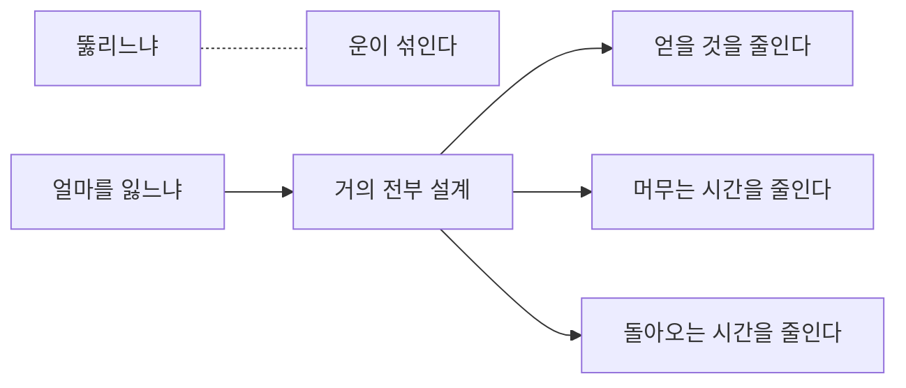

# 3.6 뚫려도 괜찮은 시스템

> 읽는 길: **이 장은 세 층이 같이 읽는 자리입니다.**
> 「아홉 가지 설계」의 제목만 훑어도 회의에서 쓸 말이 나옵니다.

> **오늘의 질문** — 지금 가장 중요한 서버가 뚫렸다고 가정하면, 무엇을 잃습니까.

## 전제를 바꿉니다

여기까지 읽으면 한 가지가 분명해집니다. **침입을 완전히 막는 방법은 없습니다.**

Equifax 는 패치 정책이 있었고 지키지 못했습니다(✅ F-050).
통신사는 2022년에 공격을 발견하고도 조치가 미흡했습니다(✅ F-022).
2026년 금융권은 당국 점검 체계가 있었는데 그 밖의 시스템으로 들어왔습니다(✅ F-004).

전부 "더 열심히 했으면 막았을 텐데"로 정리할 수 있습니다.
그런데 그 정리는 다음 사고를 못 막습니다. 다음에도 어딘가는 빠지기 때문입니다.

그래서 질문을 바꿉니다.
**"어떻게 막을까"에서 "뚫렸을 때 무엇을 잃을까"로.**
두 번째 질문은 답할 수 있고, 답한 만큼 줄일 수 있습니다.

<figure class="shot">
  
  <figcaption>방파제의 테트라포드. 파도를 막지 않습니다. <strong>부딪친 힘을 흩어 놓습니다.</strong> 뚫려도 괜찮은 시스템이 하는 일과 같습니다. 사진 そらみみ, <a href="https://creativecommons.org/licenses/by-sa/4.0">CC BY-SA 4.0</a></figcaption>
</figure>

## 아홉 가지 설계

### 1. 공격면을 없앱니다

가장 싸고 확실합니다. 안 쓰는 서비스를 끄고, 안 쓰는 계정을 지우고,
안 쓰는 기능을 뺍니다. 없는 것은 뚫리지 않습니다.

이것이 왜 안 될까요. **없애는 것에 책임이 따르기 때문**입니다.
켜 두면 아무 일도 없고, 껐다가 뭐가 멈추면 책임집니다.
그래서 조직이 **"끄는 결정"을 지원해야** 합니다. 끄고 문제가 생기면
되돌리면 되는 일로 만들어 둡니다.

### 2. 데이터를 무가치하게 만듭니다

훔쳐도 쓸모없으면 훔칠 이유가 없습니다.

- 안 쓰는 데이터는 지웁니다
- 원본이 필요 없는 자리는 가명 처리나 토큰으로 바꿉니다
- 화면에는 마스킹한 값만 보냅니다
- 암호화하고 열쇠는 다른 권한 경계에 둡니다

**화면 마스킹이 특히 효과적입니다.** 2026년 금융권 사건에서 공격자는
서비스를 반복 조회했습니다(⚠️ F-006). 조회 결과에 전체 값이 아니라
마스킹된 값이 나왔다면 얻는 것이 크게 줄었을 것입니다.

### 3. 신원을 중심에 둡니다

경계가 없으니 모든 접근을 신원으로 판단합니다.
사람도 서비스도 에이전트도 각자 신원을 갖고, 요청마다 확인받습니다.
2.2 가 이 이야기입니다.

### 4. 폭발 반경을 좁힙니다

한 지점이 뚫렸을 때 닿는 범위입니다. 계정을 나누고, 망을 나누고, 데이터를 나눕니다.

점검하는 방법이 있습니다. 서버 한 대를 고르고 **"여기가 뚫렸다면"으로 시작해
갈 수 있는 곳을 그려 봅니다.** 그림이 넓으면 반경이 넓은 것입니다.
이 연습은 반나절이면 되고 효과가 큽니다.

### 5. 불변 인프라

서버에 손으로 들어가서 고치지 않습니다. 바꿔야 하면 새로 만들어 교체합니다.

보안에서 이 방식의 값은 두 가지입니다.
공격자가 **서버에 심어 둔 것**이 다음 배포 때 사라집니다.
그리고 지금 서버 상태가 코드와 같다는 것을 믿을 수 있습니다.
손으로 고친 흔적이 쌓이면 무엇이 정상인지 모르게 됩니다.

**다만 다시 세운다고 전부 지워지지 않습니다.** 데이터베이스, 저장소,
그리고 이미 새어 나간 자격증명은 그대로 남습니다.
불변 인프라는 **거점을 지우는 것**이지 사고를 없던 일로 만드는 것이 아닙니다.
자격증명 교체가 따로 필요합니다.

### 6. 카나리

건드리면 알림이 울리는 가짜 자산입니다.

- 쓰지 않는 계정을 만들어 두고, 로그인 시도가 있으면 알립니다
- 가짜 문서 파일을 두고, 열리면 알립니다
- 유효하지 않은 API 키를 설정 파일에 두고, 사용되면 알립니다
- 가짜 고객 레코드를 넣어 두고, 조회되면 알립니다

정상 업무에서는 아무도 안 건드립니다. 그래서 **오탐이 거의 없습니다.**
비싼 탐지 도구보다 먼저 붙일 수 있고 비용이 거의 안 듭니다.

마지막 항목이 특히 유용합니다. 고객 데이터베이스에 가짜 레코드를 몇 개 심어 두면,
대량 조회나 유출을 조용히 알아챌 수 있습니다.

### 7. 격리

이상이 보이면 빠르게 끊을 수 있어야 합니다. 그런데 사고 당일에
"끊으면 서비스가 멈추는데 괜찮습니까"를 묻기 시작하면 시간이 갑니다.

**미리 정해 둡니다.** 어떤 조건에서 무엇을 끊는지, 누가 결정하는지.
그리고 끊는 방법을 연습해 둡니다. 처음 해 보는 격리는 느립니다.

### 8. 공급망 통제

내가 쓴 코드보다 가져다 쓴 코드가 많습니다.
잠금 파일, 의존성 검사, 사내 미러, 서명 확인.
4.10 에서 자세히 봅니다.

### 9. 복원력

깨끗한 백업, 다시 세우는 절차, 그리고 **누가 무엇을 결정하는지 적힌 문서**입니다.
세 번째가 가장 자주 빠지고 사고 당일에 가장 많은 시간을 먹습니다.

2011년 농협 사건에서 일부 업무는 다음 날 돌아왔지만
전체 정상화에는 18일이 걸렸습니다(⚠️ F-043).

**뚫리느냐와 얼마를 잃느냐는 다른 질문입니다**

## 상시 검증

위 아홉 가지가 **지금도 작동하는지** 확인하는 일이 따로 필요합니다.
설정은 바뀌고, 예외는 늘고, 사람은 떠납니다.

| 주기 | 무엇 |
|---|---|
| 매일 | 외부 노출 자산 변화 확인 |
| 매주 | 새로 생긴 관리자 권한 확인 |
| 매월 | 서버 점검 20줄 표본 점검 |
| 분기 | 안 쓴 권한 회수, 카나리 동작 확인 |
| 반기 | 복원 훈련, 격리 훈련 |
| 연 1회 | 외부 모의 침투 |

전부 할 필요는 없습니다. **위에서부터 할 수 있는 만큼** 합니다.
매일 한 줄이 1년에 한 번 하는 대규모 점검보다 낫습니다.

## 경제성을 무너뜨린다는 말

이 책의 척추 문장으로 돌아갑니다.

공격자는 비용을 쓰고 수익을 얻습니다. 아홉 가지 설계는 막는 장치가 아니라
**수지를 바꾸는 장치**입니다.

| 설계 | 공격자에게 생기는 일 |
|---|---|
| 공격면 제거 | 입구를 찾는 비용이 올라갑니다 |
| 데이터 무가치화 | 얻는 것이 줄어듭니다 |
| 신원 중심 | 자격증명 하나의 값이 떨어집니다 |
| 폭발 반경 축소 | 침투 한 번으로 얻는 범위가 줄어듭니다 |
| 불변 인프라 | 심어 둔 것이 사라져 재침투 비용이 듭니다 |
| 카나리 | 조용히 머물 수 없습니다 |
| 격리 | 머무는 시간이 짧아집니다 |
| 공급망 통제 | 우회 경로가 줄어듭니다 |
| 복원력 | 협박의 값이 떨어집니다 |

아홉 가지 중 **세 개만 해도 수지가 바뀝니다.** 전부 하려다 아무것도 못 하느니
세 개를 고르는 쪽이 낫습니다.

고르는 기준은 하나입니다. **우리 조직에서 지금 가장 비어 있는 칸.**

> ### 금융권 사건에 적용하면
>
> 우리은행과 농협은행은 같은 공격을 받고 유출이 없었습니다(⚠️ F-003).
> 다른 은행들은 유출이 있었는데 규모가 25,729명에서 11명까지 차이가 났습니다.
>
> 이 분포가 이 장의 증거입니다. **같은 공격을 받아도 결과는 설계로 갈립니다.**
> 공격을 못 막은 조직들 사이에서도 고객 기준 유출 규모가
> 25,729명에서 89명까지 갈렸습니다(⚠️ F-003, 보도 기준).
>
> "뚫렸느냐"는 운이 섞인 질문입니다. "뚫렸을 때 얼마를 잃었느냐"는
> 거의 전부 설계의 문제입니다.

## 우리 조직 적용표

| 지금 가능 | 3개월 내 | 투자 필요 |
|---|---|---|
| 폭발 반경 그림 한 장 그리기 | 카나리 계정 3개 심기 | 불변 인프라 전환 |
| 안 쓰는 서비스 목록 만들기 | 화면 마스킹 적용 | 토큰화 체계 |
| 격리 조건과 결정권자 정하기 | 복원 훈련 1회 | 상시 검증 자동화 |

## 체크리스트

- [ ] 폭발 반경을 그려 본 적이 있다
- [ ] 안 쓰는 서비스를 끄는 결정이 지원받는다
- [ ] 화면에 민감 정보가 마스킹되어 나간다
- [ ] 카나리를 최소 하나 심어 두었다
- [ ] 격리 조건과 결정권자가 문서에 있다
- [ ] 최근 6개월 내 복원을 실제로 해 봤다
- [ ] 서버 상태가 코드와 같다는 것을 확인할 수 있다
- [ ] 상시 검증 항목 중 최소 세 개를 돌리고 있다

## 이해 점검

1. "어떻게 막을까"에서 "뚫렸을 때 무엇을 잃을까"로 질문을 바꾸는 이유는 무엇입니까.
2. 안 쓰는 서비스를 끄는 일이 조직에서 잘 안 되는 이유는 무엇입니까.
3. 카나리의 오탐이 적은 이유는 무엇입니까.
4. 불변 인프라가 보안에 주는 값 두 가지는 무엇입니까.
5. 같은 공격에서 유출 규모가 자릿수로 갈린 것이 무엇을 보여 줍니까.

## 스터디 가이드 (60분)

- **읽기 10분** — 각자 읽습니다
- **실습 30분** — 가장 중요한 서버를 하나 고르고, 그것이 뚫렸을 때
  갈 수 있는 곳을 화이트보드에 그립니다
- **토론 15분** — 그림에서 가장 굵은 선 하나를 고르고 어떻게 끊을지 정합니다
- **정리 5분** — 아홉 가지 중 우리가 가장 비어 있는 세 개를 고릅니다

---

## 개념 확인

**Q.** "뚫리느냐"와 "얼마를 잃느냐" 중, 설계가 거의 전부를 정하는 쪽은 어느 것입니까. (주관식)

답 보기

**얼마를 잃느냐입니다.** 뚫리느냐에는 운과 상대의 사정이 섞입니다.
반면 뚫린 다음에 무엇이 보이고 어디까지 가는지는
전부 우리가 미리 정해 둔 구조가 결정합니다.

## 한 줄 요약

뚫리느냐는 운이 섞이고, 얼마를 잃느냐는 거의 전부 설계입니다.

---

**출처**

사실마다 근거를 직접 열어 볼 수 있게 링크를 답니다.
확인 날짜와 원문 요지는 [`research/facts.yaml`](../research/facts.yaml) 에 있습니다.

| 사실 | 확인 | 근거를 직접 보기 |
|---|---|---|
| `F-003` | ⚠️ | [newspim.com](https://www.newspim.com/news/view/20261002001278) — 2차 |
| `F-004` | ✅ | [newspim.com](https://www.newspim.com/news/view/20261002001278) — 2차 |
| `F-006` | ⚠️ | [busan.com](https://www.busan.com/view/busan/view.php?code=2026100418075759253) — 2차 |
| `F-022` | ✅ | [news.nate.com](https://news.nate.com/view/20250704n26170?mid=n0100) — 2차(과기정통부 발표 인용) |
| `F-043` | ⚠️ | [ko.wikipedia.org](https://ko.wikipedia.org/wiki/%EB%86%8D%ED%98%91_%EC%A0%84%EC%82%B0%EB%A7%9D_%EB%A7%88%EB%B9%84_%EC%82%AC%ED%83%9C) — 3차(위키) |
| `F-050` | ✅ | [oversight.house.gov](https://oversight.house.gov/wp-content/uploads/2018/12/Equifax-Report.pdf) — 1차(미 하원 감독위 보고서) |
