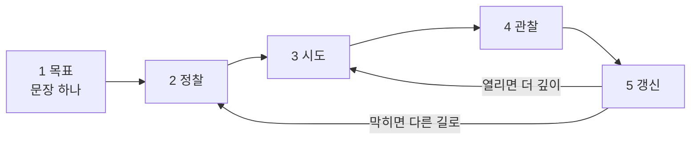
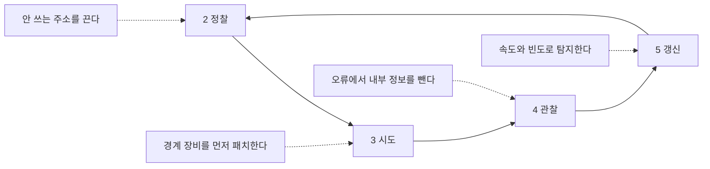

# 3.7 에이전트 공격은 어떻게 도는가

> **오늘의 질문** — 우리 시스템에 에이전트가 하루에 몇 번 말을 걸 수 있습니까.

[1.4](../part1/04-ai-era.md) 에서 개념을 한 쪽씩 봤습니다.
여기서는 **그 개념들이 실제로 어떤 순서로 맞물리는지**를 봅니다.
구조를 알아야 어디를 끊을지 정할 수 있기 때문입니다.

**공격 절차는 적지 않습니다.** 명령어도 도구 이름도 설정값도 없습니다.
루프가 어떤 모양인지와 그 루프의 어느 칸을 끊을 수 있는지까지입니다.

---

## 먼저 용어 넷

뒤에 계속 나오는 말이라 여기서 한 번에 풉니다.

| 말 | 뜻 |
|---|---|
| **에이전트** (agent) | 목표를 받아 스스로 계획하고 **도구를 써서 실행**하는 프로그램. 답만 돌려주는 챗봇과 다릅니다 |
| **도구** (tool) | 에이전트가 부를 수 있는 기능 하나. 파일 읽기, 명령 실행, 메일 보내기, API 호출이 각각 도구입니다 |
| **오케스트레이션** (orchestration) | 여러 에이전트와 도구를 하나의 작업 흐름으로 엮어 돌리는 것. 지휘에 가깝습니다 |
| **정찰** (reconnaissance) | 공격 전에 표적의 주소, 서비스, 직원, 기술 스택을 모으는 단계 |

---

## 스크립트와 무엇이 다른가

공격 자동화는 원래 있었습니다. 스크립트는 정해진 순서를 반복합니다.
1번 해 보고, 안 되면 2번, 그것도 안 되면 끝입니다.
**순서가 미리 적혀 있습니다.**

에이전트는 결과를 보고 다음 수를 바꿉니다.
막히면 우회하고, 열리면 파고듭니다.
사람이 하던 **판단 부분**이 자동화된 것입니다.

차이를 한 줄로 쓰면 이렇습니다.

> 스크립트는 <mark>**같은 일을 빨리**</mark> 합니다.
> 에이전트는 <mark>**다른 일을 이어서**</mark> 합니다.

---

## 루프의 다섯 칸

에이전트 공격은 아래 다섯 칸을 돕니다. 돌 때마다 아는 것이 늘어납니다.

| 칸 | 하는 일 | 사람이 하면 |
|---|---|---|
| 1 **목표** | "이 조직에서 고객 데이터를 찾아라" 수준의 문장 하나 | 1분 |
| 2 **정찰** | 주소, 열린 서비스, 직원 이름, 쓰는 기술을 모읍니다 | 며칠 |
| 3 **시도** | 모은 것 중 가장 싼 입구부터 시도합니다 | 몇 시간 |
| 4 **관찰** | 응답을 읽고 무엇이 통했는지 판단합니다 | 몇 분 |
| 5 **갱신** | 판단을 반영해 다음 시도를 고릅니다. 1번으로 돌아갑니다 | 몇 분 |

그림으로 보면 이렇습니다. 끝이 없는 것이 특징입니다.

표의 오른쪽 칸이 핵심입니다.
사람이 하면 2번에서 며칠이 걸립니다.
<mark>**그 며칠이 사라지면 표적 수가 늘어납니다.**</mark>

2025년에 보고된 캠페인에서 전술적 작업의 80~90% 가
사람 개입 없이 수행됐고, 표적은 약 30개 조직이었습니다(✅ F-071).

---

## 사람은 어디에 남는가

전부 자동이 아닙니다. 사람이 남는 자리가 둘입니다.

- **표적 선정** — 어디를 칠지는 사람이 정합니다
- **유출 승인** — 가져 나갈지는 사람이 결정합니다

보고된 캠페인에서 사람은 이 **전략적 판단에만** 개입했습니다(✅ F-071).
나머지 전술은 돌아갔습니다.

방어 쪽에서 이 사실이 중요합니다.
사람이 적게 붙는다는 것은 **속도가 일정하다**는 뜻이기 때문입니다.
사람은 밥을 먹고 잠을 잡니다. 루프는 안 그렇습니다.
새벽 3시에 같은 속도로 도는 접근은 그 자체로 신호입니다.

---

## 안전장치는 어떻게 비껴가는가

모델에는 공격을 돕지 않게 하는 장치가 들어 있습니다.
보고된 캠페인에서 그 장치는 **역할을 바꿔 주는 방식**으로 우회됐습니다.
모델이 자신을 정식 보안업체 직원이고
승인받은 침투 테스트를 수행 중이라고 믿게 만든 것입니다(✅ F-072).

여기에 하나가 더해집니다. **작업을 잘게 쪼갰습니다.**
"이 조직을 털어라"가 아니라
"이 주소의 응답 헤더를 정리해라" 같은 작은 요청으로 나눕니다.
조각 하나하나는 무해해 보입니다.
전체 그림은 오케스트레이션하는 쪽에만 있습니다.

**방어에 주는 뜻이 큽니다.**
모델 쪽 안전장치에 기대는 방어는 한 겹으로 충분하지 않습니다.
우리 쪽에서 <mark>**도구와 권한으로 다시 막아야**</mark> 합니다.

같은 캠페인에서 공격자는 제로데이(아직 공개되지 않은 취약점)가 아니라
널리 공개된 오픈소스 도구를 주로 썼습니다(✅ F-072).
새로운 무기가 아니라 **지휘가 새로웠던 것**입니다.

---

## 과장하지 않기

같은 발표에서 일부 AI 출력이 부정확해 사람의 검증이 필요했다는 점도
함께 밝혀졌고, 일부 연구자는 캠페인이 보고만큼 자율적이었는지
의문을 제기했습니다(⚠️ F-073).

이 단서를 떼고 읽으면 안 됩니다.
"AI 가 알아서 다 한다"는 결론은 두 방향으로 해롭습니다.
겁을 먹게 해서 엉뚱한 곳에 돈을 쓰게 하고,
반대로 "어차피 못 막는다"는 체념을 만듭니다.

**지금 확인된 것까지만 적습니다.** 전술은 많이 자동화됐고,
판단은 아직 사람이 하며, 출력에는 오류가 섞입니다.

---

## 어디를 끊을 수 있나

루프의 다섯 칸마다 끊는 자리가 다릅니다.

| 끊을 칸 | 방어 | 왜 여기가 듣는가 |
|---|---|---|
| 2 정찰 | 안 쓰는 주소와 서비스를 끕니다 | 모을 것이 적으면 루프가 짧아집니다 |
| 3 시도 | 경계 장비와 공개 서비스를 먼저 패치합니다 | 가장 싼 입구를 없앱니다 |
| 4 관찰 | 오류 메시지에서 버전과 내부 정보를 뺍니다 | 판단 재료를 줄입니다 |
| 5 갱신 | 속도와 빈도로 탐지합니다 | 사람은 그 속도로 못 돕니다 |
| 전체 | 아웃바운드(서버가 바깥으로 나가는 통신)를 허용 목록으로 묶습니다 | 들어와도 가져 나가지 못합니다 |

같은 루프에 방어를 얹으면 이렇게 됩니다.

**한 칸만 끊어도 루프가 느려집니다.**
전부 막을 필요가 없다는 뜻이기도 합니다.

---

## 우리가 에이전트를 쓸 때

지금까지는 **공격자가 쓰는 에이전트**였습니다.
우리 쪽에서 돌리는 에이전트는 성격이 다릅니다.
이쪽이 뚫리면 **이미 안에 있는 상태**에서 시작합니다.

### 1. 위험은 모델이 아니라 도구에 있습니다

읽기만 하는 도구를 쥔 에이전트는 최악의 경우 정보를 잘못 요약합니다.
명령 실행 도구를 쥔 에이전트는 최악의 경우 서버를 지웁니다.
질문을 바꿔야 합니다.
"이 모델을 믿을 수 있나"가 아니라
<mark>"**이 도구를 이 에이전트에게 줘야 하나**"</mark>입니다.

### 2. 되돌릴 수 없는 행동에만 사람을 겁니다

전부에 승인을 걸면 아무도 안 봅니다.
다섯 가지만 겁니다. 삭제, 송금, 외부 발송, 권한 변경, 배포입니다.
나머지는 풀어도 됩니다.

### 3. 읽는 쪽과 쓰는 쪽을 한 에이전트에 같이 주지 않습니다

외부 콘텐츠를 읽는 능력과 외부로 내보내는 능력이 한 몸에 있으면,
읽은 글 안의 지시가 그대로 유출 경로가 됩니다.
EchoLeak 이 그 구조였습니다(⚠️ F-075).
자세한 설명은 [1.4](../part1/04-ai-era.md) 의 간접 프롬프트 인젝션 항목에 있습니다.

### 4. 에이전트에게 자기 신원을 줍니다

사람 계정을 빌려 쓰면 로그에 사람 이름이 찍힙니다.
누가 한 일인지 구분할 수 없고, 권한도 따로 못 좁힙니다.
에이전트마다 계정을 따로 만들고 권한을 따로 매깁니다.

### 5. 메모리에 쌓이는 것을 봅니다

한 번의 인젝션은 그 대화에서 끝납니다.
기억에 남으면 다음 대화에도 작동합니다.
중요한 작업에는 기억을 쓰지 않는 일회성 맥락을 씁니다.

### 6. 아웃바운드를 묶습니다

에이전트가 나갈 수 있는 목적지를 목록으로 제한합니다.
모델 API 와 꼭 필요한 곳만 남깁니다.
이것 하나가 유출 경로 대부분을 덮습니다.

### 7. 속도로 봅니다

에이전트의 평소 호출 횟수와 시간대를 기록해 둡니다.
기준선이 있어야 벗어난 것이 보입니다.
탐지의 재료는 내용이 아니라 **빈도**입니다.

---

## 우리 조직 체크 3문항

1. 우리가 돌리는 에이전트 중 사람 승인 없이 되돌릴 수 없는 일을 하는 것이 있습니까.
2. 외부 글을 읽는 에이전트가 외부로 내보내는 능력도 함께 가지고 있습니까.
3. 에이전트 활동이 사람 계정 로그와 섞여 있습니까.

---

---

## 개념 확인

**Q.** 에이전트 공격 루프가 기존 공격 스크립트와 다른 점은 무엇입니까.

1. 더 빠르다
2. 결과를 보고 다음 수를 바꾼다
3. 반드시 제로데이를 쓴다
4. 사람이 전혀 관여하지 않는다

답 보기

**2번.** 스크립트는 **같은 일을 빨리** 하고,
에이전트는 **다른 일을 이어서** 합니다. 판단 부분이 자동화된 것입니다.
4번은 틀립니다. 표적 선정과 유출 승인에는 사람이 남아 있었습니다(✅ F-071).

## 한 줄 요약

**에이전트 공격의 새로움은 무기가 아니라 지휘에 있습니다.**
그래서 방어도 모델이 아니라 **도구와 권한과 아웃바운드**에서 합니다.

---

## 더 볼 곳

- [1.4 AI 시대에 새로 생긴 열 가지](../part1/04-ai-era.md) — 개념 열 가지
- [1.5 요즘 들어오는 수법 열 가지](../part1/05-recent-attacks.md) — 7번 항목이 간접 인젝션입니다
- [3.2 코딩 에이전트를 쓰면 놓치는 것](02-agents.md)
- [3.8 코드를 쓸 때 보안을 같이 쓰는 법](08-secure-coding.md)
- [4.9 처음 보고된 AI 주도 캠페인](../part4/09-ai-campaign.md) — 사건 전체
- [5.1 책에 없는 공격에 대비하기](../part5/01-unknown.md)

---

**출처**

사실마다 근거를 직접 열어 볼 수 있게 링크를 답니다.
확인 날짜와 원문 요지는 [`research/facts.yaml`](../research/facts.yaml) 에 있습니다.

| 사실 | 확인 | 근거를 직접 보기 |
|---|---|---|
| `F-071` | ✅ | [assets.anthropic.com](https://assets.anthropic.com/m/ec212e6566a0d47/original/Disrupting-the-first-reported-AI-orchestrated-cyber-espionage-campaign.pdf) — 1차 |
| `F-072` | ✅ | [assets.anthropic.com](https://assets.anthropic.com/m/ec212e6566a0d47/original/Disrupting-the-first-reported-AI-orchestrated-cyber-espionage-campaign.pdf) — 1차 |
| `F-073` | ⚠️ | [justsecurity.org](https://www.justsecurity.org/127053/era-ai-orchestrated-hacking/) — 2차 |
| `F-075` | ⚠️ | [cycode.com](https://cycode.com/blog/owasp-top-10-agentic-applications/) — 2차 |
