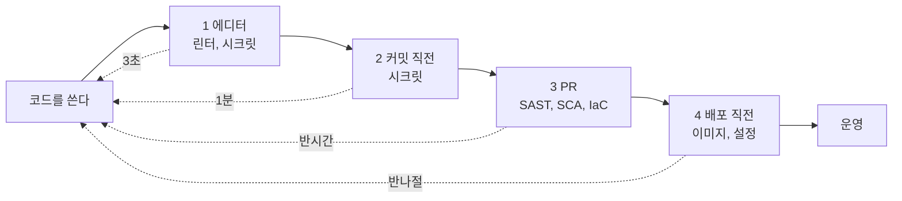

# 3.8 코드를 쓸 때 보안을 같이 쓰는 법

> **오늘의 질문** — 어제 병합된 코드에서 자동으로 걸러진 것이 몇 건입니까.

[3.1](01-coding.md) 은 무엇을 놓치는지를 봤습니다.
이 장은 **그것을 사람이 기억하지 않아도 걸리게 만드는 법**입니다.

전제가 하나 바뀌었기 때문입니다.
코드 리뷰는 "사람이 쓴 코드를 사람이 본다"를 전제했습니다.
작성 속도와 검토 속도가 비슷하니 성립했습니다.
에이전트가 코드를 쓰면서 그 균형이 깨졌습니다.

답은 더 열심히 보는 것이 아닙니다.
<mark>**기계가 먼저 거르고, 사람은 판단할 가치가 있는 것만 보는 것**</mark>입니다.

---

## 먼저 용어 여섯

도구 이름처럼 보이지만 전부 **검사의 종류**를 가리키는 말입니다.

| 말 | 뜻 | 무엇을 잡나 |
|---|---|---|
| **린터** (linter) | 코드 생김새와 뻔한 실수를 보는 검사 | 안 쓰는 변수, 위험한 함수 호출 |
| **시크릿 스캔** (secret scanning) | 코드에 섞여 들어간 비밀 문자열을 찾는 검사 | API 키, 비밀번호, 토큰 |
| **SAST** (정적 분석) | 코드를 **실행하지 않고** 읽어서 취약 패턴을 찾는 검사 | SQL 인젝션 가능 지점, 경로 조작 |
| **DAST** (동적 분석) | 띄워 놓은 서비스에 실제로 요청을 보내 보는 검사 | 인증 누락, 설정 실수 |
| **SCA** (의존성 점검) | 가져다 쓰는 라이브러리에 알려진 취약점이 있는지 보는 검사 | 낡은 패키지, 위험한 라이선스 |
| **IaC 점검** | 인프라를 적어 둔 설정 파일을 읽어 위험한 설정을 찾는 검사 | 공개된 버킷, 열린 보안 그룹 |

<mark>**이 중 하나만 고르라면 시크릿 스캔입니다.**</mark>
가장 싸고, 가장 자주 걸리고, 걸렸을 때 피해가 가장 큽니다.

---

## 네 겹으로 거릅니다

같은 검사를 한 번만 두지 않습니다. 겹마다 성격이 다릅니다.

| 겹 | 언제 | 무엇을 | 걸리면 |
|---|---|---|---|
| 1 **에디터** | 타자 치는 중 | 린터, 시크릿 스캔 | 빨간 줄만 긋습니다 |
| 2 **커밋 직전** | `git commit` 할 때 | 시크릿 스캔, 포맷 | **막습니다** |
| 3 **PR** | 올렸을 때 | SAST, SCA, IaC 점검 | 등급에 따라 막습니다 |
| 4 **배포 직전** | 나가기 전 | 이미지 점검, 설정 점검 | **막습니다** |



점선은 **걸렸을 때 되돌아가는 비용**입니다.
오른쪽으로 갈수록 비싸집니다.

겹을 나누는 이유가 있습니다.
**빠를수록 고치기 싸기 때문**입니다.
에디터에서 걸리면 3초 걸립니다.
배포 직전에 걸리면 되돌리고 다시 올리느라 반나절 갑니다.

2번 겹이 특히 값이 큽니다.
비밀이 한 번 커밋되면 기록에 남습니다.
나중에 지워도 **되돌리기 이력에 남아 있습니다.**
들어가기 전에 막는 것과 들어간 뒤에 지우는 것은 비용이 다릅니다.

---

## 막는 기준을 미리 정합니다

전부 막으면 사람들이 검사를 끕니다. 이게 가장 흔한 실패입니다.

기준을 세 칸으로 나눕니다.

| 등급 | 어떻게 | 예 |
|---|---|---|
| **차단** | 병합이 안 됩니다 | 비밀 문자열, 인가 검증 누락, 알려진 치명 취약점 |
| **경고** | 병합은 되는데 기록이 남습니다 | 중간 등급 취약점, 새 의존성 추가 |
| **보고만** | 대시보드에만 쌓입니다 | 코드 스타일, 낮은 등급 |

**차단 목록은 짧게 유지합니다.** 다섯 줄을 넘기지 않는 것이 좋습니다.
길어지면 예외 요청이 늘고, 예외가 늘면 기준이 없어집니다.

---

## 거짓 경보를 다루는 법

검사를 들이면 반드시 거짓 경보가 납니다.
여기서 조직이 둘로 갈립니다.

**하지 말 것** — <mark class="w">규칙을 통째로 끕니다. 한 번 끄면 다시 안 켭니다.</mark>

**할 것** — 범위를 좁힙니다.
그 파일만, 그 줄만, 기간을 정해서 예외로 둡니다.
예외에는 **이유와 날짜와 사람 이름**을 적습니다.

```
# 예외 기록에 들어갈 것
어디 — 파일과 줄
왜   — 왜 이 경보가 우리 경우엔 맞지 않는지
언제까지 — 날짜. 지나면 다시 올라옵니다
누가 — 사람 이름
```

기한 없는 예외는 예외가 아니라 <mark class="w">**삭제**</mark>입니다.

---

## 에이전트에게 규칙을 주는 법

에이전트에게 코드를 맡기면 검사만으로는 부족합니다.
검사는 **쓴 다음에** 봅니다. 쓰기 전에 거는 것이 더 쌉니다.

### 1. 규칙 파일을 둡니다

저장소에 규칙 파일을 두고 에이전트가 매번 읽게 합니다.
들어갈 내용은 길지 않아도 됩니다.

```
- 비밀은 코드에 쓰지 않는다. 환경 변수나 비밀 저장소에서 읽는다
- SQL 은 문자열을 붙이지 않는다. 매개변수 바인딩만 쓴다
- 새 의존성을 추가하면 PR 설명에 왜 필요한지 적는다
- 사용자 입력이 파일 경로나 외부 요청 주소로 가지 않게 한다
- 에러 메시지에 내부 경로, 버전, 스택을 담지 않는다
- 인가 검증은 클라이언트가 아니라 서버에서 한다
```

**짧을수록 지켜집니다.** 규칙이 길면 뒤쪽이 무시됩니다.

### 2. 작업 단위로 쓸 수 있는 묶음을 만듭니다

같은 지시를 매번 타자로 치고 있다면 묶어 둘 때가 된 것입니다.
"이 변경분을 보안 관점에서 리뷰해라" 같은 작업은
질문 목록이 고정되어 있어서 묶기 좋습니다.

묶음 하나에 들어갈 것은 셋입니다.

- **언제 쓰는지** — 어떤 요청일 때 꺼내는지
- **무엇을 보는지** — 질문 목록. [부록 B-2](../appendix/b-checklists.md) 의 20개를 그대로 써도 됩니다
- **무엇을 하지 않는지** — 코드를 고치지는 말고 지적만 한다 같은 선

### 3. 에이전트가 만든 것은 따로 표시합니다

PR 에 "에이전트가 생성" 표시를 답니다.
차별하려는 것이 아니라 **다른 것을 보기 위해서**입니다.

에이전트가 쓴 코드에서 사람 코드보다 자주 나오는 것이 있습니다.

- **없는 패키지** — 모델이 지어낸 이름일 수 있습니다. 설치 전에 실재를 확인합니다([1.5](../part1/05-recent-attacks.md) 6번)
- **그럴듯한 기본값** — 동작은 하는데 왜 그 값인지 근거가 없습니다
- **예외를 삼키는 코드** — 오류를 잡아서 조용히 넘깁니다
- **복사된 설정** — 예제 설정이 그대로 들어옵니다

### 4. 에이전트를 격리된 곳에서 돌립니다

코딩 에이전트에게 쉘을 주면 그 노트북의 전부를 줄 수 있습니다.
개발 환경에는 토큰이 모여 있습니다.

- 작업용 컨테이너나 가상 머신 안에서 돌립니다
- 나갈 수 있는 목적지를 목록으로 제한합니다
- 운영 자격증명을 개발 환경에 두지 않습니다

관련 — [3.7](07-agent-attacks.md), [3.2](02-agents.md)

---

## 처음 들이는 순서

한꺼번에 넣으면 전부 꺼집니다. 이 순서를 권합니다.

| 주 | 할 일 | 왜 이 순서인가 |
|---|---|---|
| 1주 | 시크릿 스캔을 켭니다. 처음엔 **보고만** | 지금 무엇이 들어 있는지부터 봅니다 |
| 2주 | 이미 들어간 비밀을 전부 갈아 끼웁니다 | 막기 전에 치웁니다 |
| 3주 | 시크릿 스캔을 **차단**으로 올립니다 | 새로 들어오는 것을 끊습니다 |
| 4주 | SCA 를 켭니다. 치명 등급만 차단 | 가장 많이 나오는 검사라 기준이 필요합니다 |
| 2개월 | SAST 를 켭니다. 처음엔 경고 | 거짓 경보가 많아 적응 기간이 필요합니다 |
| 3개월 | 규칙 파일과 PR 표시를 넣습니다 | 검사가 자리 잡은 뒤에 얹습니다 |

**2주차를 건너뛰지 마십시오.**
막기부터 하면 이미 들어간 비밀은 그대로 남습니다.
그게 실제로 쓰이는 비밀입니다.

---

## 하지 말 것

**검사 결과를 메일로만 보내기.** 아무도 안 봅니다.
병합을 막거나 PR 화면에 띄워야 봅니다.

**점수를 성과 지표로 쓰기.** 사람들이 점수를 올리는 쪽으로 움직입니다.
검사를 피해 가는 코드가 늘어납니다.

**에이전트에게 보안 판단을 맡기기.**
에이전트는 질문 목록을 돌리는 데 쓰고,
막을지 말지는 사람이 정합니다.

**도구를 먼저 사기.** 무엇을 막을지 정하기 전에 사면
도구가 기준을 대신 정해 버립니다.

---

## 우리 조직 체크 3문항

1. 비밀 문자열이 커밋되는 것을 **막는** 검사가 있습니까. 보고만 하는 것 말고.
2. 병합을 차단하는 조건이 문서에 적혀 있습니까. 몇 줄입니까.
3. 에이전트가 추가한 의존성을 사람이 보는 자리가 있습니까.

---

---

## 개념 확인

**Q.** 시크릿 스캔을 차단 등급으로 올리기 **전에** 반드시 해야 하는 일은 무엇입니까.

1. SAST 를 먼저 도입한다
2. 이미 들어가 있는 비밀을 전부 갈아 끼운다
3. 규칙 파일을 작성한다
4. 거짓 경보가 나는 규칙을 끈다

<details>
<summary>답 보기</summary>

**2번.** 막기부터 하면 새로 들어오는 것만 끊깁니다.
**이미 들어간 비밀은 그대로 남고, 그게 실제로 쓰이는 비밀입니다.**
치우고 나서 막는 순서여야 합니다.

</details>

## 한 줄 요약

**사람이 기억해서 지키는 규칙은 지켜지지 않습니다.**
기계가 먼저 거르고, 사람은 판단할 것만 봅니다.

---

## 더 볼 곳

- [3.1 개발자가 놓치기 쉬운 자리](01-coding.md)
- [3.2 코딩 에이전트를 쓰면 놓치는 것](02-agents.md)
- [3.7 에이전트 공격은 어떻게 도는가](07-agent-attacks.md)
- [1.5 요즘 들어오는 수법 열 가지](../part1/05-recent-attacks.md) — 5번과 6번이 공급망입니다
- [부록 B-2 PR 리뷰 질문 20개](../appendix/b-checklists.md)
- [부록 F 우리 서버 안전 점검 100점](../appendix/f-server-audit.md) — F 영역이 비밀과 공급망입니다
- [4.10 설치 한 줄](../part4/10-supply-npm.md)
