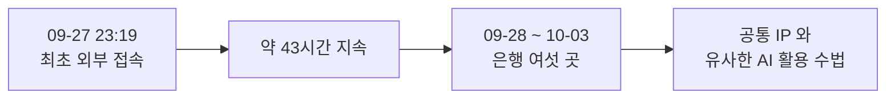

# 4.1 엿새 동안 은행 여섯 곳 (2026)

> 여기부터 사건입니다. 앞에서 본 개념들이 어떻게 실제로 작동했는지 봅니다.

> **오늘의 질문** — 우리 조직에서 "그건 중요한 시스템이 아니라서"라고 분류한 것은 무엇입니까.

<!-- [장면 필요] 이 사건 소식을 들었을 때 저자의 조직에서 무슨 일이 있었는지.
     누가 먼저 물었고, 며칠 만에 점검했고, 무엇이 나왔는지.
     4부 전체에서 독자가 "남의 일"로 읽지 않게 만드는 자리다. -->

## 무슨 일이 있었나

| 날짜 | 일어난 일 |
|---|---|
| 2026-09-27 23:19경 | 한 은행의 직원용 모바일 업무지원시스템에 외부 접속 시작 (⚠️ F-005) |
| 2026-09-28 ~ 10-03 | 신한, 하나, KB국민, 부산, NH농협, 우리은행에서 같은 수법 확인 (✅ F-001) |
| 2026-09-29 18:00경 | 위 접속이 끝남. 약 43시간 지속 (⚠️ F-005) |
| 2026-09-30 | KB국민은행이 비정상 외부 접속을 확인하고 서버와 접속 경로 차단 |
| 2026-10-02 | 금융위원회가 추가 피해를 공식 확인. 긴급 상황대응 회의 (✅ F-007) |

금융당국은 공통 IP 와 유사한 AI 활용 수법을 근거로
최소 여섯 곳을 동일 주체의 공격으로 추정했습니다(✅ F-001).
증권과 카드와 보험사에도 시도가 있었습니다(✅ F-007).

보도 기준 피해는 이렇습니다(⚠️ F-003, 조사 중이라 변동 가능).

| 기관 | 규모 |
|---|---|
| 신한은행 | 고객 25,729명 |
| KB국민은행 | 119명 (고객 99명, 임직원 20명) |
| 하나은행 | 고객 89명 |
| BNK부산은행 | 외주 개발직원 11명 |
| 우리은행, NH농협은행 | 유출 없음 (침입 방지 시스템 작동) |

유출 항목에 주민등록번호 66건과 연계정보 97건이 포함됐습니다.

## 어떻게 들어왔나

**들어온 곳이 전부 주변부였습니다.**

KB국민은행은 직원용 모바일 업무지원시스템이었습니다.
하나은행은 영업지원시스템이었고, 하나은행은 그 시스템이
인터넷뱅킹과 모바일뱅킹 거래 시스템과 별개라고 밝혔습니다(✅ F-004).
신한은행은 모바일 홈페이지였고, 공격자는 대출신청 결과를 포함한
여섯 개 서비스를 집중적으로 조회했습니다(⚠️ F-006).

그리고 결정적인 사실. **이 직원용 업무지원 시스템들은 당국 점검 대상에서 빠져
금융사 자체 점검에 맡겨져 있었습니다**(✅ F-004).

동일 주체 추정의 핵심 근거는 중국어 기반 AI 자율 침투 테스트 플랫폼의
흔적이었습니다. 다만 이 도구는 **공개 플랫폼**이라 중국발 공격으로
단정할 수 없습니다(⚠️ F-002).

**엿새 동안 벌어진 일**

## 어디서 실패했나

**1. 점검 대상 목록이 자산 목록과 달랐습니다.**

이것이 이 사건의 한 문장 요약입니다. 규제가 보는 목록과
실제로 존재하는 시스템 목록이 달랐고, 공격자는 그 차이로 들어왔습니다.

**2. 주변부 시스템이 비싼 데이터에 닿았습니다.**

유출 항목에는 고객명과 전화번호뿐 아니라 연소득과 대출 산출한도가 포함됐고,
일부는 주민등록번호와 연계정보까지 나갔습니다(⚠️ F-003, 보도 기준).

**어느 항목이 어느 기관에서 나왔는지는 보도에서 구분되지 않습니다.**
다만 분명한 것은 하나입니다. 점검 우선순위가 낮게 매겨진 시스템들을 통해
이 수준의 데이터가 나갔습니다.

중요도 분류와 실제로 닿는 범위가 어긋나 있었다는 뜻입니다.
1.1 의 「주변부」 개념 그대로입니다.

**3. 조회 패턴이 즉시 걸리지 않았습니다.**

43시간 동안 비정상 접속이 이어졌습니다(⚠️ F-005).
신한은행 사례에서는 여섯 개 서비스를 집중 조회했습니다(⚠️ F-006).
집중 조회는 사람의 업무 패턴과 다릅니다. 알림이 걸려 있었다면 더 일찍 끊었을 것입니다.

**4. 같은 수법이 여러 조직에 통했습니다.**

한 곳에서 통한 수법이 엿새 동안 여섯 곳에서 통했습니다.
이것은 **업계 공통의 구조적 공백**이 있었다는 뜻입니다.
한 조직의 실수가 아닙니다.

## 무엇이 있었으면 막혔나

**자산 목록과 점검 대상의 대조.** 분기마다 "점검 대상이 아닌 자산"을
목록으로 뽑고, 그 목록의 크기를 지표로 관리합니다(2.1).

**주변부 시스템의 데이터 접근 범위 축소.** 직원용 도구가 고객 상세 정보를
전체 값으로 조회할 필요가 있는지 다시 봅니다. 마스킹으로 충분한 자리가 많습니다(3.6).

**조회량 이상 탐지.** 한 계정이 평소의 몇 배를 조회하면 알림이 울려야 합니다.
비싼 도구가 아니라 쿼리 하나로 시작할 수 있습니다(2.3).

**아웃바운드 통제.** 조회한 데이터가 밖으로 나가는 경로를 제한합니다.
침입을 못 막아도 유출을 줄입니다(3.3).

**업계 공유.** 같은 수법이 여섯 곳에 통했다는 것은 한 곳이 막았을 때
그 정보가 빨리 돌았어야 했다는 뜻입니다. 우리은행과 농협은행이 막았다면,
**어떻게 막았는지가 가장 값진 정보**입니다.

## 막은 쪽을 봅니다

이 사건에서 가장 덜 다뤄진 사실이 있습니다.
**우리은행과 농협은행은 같은 공격을 받고 막았습니다**(⚠️ F-003).

사고 분석은 보통 뚫린 쪽만 봅니다. 그런데 배울 것은 막은 쪽에 있습니다.
같은 날, 같은 수법, 다른 결과입니다.

방어 쪽 준비가 없었던 것도 아닙니다. 금융보안원은 이번 사태 이전인
2025년 말에 모의해킹 조직을 6명에서 20명으로 늘리고
AI 레드팀을 신설했습니다(✅ F-008).

**준비의 양이 아니라 범위가 문제였습니다.**
준비는 중요 시스템에 집중됐고, 공격은 그 바깥으로 들어왔습니다.

## 우리 조직 체크 3문항

1. 점검 대상이 아닌 시스템이 몇 개입니까. 그중 고객 데이터에 닿는 것은 몇 개입니까.
2. 직원용 도구에서 고객 정보를 전체 값으로 조회할 수 있습니까. 마스킹으로 충분하지 않습니까.
3. 한 계정이 평소의 100배를 조회하면 알림이 울립니까.

---

## 개념 확인

**Q.** 규제가 요구하는 점검 대상을 다 지켰는데도 뚫렸습니다. 왜 그렇습니까. (주관식)

답 보기

**규제 목록은 최소선이기 때문입니다.**
공격자는 그 목록을 보지 않고 열려 있는 문을 봅니다.
들어온 자리는 전부 목록 **밖**에 있던 주변부 시스템이었습니다(✅ F-004).

## 한 줄 요약

규제 대상 목록은 최소선이고, 공격자는 그 목록 밖에서 들어옵니다.

---

**출처**

사실마다 근거를 직접 열어 볼 수 있게 링크를 답니다.
확인 날짜와 원문 요지는 [`research/facts.yaml`](../research/facts.yaml) 에 있습니다.

| 사실 | 확인 | 근거를 직접 보기 |
|---|---|---|
| `F-001` | ✅ | [seoul.co.kr](https://www.seoul.co.kr/news/economy/2026/10/04/20261004500025) — 2차(언론, 금융당국 인용) |
| `F-002` | ⚠️ | — 원문이 내려갔습니다. 대체 출처를 찾는 중입니다 |
| `F-003` | ⚠️ | [newspim.com](https://www.newspim.com/news/view/20261002001278) — 2차 |
| `F-004` | ✅ | [newspim.com](https://www.newspim.com/news/view/20261002001278) — 2차 |
| `F-005` | ⚠️ | [seoul.co.kr](https://www.seoul.co.kr/news/economy/2026/10/04/20261004500025) — 2차(의원실 자료 인용) |
| `F-006` | ⚠️ | [busan.com](https://www.busan.com/view/busan/view.php?code=2026100418075759253) — 2차 |
| `F-007` | ✅ | [seoul.co.kr](https://www.seoul.co.kr/news/economy/2026/10/04/20261004500025) — 2차 |
| `F-008` | ✅ | [m.boannews.com](https://m.boannews.com/html/detail.html?idx=141206) — 2차 |

**읽어 볼 곳**

- 서울신문, [동일 해커, 중국 AI로 최소 6개 은행 공격](https://www.seoul.co.kr/news/economy/2026/10/04/20261004500025) (2026-10-04)
- 서울신문, [중국 AI 손에 쥔 해커](https://www.seoul.co.kr/news/economy/2026/10/05/20261005001002) (2026-10-05)
- 뉴스핌, [은행권 전방위 해킹 종합](https://www.newspim.com/news/view/20261002001278) (2026-10-02)
- 부산일보, [해커들 표적된 금융권](https://www.busan.com/view/busan/view.php?code=2026100418075759253) (2026-10-04)
- 보안뉴스, [금융보안원 2026년 조직 개편](https://m.boannews.com/html/detail.html?idx=141206)

전부 2차 자료입니다. 공식 발표는 [금융위원회](https://www.fsc.go.kr/),
[금융감독원](https://www.fss.or.kr/), [금융보안원](https://www.fsec.or.kr/) 에서 확인하십시오.
