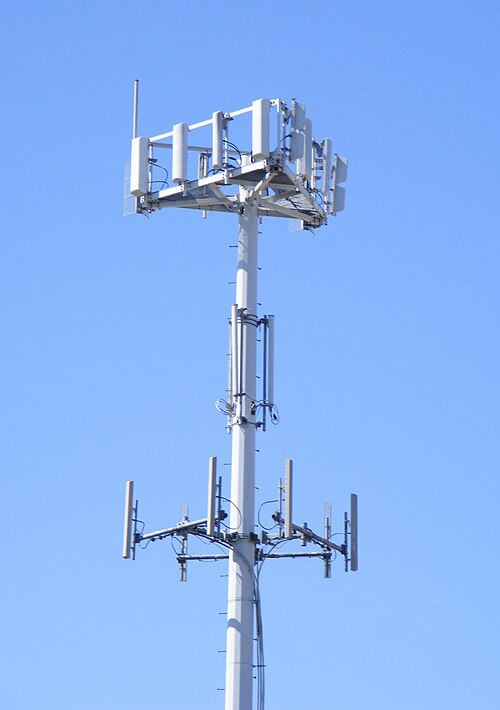
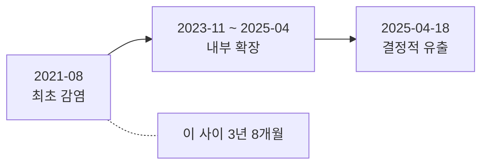

# 4.2 3년 8개월 (통신사, 2025)

> **오늘의 질문** — 3년 전에 우리 서버에서 일어난 일을 지금 확인할 수 있습니까.

## 무슨 일이 있었나

2025년 4월, 국내 통신사에서 가입자 유심 정보가 대규모로 유출됐습니다.
정부는 중대 침해사고로 판단하고 2025년 4월 23일 민관합동조사단을 구성해
전체 42,605대 서버를 대상으로 두 달간 정밀 조사를 진행했습니다(✅ F-024).

최종 결과는 2025년 7월 4일에 발표됐습니다.

| 시점 | 일어난 일 |
|---|---|
| 2021-08 | 내부 서버에 악성코드 순차 감염 시작 (✅ F-020) |
| 2022 | 공격 사실을 발견. **조치가 미흡했고 당국에 알리지 않음** (✅ F-022) |
| 2023-11 ~ 2025-04 | 다양한 서버에 추가 악성코드를 설치하며 내부 확장 (✅ F-020) |
| 2025-04-18 | 음성통화인증 서버에서 유심 정보 유출 (✅ F-020) |
| 2025-04-23 | 민관합동조사단 구성 (✅ F-024) |
| 2025-07-04 | 최종 전수조사 결과 발표 |

최초 감염부터 결정적 유출까지 **3년 8개월**입니다.

유출 규모는 9.82GB, IMSI 기준 26,957,749건입니다.
감염 서버는 최종 28대, 악성코드는 33종이 발견됐습니다.
BPF도어 계열 27종, 타이니쉘 3종, 웹쉘 1종, 오픈소스 악성코드 2종입니다.
IMEI 291,831건이 담긴 파일도 확인됐습니다(✅ F-021).

<figure class="shot">
  
  <figcaption>이동통신 기지국. 가입자 인증에 쓰이는 정보가 이 망의 뒤편에 모여 있습니다. 사진 The original uploader was J.smith at English , <a href="https://creativecommons.org/licenses/by-sa/2.5">CC BY-SA 2.5</a></figcaption>
</figure>

## 어떻게 들어왔고 어떻게 머물렀나

초기 침투 경로보다 **머문 방식**이 이 사건의 핵심입니다.

공격자는 한 번에 끝내지 않았습니다. 2021년에 들어와서
2023년 11월부터 2025년 4월까지 서버를 하나씩 늘려 갔습니다(✅ F-020).
1.1 에서 본 공격 생애주기의 확산과 잠복 단계가 4년에 걸쳐 진행됐습니다.

BPF도어 계열이 27종 발견됐다는 점이 눈에 띕니다(✅ F-021).
이런 종류의 도구는 조용히 머무는 데 특화되어 있습니다.
평소에는 아무 일도 하지 않다가 특정 신호가 올 때만 깨어납니다.
그래서 일반적인 탐지에 잘 안 걸립니다.

**3년 8개월의 모양**

## 어디서 실패했나

**1. 2022년에 발견하고도 끝내지 못했습니다.**

이것이 가장 뼈아픈 지점입니다. 조사단은 2022년에 공격 사실을 발견하고도
조치가 미흡했고, 당국에 알리지 않고 자체 해결로 대응하다 문제를 키웠다고
밝혔습니다(✅ F-022).

보안 사고에서 가장 비싼 선택이 **"우리가 조용히 처리하자"** 입니다.
외부에 알리면 비용과 평판 손실이 옵니다. 안 알리면 당장은 아무 일도 없습니다.
그런데 조용히 처리한 것이 실제로 처리된 것인지 확인할 방법이
내부에는 없습니다. 3년 뒤에 알게 됩니다.

**2. 로그가 없었습니다.**

조사단 내부에서 2024년 이전 기간은 로그가 1년 치도 남아 있지 않아
유출 여부를 확인할 방법 자체가 없다는 지적이 나왔습니다(⚠️ F-023).

최초 감염(2021년 8월)부터 로그가 남기 시작한 시점까지 2년 넘게 공백입니다.
**그 기간에 무엇이 나갔는지는 영원히 모릅니다.**
피해 규모를 숫자로 말할 수 없으면 최악을 가정해야 하고,
그게 더 큰 비용입니다.

**3. 계정 정보가 평문으로 다른 서버에 있었습니다.**

음성통화인증 관리서버의 계정정보를 다른 서버에 평문으로 저장해
인증 기준을 위반한 점이 지적됐습니다(✅ F-022).

이것이 내부 이동을 쉽게 만들었습니다. 서버 한 대를 잡으면
다음 서버의 열쇠가 거기 있습니다. 1.1 의 「내부 이동」 그대로입니다.

**4. 증거가 훼손됐습니다.**

자료 보전 명령을 받았는데도 서버 두 대를 포렌식 분석이 불가능한 상태로
제출한 점이 지적됐습니다(✅ F-022). 악의였는지 서두른 복구였는지는
알 수 없지만 결과는 같습니다.

## 무엇이 있었으면 막혔나

**2022년에 제대로 끝냈어야 했습니다.** 침해를 발견했을 때
"이 흔적만 지우면 되는가"가 아니라 "공격자가 어디까지 갔는가"를
물어야 합니다. 그 질문에 답하려면 외부 전문가가 필요하고,
외부를 부르면 대개 신고로 이어집니다. 그래서 안 부릅니다.

**조직이 이 구조를 바꿔야 합니다.** 신고하고 외부를 부른 담당자가
불이익을 받는 구조면 다음에도 숨깁니다. 2.3 의 사고 대응 절차에
"외부를 부르는 기준"을 미리 적어 두는 이유가 이것입니다.

**로그를 서버 밖에 오래 두었어야 했습니다.** 3.5 의 전부입니다.
인증과 권한 로그는 최소 1년, 가능하면 더 오래. 서버 밖에, 변조 불가능하게.
로그는 공격을 막지 않지만 **범위를 말할 수 있게** 합니다.

**계정 정보를 평문으로 두지 않았어야 했습니다.** 1.3 의 비밀 관리입니다.
중앙 비밀 관리 체계를 쓰고, 서버에 다른 서버의 자격증명을 두지 않습니다.

**카나리가 있었으면 더 일찍 알았을 수 있습니다.** 3.6 의 카나리입니다.
3년 8개월 동안 조용히 머무는 공격자는 탐지 규칙에는 안 걸려도
건드리면 안 되는 가짜 자산에는 걸릴 수 있습니다.

**보전 먼저, 복구 나중.** 2.3 의 절차입니다. 급할수록 이 순서가 흔들립니다.

## 이 사건이 남긴 질문

사고 이후 해당 기업은 정보보호최고책임자 조직을 대표 직속으로 격상하고
레드팀을 신설하겠다고 밝혔습니다(⚠️ F-025, 발표 기준이고 이행 여부는 확인하지 않았습니다).
조직 개편은 의미가 있습니다.

다만 이 사건이 남긴 질문은 조직도가 아닙니다.

**2022년에 그 담당자는 왜 외부에 알리지 않았을까요.**

기술적 무능이었을 수도 있고, 조직 문화였을 수도 있고,
알렸을 때 생길 일이 무서웠을 수도 있습니다.
세 번째라면 조직도를 바꿔도 다시 일어납니다.

## 우리 조직 체크 3문항

1. 3년 전 특정 서버의 접근 기록을 지금 조회할 수 있습니까.
2. 침해를 발견한 담당자가 외부 전문가를 부르자고 말할 수 있습니까. 그 결정을 누가 합니까.
3. 서버 A 에 서버 B 의 자격증명이 평문으로 있는 자리가 있습니까.

---

## 개념 확인

**Q.** 3년 8개월 동안 발각되지 않은 원인으로 이 장이 짚은 것은 무엇입니까.

1. 암호화를 하지 않아서
2. 로그가 없던 기간이 있어서
3. 방화벽이 없어서
4. 직원 교육이 부족해서

답 보기

**2번.** 로그가 없는 기간은 나중에 어떤 도구로도 복원되지 않습니다.
**영원히 공백으로 남습니다.** 그리고 조용히 처리한 사고는
처리된 것이 아니라 기록되지 않은 것입니다.

## 한 줄 요약

조용히 처리한 사고는 처리된 것이 아니고, 로그 없는 기간은 영원히 공백입니다.

---

**출처**

사실마다 근거를 직접 열어 볼 수 있게 링크를 답니다.
확인 날짜와 원문 요지는 [`research/facts.yaml`](../research/facts.yaml) 에 있습니다.

| 사실 | 확인 | 근거를 직접 보기 |
|---|---|---|
| `F-020` | ✅ | [news.nate.com](https://news.nate.com/view/20250704n26170?mid=n0100) — 2차(과기정통부 발표 인용) |
| `F-021` | ✅ | [korea.kr](https://www.korea.kr/briefing/policyBriefingView.do?newsId=156689741) — 1차(부처 브리핑) |
| `F-022` | ✅ | [news.nate.com](https://news.nate.com/view/20250704n26170?mid=n0100) — 2차(과기정통부 발표 인용) |
| `F-023` | ⚠️ | [news.nate.com](https://news.nate.com/view/20250704n26170?mid=n0100) — 2차 |
| `F-024` | ✅ | [korea.kr](https://www.korea.kr/briefing/policyBriefingView.do?newsId=156689741) — 1차(부처 브리핑) |
| `F-025` | ⚠️ | [news.nate.com](https://news.nate.com/view/20250704n26170?mid=n0100) — 2차 |

**읽어 볼 곳**

- **1차** — 대한민국 정책브리핑, [SKT 침해사고 민관합동조사단 조사 결과](https://www.korea.kr/briefing/policyBriefingView.do?newsId=156689741)
- 네이트뉴스, [4년 전 침투해 유출까지](https://news.nate.com/view/20250704n26170?mid=n0100) (2025-07-04, 과기정통부 발표 인용)
