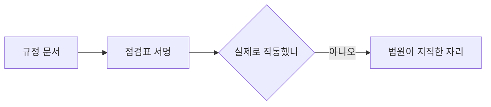
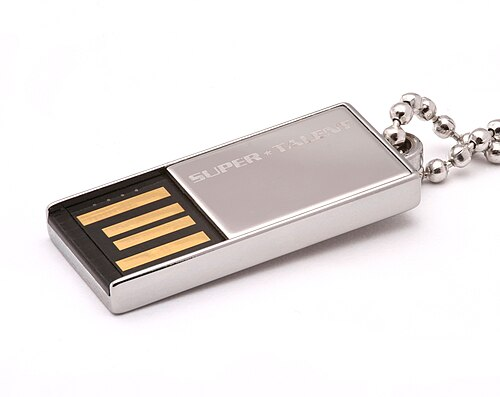

# 4.4 노트북 한 대와 USB 하나 (2011, 2014)

> 15년 전 사건입니다. 그런데 2026년 사건에서도 외주 개발직원 정보가 나갔습니다.
> 이 구조는 아직 안 고쳐졌습니다.

> **오늘의 질문** — 지금 우리 시스템에 접근 권한이 있는 외부 인력은 몇 명입니까.

## 사건 하나 — 2011년, 전산망 마비

| 시점 | 일어난 일 |
|---|---|
| 2010-09-04 | 외주 유지보수 업체 직원의 업무용 노트북이 외부에서 받은 파일로 감염 (⚠️ F-044) |
| 2010-09 ~ 2011-04 | 약 7개월 동안 관리자 비밀번호 등 정보 수집 (⚠️ F-044) |
| 2011-04-12 17:00 | 서버 OS 삭제 명령 실행. 전산망 불통 (⚠️ F-043, F-044) |
| 2011-04-13 오후 | 일부 업무 복구 |
| 2011-04-30 | 전체 업무 정상화 (⚠️ F-043) |

서버 273대에 장애가 발생했고, 현금카드와 ATM 과 인터넷뱅킹이 멈췄습니다(⚠️ F-043).
전체 정상화까지 18일이 걸렸습니다.

공격 주체에 대한 당국 발표에는 당시 여러 의문이 제기됐습니다.
이 책은 주체를 단정하지 않습니다. **구조만 봅니다.**

## 구조가 말하는 것

이 사건의 구조는 이렇습니다.

외부 인력의 **개인 용도로도 쓰이던 업무용 노트북**이, **내부 서버의
높은 권한에 접근**할 수 있었고, 그 노트북이 감염된 뒤
**7개월 동안 아무도 몰랐습니다**(⚠️ F-044).

세 가지가 겹쳤습니다.

**1. 단말 분리가 없었습니다.** 업무용과 개인용이 한 기기였습니다.
외부에서 받은 파일이 들어왔고, 그 기기로 서버에 접속했습니다.

**2. 권한이 과했습니다.** 유지보수 업체 직원의 노트북에서
서버 OS 를 삭제할 수 있는 명령이 나갔습니다.
유지보수에 그 권한이 필요했을까요.

**3. 7개월 동안 탐지가 없었습니다.** 1.1 의 「장기 잠복」입니다.
정보를 수집하는 동안 아무 신호도 울리지 않았습니다.

**있는 것과 작동하는 것**

<figure class="shot">
  
  <figcaption>USB 저장장치. 2014년 사건에서 1억 건이 이것 하나로 나갔습니다. 통제가 문서에는 있었습니다. 사진 Afrank99, <a href="https://creativecommons.org/licenses/by-sa/3.0">CC BY-SA 3.0</a></figcaption>
</figure>

## 사건 둘 — 2014년, 1억 400만 건

| 시점 | 일어난 일 |
|---|---|
| 2012 | 카드 3사가 부정사용예방시스템 용역 개발을 신용평가사에 위탁 (✅ F-041) |
| 2012-10, 12 | 투입된 외주 직원이 USB 로 고객 정보 반출 (✅ F-041) |
| 2014-01 | 유출 확인. 3사 합계 1억 400만 건 (✅ F-040) |

유출 항목은 카드번호, 주거상황, 신용한도, 신용등급, 결제일,
결제계좌, 유효기간 등 19종입니다(✅ F-040).
반출량은 1억 580만 건이었고, 해당 직원은 2014년에 징역 3년을 선고받았습니다(✅ F-041).

법원이 지적한 것은 셋입니다(✅ F-042).

- USB 쓰기 제한 보안프로그램의 설치와 **실제 작동 여부**에 대한 관리 감독 미흡
- 외주업체 직원에 대한 **보안 지침 부재**
- **접근권한 제한 조치 미실시**

카드 3사는 3개월 영업정지 중징계를 받았습니다(✅ F-042).

## 두 번째 지적이 핵심입니다

법원이 "보안프로그램의 **실제 작동 여부**에 대한 관리 감독 미흡"이라고
적은 부분이 중요합니다.

보안프로그램이 없었던 것이 아닙니다. **있었는데 작동하는지 확인하지 않았습니다.**

이것이 통제의 가장 흔한 실패 방식입니다. 도입하고, 문서에 적고, 감사에 보여 주고,
그다음 아무도 확인하지 않습니다. 몇 년 지나면 예외가 쌓이고
특정 단말에서는 꺼져 있습니다.

3.6 의 「상시 검증」이 이것 때문에 필요합니다.
**통제가 있는 것과 작동하는 것은 다른 일입니다.**

<!-- [장면 필요] 외주 계정이나 권한 정리가 안 돼 있던 것을 발견한 순간.
     계약은 끝났는데 살아 있던 계정이 몇 개였는지.
     15년 전 사건이 지금 이야기가 되는 다리 역할을 한다. -->

## 2026년에도 같은 자리

2026년 금융권 사건에서 한 은행의 피해자는 **외주 개발직원 11명**이었습니다(⚠️ F-003).

15년이 지났는데 외주 구간이 여전히 사건에 등장합니다.
이번에는 외주 인력이 가해자가 아니라 피해자였습니다.
그런데 공격자 입장에서 **외주 인력 명단은 다음 공격의 표적 목록**입니다.

외주는 계속 쓸 것입니다. 쓰지 말자는 말이 아닙니다.
구간을 설계하자는 말입니다.

## 무엇이 있었으면 막혔나

**단말을 분리합니다.** 외부 인력이 내부에 접속하는 기기를 지정합니다.
지급된 기기만, 또는 가상 데스크톱만 허용합니다.
개인 기기에서 바로 들어오게 두지 않습니다.

**권한을 작업 단위로 줍니다.** 유지보수를 한다고 상시 관리자 권한을 주지 않습니다.
필요할 때 신청해서 받고, 작업이 끝나면 회수합니다(2.2).

**반출 경로를 통제합니다.** 매체 쓰기, 대량 다운로드, 외부 전송.
세 경로에 통제와 기록을 둡니다. 그리고 **실제로 작동하는지 분기마다 확인합니다.**

**계약 시작할 때 종료일을 설정합니다.** 2.2 에서 말한 것입니다.
사람의 기억에 의존하면 회수가 안 됩니다.

**활동을 기록합니다.** 외부 인력의 세션은 전부 기록합니다.
2011년 사건에서 7개월 동안 아무도 몰랐던 것은 보는 눈이 없었기 때문입니다.

**카나리를 외주 구간에 둡니다.** 3.6 의 카나리입니다.
외주가 접근할 이유가 없는 가짜 자산을 두고, 건드리면 알립니다.

## 외주 계약서에 넣을 것

기술 통제만으로는 부족합니다. 계약서에 들어가야 효력이 생깁니다.

1. 접근 가능한 시스템의 **목록**과 그 외 접근 금지
2. 접속 **기기와 경로** 지정
3. 작업 **기간**과 자동 만료
4. 데이터 **반출 금지**와 예외 승인 절차
5. 보안 **사고 발생 시 통지 의무**와 기한
6. 재위탁 **금지** 또는 사전 승인
7. 계약 종료 시 **데이터 파기** 확인
8. **감사 수용** 의무

7번이 자주 빠집니다. 계약은 끝났는데 작업하면서 받은 데이터가
그쪽 노트북에 남아 있습니다.

## 우리 조직 체크 3문항

1. 외부 인력이 어떤 기기로 우리 시스템에 들어옵니까. 지정된 기기입니까.
2. 지금 살아 있는 외주 계정 중 계약이 끝난 것이 있습니까.
3. 매체 반출 통제가 **실제로 작동하는지** 마지막으로 확인한 날은 언제입니까.

---

## 개념 확인

**Q.** 이 사건에서 법원이 지적한 핵심은 무엇이었습니까.

1. 통제가 아예 없었다
2. 통제는 있었으나 작동하지 않았다
3. 외주를 쓴 것 자체가 잘못이다
4. 암호화를 하지 않았다

답 보기

**2번.** 규정도 있었고 절차도 문서에 있었습니다.
**있는 것과 작동하는 것은 다른 일**이고, 그 차이가 지적된 자리입니다.
점검표에 서명이 있다고 점검이 된 것은 아닙니다.

## 한 줄 요약

통제가 있는 것과 작동하는 것은 다른 일이고, 법원도 그 차이를 지적했습니다.

---

**출처**

사실마다 근거를 직접 열어 볼 수 있게 링크를 답니다.
확인 날짜와 원문 요지는 [`research/facts.yaml`](../research/facts.yaml) 에 있습니다.

| 사실 | 확인 | 근거를 직접 보기 |
|---|---|---|
| `F-003` | ⚠️ | [newspim.com](https://www.newspim.com/news/view/20261002001278) — 2차 |
| `F-040` | ✅ | [etnews.com](https://www.etnews.com/20141226000110) — 2차 |
| `F-041` | ✅ | [thescoop.co.kr](https://www.thescoop.co.kr/news/articleView.html?idxno=25228) — 2차 |
| `F-042` | ✅ | [m.boannews.com](https://m.boannews.com/html/detail.html?idx=51708) — 2차 |
| `F-043` | ⚠️ | [ko.wikipedia.org](https://ko.wikipedia.org/wiki/%EB%86%8D%ED%98%91_%EC%A0%84%EC%82%B0%EB%A7%9D_%EB%A7%88%EB%B9%84_%EC%82%AC%ED%83%9C) — 3차(위키) |
| `F-044` | ⚠️ | [m.boannews.com](https://m.boannews.com/html/detail.html?idx=29192) — 2차 |

**읽어 볼 곳**

- 전자신문, [2014년 10대 뉴스 — 카드3사 대규모 개인정보유출](https://www.etnews.com/20141226000110)
- 더스쿠프, [카드3사 고객정보 유출사건 3년의 기록](https://www.thescoop.co.kr/news/articleView.html?idxno=25228)
- 보안뉴스, [카드 3사 1심 판결로 본 시사점](https://m.boannews.com/html/detail.html?idx=51708)
- 보안뉴스, [농협 사이버테러 사건 그 이후](https://m.boannews.com/html/detail.html?idx=29192)
- 위키백과, [농협 전산망 마비 사태](https://ko.wikipedia.org/wiki/%EB%86%8D%ED%98%91_%EC%A0%84%EC%82%B0%EB%A7%9D_%EB%A7%88%EB%B9%84_%EC%82%AC%ED%83%9C) (3차 자료)
