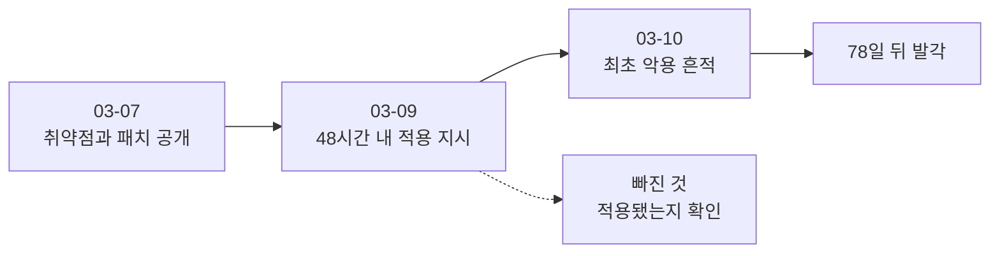

# 4.5 78일 (Equifax, 2017)

> 패치 관리의 교과서 사례입니다. 미 하원 감독위원회 보고서가 공개되어 있어
> 1차 자료로 확인할 수 있는 드문 사건입니다.

> **오늘의 질문** — 심각도가 가장 높은 취약점이 공개되면 우리는 며칠 안에 적용합니까.

## 무슨 일이 있었나

| 날짜 | 일어난 일 |
|---|---|
| 2017-03-07 | Apache Struts 취약점 CVE-2017-5638 공개. CVSS 10.0. 패치 배포 (✅ F-050) |
| 2017-03-07 ~ 08 | 공개 익스플로잇 코드가 24시간 내 등장 (✅ F-050) |
| 2017-03-08 | US-CERT 가 Equifax 를 포함한 신용평가사들에 통보 (✅ F-050) |
| 2017-03-09 | Equifax 내부 메일로 48시간 내 패치 적용 요청 (✅ F-050) |
| 2017-03-10 | 공격자가 해당 취약점을 악용한 **최초 증거** (✅ F-050) |
| 2017-03-15 | 보안팀 스캔. **취약점을 탐지하지 못함** (✅ F-050) |
| 2017-07-29 | 의심스러운 네트워크 트래픽 발견 후 패치 적용 (✅ F-050) |
| 2017-07-30 | 웹 애플리케이션 오프라인 전환 (✅ F-050) |

**패치는 78일 동안 적용되지 않았습니다**(✅ F-050).

결과는 미국인 **1억 4,700만 명**의 이름, 사회보장번호, 생년월일, 주소,
운전면허번호 노출이었습니다(✅ F-051).

<figure class="shot">
  
  <figcaption>Apache Struts. 2017년 3월 7일에 취약점과 패치가 함께 공개됐습니다. 지시는 이틀 뒤에 내려갔고, 적용 여부는 아무도 확인하지 않았습니다. 사진 출처 불명, 퍼블릭 도메인</figcaption>
</figure>

## 세 줄에 모든 것이 있습니다

위 표에서 세 줄만 봐도 됩니다.

**3월 9일 — 48시간 내 적용하라는 내부 메일이 나갔습니다.**
정책이 없었던 것이 아닙니다. 지시도 있었습니다.

**3월 10일 — 다음 날 공격이 시작됐습니다.**
48시간의 유예가 끝나기 전에 들어왔습니다.
공개 익스플로잇이 24시간 안에 나왔으니 당연합니다.

**3월 15일 — 스캔했는데 못 찾았습니다.**
이 줄이 가장 중요합니다. 확인을 **했는데** 실패했습니다.

**78일의 타임라인**

## 스캔이 왜 실패했을까

보안팀이 스캔을 돌렸고 외부 노출 시스템에서 그 취약점을 탐지하지 못했습니다(✅ F-050).

스캔이 무언가를 못 찾는 이유는 보통 둘입니다.
**스캔 대상에 그 시스템이 없었거나**, 스캔 방식이 그 취약점을 못 보는 것입니다.

사전 감사에서 지적된 내용이 첫 번째를 가리킵니다.
감사는 Equifax 가 자체 패치 일정을 준수하지 않고,
**IT 자산 목록이 미비하며**, 자산 중요도 기반 패치 우선순위가 없고,
패치 절차가 명예 제도에 의존한다고 지적했습니다(✅ F-051).

그리고 그 지적은 **2년 전**에 나왔습니다. 침해 시점까지 다수 권고가 미이행이었습니다(✅ F-051).

자산 목록이 없으면 스캔 대상 목록도 불완전합니다.
목록에 없는 서버는 스캔에서도 빠집니다.
**2.1 의 자산 목록이 패치 관리의 전제조건인 이유**가 여기 있습니다.

## "명예 제도"라는 표현

감사 보고서의 "패치 절차가 명예 제도(honor system)에 의존한다"는 표현이
이 사건의 핵심을 가장 잘 요약합니다.

패치하라는 메일을 보냅니다. 각 팀이 알아서 합니다.
했다고 하면 한 것으로 봅니다. **확인하지 않습니다.**

이 방식이 평소에는 문제가 없습니다. 대부분은 실제로 합니다.
문제는 안 한 하나를 찾을 방법이 없다는 점입니다.
공격자는 그 하나만 찾으면 됩니다. 1.1 의 「가장 약한 고리」입니다.

**지시와 확인은 다른 일입니다.** 보안 운영에서 거의 모든 실패가
이 문장으로 설명됩니다. 2014년 카드 3사에서 법원이 지적한
"실제 작동 여부에 대한 관리 감독 미흡"과 같은 구조입니다(✅ F-042).

## 어디서 실패했나

**1. 자산 목록이 없었습니다.** 어디에 무엇이 깔렸는지 몰랐습니다.

**2. 확인 절차가 없었습니다.** 지시는 했고 이행은 확인하지 않았습니다.

**3. 감사 지적을 2년간 방치했습니다.** 문제를 알고 있었습니다.

**4. 탐지가 4개월 반 걸렸습니다.** 3월 10일 침입, 7월 29일 발견입니다.

**5. 우선순위 기준이 없었습니다.** CVSS 10.0 이고 외부 노출인데
다른 패치와 같은 줄에 섰습니다.

## 무엇이 있었으면 막혔나

**자산 목록과 스캔 대상의 대조.** 스캔 대상이 전체 자산의 몇 퍼센트인지
숫자로 관리합니다. 100% 가 아니면 나머지가 어디인지 압니다.
2.3 의 「점검 커버리지」 지표입니다.

**패치 목표 기간과 이행 확인.** 3.3 의 표처럼 자산 등급별 기간을 정하고,
**적용 여부를 시스템이 확인**합니다. 사람의 보고에 의존하지 않습니다.
기한을 넘기면 자동으로 보고됩니다.

**CVSS 와 노출 여부의 조합으로 우선순위.** 심각도 10.0 이면서 외부 노출이면
다른 모든 것보다 먼저입니다. 이 조합을 자동으로 계산해서 맨 위에 올립니다.

**감사 지적의 추적.** 지적 사항에 담당자와 기한을 붙이고 이행률을 봅니다.
2년 묵은 지적이 남아 있으면 그것 자체가 경보입니다.

**가정 침해.** 1.2 입니다. 패치를 완벽히 할 수 없다는 전제에서
그다음 겹을 둡니다. 아웃바운드 통제, 데이터 암호화, 이상 탐지.
78일 동안 데이터가 나가는 것을 아무도 못 봤다는 점이
패치 실패만큼 중요합니다.

## 이 사건을 인용할 때

Equifax 는 보안 자료에서 가장 많이 인용되는 사건입니다.
그만큼 단순화되기도 쉽습니다.

"패치를 안 해서 뚫렸다"는 요약은 **절반만 맞습니다.**
패치를 지시했고, 스캔했고, 둘 다 실패했습니다.
실패한 이유는 자산 목록과 확인 절차의 부재였습니다.

이 구분이 중요한 이유는 대책이 달라지기 때문입니다.
"패치를 잘하자"는 대책은 다음에도 실패합니다.
"자산 목록을 만들고 이행을 확인하자"가 실제 대책입니다.

## 우리 조직 체크 3문항

1. 스캔 대상 목록이 전체 자산의 몇 퍼센트입니까.
2. 패치를 지시한 뒤 적용됐는지 **시스템이** 확인합니까, 사람이 보고합니까.
3. 1년 넘은 보안 지적 사항이 몇 건 남아 있습니까.

---

## 개념 확인

**Q.** 패치 지시가 내려갔는데도 78일이 흐른 이유를 한 줄로 쓰십시오. (주관식)

답 보기

**지시와 확인은 다른 일이기 때문입니다.**
48시간 안에 적용하라는 지시는 있었지만
적용됐는지 확인하는 절차가 없었습니다(✅ F-050).
공격자는 확인되지 않은 하나를 찾습니다.

## 한 줄 요약

지시와 확인은 다른 일이고, 공격자는 확인되지 않은 하나를 찾습니다.

---

**출처**

사실마다 근거를 직접 열어 볼 수 있게 링크를 답니다.
확인 날짜와 원문 요지는 [`research/facts.yaml`](../research/facts.yaml) 에 있습니다.

| 사실 | 확인 | 근거를 직접 보기 |
|---|---|---|
| `F-042` | ✅ | [m.boannews.com](https://m.boannews.com/html/detail.html?idx=51708) — 2차 |
| `F-050` | ✅ | [oversight.house.gov](https://oversight.house.gov/wp-content/uploads/2018/12/Equifax-Report.pdf) — 1차(미 하원 감독위 보고서) |
| `F-051` | ✅ | [oversight.house.gov](https://oversight.house.gov/wp-content/uploads/2018/12/Equifax-Report.pdf) — 1차 |

**읽어 볼 곳**

- **1차** — 미국 하원 감독위원회, [Equifax Report](https://oversight.house.gov/wp-content/uploads/2018/12/Equifax-Report.pdf) (2018-12, PDF)
- 취약점 원문 — [CVE-2017-5638](https://nvd.nist.gov/vuln/detail/CVE-2017-5638)

이 책에서 **1차 자료로 확인한 몇 안 되는 사건**입니다. 타임라인과 감사 지적이 보고서에 있습니다.
