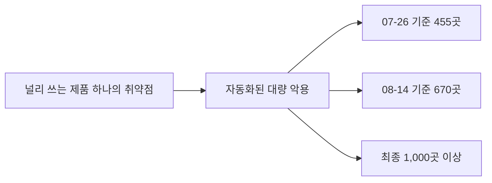

# 4.6 하나를 뚫어 천 곳 (MOVEit, 2023)

> **오늘의 질문** — 우리 데이터를 갖고 있는 외부 업체를 전부 댈 수 있습니까.
> 그 업체가 쓰는 업체는요.

## 무슨 일이 있었나

2023년 5월 말, 파일 전송 소프트웨어 MOVEit Transfer 의 취약점
CVE-2023-34362(SQL 인젝션)가 대량으로 악용됐습니다.
공격 그룹 Clop 은 패치가 없는 제로데이를 확보해 사용했고,
미국 메모리얼 데이 연휴를 노려 5월 29일경 고도로 자동화된 형태로 시작한 것으로
보입니다(✅ F-052).

피해 집계는 계속 늘었습니다.

| 시점 | 피해 조직 | 피해 개인 |
|---|---|---|
| 2023-07-26 | 455곳 | 약 2,300만 명 |
| 2023-08-14 | 670곳 | 최소 4,600만 명 |
| 최종 | **1,000곳 이상** | **최소 6,000만 명** |

(✅ F-052, 집계기관마다 수치가 다릅니다)

Clop 은 암호화 후 복호화 키를 파는 대신 **데이터를 탈취해
공개를 협박하는 방식**에 집중했습니다. 전문가들은 이 캠페인만으로
7,500만에서 1억 달러를 벌었을 가능성을 제기했습니다(⚠️ F-053).

## 구조가 달랐습니다

앞의 사건들과 결정적으로 다른 점이 있습니다.

Equifax 는 한 조직을 뚫어 1억 4,700만 명의 데이터를 얻었습니다.
MOVEit 은 **한 소프트웨어를 뚫어 1,000곳 이상에 동시에 들어갔습니다.**

공격자 입장에서 수지가 완전히 다릅니다.
조직을 하나씩 뚫으려면 조직마다 비용이 듭니다.
널리 쓰이는 소프트웨어의 취약점 하나를 찾으면,
그 소프트웨어를 쓰는 모든 곳에 같은 열쇠가 듣습니다.

랜섬웨어 추적 전문가들은 널리 쓰이는 소프트웨어의 제로데이를
반복 표적으로 삼는 방식이 다수 조직을 개별 감염시키는 것보다
수익성이 높고 노력이 적게 든다고 분석했습니다.
MOVEit 은 Clop 의 **네 번째** 파일 전송 소프트웨어 표적이었습니다.

**이것은 전략입니다. 우연이 아닙니다.**

**하나를 뚫어 천 곳으로**

## 4차 피해자

이 사건에서 가장 어려운 문제는 **자기가 피해자인 줄 모르는 조직**이었습니다.

MOVEit 을 쓰지 않았는데 피해를 입은 조직이 많았습니다.
서비스 제공업체가 MOVEit 을 썼고, 그 업체가 고객 데이터를 갖고 있었기 때문입니다.

한 집계는 12월 1일 기준 피해자를 2,098곳으로 세었는데,
여기에는 MOVEit 을 직접 쓰지 않았지만 서비스 제공업체를 통해
데이터가 노출된 3자 피해자가 포함됩니다.

미국 최대 연기금 한 곳은 연금 관련 서비스업체의 침해와 관련해
약 76만 9천 명의 개인정보가 유출됐다고 확인했습니다.

**내가 쓰는 업체가 쓰는 업체**까지 봐야 한다는 뜻입니다.
이것을 4차 공급망이라고 부릅니다. 대부분의 조직은 2차도 모릅니다.

## 어디서 실패했나

이 사건의 "실패"는 개별 조직의 실수가 아닙니다. **구조의 문제**입니다.

**1. 위험이 한 곳에 몰려 있었습니다.** 파일 전송은 지루한 기능이라
다들 같은 제품을 씁니다. 그 집중이 공격자에게 지렛대가 됐습니다.

**2. 제로데이라 패치로 못 막았습니다.** Equifax 와 다릅니다.
패치가 없었습니다. 패치 관리를 아무리 잘해도 소용없는 사건입니다.

**3. 파일 전송 서버가 인터넷에 열려 있었습니다.**
자동화된 스캔이 인터넷에 노출된 인스턴스를 찾아다녔습니다.
외부 노출이 공격 대상 선정의 기준이었습니다.

**4. 전송 서버에 데이터가 쌓여 있었습니다.**
파일 전송 서버는 전송이 끝나면 비어 있어야 합니다.
그런데 실제로는 지난 파일들이 남아 있습니다.
**지나가는 곳이 쌓이는 곳이 됐습니다.**

**5. 공급망 지도가 없었습니다.** 자기가 피해자인지 몇 달 뒤에 알았습니다.

## 무엇이 있었으면 막혔나

제로데이라서 "패치를 빨리"는 답이 아닙니다. 다른 답이 필요합니다.

**노출면을 줄입니다.** 파일 전송 서버를 인터넷 전체에 열어 둘 필요가 있는지 봅니다.
거래처 IP 로 제한하거나 VPN 뒤에 두면 자동화 스캔에 안 걸립니다.
**제로데이의 1차 방어는 패치가 아니라 노출 축소입니다.**

**전송 서버를 비웁니다.** 전송이 끝난 파일은 즉시 지웁니다.
보관 기간을 24시간으로 두면, 뚫려도 하루치만 나갑니다.
3.6 의 「데이터 무가치화」입니다.

**전송 파일을 암호화합니다.** 전송 경로 암호화 말고 **파일 자체**를 암호화합니다.
받는 쪽만 열 수 있게 하면 중계 서버가 뚫려도 내용은 안 나갑니다.

**공급망 지도를 만듭니다.** 우리 데이터를 갖고 있는 외부 업체 목록과,
그 업체가 어떤 데이터를 얼마나 오래 갖는지 적습니다.
계약서에 침해 통지 의무와 기한을 넣습니다.

**집중을 인지합니다.** 업계 전체가 같은 제품을 쓴다는 사실 자체가 위험 요인입니다.
대안이 없어도 **알고 있는 것**과 모르는 것은 다릅니다.
그 제품에 사고가 나면 바로 알 수 있게 경보를 걸어 둡니다.

## 협박 방식의 변화

Clop 은 암호화하지 않았습니다. 가져가서 공개하겠다고 했습니다(✅ F-052).

이 변화가 방어 전략을 바꿉니다.

| | 암호화형 | 유출 협박형 |
|---|---|---|
| 핵심 방어 | 백업 | 데이터 무가치화, 아웃바운드 통제 |
| 복구 가능 | 백업으로 가능 | 복구해도 유출은 되돌릴 수 없음 |
| 알아채는 시점 | 즉시 (파일이 안 열림) | 늦게 (아무 일도 안 일어남) |

세 번째 줄이 중요합니다. 유출형은 **아무 일도 일어나지 않습니다.**
서비스는 정상이고 파일도 열립니다. 공격자가 연락할 때까지 모릅니다.
그래서 탐지가 백업보다 중요해졌습니다.

## 우리 조직 체크 3문항

1. 우리 데이터를 갖고 있는 외부 업체를 전부 댈 수 있습니까. 몇 곳입니까.
2. 파일 전송이나 중계 역할을 하는 서버에 지난 파일이 쌓여 있습니까.
3. 외부에 노출할 필요가 없는데 노출된 서비스가 있습니까.

---

## 개념 확인

**Q.** 제로데이에 대한 1차 방어로 이 장이 제시한 것은 무엇입니까.

1. 더 빠른 패치
2. 노출 축소
3. 백신 강화
4. 사이버 보험

답 보기

**2번.** 제로데이는 정의상 패치가 아직 없습니다.
그래서 **애초에 인터넷에 덜 내놓는 것**이 먼저입니다.
전송 제품에 데이터를 쌓아 두지 않는 것도 같은 이야기입니다.

## 한 줄 요약

널리 쓰이는 소프트웨어 하나가 1,000곳의 공통 입구가 되고, 제로데이의 1차 방어는 노출 축소입니다.

---

**출처**

사실마다 근거를 직접 열어 볼 수 있게 링크를 답니다.
확인 날짜와 원문 요지는 [`research/facts.yaml`](../research/facts.yaml) 에 있습니다.

| 사실 | 확인 | 근거를 직접 보기 |
|---|---|---|
| `F-052` | ✅ | [bankinfosecurity.com](https://www.bankinfosecurity.com/latest-moveit-data-breach-victim-tally-455-organizations-a-22650) — 2차(집계기관 인용) |
| `F-053` | ⚠️ | [flashpoint.io](https://flashpoint.io/blog/clop-ransomware-moveit-vulnerability/) — 2차 |

**읽어 볼 곳**

- BankInfoSecurity, [MOVEit 피해 집계 455곳](https://www.bankinfosecurity.com/latest-moveit-data-breach-victim-tally-455-organizations-a-22650)
- Flashpoint, [Clop 랜섬웨어와 MOVEit 취약점](https://flashpoint.io/blog/clop-ransomware-moveit-vulnerability/)
- 취약점 원문 — [CVE-2023-34362](https://nvd.nist.gov/vuln/detail/CVE-2023-34362)
