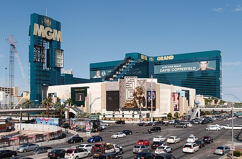
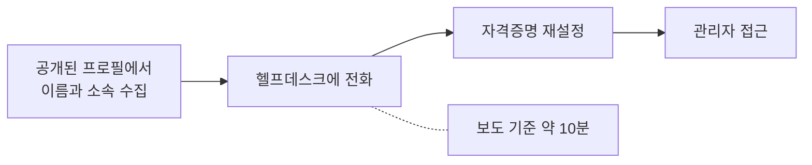

# 4.7 전화 한 통 (MGM 과 Caesars, 2023)

> 이 장의 사실은 대부분 공격자 측 주장과 언론 보도에 근거합니다.
> 회사 공시로 확인된 내용이 아닙니다. 그래서 전부 "보도에 따르면"으로 읽어야 합니다.

> **오늘의 질문** — 지금 우리 헬프데스크에 임원을 사칭한 전화가 오면 어떻게 됩니까.

## 무슨 일이 있었나

2023년 8월과 9월, 미국의 대형 호텔과 카지노 기업 두 곳이
며칠 사이로 같은 수법에 당했습니다.

**Caesars** — 공격자가 IT 사용자를 사칭해 **외주 헬프데스크**를 설득하여
자격증명을 재설정받았습니다. 고객 로열티 프로그램 데이터베이스를 탈취했고,
보도에 따르면 1,500만 달러의 몸값이 지급됐습니다(⚠️ F-055).

**MGM Resorts** — 공격자가 링크드인 정보로 직원을 사칭해 IT 지원에 전화했습니다.
보도에 따르면 통화는 약 10분이었습니다. 자격증명을 재설정받은 뒤
Okta 와 Azure 환경의 관리자 접근을 얻었고, 10일간 이어진 랜섬웨어 공격으로
슬롯머신, 호텔 키, 예약 시스템이 멈췄습니다. 공격자는 Okta 의
inbound federation 기능으로 새 신원 공급자를 구성해 거점을 만들었습니다(⚠️ F-054).

**IT 서비스데스크 초기 침투 경로는 MGM 의 공시로 확인된 것이 아니라
공격자 측 공개 발언과 언론 보도에 근거합니다**(⚠️ F-054).

MGM, Caesars, 그리고 영국의 한 교통 기관 사건의 초기 침투 경로가
모두 헬프데스크에 전화해 자격증명을 재설정받는 방식이었다는 분석이 있습니다(⚠️ F-056).

<figure class="shot">
  
  <figcaption>MGM Grand Las Vegas. 2023년 9월, 전화 한 통에서 시작된 공격으로
  슬롯머신과 객실 카드키를 포함한 운영이 멈췄습니다.
  사진 Tuxyso, <a href="https://creativecommons.org/licenses/by-sa/3.0">CC BY-SA 3.0</a></figcaption>
</figure>

## 10분

이 사건에서 기억할 숫자는 하나입니다.

대형 기업의 시스템이 **10분짜리 전화 한 통**으로 뚫렸습니다
(⚠️ F-054, 보도 기준).

방화벽도, 다중 인증도, 보안 장비도 뚫리지 않았습니다.
**우회됐습니다.** 정식 절차를 통해 정식 자격증명을 발급받았으니
로그인 자체는 이상해 보일 이유가 없습니다.

탐지가 언제 어떻게 작동했는지는 공개되지 않았습니다.
다만 **첫 단계에서 걸릴 만한 신호가 없었다**는 것은 분명합니다.

이것이 사람을 노리는 공격의 특징입니다. 시스템 입장에서는
정상 요청과 구분이 안 됩니다. 1.1 의 「가장 약한 고리」가
기술이 아니라 사람일 때의 모습입니다.

**전화 한 통의 경로**

## 링크드인이 도구였습니다

MGM 사건에서 공격자는 링크드인 정보로 직원을 사칭했습니다(⚠️ F-054).

공개 프로필에는 이름, 직책, 부서, 입사 시기, 같이 일하는 사람들이 있습니다.
헬프데스크가 본인 확인에 쓰는 질문들이 대부분 그 범위 안에 있습니다.

어떤 정보를 어디까지 썼는지는 공개되지 않았습니다.
확실한 것은 **링크드인만으로 사칭이 성립했다**는 것입니다.

**"본인 확인"이라고 부르는 절차의 대부분이 실제로는
공개 정보 확인입니다.** 생년월일, 사번, 부서, 상사 이름.
전부 찾을 수 있거나 추측할 수 있습니다.

## 헬프데스크가 구조적으로 불리한 이유

헬프데스크 직원을 탓하면 안 됩니다. 구조가 그들에게 불리합니다.

**업무 목표가 반대입니다.** 헬프데스크의 성과 지표는 보통
처리 시간과 만족도입니다. 의심하고 되묻는 것은 두 지표를 모두 깎습니다.

**거절의 비용이 비대칭입니다.** 진짜 임원을 거절하면 바로 불이익이 옵니다.
가짜를 통과시키면 아무 일도 안 일어납니다. 몇 달 뒤에 사고가 나도
그 전화와 연결되지 않습니다.

**압박이 실제입니다.** 급하다고 합니다. 회의에 들어가야 한다고 합니다.
목소리가 떨립니다. 사람은 이런 상황에서 돕는 쪽으로 기웁니다.

**외주인 경우가 많습니다.** Caesars 는 외주 헬프데스크였습니다(⚠️ F-055).
외주 직원이 고객사 임원에게 "확인 절차가 있습니다"라고 말하기는 더 어렵습니다.

## 어디서 실패했나

**1. 본인 확인이 공개 정보로 가능했습니다.**

**2. 재설정 권한이 전화 한 통으로 행사됐습니다.**

**3. 재설정된 계정이 곧바로 높은 권한에 닿았습니다.**
MGM 에서는 Okta 와 Azure 의 관리자 접근으로 이어졌습니다(⚠️ F-054).
1.1 의 「권한 상승」과 「폭발 반경」입니다.

**4. 신원 공급자 설정 변경에 경보가 없었습니다.**
공격자가 새 신원 공급자를 구성했는데 알림이 울리지 않았습니다(⚠️ F-054).
이것은 평소에 거의 일어나지 않는 변경입니다. 반드시 알려야 하는 사건입니다.

## 무엇이 있었으면 막혔나

**전화로 자격증명을 재설정하지 않습니다.** 예외 없이.
이 한 줄이 이 사건 전체를 막습니다.

**등록된 다른 채널로 확인합니다.** 사내 메신저, 등록된 기기 알림,
또는 직속 상사를 통한 확인. 전화를 건 사람이 아니라
**등록된 경로로 되거는 것**이 핵심입니다.

**패스키나 보안 키를 씁니다.** 1.3 입니다. 기기에 묶인 열쇠는
전화로 옮길 수 없습니다. 재설정 자체가 물리적 확인을 요구하게 됩니다.

**고위험 계정 목록을 만듭니다.** 관리자, 재무, 인사, 경영진.
이 목록의 계정은 재설정에 상급자 승인을 추가로 받습니다.
전원에게 적용하면 운영이 멈추니 **목록을 좁힙니다.**

**거절의 책임을 조직이 집니다.** 2.2 에서 말한 그 문장입니다.
문서에 "절차대로 거절해 생긴 불편은 담당자 책임이 아니다"를 적습니다.
이 문장이 없으면 절차가 있어도 안 지켜집니다.

**신원 체계의 설정 변경에 경보를 겁니다.** 신원 공급자 추가,
도메인 연동 변경, 관리자 역할 부여. 평소에 거의 없는 변경이라
오탐이 적습니다. 3.6 의 카나리와 같은 원리입니다.

<!-- [장면 필요] 받아 본 사칭 메일이나 전화, 또는 속을 뻔한 순간.
     무엇이 그럴듯했고 무엇이 걸렸는지.
     사람을 노리는 공격은 체험이 있어야 설득된다. -->

## 역할극을 해 보십시오

이 장의 대책은 읽어서는 안 통합니다. **해 봐야 압니다.**

팀 회의에서 10분만 써서 역할극을 합니다.
한 명이 급한 임원, 한 명이 헬프데스크입니다.

대본은 필요 없습니다. "저 OOO 상무인데요, 지금 이사회 들어가야 하는데
로그인이 안 됩니다"로 시작하면 됩니다.

해 보면 두 가지를 알게 됩니다.
**거절하기가 생각보다 훨씬 어렵다**는 것과,
**지금 절차에 구멍이 어디 있는지**입니다.

공격 문구를 더 구체적으로 적지 않는 이유가 있습니다.
이 책은 복사해서 쓸 수 있는 대본을 싣지 않습니다.
역할극은 각 조직의 실제 상황으로 만드는 것이 더 효과적이기도 합니다.

## 우리 조직 체크 3문항

1. 전화로 비밀번호를 재설정해 준 적이 최근 한 달 안에 있습니까.
2. 본인 확인에 쓰는 질문의 답을 링크드인에서 찾을 수 있습니까.
3. 신원 공급자 설정이 바뀌면 누구에게 알림이 갑니까.

---

## 개념 확인

**Q.** 이 사건을 막을 수 있었던 한 줄짜리 규칙은 무엇입니까.

1. 비밀번호 길이를 늘린다
2. 전화로는 재설정하지 않는다
3. 방화벽을 교체한다
4. 로그 보관 기간을 늘린다

답 보기

**2번.** 10분짜리 통화가 다중 인증을 우회했습니다(⚠️ F-054).
막는 방법은 기술이 아니라 절차입니다.
**되전화**를 걸고, 관리자급은 전화로 아예 받지 않습니다.

## 한 줄 요약

10분짜리 전화가 다중 인증을 우회했고, 막는 방법은 기술이 아니라 "전화로는 안 한다"는 한 줄입니다.

---

**출처**

사실마다 근거를 직접 열어 볼 수 있게 링크를 답니다.
확인 날짜와 원문 요지는 [`research/facts.yaml`](../research/facts.yaml) 에 있습니다.

| 사실 | 확인 | 근거를 직접 보기 |
|---|---|---|
| `F-054` | ⚠️ | [adaptivesecurity.com](https://www.adaptivesecurity.com/blog/mgm-ransomware-attack) — 2차 |
| `F-055` | ⚠️ | [adaptivesecurity.com](https://www.adaptivesecurity.com/blog/mgm-ransomware-attack) — 2차 |
| `F-056` | ⚠️ | — 원문이 내려갔습니다. 대체 출처를 찾는 중입니다 |

전부 보도와 공격자 측 주장을 바탕으로 합니다. 1차 자료가 아닙니다.

**읽어 볼 곳**

- Adaptive Security, [MGM Ransomware Attack Timeline](https://www.adaptivesecurity.com/blog/mgm-ransomware-attack)
- The Hacker News, [Scattered Spider 헬프데스크 사기](https://thehackernews.com/2025/06/scattered-spider-understanding-help-desk-scams.html) (2025-06)

**공시로 확인하려면** [SEC EDGAR](https://www.sec.gov/edgar/search/) 에서
두 회사의 2023년 8-K 를 보십시오. 이 장의 서술이 공시에 있는지 없는지가
"보도에 따르면"을 떼도 되는지를 가릅니다.
