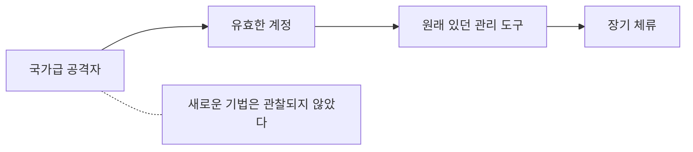

# 4.8 새로운 기법은 없었다 (Salt Typhoon, 2024)

> **오늘의 질문** — 우리 네트워크 장비의 패치를 마지막으로 적용한 날은 언제입니까.

## 무슨 일이 있었나

2024년 10월, 미국 통신사들에 대한 대규모 침해가 공개됐습니다.
CISA 는 이를 미국 역사상 최악의 통신 해킹으로 표현했습니다(✅ F-057).

| 시점 | 일어난 일 |
|---|---|
| 2024-10 | 침해 공개 (✅ F-057) |
| 2024-12-04 | 미 정부가 최소 8개 통신 관련 기업 피해 공개 (✅ F-057) |
| 2024-12-04 | CISA, FBI, NSA 와 호주, 캐나다, 뉴질랜드가 공동 서명한 가이드 발표 (✅ F-058) |
| 이후 | 9번째 기업 확인 (✅ F-057) |

접근된 것은 통화 상세 기록, 위치 데이터, 그리고 법 집행 관련 데이터였습니다(✅ F-057).
누가 누구와 언제 통화했는지에 대한 기록입니다.

영향받은 조직에는 미국 외에도 유럽, 아프리카, 아시아의 통신사가 포함됐습니다.

<figure class="shot">
  
  <figcaption>미국 사이버보안 인프라보안국(CISA). 2024년 12월, 각국 기관과 함께 낸
  공동 가이드에서 <strong>새로운 기법은 관찰되지 않았다</strong>고 밝혔습니다.
  미국 국토안보부, 퍼블릭 도메인</figcaption>
</figure>

## 한 문장이 전부입니다

이 사건에서 가장 중요한 문장은 CISA 와 파트너 기관들이 발표한 가이드에 있습니다.

**확인된 침해가 피해 인프라의 기존 약점과 일치하며,
새로운 기법은 관찰되지 않았습니다**(✅ F-058).

국가 지원을 받는 것으로 알려진 공격 조직이, 미국 통신망 전체를 상대로,
수년에 걸쳐, **새로운 기법 없이** 성공했습니다.

이 문장을 다시 읽어야 합니다. 우리가 보안 예산을 쓰는 방식에 대한 질문이기 때문입니다.

**새 무기가 없었던 침투**

## 우리는 무엇을 두려워하는가

보안 논의는 늘 새로운 위협으로 흐릅니다. 제로데이, AI 공격, 양자 컴퓨터.
새로운 것이 무섭고, 새로운 것에 예산이 붙습니다.

그런데 실제 대형 사건들을 보면,

- Equifax — 알려진 취약점, 패치 78일 방치 (✅ F-050)
- 롯데카드 — 8년 된 취약점 방치 (⚠️ F-033)
- Salt Typhoon — **새로운 기법 없음** (✅ F-058)
- MGM — 전화 한 통 (⚠️ F-054)
- 2026 금융권 — 점검 대상에서 빠진 시스템 (✅ F-004)
- 2025 AI 주도 캠페인 — 널리 공개된 상용 도구 (✅ F-072)
- MOVEit — **제로데이** (✅ F-052)

일곱 건 중 여섯 건이 **이미 알려진 문제**였습니다.
제로데이는 MOVEit 하나뿐이고, 그마저도 노출 축소로 상당 부분 줄일 수 있었습니다(4.6).

**새로운 공격을 걱정하기 전에 오래된 구멍을 세어야 합니다.**
순서가 반대면 비싼 도구를 사 놓고 기본을 놓칩니다.

## 네트워크 장비라는 사각지대

이 사건에서 특히 주목할 것은 **표적이 네트워크 장비**였다는 점입니다.
가이드는 공격 조직이 통신 부문에서 쓰이는 특정 제조사의 기능을
노렸다고 언급했습니다(✅ F-058).

네트워크 장비는 조직에서 가장 안 보는 자산 중 하나입니다.

**패치를 잘 안 합니다.** 내리면 전체가 멈추니까 창을 잡기 어렵습니다.
"잘 돌고 있으니 건드리지 말자"가 됩니다.

**로그를 잘 안 봅니다.** 서버 로그는 수집하는데 라우터와 스위치 로그는
수집 대상에서 빠지는 경우가 많습니다.

**담당이 애매합니다.** 서버는 개발팀이나 인프라팀이, 보안은 보안팀이 보는데
네트워크 장비는 네트워크팀이 보고 보안 점검 대상에는 잘 안 들어갑니다.

**그런데 모든 트래픽이 지나갑니다.** 여기를 잡으면 나머지를 다 볼 수 있습니다.

2.1 에서 자산 목록을 만들라고 한 이유가 이것입니다.
**서버만 세는 자산 목록은 자산 목록이 아닙니다.**

## 끝났다고 말할 수 없었습니다

CISA 관계자는 당시 적이 축출됐다고 확신할 수 없다고 말했습니다.
무엇을 하고 있는지 범위를 아직 모르기 때문이라고 했습니다(⚠️ F-059).

이것이 장기 잠복 공격의 가장 어려운 부분입니다.
**끝났다는 것을 증명할 수 없습니다.**

증명하려면 침입 이후의 모든 변경을 추적할 수 있어야 합니다.
로그가 충분하고, 정상 상태가 무엇인지 기록되어 있어야 합니다.
대부분의 조직에 둘 다 없습니다.

그래서 대형 침해 이후 조직은 두 가지 중 하나를 택합니다.
**전부 다시 세우거나, 찜찜한 채로 운영하거나.**
전자는 비싸고 후자는 위험합니다.

3.6 의 「불변 인프라」가 여기서 값을 발휘합니다.
서버를 코드로 다시 세울 수 있으면 첫 번째 선택지의 비용이 크게 내려갑니다.

## 어디서 실패했나

**1. 기존 약점이 방치됐습니다.** 새 기법이 필요 없었습니다.

**2. 네트워크 장비가 점검 범위 밖이었습니다.**

**3. 장기 잠복을 탐지하지 못했습니다.**

**4. 복원 시점을 정할 수 없었습니다.** 정상 상태 기준이 없었습니다.

## 무엇이 있었으면 막혔나

**네트워크 장비를 자산 목록에 넣습니다.** 라우터, 스위치, 방화벽, VPN 장비,
로드밸런서, 무선 AP. 담당자와 펌웨어 버전과 마지막 패치 날짜를 적습니다.

**장비 로그를 중앙으로 보냅니다.** 3.5 의 전부가 네트워크 장비에도 적용됩니다.
장비 자체에만 있는 로그는 장비가 장악되면 없는 로그입니다.

**관리 평면을 분리합니다.** 네트워크 장비의 관리 인터페이스를
업무망에서 분리하고, 접근을 점프 호스트로 제한합니다.

**설정 변경을 추적합니다.** 장비 설정을 버전 관리하고 변경되면 알립니다.
침입자가 설정을 바꿨는지 알아내는 가장 확실한 방법입니다.

**정상 상태를 기록해 둡니다.** 지금 설정과 지금 돌고 있는 것의 목록을
저장해 둡니다. 사고 때 "무엇이 바뀌었나"를 물을 수 있는 기준이 됩니다.

## 이 사건을 읽는 법

Salt Typhoon 은 국가급 공격자의 사건이라 "우리와는 다르다"고 넘기기 쉽습니다.

그런데 CISA 의 문장이 그것을 막습니다.
**새로운 기법은 관찰되지 않았습니다**(✅ F-058).

국가급 공격자도 평범한 구멍으로 들어왔습니다.
그 구멍은 우리 조직에도 있습니다.
차이는 그들이 우리를 노릴 이유가 있느냐뿐입니다.

그리고 1.1 의 「공격의 경제성」을 다시 보면,
AI 로 비용이 내려가면서 **노릴 이유의 문턱도 내려가고 있습니다.**

## 우리 조직 체크 3문항

1. 자산 목록에 네트워크 장비가 들어 있습니까. 펌웨어 버전이 적혀 있습니까.
2. 라우터와 방화벽의 로그가 중앙으로 수집됩니까.
3. 장비 설정이 바뀌면 누가 압니까.

---

## 개념 확인

**Q.** 각국 기관이 공동 가이드에서 밝힌 한 문장은 무엇이었습니까. (주관식)

답 보기

**새로운 기법은 관찰되지 않았다**는 것입니다.
확인된 침해가 피해 인프라의 **기존 약점과 일치**했습니다(✅ F-058).
국가급 공격자도 새 무기가 아니라 오래된 구멍으로 들어왔습니다.

## 한 줄 요약

국가급 공격자도 새로운 기법 없이 성공했습니다. 오래된 구멍부터 세십시오.

---

**출처**

사실마다 근거를 직접 열어 볼 수 있게 링크를 답니다.
확인 날짜와 원문 요지는 [`research/facts.yaml`](../research/facts.yaml) 에 있습니다.

| 사실 | 확인 | 근거를 직접 보기 |
|---|---|---|
| `F-004` | ✅ | [newspim.com](https://www.newspim.com/news/view/20261002001278) — 2차 |
| `F-033` | ⚠️ | [kwnews.co.kr](https://www.kwnews.co.kr/article/202509220020890) — 2차 |
| `F-050` | ✅ | [oversight.house.gov](https://oversight.house.gov/wp-content/uploads/2018/12/Equifax-Report.pdf) — 1차(미 하원 감독위 보고서) |
| `F-052` | ✅ | [bankinfosecurity.com](https://www.bankinfosecurity.com/latest-moveit-data-breach-victim-tally-455-organizations-a-22650) — 2차(집계기관 인용) |
| `F-054` | ⚠️ | [adaptivesecurity.com](https://www.adaptivesecurity.com/blog/mgm-ransomware-attack) — 2차 |
| `F-057` | ✅ | [darkreading.com](https://www.darkreading.com/cyberattacks-data-breaches/cisa-issue-guidance-telecoms-salt-typhoon-threat) — 2차 |
| `F-058` | ✅ | [darkreading.com](https://www.darkreading.com/cyberattacks-data-breaches/cisa-issue-guidance-telecoms-salt-typhoon-threat) — 2차 |
| `F-059` | ⚠️ | [darkreading.com](https://www.darkreading.com/cyberattacks-data-breaches/cisa-issue-guidance-telecoms-salt-typhoon-threat) — 2차 |
| `F-072` | ✅ | [assets.anthropic.com](https://assets.anthropic.com/m/ec212e6566a0d47/original/Disrupting-the-first-reported-AI-orchestrated-cyber-espionage-campaign.pdf) — 1차 |

**읽어 볼 곳**

- Dark Reading, [CISA Issues Guidance to Telecom Sector on Salt Typhoon](https://www.darkreading.com/cyberattacks-data-breaches/cisa-issue-guidance-telecoms-salt-typhoon-threat)
- 권고 원문 — [CISA](https://www.cisa.gov/)
