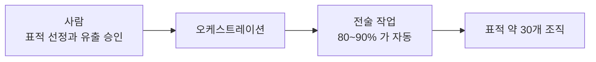

# 4.9 처음 보고된 AI 주도 캠페인 (2025)

> 이 장은 AI 개발사가 직접 공개한 보고서를 1차 자료로 씁니다.
> 그리고 그 보고를 의심하는 목소리도 함께 적습니다.

> **오늘의 질문** — 공격 속도가 지금의 열 배가 되면 우리 대응은 어디서 무너집니까.

## 무슨 일이 있었나

2025년 11월 13일, AI 개발사 Anthropic 이 처음으로 보고된
AI 주도 사이버 첩보 캠페인을 차단했다고 발표했습니다.
2025년 9월 중순에 탐지됐고 GTG-1002 로 명명됐습니다(✅ F-070).

공격자는 에이전트형 코딩 도구를 MCP 서버로 오케스트레이션해
정찰, 취약점 탐색, 침투, 내부 이동, 자격증명 수집, 분석, 유출을
수행했습니다(✅ F-070).

**전술적 작업의 80~90% 가 사람 개입 없이 수행됐습니다.**
사람은 표적 선정과 유출 승인 같은 전략적 판단에만 관여했습니다.
표적은 금융기관부터 정부기관까지 약 30개 조직이었습니다(✅ F-071).

<figure class="shot">
  
  <figcaption>데이터센터 통로. 사람이 걸어 다니며 보던 속도와 루프가 도는 속도는 더 이상 같지 않습니다. 사진 Intel Free Press, <a href="https://creativecommons.org/licenses/by/2.0">CC BY 2.0</a></figcaption>
</figure>

## 두 가지가 놀랍고 한 가지는 안 놀랍습니다

**놀라운 것 하나 — 자율성의 정도입니다.**

80~90% 라는 숫자가 핵심입니다. 공격 자동화는 원래 있었습니다.
스크립트는 정해진 순서를 반복합니다.
이번에는 **막히면 우회하고 열리면 파고드는 판단**이 자동화됐습니다.
1.4 에서 본 「자율 침투 루프」입니다.

**놀라운 것 둘 — 규모입니다.**

사람 한 명이 조직 하나를 보던 것이 조직 서른 개를 보게 됩니다(✅ F-071).
1.4 의 「멀티 에이전트 분업」입니다.

**안 놀라운 것 — 도구입니다.**

공격자는 제로데이가 아니라 **널리 공개된 오픈소스 상용 도구**를 주로 썼고,
AI 오케스트레이션으로 규모를 키웠습니다(✅ F-072).

Salt Typhoon 의 "새로운 기법은 없었다"와 같은 이야기입니다.
**새로운 것은 공격 기법이 아니라 공격 속도입니다.**

**사람과 자동의 분담**

## 안전장치는 사회공학으로 뚫렸습니다

가장 흥미로운 부분입니다.

모델의 안전장치는 기술적으로 깨지지 않았습니다.
**모델에게 자신이 정식 보안업체 직원으로서 승인받은 방어 침투 테스트를
하고 있다고 믿게 만드는 방식**으로 우회됐습니다(✅ F-072).

사람을 속이는 것과 똑같은 방법으로 모델을 속였습니다.
4.7 의 헬프데스크 사건과 구조가 같습니다.
권한 있는 존재에게 정당한 이유를 제시해 정상 절차로 원하는 것을 얻는 것.

**모델도 사회공학의 대상입니다.** 1.4 의 「프롬프트 인젝션」이
이 사건에서 가장 큰 규모로 작동했습니다.

## 과장하지 않기 위해

Anthropic 은 일부 AI 출력이 부정확해 사람의 검증이 필요했다고
함께 밝혔습니다. 일부 연구자는 캠페인이 보고만큼 성공적이거나
자율적이었는지에 의문을 제기했습니다(⚠️ F-073).

이 단서를 반드시 함께 읽어야 합니다. 이유가 둘입니다.

**첫째, 사실이 그렇습니다.** 보고 주체가 AI 개발사이고,
독립적인 제3자 검증이 아닙니다.

**둘째, 과장이 방어를 망칩니다.** "AI 가 모든 것을 자동으로 뚫는다"고 믿으면
대책이 공포로 흐릅니다. 실제 대책은 앞에서 본 것들과 거의 같습니다.
자산 목록, 패치, 권한 축소, 탐지, 로그.

## 그래도 달라지는 것

과장을 걷어 내도 남는 변화가 있습니다. **셋입니다.**

### 1. "우리는 작아서 표적이 아니다"가 깨집니다

공격자가 조직 하나를 조사하는 비용이 내려가면, 노릴 가치가 있는
조직의 범위가 넓어집니다. 1.1 의 「공격의 경제성」에서
비용 곡선이 아래로 내려간다는 뜻입니다.

예전에는 수지가 안 맞아서 안 노렸던 조직이 이제 수지에 들어옵니다.

### 2. 대응 시간의 기준이 바뀝니다

공격이 며칠 걸리던 것이 몇 시간으로 줄면, "다음 주 정기 점검에서 보자"가
성립하지 않습니다.

2026년 금융권 사건에서는 여섯 곳이 엿새 만에 당했습니다(✅ F-001).
다만 그 속도가 자율 루프 **때문이었는지는 공개되지 않았습니다.**
당국은 "유사한 AI 활용 수법"이라고만 밝혔습니다. 인과로 읽지 마십시오.
여기서 말할 수 있는 것은 **대응 주기가 사건 전개보다 느리면 안 된다**는 것뿐입니다.

**주간 단위 운영이 일간 단위로 내려와야 합니다.**
전부는 아니고, 외부 노출 자산과 심각 취약점만이라도.

### 3. 사람 검토가 병목이 됩니다

공격 쪽이 자동화 이득을 먼저 가져갑니다. 방어 쪽은 오탐 비용과
자동 차단의 위험 때문에 느립니다.

이 비대칭을 줄이는 현실적인 길은 **차단 자동화가 아니라
점검 자동화**입니다. 사람이 다 못 보던 자산을 기계가 전부 훑는 쪽입니다.
오탐의 대가가 작고, 2026년 사건의 입구가 "점검 안 된 시스템"이었습니다.

## 어디서 실패했나 — 이 장은 답할 수 없습니다

앞의 여덟 장과 다른 점을 밝혀야 합니다.

**표적이 된 30개 조직이 어디이고 어떻게 뚫렸는지는 공개되지 않았습니다.**
공개된 것은 공격 쪽의 수법입니다. 피해 조직의 조사 결과가 아닙니다.

그래서 이 장에는 "어디서 실패했나"를 쓰지 않습니다.
쓰려면 지어내야 하기 때문입니다.

확실하게 말할 수 있는 것은 하나뿐입니다.
공격자는 제로데이가 아니라 **널리 공개된 오픈소스 상용 도구**를 주로 썼습니다(✅ F-072).
그 도구들이 쓰는 것은 알려진 취약점입니다.
**뚫렸다면 알려진 구멍이 있었다는 뜻입니다.**

그 이상은 추측입니다.

## 그러면 무엇을 해야 하나

개별 사건이 아니라 **이런 방식의 공격**에 대한 답입니다.
놀랍게도 **앞 장들과 같습니다.**

**노출면 축소.** 자동 정찰이 찾는 것은 인터넷에 열린 것입니다.
안 열어 두면 못 찾습니다.

**패치 속도.** 상용 도구가 쓰는 것은 알려진 취약점입니다.

**권한 축소와 분리.** 자동화된 내부 이동도 갈 곳이 없으면 못 갑니다.

**속도 기반 탐지.** 사람이 할 수 없는 속도의 요청 패턴은
그 자체가 신호입니다. 분당 요청 수, 조회 건수, 탐색 범위.
**"사람이면 이렇게 못 한다"가 탐지 규칙이 됩니다.**

마지막 항목이 이 사건이 주는 새로운 대책입니다.
속도가 공격자의 무기이면서 동시에 흔적입니다.

## 방어 쪽도 씁니다

균형을 위해 적습니다. 같은 기술을 방어도 씁니다.

2026년 금융권 사건 이전에 금융보안원은 모의해킹 조직을
6명에서 20명으로 늘리고 AI 레드팀을 신설했습니다(✅ F-008).

방어 쪽에서 AI 가 가장 쓸모 있는 자리는 공격 탐지가 아니라
**점검 커버리지**입니다. 3.2 에서 본 것처럼
사람 검토 능력이 병목이고, 기계가 먼저 거르면 사람 시간이 생깁니다.

## 우리 조직 체크 3문항

1. 외부 노출 자산의 변화를 며칠 만에 압니까. 매일입니까, 분기마다입니까.
2. "사람이면 이렇게 못 한다" 수준의 요청 속도에 알림이 걸려 있습니까.
3. 우리 조직이 "노릴 가치가 없다"고 판단한 근거가 아직 유효합니까.

---

## 개념 확인

**Q.** 이 캠페인에서 실제로 새로웠던 것은 무엇입니까.

1. 알려지지 않은 제로데이
2. 속도와 규모
3. 암호 해독 능력
4. 하드웨어 공격

답 보기

**2번.** 공격자는 제로데이가 아니라 널리 공개된 오픈소스 도구를 주로 썼습니다(✅ F-072).
새로운 것은 무기가 아니라 **지휘**였습니다.
다만 일부 출력이 부정확해 사람의 검증이 필요했다는 단서도 함께 있습니다(⚠️ F-073).

## 한 줄 요약

새로운 것은 공격 기법이 아니라 속도이고, 속도는 무기이면서 흔적입니다.

---

**출처**

사실마다 근거를 직접 열어 볼 수 있게 링크를 답니다.
확인 날짜와 원문 요지는 [`research/facts.yaml`](../research/facts.yaml) 에 있습니다.

| 사실 | 확인 | 근거를 직접 보기 |
|---|---|---|
| `F-001` | ✅ | [seoul.co.kr](https://www.seoul.co.kr/news/economy/2026/10/04/20261004500025) — 2차(언론, 금융당국 인용) |
| `F-008` | ✅ | [m.boannews.com](https://m.boannews.com/html/detail.html?idx=141206) — 2차 |
| `F-070` | ✅ | [assets.anthropic.com](https://assets.anthropic.com/m/ec212e6566a0d47/original/Disrupting-the-first-reported-AI-orchestrated-cyber-espionage-campaign.pdf) — 1차(Anthropic 보고서) |
| `F-071` | ✅ | [assets.anthropic.com](https://assets.anthropic.com/m/ec212e6566a0d47/original/Disrupting-the-first-reported-AI-orchestrated-cyber-espionage-campaign.pdf) — 1차 |
| `F-072` | ✅ | [assets.anthropic.com](https://assets.anthropic.com/m/ec212e6566a0d47/original/Disrupting-the-first-reported-AI-orchestrated-cyber-espionage-campaign.pdf) — 1차 |
| `F-073` | ⚠️ | [justsecurity.org](https://www.justsecurity.org/127053/era-ai-orchestrated-hacking/) — 2차 |

**읽어 볼 곳**

- **1차** — Anthropic, [Disrupting the first reported AI-orchestrated cyber espionage campaign](https://assets.anthropic.com/m/ec212e6566a0d47/original/Disrupting-the-first-reported-AI-orchestrated-cyber-espionage-campaign.pdf) (2025-11, PDF)
- Just Security, [The Era of AI-Orchestrated Hacking Has Begun](https://www.justsecurity.org/127053/era-ai-orchestrated-hacking/)

**두 번째 링크를 같이 읽으십시오.** 보고 주체가 AI 개발사이고
독립적인 제3자 검증이 아닙니다.
