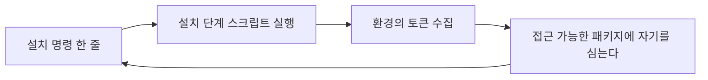

# 4.10 설치 한 줄 (npm, 2025)

> 마지막 사건입니다. 앞의 아홉 건과 달리, 이 공격의 입구는
> 서버가 아니라 **개발자의 노트북**입니다.

> **오늘의 질문** — 어제 설치한 패키지가 설치 중에 무엇을 실행했는지 압니까.

## 무슨 일이 있었나 — 1차 파동

2025년 9월 15일, npm 생태계를 대상으로 한 자기복제 웜
**Shai-Hulud** 가 공개됐습니다. 500개 넘는 패키지가 감염됐습니다(✅ F-076).

동작은 이렇습니다.

1. 감염된 패키지를 설치하면 **설치 후 스크립트**가 돕니다
2. 스크립트가 환경에서 민감 정보를 수집합니다
3. 공격자가 만든 공개 깃허브 저장소로 유출합니다
4. 환경에서 추가 npm 토큰을 발견하면, **접근 가능한 패키지를
   자동으로 악성 버전으로 배포**합니다 (✅ F-076)

4번이 핵심입니다. 스스로 퍼집니다.
피해자가 다음 피해자를 만듭니다.

## 2차 파동 — 더 나빠졌습니다

2025년 11월 24일, 2차 파동이 탐지됐습니다.
**몇 시간 만에** 700개 넘는 패키지가 감염되고,
27,000개 넘는 악성 깃허브 저장소가 생성됐으며,
487개 조직에서 약 14,000개의 비밀이 노출됐습니다(✅ F-077).

1차와 달라진 점이 둘입니다.

**실행 시점이 설치 후에서 설치 전으로 옮겨졌습니다**(✅ F-077).
설치가 끝나지 않아도 실행됩니다. 중단해도 늦습니다.

**파괴 동작이 추가됐습니다.** 자격증명 탈취나 유출 채널 확보에 실패하면
사용자 소유의 쓰기 가능한 파일을 덮어쓰고 지우려 합니다(✅ F-077).

얻을 게 없으면 부숩니다. 1.1 의 「공격의 경제성」이
협박의 형태로 바뀐 것입니다.

**설치가 곧 코드 실행입니다**



<figure class="shot">
  
  <figcaption>컨테이너 하역장. 공급망의 힘은 한 번 실으면 끝까지 간다는 것이고, 약점도 같은 자리에 있습니다. 중간에 무엇이 들어갔는지는 열어 봐야 압니다.<br>사진 George Robinson, <a href="https://creativecommons.org/licenses/by-sa/2.0">CC BY-SA 2.0</a></figcaption>
</figure>

## 왜 이렇게 빠르게 퍼지나

세 가지가 겹칩니다.

**설치가 코드 실행입니다.** 대부분의 패키지 생태계에서
설치 과정이 스크립트를 실행합니다. 편의를 위한 기능인데
**다운로드와 실행 사이의 구분을 없앱니다.**

**의존성이 깊습니다.** 직접 설치하는 것은 몇 개인데
따라 들어오는 것은 훨씬 많습니다. 하나만 감염되면 들어옵니다.

**개발 환경에 비밀이 많습니다.** 노트북과 CI 환경에는
클라우드 자격증명, 저장소 토큰, 배포 키가 모여 있습니다.
**서버보다 비밀 밀도가 높을 때도 있습니다.**

## 슬롭스쿼팅 — AI 가 만든 새 입구

같은 시기에 다른 형태의 공급망 공격이 이름을 얻었습니다.

**슬롭스쿼팅**입니다. 모델이 자주 환각하는 패키지 이름을
공격자가 선점해 악성 코드를 올립니다.
개발자는 AI 가 알려 줬으니 설치합니다(⚠️ F-078).

숫자가 이 공격을 가능하게 합니다. 한 연구에서
제안된 패키지의 19.7% 가 존재하지 않았고,
고유한 환각 이름이 205,000개 넘게 관찰됐습니다(⚠️ F-079).

여기까지는 품질 문제입니다. 공격이 되는 이유는 **반복성**입니다.
환각 이름의 58% 넘게 여러 번 반복 등장했고,
43% 는 같은 프롬프트 열 번에서 일관되게 나타났습니다(⚠️ F-079).

**반복되면 선점할 수 있습니다.** 그리고 오타가 아니라
그럴듯하게 지어낸 이름이라서, 유사 이름 검사에 안 걸립니다.
사람이 틀리게 친 적이 없는 이름이기 때문입니다.

## 두 공격의 공통점

Shai-Hulud 와 슬롭스쿼팅은 방식이 다릅니다.
전자는 정상 패키지를 탈취하고, 후자는 없던 이름을 만듭니다.

공통점은 하나입니다. **둘 다 설치 단계의 암묵적 신뢰를 씁니다.**

우리는 `install` 을 칠 때 그것이 코드 실행이라고 생각하지 않습니다.
파일을 받는 일이라고 생각합니다. 그 인식의 틈이 공격면입니다.

## 에이전트가 마지막 사람 검문을 없앱니다

3.2 에서 본 내용이 여기서 만납니다.

코딩 에이전트가 의존성을 스스로 설치하면,
**패키지 이름을 사람이 보는 단계가 사라집니다.**
에이전트가 환각한 이름을 에이전트가 설치합니다.

예전에는 개발자가 `pip install` 을 치기 전에 이름을 한 번 봤습니다.
못 보고 지나칠 때가 많았지만 **볼 기회는 있었습니다.**
이제 그 기회가 없어집니다.

## 어디서 실패했나

**1. 설치가 곧 실행입니다.** 생태계의 기본 설계입니다.

**2. 잠금 파일 없이 설치합니다.** 매번 최신을 받으면 감염 버전을 받습니다.

**3. 개발 환경에 영구 토큰이 있습니다.** 훔치면 바로 쓸 수 있습니다.

**4. CI 환경이 아무 데나 나갈 수 있습니다.** 유출을 못 막습니다.

**5. 새 의존성을 사람이 안 봅니다.** 특히 에이전트가 추가할 때.

## 무엇이 있었으면 막혔나

**설치 스크립트를 끕니다.** 대부분의 패키지 관리자에
설치 스크립트 실행을 막는 옵션이 있습니다.
필요한 소수만 허용 목록으로 풉니다. **이 한 줄이 가장 효과가 큽니다.**

```bash
# 나쁜 예 — 설치 스크립트가 그대로 돈다
npm install

# 좋은 예 — 스크립트를 막고, 꼭 필요한 것만 따로 허용한다
npm install --ignore-scripts
```

**잠금 파일을 고정하고 커밋합니다.** 버전이 고정되면
새로 배포된 악성 버전이 자동으로 들어오지 않습니다.

**사내 미러를 둡니다.** 승인된 패키지만 두면
환각한 이름은 **애초에 해결되지 않습니다.**
슬롭스쿼팅에 대한 가장 확실한 방어입니다.

**CI 에서 아웃바운드를 막습니다.** 3.3 의 아웃바운드 통제입니다.
설치 스크립트가 돌아도 밖으로 나갈 길이 없으면 유출이 안 됩니다.

**토큰을 단명으로 바꿉니다.** 1.3 입니다. 영구 npm 토큰과
영구 클라우드 키를 없앱니다. 훔쳐도 금방 만료됩니다.

**새 의존성 추가를 사람이 승인합니다.** 자동 검사로는
"새 패키지가 추가됨"을 알리고, 사람이 실재와 신뢰도를 봅니다.
최초 배포일, 관리자, 다운로드 추이, 저장소 링크.

**개발 노트북을 자산으로 봅니다.** 2.1 의 자산 목록에
개발자 단말이 들어 있는지 봅니다. 대개 안 들어 있습니다.

## 설치 전에 보는 네 가지

패키지 하나를 추가할 때 30초면 확인할 수 있습니다.

| 볼 것 | 의심 신호 |
|---|---|
| 최초 배포일 | 며칠 전에 처음 올라왔다 |
| 다운로드 추이 | 갑자기 치솟았다 |
| 저장소 링크 | 없거나, 연결이 안 되거나, 커밋이 하나다 |
| 관리자 | 다른 패키지를 만든 적이 없다 |

네 가지 중 둘 이상이 걸리면 쓰지 않습니다.
에이전트가 제안한 패키지라면 특히 봅니다.

## 우리 조직 체크 3문항

1. 설치 스크립트가 CI 에서 실행됩니까. 막을 수 있습니까.
2. CI 환경이 인터넷의 아무 주소로나 나갈 수 있습니까.
3. 개발자 노트북과 CI 에 영구 토큰이 몇 개 있습니까.

---

## 개념 확인

**Q.** 패키지 설치가 위험한 근본 이유는 무엇입니까.

1. 내려받는 용량이 커서
2. 설치가 곧 코드 실행이어서
3. 네트워크를 쓰기 때문에
4. 버전이 너무 많아서

<details>
<summary>답 보기</summary>

**2번.** 설치는 파일을 받는 일이 아니라 **남의 코드를 내 환경에서 실행하는 일**입니다.
그리고 개발자 노트북과 빌드 서버에는 토큰이 모여 있습니다.
그래서 번지는 속도가 사람 속도가 아닙니다(✅ F-077).

</details>

## 한 줄 요약

설치는 파일을 받는 일이 아니라 코드를 실행하는 일이고, 에이전트가 마지막 검문을 없앱니다.

---

**출처**

사실마다 근거를 직접 열어 볼 수 있게 링크를 답니다.
확인 날짜와 원문 요지는 [`research/facts.yaml`](../research/facts.yaml) 에 있습니다.

| 사실 | 확인 | 근거를 직접 보기 |
|---|---|---|
| `F-076` | ✅ | [unit42.paloaltonetworks.com](https://unit42.paloaltonetworks.com/npm-supply-chain-attack/) — 2차(보안업체 분석) |
| `F-077` | ✅ | [zscaler.com](https://www.zscaler.com/blogs/security-research/shai-hulud-v2-poses-risk-npm-supply-chain) — 2차 |
| `F-078` | ⚠️ | [en.wikipedia.org](https://en.wikipedia.org/wiki/Slopsquatting) — 3차(위키) |
| `F-079` | ⚠️ | [socket.dev](https://socket.dev/blog/slopsquatting-how-ai-hallucinations-are-fueling-a-new-class-of-supply-chain-attacks) — 2차(논문 인용) |

**읽어 볼 곳**

- Palo Alto Unit 42, [Shai-Hulud Worm Compromises npm Ecosystem](https://unit42.paloaltonetworks.com/npm-supply-chain-attack/)
- Zscaler, [Shai-Hulud V2 Analysis](https://www.zscaler.com/blogs/security-research/shai-hulud-v2-poses-risk-npm-supply-chain)
- Socket, [Slopsquatting](https://socket.dev/blog/slopsquatting-how-ai-hallucinations-are-fueling-a-new-class-of-supply-chain-attacks)
- 위키백과, [Slopsquatting](https://en.wikipedia.org/wiki/Slopsquatting) (3차 자료)

19.7% 등의 수치는 **USENIX Security 2025 논문을 2차 자료가 인용한 것**입니다.
원논문은 [USENIX Security 2025](https://www.usenix.org/conference/usenixsecurity25) 에 있습니다.
