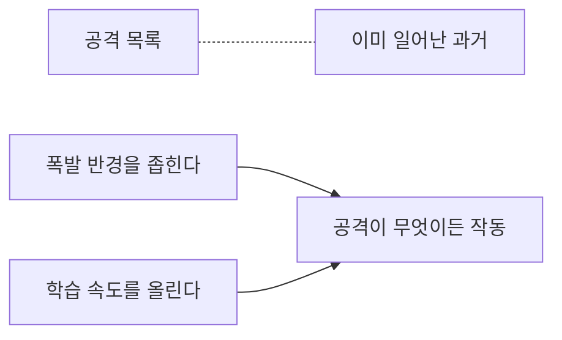

# 5.1 책에 없는 공격에 대비하기

> 읽는 길: 「미지 대비 여섯 원칙」과 「새 기술을 들일 때」만 보셔도 됩니다.
> 앞의 「다음에 올 것들」은 예측이라 더 빨리 낡습니다.

> **오늘의 질문** — 이 책에 없는 공격이 내일 온다면, 무엇이 우리를 구합니까.

## 목록으로는 못 막습니다

4부에서 사건 열 건을 봤습니다. 각각에 대책이 있었습니다.
그 대책들을 전부 적용해도 **다음 사건은 못 막습니다.**

목록은 과거를 정리한 것이기 때문입니다.
공격자는 목록에 없는 쪽으로 갑니다. 그게 더 쌉니다.

그렇다고 목록이 쓸모없지는 않습니다.
**목록에서 패턴을 뽑아내면 구조가 됩니다.** 이 장은 그 작업입니다.

<figure class="shot">
  
  <figcaption>안개 낀 길. 앞이 안 보일 때 할 수 있는 일은 멀리 보려고 애쓰는 것이 아니라 <strong>속도를 줄이고 차간 거리를 넓히는 것</strong>입니다. 사진 Ted Moravec, <a href="http://creativecommons.org/publicdomain/zero/1.0/deed.en">CC0</a></figcaption>
</figure>

## 다음에 올 것들

일부는 이미 보고된 것이고 일부는 **구조상 따라오는 것**입니다.
뒤쪽은 예측이므로 그렇게 읽으십시오. 전부 개념 수준으로만 적습니다.

**에이전트를 직접 노리는 공격.** 지금까지 에이전트는 공격 도구였습니다.
앞으로는 표적이 됩니다. 조직 안에서 돌고 권한을 가진 존재이니
당연한 수순입니다. OWASP 의 열 가지 목록이 이미 나와 있습니다(⚠️ F-074).

**지식 베이스 오염.** 조직이 쌓은 문서와 벡터 저장소에
잘못된 내용을 심어 둡니다. 에이전트가 그것을 읽고 행동합니다.
한 번 심으면 오래 갑니다. 1.4 의 「메모리 오염」이 조직 규모로 커진 것입니다.

**음성과 영상 사칭.** 4.7 의 전화 한 통이 더 쉬워집니다.
목소리와 얼굴이 확인 수단이던 자리가 전부 흔들립니다.
구체적인 사건 사례는 **1차 출처를 확인하지 못해 싣지 않습니다.**
이 분야는 보도가 앞서고 확인이 늦게 따라옵니다. 확인되지 않은 사례를 실으면
이 책이 경계하라고 말해 온 바로 그 일을 하게 됩니다.

**취약점 발견의 대량화.** 지금까지 취약점 발견은 비쌌습니다.
싸지면 공개 전 취약점의 공급이 늘어납니다. 패치 수명이 더 중요해집니다.

**안전장치가 제거된 모델.** 공개 가중치 모델에서 제한을 떼어 낸 것들이 돕니다.
**특정 국가나 특정 모델에 낙인을 찍지 않습니다.** 이것은 기술의 속성이지
어느 쪽의 문제가 아닙니다.

**느린 공격.** 속도가 탐지 신호가 되면, 공격자는 느려집니다.
사람 속도로 몇 달에 걸쳐 조금씩 움직입니다.
속도 기반 탐지만 믿으면 이쪽을 놓칩니다.

마지막 항목이 중요합니다. **모든 탐지 방법은 그것을 피하는 방법을 만듭니다.**
그래서 한 가지 탐지에 의존하면 안 됩니다.

**목록은 과거이고 구조는 미래에도 작동합니다**

## 미지 대비 여섯 원칙

위 목록이 틀려도 아래는 유효합니다. **공격의 종류와 무관하게 작동**하기 때문입니다.

### 1. 폭발 반경을 제한합니다

무슨 공격이 오든, 한 지점이 뚫렸을 때 닿는 범위가 좁으면 피해가 작습니다.
공격 기법을 몰라도, 공격이 언제 올지 몰라도 지금 줄일 수 있습니다.

여섯 중 **가장 값이 크다고 봅니다.** 하나만 한다면 이것입니다.

### 2. 이미 뚫렸다고 가정합니다

막는 설계에서 **알아채는 설계**로 무게를 옮깁니다.
"어떻게 막을까"는 공격을 알아야 답할 수 있고,
"들어와 있다면 어떻게 알까"는 몰라도 답할 수 있습니다.

### 3. 행동으로 탐지합니다

알려진 악성 코드의 지문을 찾는 방식은 새 공격을 못 잡습니다.
**정상과 다른 행동**을 찾는 방식은 잡을 가능성이 있습니다.

- 이 계정이 평소에 안 하던 일을 합니다
- 이 서버가 평소에 연결하지 않던 곳에 연결합니다
- 이 시간에 평소에 없던 활동이 있습니다

전제는 **정상이 무엇인지 알고 있어야** 한다는 것입니다.
그래서 로그가 먼저입니다(3.5).

### 4. 카나리를 심습니다

건드리면 울리는 가짜 자산입니다(3.6).
공격 기법과 무관하게 작동하고 오탐이 거의 없습니다.
**공격 기법을 모르는 상태에서도 미리 깔아 둘 수 있습니다.**

### 5. 복원력을 갖춥니다

막지 못한다는 전제에서, 돌아오는 능력이 피해를 정합니다.
깨끗한 백업, 다시 세우는 절차, 결정권자가 적힌 문서.

복원력은 **협박의 값을 떨어뜨립니다.** 빨리 돌아올 수 있으면
멈춰 세우는 공격의 수지가 안 맞습니다.

### 6. 학습 속도를 올립니다

가장 추상적인데 장기적으로 가장 중요합니다.

새 공격이 나오면 **며칠 만에 우리 조직에 적용하는가.**
업계 사고가 나면 **우리는 같은 구멍이 있는지 며칠 만에 확인하는가.**

2026년 금융권 사건에서 여섯 곳이 엿새 동안 당했습니다(✅ F-001).
첫 번째 조직이 당한 날부터 마지막까지 며칠이 있었습니다.
그 며칠 안에 확인한 조직과 못 한 조직이 갈렸습니다.

학습 속도는 기술이 아니라 **절차**입니다.
업계 사고 소식을 누가 보고, 누가 "우리는 어떤가"를 묻고,
며칠 안에 답이 나오는지의 문제입니다.

## 여섯 원칙 자가진단

| 원칙 | 질문 | 답 |
|---|---|---|
| 폭발 반경 | 서버 한 대가 뚫리면 몇 개 시스템에 닿습니까 | |
| 가정 침해 | "이미 들어와 있다면"으로 시작한 회의를 해 봤습니까 | |
| 행동 탐지 | 정상 행동의 기준선이 있습니까 | |
| 카나리 | 몇 개 심어 두었습니까 | |
| 복원력 | 전체 복원에 며칠 걸립니까 | |
| 학습 속도 | 지난 업계 사고 때 우리 점검까지 며칠 걸렸습니까 | |

여섯 칸을 채우고 **가장 나쁜 칸 하나**를 이번 분기 과제로 삼습니다.

## 새 기술을 들일 때

이 책을 덮은 뒤에도 새로운 것이 계속 들어옵니다.
그때마다 물을 질문 다섯 개를 남깁니다.

1. **이것이 무엇을 할 수 있습니까.** 할 수 있는 일의 목록이 곧 최악의 피해입니다
2. **이것이 무엇을 읽습니까.** 읽는 것이 오염되면 어떻게 됩니까
3. **이것이 누구의 신원으로 돕니까.** 로그에 어떻게 남습니까
4. **되돌릴 수 없는 행동이 있습니까.** 있다면 사람 승인이 걸립니까
5. **이것이 뚫리면 어디까지 갑니까.** 폭발 반경이 얼마입니까

다섯 질문은 에이전트, 새 SaaS, 새 외주, 새 연동에 똑같이 적용됩니다.
**기술이 무엇이든 질문은 같습니다.** 그게 이 다섯 개를 남기는 이유입니다.

## 우리 조직 체크 3문항

1. 여섯 원칙 중 우리가 가장 비어 있는 것은 무엇입니까.
2. 업계 사고가 나면 누가 "우리는 어떤가"를 묻습니까.
3. 새 기술을 들일 때 위 다섯 질문을 묻는 절차가 있습니까.

---

## 개념 확인

**Q.** 공격 목록을 아무리 길게 만들어도 미지의 공격을 막지 못하는 이유는 무엇입니까. (주관식)

답 보기

**목록은 이미 일어난 과거이기 때문입니다.**
다음에 오는 것은 거기 없습니다.
대신 **폭발 반경을 좁히는 일과 학습 속도를 올리는 일**은
공격이 무엇이든 작동합니다.

## 한 줄 요약

공격 목록은 과거이고, 폭발 반경과 학습 속도는 미래에도 작동합니다.

---

**출처**

사실마다 근거를 직접 열어 볼 수 있게 링크를 답니다.
확인 날짜와 원문 요지는 [`research/facts.yaml`](../research/facts.yaml) 에 있습니다.

| 사실 | 확인 | 근거를 직접 보기 |
|---|---|---|
| `F-001` | ✅ | [seoul.co.kr](https://www.seoul.co.kr/news/economy/2026/10/04/20261004500025) — 2차(언론, 금융당국 인용) |
| `F-074` | ⚠️ | [cycode.com](https://cycode.com/blog/owasp-top-10-agentic-applications/) — 2차 |
