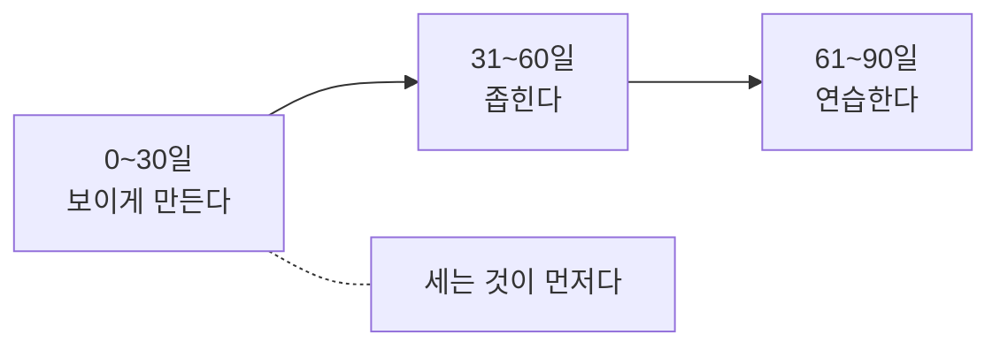

# 5.2 조직의 90일

> 읽는 길: 이 장은 계획서입니다. 그대로 복사해서 쓰셔도 됩니다.

> **오늘의 질문** — 다음 분기에 보안에서 무엇을 끝낼 작정입니까.

## 원칙 셋

**돈 안 드는 것부터 합니다.** 예산 승인을 기다리면 90일이 그냥 갑니다.
아래 목록의 대부분은 사람 시간만 듭니다.

**세는 것부터 합니다.** 모르는 것을 숫자로 바꾸는 일이
좋아지게 만드는 일보다 먼저입니다. 숫자가 없으면 나아졌는지도 모릅니다.

**끝나는 것을 고릅니다.** 90일 안에 완료 판정이 나는 항목만 넣습니다.
"보안 문화 개선" 같은 것은 넣지 않습니다.

## 0~30일 — 보이게 만든다

이 달의 목표는 **모른다를 숫자로 바꾸는 것**입니다. 고치지 않습니다.

| # | 할 일 | 끝났다는 기준 | 참고 |
|---|---|---|---|
| 1 | 외부 노출 자산 목록 뽑기 | 주소 목록 파일이 있다 | 2.1 |
| 2 | 점검 대상이 아닌 시스템 세기 | 숫자 하나가 나온다 | 2.1 |
| 3 | 상시 관리자 계정 세기 | 숫자 하나가 나온다 | 2.2 |
| 4 | 영구 API 키와 토큰 세기 | 숫자 하나가 나온다 | 2.2 |
| 5 | 퇴사자와 종료 외주 계정 확인 | 잔존 수가 나온다 | 2.2 |
| 6 | 개인정보가 있는 시스템 세기 | 목록이 있다 | 2.1 |
| 7 | 3개월 전 접근 기록 조회 시도 | 되는지 안 되는지 안다 | 3.5 |
| 8 | 사고 연락망 문서 확인 | 전화번호가 최신이다 | 2.3 |
| 9 | 72시간 통지 판단 담당자 지정 | 이름이 적혀 있다 | 2.4 |
| 10 | 자가진단 다섯 문항 답하기 | "모른다"가 몇 개인지 안다 | 2.1 |

**10번이 이 달의 성적표입니다.** "모른다"가 다섯 개에서 한 개가 되면 성공입니다.

이 달에 거의 항상 나오는 결과가 있습니다.
**아무도 모르던 서버가 나옵니다.** 그게 1번의 목적입니다.

**90일의 세 구간**

## 31~60일 — 좁힌다

세어 본 것 중 **가장 나쁜 것부터** 줄입니다. 전부 하지 않습니다.

| # | 할 일 | 끝났다는 기준 | 참고 |
|---|---|---|---|
| 11 | 자산 목록에 담당자 채우기 | 빈 칸이 0 이다 | 2.1 |
| 12 | 퇴사자와 종료 외주 계정 정리 | 잔존 수가 0 이다 | 2.2 |
| 13 | 안 쓰는 외부 노출 서비스 끄기 | 노출 자산 수가 줄었다 | 3.6 |
| 14 | 운영 서버 아웃바운드 허용 목록 적용 | 최소 한 대에 적용됐다 | 3.3 |
| 15 | 신규 계정 최소 권한 규칙 적용 | 규칙이 문서에 있다 | 2.2 |
| 16 | 헬프데스크 재설정 절차 문서화 | "전화로 안 한다"가 적혀 있다 | 4.7 |
| 17 | 로그를 서버 밖으로 전송 | 중앙에서 조회된다 | 3.5 |
| 18 | 카나리 3개 심기 | 알림이 실제로 울린다 | 3.6 |
| 19 | 설치 스크립트 차단 적용 | CI 에서 적용됐다 | 4.10 |
| 20 | 사고 1단계 공지문 초안 작성 | 문서가 있다 | 4.3 |

**16번과 18번이 비용 대비 효과가 가장 큽니다.**
16번은 문서 한 장이고, 18번은 반나절이면 됩니다.

16번에는 이 문장이 반드시 들어가야 합니다.
**"절차대로 거절해서 생긴 불편은 담당자 책임이 아니다."**

## 61~90일 — 연습한다

통제가 있는 것과 작동하는 것은 다릅니다(4.4).
이 달은 **작동하는지 확인**합니다.

| # | 할 일 | 끝났다는 기준 | 참고 |
|---|---|---|---|
| 21 | 복원 훈련 | 복원 소요 시간을 잰다 | 3.6 |
| 22 | 사고 대응 모의훈련 | 72시간 시계로 1회 돌린다 | 2.3 |
| 23 | 헬프데스크 역할극 | 팀 회의에서 10분 | 4.7 |
| 24 | 서버 점검 20줄 표본 적용 | 서버 3대에 돌린다 | 3.3 |
| 25 | 폭발 반경 그리기 | 그림 한 장이 있다 | 3.6 |
| 26 | 카나리 동작 확인 | 알림이 담당자에게 간다 | 3.6 |
| 27 | 매체 반출 통제 작동 확인 | 실제로 막히는지 본다 | 4.4 |
| 28 | 네 지표 측정 | 숫자 네 개가 나온다 | 2.3 |
| 29 | 1년 넘은 보안 지적 사항 정리 | 건수와 담당자가 있다 | 4.5 |
| 30 | 다음 분기 과제 선정 | 가장 나쁜 칸 하나 | 5.1 |

**21번과 22번이 가장 많이 배우는 항목입니다.**
훈련을 하면 문서에 없던 구멍이 반드시 나옵니다.
그 구멍을 찾는 것이 훈련의 목적입니다.

## 90일 뒤에 보고할 것

경영진에게 가져갈 것은 활동 목록이 아니라 **숫자의 변화**입니다.

| 지표 | 0일 | 90일 |
|---|---|---|
| 외부 노출 자산 수 | | |
| 점검 대상이 아닌 시스템 수 | | |
| 상시 관리자 계정 수 | | |
| 영구 토큰 수 | | |
| 잔존 퇴사자 계정 수 | | |
| 자가진단 "모른다" 개수 | | |
| 복원 소요 시간 | 미측정 | |
| 탐지에서 차단까지 시간 | 미측정 | |

마지막 두 줄의 "미측정"이 숫자로 바뀌는 것이 90일의 가장 큰 성과입니다.

## 이사회에 할 세 질문

2.3 에서 본 것을 다시 적습니다.

1. 점검 대상이 아닌 시스템이 몇 개입니까. 작년보다 줄었습니까.
2. 지난 사고에서 침입부터 인지까지 몇 시간이었습니까.
3. 72시간 통지 판단을 누가 합니까. 그 사람이 지금 연락됩니까.

## 예산을 받는 법

보안 예산 요청이 어려운 이유는 **효과를 증명할 수 없기** 때문입니다.
사고가 안 나면 돈을 잘 쓴 것인지 안 써도 됐던 것인지 모릅니다.

세 가지로 접근합니다.

**규제 요건으로 설명합니다.** 개정 개인정보 보호법에서 징벌적 과징금의 상한이
**전체 매출액의 10%** 입니다(⚠️ F-091). 산정 기준이 전체 매출액이라는 점이
자릿수를 정합니다.

적용 요건은 까다롭고, **우리가 거기 해당하는지는 조문과 전문가 확인의 영역입니다**(2.4).
예산 회의에서는 요건을 다투지 말고 **상한의 크기**만 말하십시오.
요건을 다투기 시작하면 보안 논의가 법률 논의로 바뀝니다.

**감경 조항을 씁니다.** 같은 개정에서 개인정보 보호 투자 시
과징금 감경 제도가 신설됐습니다(⚠️ F-091).
보안 투자를 비용이 아니라 **위험 조정**으로 설명할 수 있습니다.

**숫자의 변화를 보여 줍니다.** 위 표가 그것입니다.
"열심히 했습니다"보다 "노출 자산을 47개에서 23개로 줄였습니다"가 통합니다.

## 90일 뒤에

이 90일은 시작입니다. 그다음은 **상시 검증**으로 넘어갑니다(3.6).

| 주기 | 무엇 |
|---|---|
| 매일 | 외부 노출 자산 변화 |
| 매주 | 새 관리자 권한 |
| 매월 | 서버 점검 표본 |
| 분기 | 안 쓴 권한 회수, 카나리 확인 |
| 반기 | 복원 훈련, 격리 훈련 |
| 연 1회 | 외부 모의 침투 |

**위에서부터 할 수 있는 만큼** 합니다.
매일 한 줄이 1년에 한 번 하는 대규모 점검보다 낫습니다.

---

## 개념 확인

**Q.** 90일 계획의 첫 30일에 해야 할 일은 무엇입니까.

1. 보안 제품을 도입한다
2. 보이게 만든다
3. 인증을 취득한다
4. 조직을 개편한다

답 보기

**2번.** 세는 것이 먼저입니다.
안 보이는 것은 고칠 수도, 예산을 받을 수도 없습니다.
좁히는 일은 31일부터, 연습은 61일부터입니다.

## 한 줄 요약

세는 것부터 하고, 가장 나쁜 칸 하나를 고치고, 작동하는지 연습합니다.

---

**출처**

사실마다 근거를 직접 열어 볼 수 있게 링크를 답니다.
확인 날짜와 원문 요지는 [`research/facts.yaml`](../research/facts.yaml) 에 있습니다.

| 사실 | 확인 | 근거를 직접 보기 |
|---|---|---|
| `F-091` | ⚠️ | [lawtimes.co.kr](https://www.lawtimes.co.kr/news/articleView.html?idxno=226491) — 2차 |
