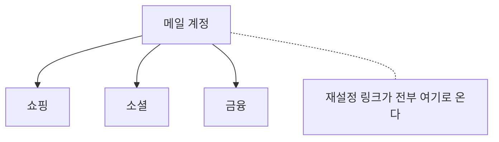

# 5.3 개인의 30일

> 읽는 길: 이 장은 개발자가 아닌 분을 위한 장입니다. 하루에 하나씩 하면 됩니다.

> **오늘의 질문** — 내 계정 중 비밀번호를 여러 곳에서 똑같이 쓰는 것이 몇 개입니까.

## 왜 개인인가

조직 보안의 상당 부분이 개인의 습관에서 무너집니다.
4.7 의 전화 한 통도, 1.2 의 가장 약한 고리도 결국 사람입니다.

그런데 "보안 교육"은 대개 효과가 없습니다.
무엇을 하지 말라고만 하고 **무엇을 하라고 하지 않기** 때문입니다.

이 장은 30일 동안 할 일을 하루에 하나씩 적었습니다.
전부 10분 안에 끝납니다. 순서대로 하면 효과가 큰 것부터 합니다.

<figure class="shot">
  
  <figcaption>손에 든 휴대전화 한 대가 지금 대부분의 재설정 경로가 지나가는 곳입니다. 사진 Santeri Viinamäki, <a href="https://creativecommons.org/licenses/by-sa/4.0">CC BY-SA 4.0</a></figcaption>
</figure>

## 1주차 — 계정의 밑바닥

| 날 | 할 일 | 왜 |
|---|---|---|
| 1 | 비밀번호 관리자 하나를 정해 설치합니다 | 나머지 29일의 전제입니다 |
| 2 | 메일 계정 비밀번호를 길고 유일한 것으로 바꿉니다 | 메일이 모든 계정의 열쇠입니다 |
| 3 | 메일 계정에 다중 인증을 켭니다 | 가능하면 앱이나 보안 키로 |
| 4 | 메일 계정에 패스키를 등록합니다 | 가짜 사이트에서 안 통합니다 |
| 5 | 메일의 자동 전달 규칙을 확인합니다 | 공격자가 흔히 심어 두는 것입니다 |
| 6 | 메일에 연결된 복구 수단을 확인합니다 | 옛날 번호가 남아 있는 경우가 많습니다 |
| 7 | 메일 계정의 최근 로그인 기록을 봅니다 | 모르는 기기가 있는지 |

**1주차는 메일만 합니다.** 메일이 뚫리면 나머지가 다 뚫립니다.
비밀번호 재설정 링크가 전부 메일로 오기 때문입니다.

**메일이 뿌리입니다**

## 2주차 — 업무 계정

| 날 | 할 일 | 왜 |
|---|---|---|
| 8 | 회사 계정 비밀번호를 유일한 것으로 바꿉니다 | 개인 계정과 같으면 하나가 둘이 됩니다 |
| 9 | 회사 계정 다중 인증을 확인합니다 | 켜져 있는지, 어떤 방식인지 |
| 10 | 회사 메신저와 협업 도구에 로그인된 기기를 정리합니다 | 안 쓰는 기기를 내립니다 |
| 11 | 업무 파일이 개인 저장소에 있는지 확인합니다 | 있으면 옮기거나 지웁니다 |
| 12 | 업무용 기기에 깔린 프로그램을 훑습니다 | 쓰지 않는 것을 지웁니다 |
| 13 | 업무 기기의 자동 잠금을 1분으로 설정합니다 | 자리를 뜰 때마다 |
| 14 | 업무 기기 디스크 암호화를 확인합니다 | 기기를 잃어버렸을 때 남는 방어입니다 |

11번이 의외로 많이 걸립니다. 집에서 작업하려고 개인 드라이브에
올려 둔 파일이 몇 년째 남아 있습니다.

## 3주차 — 나머지 계정과 흔적

| 날 | 할 일 | 왜 |
|---|---|---|
| 15 | 비밀번호 관리자의 중복 비밀번호 목록을 봅니다 | 재사용이 가장 큰 위험입니다 |
| 16 | 중복 중 중요한 것 5개를 바꿉니다 | 금융, 쇼핑, 소셜 순서로 |
| 17 | 안 쓰는 계정 5개를 탈퇴합니다 | 없는 계정은 안 털립니다 |
| 18 | 유출 조회 서비스로 내 메일을 확인합니다 | 이미 나간 것이 있는지 |
| 19 | 금융 계정 두 개에 패스키나 보안 키를 등록합니다 | 가장 피해가 큰 곳부터 |
| 20 | 소셜 계정의 공개 정보를 줄입니다 | 4.7 의 사칭 재료입니다 |
| 21 | 연결된 외부 앱 권한을 정리합니다 | 몇 년 전 허용한 것들이 남아 있습니다 |

20번이 중요합니다. MGM 사건에서 공격자는 공개 프로필 정보로
직원을 사칭했습니다(⚠️ F-054). 직책, 부서, 입사 시기, 동료 관계가
본인 확인 질문의 답이 됩니다.

## 4주차 — 습관과 대비

| 날 | 할 일 | 왜 |
|---|---|---|
| 22 | 메일 링크 대신 즐겨찾기로 들어가는 습관을 정합니다 | 가짜 사이트로 유도하는 공격이 성립하지 않습니다 |
| 23 | 급한 요청을 받으면 다른 채널로 되묻는 규칙을 정합니다 | 사칭의 공통점은 급함입니다 |
| 24 | 가족이나 동료와 암호 한 마디를 정합니다 | 음성 사칭에 대한 간단한 대비 |
| 25 | 중요 파일을 백업합니다 | 랜섬웨어 대비 |
| 26 | 백업에서 파일 하나를 실제로 복원해 봅니다 | 있는 것과 되는 것은 다릅니다 |
| 27 | 휴대폰 번호 이동 보호를 신청합니다 | 번호를 뺏기면 인증이 뚫립니다 |
| 28 | 운영체제와 브라우저를 최신으로 업데이트합니다 | 가장 쉬운 보안 조치입니다 |
| 29 | 자동 업데이트를 켭니다 | 29일의 효과를 유지합니다 |
| 30 | 1일부터 다시 봅니다. 빠진 것을 채웁니다 | |

22번이 **하나만 고르라면 이것**입니다.
메일과 문자의 링크를 누르지 않고 평소 쓰던 앱이나 즐겨찾기로 들어가는 습관.
기술 없이, 돈 없이, 가장 많은 공격을 막습니다.

## 30일 뒤 점검

- [ ] 메일 계정에 패스키가 등록되어 있다
- [ ] 비밀번호를 두 곳 이상에서 똑같이 쓰는 것이 없다
- [ ] 업무 기기 디스크가 암호화되어 있다
- [ ] 중요 파일 백업에서 복원을 해 봤다
- [ ] 메일 링크를 누르지 않고 들어가는 습관이 생겼다
- [ ] 급한 요청에 다른 채널로 되묻는 규칙이 있다

## 스터디 그룹용 체크표

팀으로 할 때 쓰는 표입니다. 이름은 익명으로, 개수만 공유합니다.

| 주차 | 완료한 항목 수 | 가장 어려웠던 것 |
|---|---|---|
| 1주차 (1~7) | / 7 | |
| 2주차 (8~14) | / 7 | |
| 3주차 (15~21) | / 7 | |
| 4주차 (22~30) | / 9 | |

**못 한 항목을 비난하지 않습니다.** 어떤 항목이 공통으로 안 됐는지를
보는 것이 목적입니다. 공통으로 안 된 항목은 개인 문제가 아니라
회사가 지원해야 하는 항목입니다.

예를 들어 다수가 4번(패스키 등록)을 못 했다면,
그건 개인의 게으름이 아니라 회사가 패스키를 지원하지 않는 것입니다.

## 안 해도 되는 것

보안 조언 중에 효과가 적거나 역효과인 것들이 있습니다.

**비밀번호를 주기적으로 바꾸는 것.** 자주 바꾸게 하면
사람들이 규칙적으로 바꿉니다. `password1`, `password2` 식입니다.
**유일하고 긴 비밀번호 하나**가 자주 바뀌는 약한 것보다 낫습니다.

**복잡한 문자 조합 규칙.** 특수문자를 강제하면
`P@ssw0rd!` 같은 예측 가능한 패턴이 나옵니다. **길이**가 더 중요합니다.

**"자물쇠를 확인하세요."** 3.4 에서 봤습니다. 피싱 사이트에도 있습니다.
**도메인 이름**을 보는 쪽이 낫습니다.

---

## 개념 확인

**Q.** 개인이 가장 먼저 지켜야 할 계정은 무엇입니까.

1. 소셜 계정
2. 메일 계정
3. 쇼핑 계정
4. 게임 계정

답 보기

**2번 메일.** 다른 모든 계정의 **비밀번호 재설정 링크가 도착하는 곳**이기 때문입니다.
메일이 뚫리면 나머지는 순서대로 열립니다.
여기부터 다중 인증을 겁니다.

## 한 줄 요약

메일부터 지키고, 비밀번호를 재사용하지 않고, 링크 대신 즐겨찾기로 들어갑니다.

---

**출처**

사실마다 근거를 직접 열어 볼 수 있게 링크를 답니다.
확인 날짜와 원문 요지는 [`research/facts.yaml`](../research/facts.yaml) 에 있습니다.

| 사실 | 확인 | 근거를 직접 보기 |
|---|---|---|
| `F-054` | ⚠️ | [adaptivesecurity.com](https://www.adaptivesecurity.com/blog/mgm-ransomware-attack) — 2차 |
